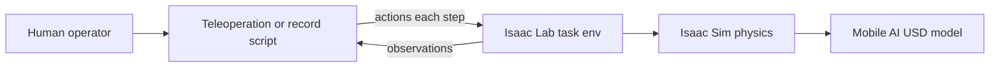
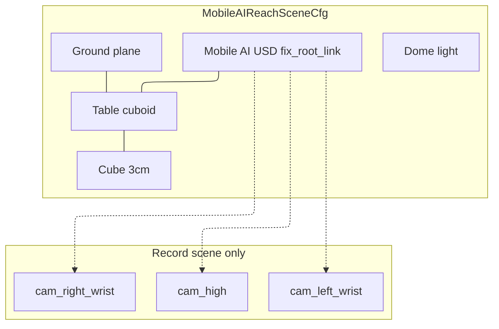
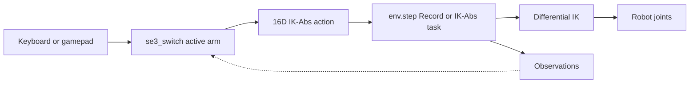
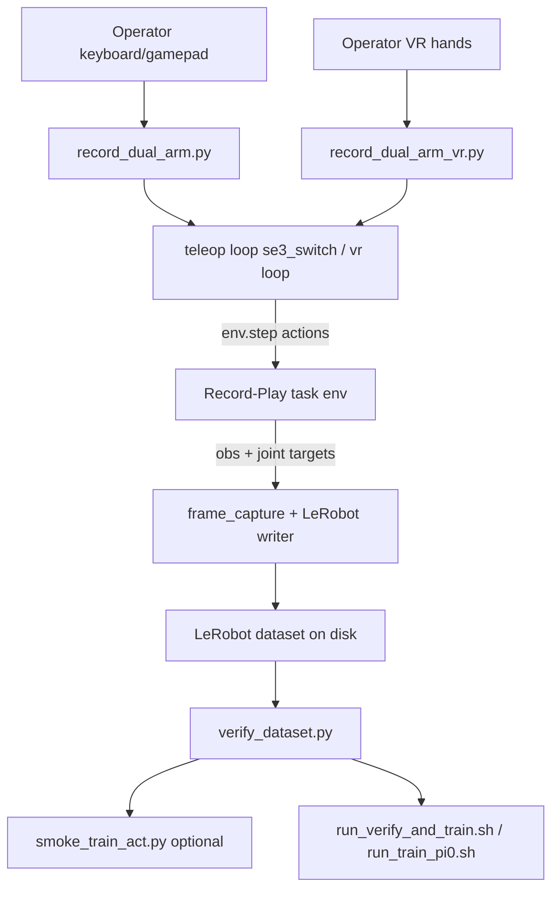
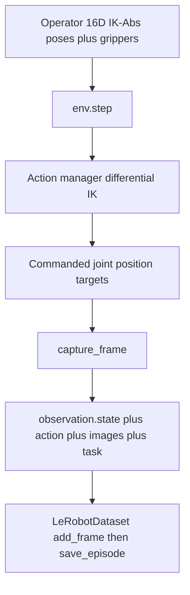
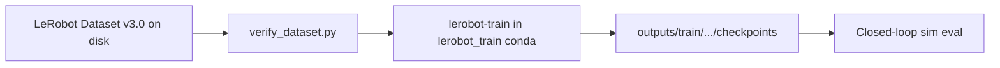
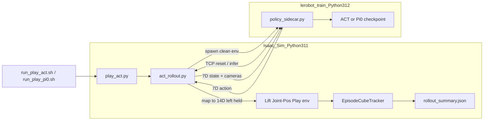

# Epic 3 — Simulation Training Pipeline

> **In-repo docs:** The same design content is maintained as separate chapters under
> `docs/epic3/` in the project repository (plus the [IL Workflow Runbook](IL_WORKFLOW_RUNBOOK.md)
> and [setup](setup/README.md) for how-to). This page is a single consolidated copy of that
> design material for convenience; for chapter-by-chapter browsing on GitHub, use `docs/epic3/`.
>
> Repo-relative links (runbook, setup, `scripts/`, `source/`) target the GitHub tree and may not
> resolve inside an external wiki.
> Reporting metrics: [ACT Evaluation Report](ACT_EVAL_REPORT_100K.md).
> Related design (VR): [Epic 4 consolidated page](EPIC4_VR_INTEGRATION.md).

## Goal

Build a digital twin of the Trossen Mobile AI in Isaac Sim and an imitation-learning pipeline: record human demonstrations, train policies (ACT / Pi0), and evaluate closed-loop in simulation. Pi0 sim eval remains deferred.

## Table of contents

- [Glossary](#glossary)
- [Tasks and Scene](#tasks-and-scene)
- [Teleoperation](#teleoperation)
- [Recording and LeRobot Dataset v3.0](#recording-and-lerobot-dataset-v30)
- [Training](#training)
- [Evaluation](#evaluation)
- [Findings and Troubleshooting](#findings-and-troubleshooting)
- [Future Work](#future-work)

## Glossary

Shared abbreviations and terms for the Mobile AI simulation / IL docs.

### Abbreviations
| Abbreviation | Meaning |
|--------------|---------|
| **14D** | Fourteen-dimensional vector (7 joint values per follower arm) |
| **16D** | Sixteen-dimensional action vector (7D pose + 1 gripper command per arm) |
| **7D** | Seven-dimensional pose (3D position + unit quaternion) |
| **ACT** | Action Chunking with Transformers — a vision–state policy that predicts short sequences (“chunks”) of joint actions |
| **DOF** | Degrees of freedom |
| **Pi0** / **π₀** | Physical Intelligence open VLA-style policy in LeRobot; fine-tuned from `lerobot/pi0_base` on the same LeRobot dataset as ACT |
| **EE** | End-effector |
| **IK** | Inverse kinematics |
| **IK-Abs** | Inverse kinematics, absolute pose command mode |
| **IK-Rel** | Inverse kinematics, relative pose delta mode |
| **IL** | Imitation learning |
| **MDP** | Markov decision process |
| **PD** | Proportional-derivative (controller gains) |
| **PPO** | Proximal policy optimization (reinforcement learning algorithm) |
| **RGB** | Red, green, blue (color image channels) |
| **RL** | Reinforcement learning |
| **ROS2** | Robot Operating System 2 |
| **SE(3)** / **Se3** | Special Euclidean group in three dimensions (3D position and orientation) |
| **USD** | Universal Scene Description (3D scene file format) |
| **VR** | Virtual reality |
| **WXAI** | WidowX AI (Trossen single-arm reference robot) |
| **XR** | Extended reality (umbrella term for VR/AR; includes OpenXR) |

### Terms
| Term | Definition |
|------|------------|
| **Isaac Sim** | NVIDIA physics simulator. Runs the 3D world, robot model, and cameras. |
| **Isaac Lab** | Framework on top of Isaac Sim for robot learning. Standardizes environments, actions, and observations. |
| **Extension** | Python package `trossen_ai_isaac` installed into Isaac Lab; adds Trossen robots and tasks. |
| **Task / environment** | Named, launchable simulation: robot, scene, control mode, and observations. Selected with `--task Isaac-Reach-MobileAI-...`. |
| **Gym registration** | Mechanism that assigns a task name. Defined in `config/__init__.py`; verified with `list_envs.py`. |
| **Play variant** | Task configured for human interaction (single environment, no RL training rewards). |
| **Action** | Command sent to the robot each simulation step (e.g. IK target poses, gripper commands). |
| **Observation** | Data returned by the simulation (joint angles, camera images, etc.). |
| **OpenXR** | Open standard for VR/AR device access; used for hand-tracking teleoperation in Epic 4. |
| **LeRobot** | Open-source robotics dataset and training framework (Hugging Face). |
| **Policy sidecar** | Separate LeRobot inference process ([`policy_sidecar.py`](../source/trossen_ai_isaac/trossen_ai_isaac/evaluation/policy_sidecar.py)) spawned by closed-loop eval. Isaac Sim (Python 3.11) talks to the sidecar over localhost so the policy can run in `lerobot_train` (Python 3.12). |


## Tasks and Scene

Install validation, Mobile AI registration, pick-and-place task configs, and simulation scene.

### System architecture




At a high level the loop is: a **human** drives a **teleop or recording script**; each step the script sends **actions** into an **Isaac Lab task environment**, which advances **Isaac Sim** physics on the **Mobile AI USD**. The task returns **observations** (joints, cameras, …) to the script for the next step. Recording adds a writer that stores those observations and joint targets as a LeRobot dataset; evaluation swaps the human for a **policy sidecar** but keeps the same task → sim → robot path.


### Installation and Initial Validation

**First-time install (procedural):** [Isaac Sim, Lab, and environments](setup/isaac-and-environments.md) · [setup hub](epic3/README.md). Day-to-day checks: [runbook §0](IL_WORKFLOW_RUNBOOK.md#0-prerequisites).

The team followed the [Trossen AI Isaac installation guide](https://docs.trossenrobotics.com/trossen_arm/main/tutorials/trossen_ai_isaac.html), then forked upstream for Mobile AI work:

| Repository | Role |
|------------|------|
| [TrossenRobotics/trossen_ai_isaac](https://github.com/TrossenRobotics/trossen_ai_isaac) | Upstream (reference and baseline) |
| [trossenmobileai/trossen_ai_isaac](https://github.com/trossenmobileai/trossen_ai_isaac) | Project fork (all Mobile AI extensions) |

**Environment versions:** see [docs index — Environment](epic3/README.md#environment).

After the extension is installed editable, these Mobile AI gym IDs should appear (full install steps in [setup](setup/isaac-and-environments.md)):

- `Isaac-Reach-MobileAI-IK-Abs-Play-v0`
- `Isaac-Reach-MobileAI-Record-Play-v0`
- `Isaac-Lift-Cube-MobileAI-Joint-Pos-Play-v0` (closed-loop eval)

**Upstream validation:** before Mobile AI customization, stock WXAI bringup (`robot_bringup.py wxai_base`) confirmed Isaac Sim / Lab / extension install. Mobile AI builds on that baseline.

### Mobile AI Robot Registration

##### Why registration is required

Isaac Lab tasks do not load a USD file by path alone. A robot must be registered through an **articulation configuration** (`ArticulationCfg`) that tells Isaac Lab how to spawn the model, which joints to control, and how actuators behave. Upstream already provides this for WXAI in `tasks/.../assets/wxai.py` (`WXAI_CFG`, `WXAI_HIGH_PD_CFG`) and wires those configs into registered WXAI tasks.

The fork **already includes** `assets/robots/mobile_ai/mobile_ai.usd` from upstream. The USD file is shipped with the original repository. Standalone demos (e.g. `robot_bringup.py mobile_ai`) can load the asset without extra registration.

However, **no Mobile AI Isaac Lab articulation config or gym tasks exist in upstream**. To run Mobile AI inside Isaac Lab task environments (teleoperation, recording, data collection, training), the team studied the WXAI registration pattern and added the equivalent for Mobile AI.

##### What was added

- **`mobile_ai.usd`**: Robot 3D model. Include link hierarchy, mimic grippers, and joint drives live in USD.
	- Path: `assets/robots/mobile_ai/mobile_ai.usd`
- **`mobile_ai.py`**: Isaac Lab articulation registration for Mobile AI. Exports `MOBILE_AI_CFG` (base physics) and `MOBILE_AI_HIGH_PD_CFG` (IK teleoperation), modeled after `wxai.py`.
	- Path: `source/trossen_ai_isaac/trossen_ai_isaac/tasks/manager_based/manipulation/assets/mobile_ai.py`
- **`assets/__init__.py`**: Re-exports Mobile AI configs alongside WXAI so task environments can import them from the assets package.
	- Path: `source/trossen_ai_isaac/trossen_ai_isaac/tasks/manager_based/manipulation/assets/__init__.py`

**`mobile_ai.py`** (essential structure):

```python
MOBILE_AI_CFG = ArticulationCfg(
    spawn=sim_utils.UsdFileCfg(
        usd_path=os.path.join(_ASSETS_ROOT, "mobile_ai", "mobile_ai.usd"),
        # ...
    ),
    init_state=ArticulationCfg.InitialStateCfg(joint_pos={...}),  # both follower arms at zero
    actuators={
        "left_arm": ImplicitActuatorCfg(joint_names_expr=["follower_left_joint_[0-5]"], stiffness=None, damping=None),
## ... see linked source file
```

- **`MOBILE_AI_CFG`:** Spawns `mobile_ai.usd`, sets initial joint poses, and groups actuators for both arms, grippers, and base wheels. Stiffness/damping are left `None` so values from the USD file are used.
- **`MOBILE_AI_HIGH_PD_CFG`:** Copy used by Reach tasks: gravity disabled and high PD on arm joints for stable IK teleoperation (same pattern as `WXAI_HIGH_PD_CFG`).

**`assets/__init__.py`** (one-line addition next to the existing WXAI import):

```python
from .wxai import *
from .mobile_ai import *
```

Task configs (e.g. [`reach_env_cfg.py`](#reach_env_cfgpy-scene-and-mdp-base)) then import `MOBILE_AI_HIGH_PD_CFG` the same way WXAI tasks import `WXAI_HIGH_PD_CFG`.

The Mobile AI has **26 degrees of freedom** (base wheels and dual follower arms). IL work focuses on the **14 follower arm joints** (7 per arm: 6 arm joints and 1 gripper joint).

> **Design note:** `MOBILE_AI_HIGH_PD_CFG` uses high proportional-derivative (PD) gains and disables gravity on arm links. The same IK-control pattern used for `WXAI_HIGH_PD_CFG`. The Reach scene applies `fix_root_link=True` when spawning the robot ([`reach_env_cfg.py`](#reach_env_cfgpy-scene-and-mdp-base)) so the base does not slide or tip during teleoperation.

### Custom Reach Task Environment

##### Why a custom task is required

Upstream provides complete Isaac Lab task packages for WXAI under `tasks/manager_based/manipulation/wxai/` (Reach, Lift, and Cabinet), each with scene configs, action/observation definitions, and gym registration in `config/__init__.py`. These tasks launch by name and work with `teleop_se3_agent.py`.

**Upstream WXAI** already ships Reach / Lift / Cabinet gym tasks under `tasks/.../wxai/`. **No equivalent package exists for Mobile AI in upstream.** The fork therefore adds environments under `tasks/manager_based/manipulation/mobile_ai/reach/` (and a joint-position play env under `.../lift/` for policy eval), following Isaac Lab’s WXAI package layout but adapted for dual-arm control, IL-oriented observations, and recording.

> **Naming note (Reach / Lift vs pick-and-place):** During development the Mobile AI environments were registered under Isaac Lab–style **Reach** and **Lift** names. They are not classic reach-to-target or lift-only RL tasks. All three production IDs are variants of the same **pick-and-place** scene (table + cube: pick, lift, place back):
>
> | Role | Gym ID (unchanged) |
> |------|--------------------|
> | Teleop | `Isaac-Reach-MobileAI-IK-Abs-Play-v0` |
> | LeRobot recording | `Isaac-Reach-MobileAI-Record-Play-v0` |
> | Closed-loop policy eval | `Isaac-Lift-Cube-MobileAI-Joint-Pos-Play-v0` |
>
> The gym IDs and Python module paths (`reach/`, `lift/`) were left as-is to avoid breaking scripts and docs already using them. When this report says “Reach task” for Mobile AI, it means the pick-and-place teleop/record environments above.

##### Reach task package

The reach package is a small set of config files. **[`reach_env_cfg.py`](#reach_env_cfgpy-scene-and-mdp-base)** is the base. It defines the digital twin scene and the dual-arm MDP skeleton that teleoperation and recording inherit from. Registered gym tasks point at specialized subclasses rather than at this file directly.

- **`reach_env_cfg.py`**: Base environment (scene, MDP terms, reset randomization, simulation timing, and teleoperation device defaults). [Details](#reach_env_cfgpy-scene-and-mdp-base)
	- Path: `source/trossen_ai_isaac/trossen_ai_isaac/tasks/manager_based/manipulation/mobile_ai/reach/reach_env_cfg.py`
- **`ik_abs_env_cfg.py`**: Absolute IK teleoperation (16D action layout and binary grippers). Registers `Isaac-Reach-MobileAI-IK-Abs-Play-v0`. [Details](#ik_abs_env_cfgpy-absolute-ik-teleoperation)
	- Path: `source/trossen_ai_isaac/trossen_ai_isaac/tasks/manager_based/manipulation/mobile_ai/reach/ik_abs_env_cfg.py`
- **`record_env_cfg.py`**: IL recording (cameras, 14D joint observations, and 60 Hz stepping). Registers `Isaac-Reach-MobileAI-Record-Play-v0`. [Details](#record_env_cfgpy-il-recording)
	- Path: `source/trossen_ai_isaac/trossen_ai_isaac/tasks/manager_based/manipulation/mobile_ai/reach/record_env_cfg.py`
- **`config/__init__.py`**: Gymnasium registration; Maps task IDs to the config entry points above.
	- Path: `source/trossen_ai_isaac/trossen_ai_isaac/tasks/manager_based/manipulation/mobile_ai/reach/config/__init__.py`

##### reach_env_cfg.py: scene and MDP base

Scene assets, table/cube setup, and reset randomization are described in [Simulation Scene](#simulation-scene). This subsection summarizes the MDP wiring.

This file turns [`MOBILE_AI_HIGH_PD_CFG`](#mobile-ai-robot-registration) into a runnable Isaac Lab `ManagerBasedRLEnv`. The file groups the environment into `@configclass` blocks that Isaac Lab assembles at launch:

- **`MobileAIReachSceneCfg`**: Digital twin scene (ground, light, table, cube, robot) — details in [Simulation Scene](#simulation-scene).
- **`CommandsCfg`**: Random end-effector pose targets for both arms (`follower_left_link_6`, `follower_right_link_6`). These feed reach-task observations; the [recording variant](#record_env_cfgpy-il-recording) disables them.
- **`ActionsCfg`**: Dual-arm action slots. `MobileAIReachEnvCfg.__post_init__` wires a differential IK controller on each arm's six joints.
- **`ObservationsCfg`**: Policy observations: relative joint positions and velocities, generated pose commands, and last action.
- **`EventCfg`**: Reset behavior: restore robot joints, randomize cube XY position on the table, and pick a discrete red, green, or blue cube color.
- **`MobileAIReachEnvCfg`**: Top-level config that combines the above, sets 60 Hz simulation (`sim.dt = 1/60`, `decimation = 2`), and registers keyboard and gamepad teleoperation device defaults (`gripper_term=False`; grippers are handled by the [teleoperation script](#teleoperation)).
- **`MobileAIReachEnvCfg_PLAY`**: Play/teleoperation base: single environment (`num_envs = 1`), observation noise off.

Essential scene and robot wiring:

*(Illustrative snippet omitted — see the source file path above.)*

##### ik_abs_env_cfg.py: absolute IK teleoperation

This file is **central to Epic 3 teleoperation**. The registered task `Isaac-Reach-MobileAI-IK-Abs-Play-v0` points at `MobileAIReachEnvCfg_IK_ABS_PLAY` defined here: the environment that [`teleop_dual_arm_switch.py`](IL_WORKFLOW_RUNBOOK.md) launches. It inherits the scene and MDP skeleton from [`reach_env_cfg.py`](#reach_env_cfgpy-scene-and-mdp-base) and overrides the action layer for **absolute** inverse kinematics.

- **`MobileAIReachEnvCfg_IK_ABS`**: Flips both arm action terms from relative deltas (base config) to absolute pose commands (`use_relative_mode=False`). Each arm expects a 7D pose `[pos_xyz, quat_wxyz]` in the robot base frame. Adds binary gripper actions on both carriage joints, producing a **16D** environment action vector: `[L_pose(7), R_pose(7), L_grip(1), R_grip(1)]`.
- **`MobileAIReachEnvCfg_IK_ABS_PLAY`**: Play/teleoperation entry point: single environment, observation noise off. Registered as `Isaac-Reach-MobileAI-IK-Abs-Play-v0`.

The file also registers an OpenXR **`handtracking`** teleoperation device for VR. Keyboard and gamepad teleoperation ignore this; see [VR teleoperation](EPIC4_VR_INTEGRATION.md#vr-teleoperation).

Essential action wiring:

*(Illustrative snippet omitted — see the source file path above.)*

The teleoperation library ([`se3_switch.py`](#teleoperation)) assembles the same 16D layout client-side for keyboard/gamepad: it integrates device deltas into per-arm IK targets and passes them to `env.step()`.

##### record_env_cfg.py: IL recording

This file defines the environment for [LeRobot dataset collection](#recording-and-lerobot-dataset-v30). The registered task `Isaac-Reach-MobileAI-Record-Play-v0` points at `MobileAIReachEnvCfg_RECORD_PLAY`, launched by [`record_dual_arm_vr.py`](IL_WORKFLOW_RUNBOOK.md#3-collect-demos-vr) or [`record_dual_arm.py`](IL_WORKFLOW_RUNBOOK.md#4-collect-demos-keyboard-gamepad-alternate). It inherits absolute IK and grippers from [`MobileAIReachEnvCfg_IK_ABS_PLAY`](#ik_abs_env_cfgpy-absolute-ik-teleoperation) and retargets observations and sensors for a [LeRobot Dataset v3.0](https://huggingface.co/docs/lerobot/en/lerobot-dataset-v3) feature schema.

- **`MobileAIRecordSceneCfg`**: Extends `MobileAIReachSceneCfg` with three RGB camera sensors (`cam_high`, `cam_left_wrist`, `cam_right_wrist`) at 480×640, bound to existing USD camera prims on the robot.
- **`RecordObservationsCfg`**: Replaces the reach-task policy observations with a single **14D absolute joint position** vector (7 joints per follower arm), matching the real-robot LeRobot layout. No pose commands or velocity noise.
- **`EmptyCommandsCfg`**: Disables random end-effector pose commands; IL demos do not use reach targets.
- **`MobileAIReachEnvCfg_RECORD_PLAY`**: Top-level recording config: inherits cube position/color randomization from `EventCfg`, sets `decimation = 1` for full 60 Hz stepping, and turns off IK debug visualization.

Essential recording overrides:

*(Illustrative snippet omitted — see the source file path above.)*

Commanded joint position targets captured at each step become the dataset `action` labels ([Recording (LeRobot)](#recording-and-lerobot-dataset-v30)); IK commands drive the robot during collection but are not stored directly.

**Registered tasks (fork):**

| Task ID | Config class | Launched by |
|---------|--------------|-------------|
| `Isaac-Reach-MobileAI-IK-Abs-Play-v0` | `MobileAIReachEnvCfg_IK_ABS_PLAY` | [`teleop_dual_arm_switch.py`](IL_WORKFLOW_RUNBOOK.md), [`teleop_dual_arm_vr.py`](EPIC4_VR_INTEGRATION.md#vr-teleoperation) |
| `Isaac-Reach-MobileAI-Record-Play-v0` | `MobileAIReachEnvCfg_RECORD_PLAY` | [`record_dual_arm_vr.py`](IL_WORKFLOW_RUNBOOK.md#3-collect-demos-vr), [`record_dual_arm.py`](IL_WORKFLOW_RUNBOOK.md#4-collect-demos-keyboard-gamepad-alternate) |

(Closed-loop eval uses `Isaac-Lift-Cube-MobileAI-Joint-Pos-Play-v0` — same pick-and-place scene, joint-position actions; see [Evaluation](#evaluation). Naming history: [Custom Reach Task](#custom-reach-task-environment).)

**IK-Rel to IK-Abs migration:** Early experiments used IK-Rel (12D relative pose deltas). Arm drift and control instability led to a switch to IK-Abs (16D). See [Arm Drift (Resolved)](#arm-drift-resolved) for the full investigation and resolution.

> **Historical note:** Early Mobile AI work also experimented with separate Lift-named gym IDs and IK-Rel Reach variants. The production teleop/record path settled on the Reach-named IDs above; joint-position eval kept a Lift-named ID. Conceptually all are pick-and-place — see the [naming note](#custom-reach-task-environment).

### Simulation Scene

The pick-and-place digital twin is assembled in [`reach_env_cfg.py`](../source/trossen_ai_isaac/trossen_ai_isaac/tasks/manager_based/manipulation/mobile_ai/reach/reach_env_cfg.py) as `MobileAIReachSceneCfg` plus reset `EventCfg`. Teleop, VR, recording, and closed-loop eval all reuse this scene (recording adds cameras; eval uses a joint-position lift variant of the same table and cube).

**Why randomize:** imitation-learning policies trained on the recorded LeRobot set ([Recording](#recording-and-lerobot-dataset-v30)) need the cube in varied positions and colors; a fixed pick point / color overfits and fails closed-loop eval ([Evaluation](#evaluation)). Position/color resampling on every `env.reset()` (including workstation **J**) is downstream of that requirement.




##### Why the scene is procedural (not a USD file)

The workstation (table + cube) is declared in Python via `sim_utils.CuboidCfg` inside `MobileAIReachSceneCfg`, not baked into a `.usd`. Three USD-first approaches were tried and rejected:

| Phase | Approach | Why rejected | Lesson |
|-------|----------|--------------|--------|
| 1 | Edit `mobile_ai.usd` in the Isaac Sim GUI to attach table/cube | Shared foundational asset (joint drives, mimic grippers); GUI edits risk the kinematic chain and bake a non-randomizable workspace into every parallel env clone | Treat `assets/robots/mobile_ai/mobile_ai.usd` as read-only; configs (`MOBILE_AI_CFG`, `MOBILE_AI_HIGH_PD_CFG`) already reference it |
| 2 | Separate `Virtual_Env.usd` referenced as a second layer | Reference stage still contained an embedded robot → two overlapping robots (`/World/Robot` + baked-in mesh); deleting the duplicate broke prim path resolution | A USD reference brings the whole stage, not only the geometry you intended |
| 3 | Manual Omniverse Layer / payload cleanup | Workspace nested as an external payload under an anonymous root; GUI “save” dropped sub-links and emptied the stage | Anonymous/payload layers are fragile under GUI edits |

**Resolution:** spawn table and cube in memory from scene config with explicit meter offsets relative to the robot origin. No shared file to corrupt, no duplicate robot reference, no GUI save path. Same class documented below.

##### Scene assets (`MobileAIReachSceneCfg`)

| Asset | How it is configured |
|-------|----------------------|
| **Ground** | Default Isaac Lab ground plane at `/World/ground`. |
| **Light** | Dome light (`color≈0.75`, intensity `2500`) for even illumination of RGB cameras. |
| **Table** | Grey cuboid `size=(0.99, 2.0, 0.807)` m with collision and rigid body props. Spawned at `(0.85, 0.0, 0.4035)` so the top sits in front of the Mobile AI base. Visual material is a dark grey preview surface. Declared as `AssetBaseCfg` (static prop — no per-reset root-state writes). |
| **Cube** | **`RigidObjectCfg`** cuboid `0.03×0.03×0.03` m, mass `0.1` kg, collision enabled. Initial pose on the table surface (`z≈0.822`). Default visual color is red; reset events override color (below). Must be `RigidObjectCfg` (not `AssetBaseCfg`): position randomization uses `write_root_pose_to_sim()` / `reset_root_state_uniform`, which require a physics-trackable root state. Prim path uses `{ENV_REGEX_NS}` so each parallel env gets its own `/World/envs/env_*/Cube`. |
| **Robot** | `MOBILE_AI_HIGH_PD_CFG` with `fix_root_link=True` so the base stays anchored, `disable_gravity=True` on the articulation spawn (arms are position-controlled), self-collisions enabled, and higher PhysX solver iterations for stable contact. |

`MobileAIReachEnvCfg` builds the scene with `replicate_physics=False`. Default `True` shares one physics representation across clones for speed; that breaks per-instance cube pose/color randomization (every env can silently get the same roll). Both reset events below depend on this flag — see [Findings](#scene-and-randomization).

##### Reset randomization (`EventCfg`)

Isaac Lab fires `EventTerm` fields whose `mode` matches the trigger. These cube events use `mode="reset"` (every `env.reset()`), matching `reset_robot_joints` — not `startup` (once at launch) or `interval`. `SceneEntityCfg("cube")` names the scene field; Isaac Lab resolves it to the spawned prim at runtime. `ik_abs_env_cfg.py` and `record_env_cfg.py` inherit this `EventCfg` unchanged.

**IL motivation:** varied cube XY + discrete RGB on every reset so demos (and later eval) are not locked to one pose/color.

On every environment reset (including after **J** / episode save):

1. **Robot joints** restore to the default scaled pose (no random joint noise).
2. **Cube XY** is resampled with `mdp.reset_root_state_uniform`. `pose_range` values are **deltas from the cube’s `init_state.pos`** `(0.85, 0.0, 0.822)`, not absolute world or table-origin coordinates — roughly `x∈[-0.10, 0.05]`, `y∈[-0.20, 0.0]`, `z` fixed at `0`. Absolute numbers plugged in as deltas spawn the cube off the table.
3. **Cube color** is chosen discretely from pure red, green, or blue via custom `randomize_cube_color_discrete` (stored on the env for eval metrics). Built-in `mdp.randomize_visual_color` only accepts a continuous two-tuple `[low_rgb, high_rgb]`; passing three palette colors crashes at launch — see [Findings](#scene-and-randomization).

**Sanity-check:** events only fire on `env.reset()`. A short teleop run with only the 12 s episode timeout shows few distinct poses/colors — that is expected. Press workstation **J** repeatedly to force resets and confirm the reachable zone and all three colors ([Controls](IL_WORKFLOW_RUNBOOK.md#controls-quick-reference)).

##### Simulation timing and physics

- Base reach config: `sim.dt = 1/60`, `decimation = 2` (control at 30 Hz); `episode_length_s = 12.0` in `MobileAIReachEnvCfg.__post_init__`.
- Record-Play: `decimation = 1` so demos are stored at **60 Hz**, matching closed-loop eval FPS.
- Anchored base + high PD gains keep teleop IK targets tracking without tipping the mobile base.
- `replicate_physics=False` on the scene (above) so per-env cube randomization is independent.

##### Recording cameras

[`record_env_cfg.py`](#record_env_cfgpy-il-recording) extends the same scene with `cam_high`, `cam_left_wrist`, and `cam_right_wrist` (480×640 RGB) bound to USD camera prims on the robot. Production demos used **right-arm** mode (`cam_high` + `cam_right_wrist` only).

Code-level overview of the same classes: [`reach_env_cfg.py`](#reach_env_cfgpy-scene-and-mdp-base).


---

### How to run

- First-time install: [setup — Isaac and environments](setup/isaac-and-environments.md)
- Confirm envs: [runbook §0](IL_WORKFLOW_RUNBOOK.md#0-prerequisites)
- Full day-to-day pipeline: [§0](IL_WORKFLOW_RUNBOOK.md#0-prerequisites)–[§7](IL_WORKFLOW_RUNBOOK.md#7-evaluate-closed-loop)


## Teleoperation

Dual-arm keyboard/gamepad teleoperation and VR summary (design). **Operator key maps:** [runbook Controls](IL_WORKFLOW_RUNBOOK.md#controls-quick-reference); day-to-day keyboard/gamepad commands: [§4](IL_WORKFLOW_RUNBOOK.md#4-collect-demos-keyboard-gamepad-alternate).

### Keyboard / gamepad

##### Why a custom teleoperation script is required

Upstream provides [`teleop_se3_agent.py`](../scripts/teleoperation/teleop_se3_agent.py) as the general teleoperation entrypoint for Isaac Lab tasks. WXAI tasks work with this script out of the box.

Mobile AI requires **dual-arm** control with **switchable** arm selection (one arm at a time for keyboard/gamepad recording). The upstream script targets single-arm tasks and does not implement arm switching or the [16D IK-Abs action layout](#ik_abs_env_cfgpy-absolute-ik-teleoperation). The team used `teleop_se3_agent.py` as the architectural base and added:

| Upstream (reference) | Fork (Mobile AI extension) |
|----------------------|----------------------------|
| [`teleop_se3_agent.py`](../scripts/teleoperation/teleop_se3_agent.py) | [`teleop_dual_arm_switch.py`](../scripts/teleoperation/teleop_dual_arm_switch.py) |
| Single-arm Se3 teleoperation | Switchable dual-arm IK-Abs teleoperation via [`se3_switch.py`](../source/trossen_ai_isaac/trossen_ai_isaac/teleop/se3_switch.py) |

VR hand-tracking teleoperation extends this layer further; see [Epic 4](EPIC4_VR_INTEGRATION.md) / [VR teleoperation](EPIC4_VR_INTEGRATION.md#vr-teleoperation).

##### Control model and loop

The operator moves one end-effector at a time; the task environment's differential IK solver ([`ik_abs_env_cfg.py`](#ik_abs_env_cfgpy-absolute-ik-teleoperation)) converts 16D pose and gripper commands into joint motion. [`teleop_dual_arm_switch.py`](../scripts/teleoperation/teleop_dual_arm_switch.py) launches `Isaac-Reach-MobileAI-IK-Abs-Play-v0`, reads input each frame, builds the action tensor in [`se3_switch.py`](../source/trossen_ai_isaac/trossen_ai_isaac/teleop/se3_switch.py), and calls `env.step(action)`.



Device motion deltas and gripper toggles are assembled into the **16D** layout (`L_pose(7)`, `R_pose(7)`, `L_grip`, `R_grip`); inactive-arm terms hold the last pose. The task’s differential IK turns those absolute EE targets into joint motion.

Periodic `[step=...]` status lines (arm / grip / pose every 60 sim steps) are **off by default**. Pass `--step_log` to enable them. Key-event logs (`[ARM SWITCH]`, `[GRIPPER]`, `[RECORD]`, `[RESET]`, …) still print as usual.

**Input devices:** keyboard or gamepad via `--teleop_device`. Motion deltas apply to the **active arm only** while teleoperation is active (`TeleopSession.teleoperation_active`, on by default). Bindings combine Isaac Lab `Se3Keyboard` / `Se3Gamepad` defaults with fork-specific callbacks in `se3_switch.py` (`gripper_term=False` in the env config; grippers are toggled via **K** / **A** instead). This project does not use SpaceMouse for Mobile AI teleoperation.

**Keyboard** (`--teleop_device keyboard`):

| Key / input | Category | Action |
|-------------|----------|--------|
| **W** / **S** | Motion (active arm) | Move end-effector along +X / −X (forward / backward) |
| **A** / **D** | Motion (active arm) | Move along +Y / −Y (left / right) |
| **Q** / **E** | Motion (active arm) | Move along +Z / −Z (up / down) |
| **Z** / **X** | Motion (active arm) | Rotate about X axis (+ / −) |
| **T** / **G** | Motion (active arm) | Rotate about Y axis (+ / −) |
| **C** / **V** | Motion (active arm) | Rotate about Z axis (+ / −) |
| **L** | Device reset | Clear accumulated position/rotation deltas (Isaac Lab default) |
| **TAB** | Dual-arm | Switch active arm (re-seeds IK target from current end-effector pose) |
| **K** | Gripper | Toggle open/close on the **active** arm |
| **J** | Environment | Reset environment (discards in-progress recording if any). Prefer **J** over **R** to avoid Isaac Kit shortcut conflicts (same as VR). |
| **N** | Recording only | Toggle episode recording: start, or save and reset ([`record_dual_arm.py`](../scripts/imitation_learning/recording/record_dual_arm.py) only) |
| **M** | Recording only | Discard current episode buffer without saving |
| **START** / **STOP** / **RESET** | Session (XR) | Registered for OpenXR / env-config teleoperation devices; not bound to physical keys on the local `Se3Keyboard` fallback |

**Gamepad** (`--teleop_device gamepad`):

| Button / stick | Category | Action |
|----------------|----------|--------|
| **Left stick** up / down | Motion (active arm) | Move along +X / −X |
| **Left stick** left / right | Motion (active arm) | Move along +Y / −Y |
| **Right stick** up / down | Motion (active arm) | Move along +Z / −Z |
| **D-pad** right / left | Motion (active arm) | Rotate about X axis (+ / −) |
| **D-pad** down / up | Motion (active arm) | Rotate about Y axis (+ / −) |
| **Right stick** left / right | Motion (active arm) | Rotate about Z axis (+ / −) |
| **Y** (polled) | Dual-arm | Switch active arm |
| **A** (polled) | Gripper | Toggle open/close on the **active** arm |
| **B** (polled) | Environment | Reset environment (discards in-progress recording if any) |
| **X** (polled, recording only) | Recording | Toggle episode recording: start, or save and reset |

Episode discard on gamepad uses keyboard **M** only (no gamepad binding).

Tune motion sensitivity with `--sensitivity`. For gamepad, `--gamepad_dead_zone` filters stick noise. Copy-paste launch: [§4 Keyboard / gamepad](IL_WORKFLOW_RUNBOOK.md#4-collect-demos-keyboard-gamepad-alternate).

**Usability:** Low setup (no headset or wireless stack). Best for smoke tests and rapid iteration when a VR headset is unavailable. Side-by-side with VR: [Input device comparison](EPIC4_VR_INTEGRATION.md#input-device-comparison).

### VR teleoperation (summary)
After keyboard/gamepad teleop worked on the pick-and-place task, the team added **Quest 3 + ALVR + OpenXR** teleoperation so both arms can be driven by hand tracking. Implementation lives in [VR teleoperation](EPIC4_VR_INTEGRATION.md#vr-teleoperation) (`teleop_dual_arm_vr.py`, `source/.../teleop/vr/`).

Epic 3 keeps only this summary:

- Same task ID as keyboard teleop: `Isaac-Reach-MobileAI-IK-Abs-Play-v0` (16D IK-Abs actions).
- Default VR session is single-arm focus for demos; `--dual_arm` enables true bimanual control.
- **Workstation teleop keys:** **N** engage · **M** pause · **B** re-anchor · **J** reset · **TAB** switch arm (single-arm) — [VR teleoperation](EPIC4_VR_INTEGRATION.md#vr-teleoperation).
- **Workstation recording keys:** **U** engage · **I** pause · **N** episode · **M** discard · **B** re-anchor · **J** reset — [VR recording](EPIC4_VR_INTEGRATION.md#vr-recording).
- **Hands:** pinch = gripper. (Kit binds **R**, so reset is **J**.)
- Operator ritual and expected terminal logs: [§1.10](IL_WORKFLOW_RUNBOOK.md#110-engage-teleop-recording-with-the-workstation-operator) · [Controls](IL_WORKFLOW_RUNBOOK.md#controls-quick-reference).

Full stack setup, CLI flags, and troubleshooting: [Epic 4 design](epic4/README.md), [VR one-time setup](setup/vr-workstation.md), [§1 session](IL_WORKFLOW_RUNBOOK.md#1-vr-session-startup-every-time), [Findings](EPIC4_VR_INTEGRATION.md#findings-and-troubleshooting).


---

### How to run

- Keyboard/gamepad practice teleop: [§4](IL_WORKFLOW_RUNBOOK.md#4-collect-demos-keyboard-gamepad-alternate)
- VR practice teleop: [§2](IL_WORKFLOW_RUNBOOK.md#2-practice-vr-teleop-no-dataset) · design [VR teleoperation](EPIC4_VR_INTEGRATION.md#vr-teleoperation)
- VR production collect: [§3](IL_WORKFLOW_RUNBOOK.md#3-collect-demos-vr) · design [VR recording](EPIC4_VR_INTEGRATION.md#vr-recording)


## Recording and LeRobot Dataset v3.0

Imitation-learning recording pipeline, action labels, and on-disk LeRobot Dataset v3.0 layout.

**End-to-end (VR production path):** Quest hand tracking → ALVR / SteamVR / OpenXR → Isaac Lab 16D IK-Abs → `env.step` → LeRobot writer → finalize → verify → train. Stack: [Background and stack](EPIC4_VR_INTEGRATION.md#background-and-stack). Operator collect: [§3](IL_WORKFLOW_RUNBOOK.md#3-collect-demos-vr). Verify: [§5](IL_WORKFLOW_RUNBOOK.md#5-verify-dataset).

### Recording pipeline
Teleoperation moves the robot; imitation learning requires saved episodes in a standard format. The pipeline builds on the [record task config](#record_env_cfgpy-il-recording).

**Reporting collection (this project):** VR, `--record_arm right` — see [runbook project example reference](IL_WORKFLOW_RUNBOOK.md). Entrypoint: [`run_collect_dataset.sh`](../scripts/imitation_learning/run_collect_dataset.sh) → [`record_dual_arm_vr.py`](../scripts/imitation_learning/recording/record_dual_arm_vr.py). Keyboard/gamepad (`record_dual_arm.py`) is smoke tooling only.

Pipeline components:

1. The **Record task** (`Isaac-Reach-MobileAI-Record-Play-v0`). See [`record_env_cfg.py`](#record_env_cfgpy-il-recording).
2. **Recording entrypoints** — **VR (production)** [`record_dual_arm_vr.py`](../scripts/imitation_learning/recording/record_dual_arm_vr.py) ([VR recording](EPIC4_VR_INTEGRATION.md#vr-recording)); **keyboard/gamepad (smoke / tooling only)** [`record_dual_arm.py`](../scripts/imitation_learning/recording/record_dual_arm.py)
3. A **LeRobot dataset writer** under [`source/.../recording/`](../source/trossen_ai_isaac/trossen_ai_isaac/recording/) that captures frames each simulation step
4. Offline **validation** ([`verify_dataset.py`](../scripts/imitation_learning/validation/verify_dataset.py), [§5 Verify](IL_WORKFLOW_RUNBOOK.md#5-verify-dataset)) — pass **your** `--root` / `--repo_id` (name and save location); this project’s reporting-set paths are only an example
5. **Training** — optional short smoke ([`smoke_train_act.py`](../scripts/imitation_learning/training/smoke_train_act.py)) or full policy train via wrappers ([Training](#training), [§6 Train](IL_WORKFLOW_RUNBOOK.md#6-train)). Any LeRobot Dataset v3.0–compatible policy can train on the demos; **in-repo wrappers today are ACT and Pi0** — other policies need a new wrapper (or a direct `lerobot-train` call).

`smoke_train_act.py` only checks that the dataset feeds the trainer for a few iterations. Production training uses [`run_verify_and_train.sh`](../scripts/imitation_learning/run_verify_and_train.sh) (ACT) or [`run_train_pi0.sh`](../scripts/imitation_learning/run_train_pi0.sh) (Pi0), which call `lerobot-train` in the `lerobot_train` conda env — open each script and edit settings near the top for your run.



**Dataset schema** (default `--record_arm both`):

| Field | Shape | Description |
|-------|-------|-------------|
| `observation.state` | 14D float32 | Follower arm joint positions (7 per arm) |
| `action` | 14D float32 | Commanded joint position targets (7 per arm) |
| `observation.images.cam_high` | 480×640 RGB video | Overhead camera |
| `observation.images.cam_left_wrist` | 480×640 RGB video | Left wrist camera |
| `observation.images.cam_right_wrist` | 480×640 RGB video | Right wrist camera |

**Reporting schema** (`--record_arm right` — this project’s train set):

| Field | Shape | Description |
|-------|-------|-------------|
| `observation.state` | 7D float32 | Right arm joint positions (`right_joint_0..6`) |
| `action` | 7D float32 | Commanded right-arm joint targets |
| `observation.images.cam_high` | 480×640 RGB video | Overhead camera |
| `observation.images.cam_right_wrist` | 480×640 RGB video | Right wrist camera |

Left-arm mode mirrors right (`left_joint_*` + `cam_left_wrist`). Mode ↔ cameras/dims: [VR recording](EPIC4_VR_INTEGRATION.md#one-arm-vs-two-arm-record_arm). Training: [Training](#training).

> **Design note:** Actions are stored as **commanded joint position targets**, not IK pose commands. During teleoperation the operator drives 16D IK-Abs actions; the recorder captures the resulting joint targets that the action manager applies (projected to the joints selected by `--record_arm`). This matches the [LeRobot Dataset v3.0](https://huggingface.co/docs/lerobot/en/lerobot-dataset-v3) layout (`observation.state` / `action` / `observation.images.*` / `task`).



##### LeRobot Dataset v3.0 on disk

Recording writes a self-describing [LeRobot Dataset v3.0](https://huggingface.co/docs/lerobot/en/lerobot-dataset-v3) tree via [`LeRobotRecorder`](../source/trossen_ai_isaac/trossen_ai_isaac/recording/lerobot_recorder.py) / [`capture_frame`](../source/trossen_ai_isaac/trossen_ai_isaac/recording/frame_capture.py):

1. **`LeRobotDataset.create`** — opens the dataset root with the feature schema (joint dims + cameras for `--record_arm`), fps, and `robot_type`.
2. **Per simulation step** — after `env.step`, `capture_frame` builds one frame dict; `add_frame` buffers it.
3. **Episode save** — workstation **N** (or equivalent) calls `save_episode`, flushing the buffer into parquet + video chunks. This can take several seconds; wait for `[RECORD] Saved episode (N frames) -> ...` in the terminal before starting the next episode ([§1.10](IL_WORKFLOW_RUNBOOK.md#110-engage-teleop-recording-with-the-workstation-operator), [VR recording](EPIC4_VR_INTEGRATION.md#vr-recording)).
4. **Finalize** — on exit / interrupt, `finalize()` writes metadata so the dataset is readable by LeRobot trainers.
5. **VR multi-session** — shards under `.../shards/session_*` are combined with [`run_merge_dataset.sh`](../scripts/imitation_learning/run_merge_dataset.sh) (`aggregate_datasets`) into one valid v3 dataset.

Typical on-disk layout (see HF docs for the full v3 contract):

| Path | Role |
|------|------|
| `meta/info.json` | Dataset metadata: features, fps, `robot_type`, total episodes/frames |
| `meta/episodes.*` | Per-episode index / lengths |
| `data/` | Parquet tables of non-video frame fields (`observation.state`, `action`, `task`, …) |
| `videos/` | MP4 (or equivalent) streams per `observation.images.*` camera feature |

The reporting set (`mobile_ai_right_pick_place_20260714_v2`) is this v3 format with **7D** right-arm state/action and cameras `cam_high` + `cam_right_wrist` (~50 episodes / ~30.5k frames @ 60 FPS — [runbook project example reference](IL_WORKFLOW_RUNBOOK.md)).

#### Recording controls

While recording, teleop motion/gripper keys still apply; the bindings below are the episode / session controls.

**Keyboard** (`record_dual_arm.py`, `--teleop_device keyboard`):

| Key | Action |
|-----|--------|
| **N** | Toggle episode: start, or save and reset |
| **M** | Discard current episode buffer |
| **J** | Reset environment (discards in-progress episode) |
| **TAB** / **K** | Switch active arm / toggle gripper (same as teleop) |

Motion keys: full table in [Teleoperation](#teleoperation).

**Gamepad** (`--teleop_device gamepad`):

| Button | Action |
|--------|--------|
| **X** | Toggle episode: start, or save and reset |
| **B** | Reset environment |
| **Y** / **A** | Switch arm / toggle gripper |
| Keyboard **M** | Discard episode (no gamepad discard binding) |

**VR** (`record_dual_arm_vr.py`): workstation **U** / **I** / **N** / **M** / **B** / **J** (+ pinch grippers). Full table: [VR recording](EPIC4_VR_INTEGRATION.md#vr-recording). After **N** (save), wait for `[RECORD] Saved episode (...)` before the next take.

Quick reference for all devices: [IL runbook — Controls](IL_WORKFLOW_RUNBOOK.md#controls-quick-reference).

**LeRobot dependency:** LeRobot is not bundled in Isaac Sim Python. It is installed separately for recording (`lerobot==0.4.4` in Isaac Sim Python 3.11), dataset verification (`~/lerobot_trossen/.venv`), and training (`lerobot_train` conda environment). Why three toolchains (and classic interpreter mistakes): [Findings — Three Python environments](#three-python-environments).


### Repository map
Runnable **scripts** live under `scripts/`; reusable **library code** lives in the installed `trossen_ai_isaac` package. All Mobile AI IL and VR integration work for this project lives on **`main`**.

| Location | Role | How to run |
|----------|------|------------|
| `scripts/teleoperation/` | Teleoperation entrypoints | `~/IsaacLab/isaaclab.sh -p scripts/teleoperation/...` |
| `scripts/imitation_learning/` | Recording, validation, training smoke | `isaaclab.sh -p` or plain Python |
| `scripts/demos/` | Standalone Isaac Sim demos | `~/isaacsim/python.sh scripts/demos/...` |
| `source/.../teleop/` | Teleoperation library | Imported by scripts |
| `source/.../recording/` | LeRobot writer, frame capture | Imported by IL scripts |
| `source/.../evaluation/` | Policy rollout, LeRobot sidecar (ACT / Pi0) | Imported by `play_act.py` |
| `source/.../tasks/.../mobile_ai/` | Task environment configs | Registered as gym tasks |


---

### How to run

- Production VR collect / merge: [§3](IL_WORKFLOW_RUNBOOK.md#3-collect-demos-vr)
- Keyboard smoke recording: [§4](IL_WORKFLOW_RUNBOOK.md#4-collect-demos-keyboard-gamepad-alternate)
- Design / XR stack: [VR recording](EPIC4_VR_INTEGRATION.md#vr-recording)


## Training

After a verified [LeRobot Dataset v3.0](https://huggingface.co/docs/lerobot/en/lerobot-dataset-v3) exists, this step **trains a policy** with `lerobot-train` in the `lerobot_train` conda env. Isaac Sim is **not** involved until evaluation ([Evaluation](#evaluation)).

**How to train:** run a repo **wrapper `.sh`**. Open the script and set dataset paths, steps, job name, and policy flags for **your** needs — defaults are this project’s recipe, not a fixed requirement. Copy-paste: [§6 Train](IL_WORKFLOW_RUNBOOK.md#6-train).

**Wrappers shipped today:** **ACT** ([`run_verify_and_train.sh`](../scripts/imitation_learning/run_verify_and_train.sh)) and **Pi0** ([`run_train_pi0.sh`](../scripts/imitation_learning/run_train_pi0.sh)). Both use `conda run --no-capture-output` for a live progress bar.

**Other policies:** any LeRobot-supported policy that consumes Dataset v3.0 can train on the same demos, but this repo does **not** ship wrappers beyond ACT/Pi0 — add a wrapper or call `lerobot-train` yourself.

### This project’s runs (ACT and Pi0)

This project trained **ACT** (twice) and **Pi0** (once) on the **VR-collected** right-arm pick-and-place set (`mobile_ai_right_pick_place_20260714_v2`), then evaluated the longer ACT run in simulation. The tables below document **those runs**, not every possible training configuration.



**What a newcomer should know**

1. Recording writes a [LeRobot Dataset v3.0](https://huggingface.co/docs/lerobot/en/lerobot-dataset-v3) (parquet frames + MP4 cameras). That format is the common input for LeRobot trainers.
2. **ACT** is a compact transformer that maps camera images + joint state → a chunk of joint actions. It trains from scratch on the demo set.
3. **Pi0** is a larger pretrained policy (`lerobot/pi0_base`) fine-tuned on the same demos. It also expects LeRobot features, so no dataset conversion is required.
4. Training runs in the external `lerobot_train` conda env (Python 3.12 / CUDA). Isaac Sim is not involved until evaluation.
5. Checkpoints land under `~/trossen_ai_isaac/outputs/train/<job_name>/checkpoints/`. Evaluation uses the `last` (or a numbered) `pretrained_model` folder.

**Shared dataset (this project’s ACT / Pi0 runs)**

| Field | Value |
|-------|--------|
| `repo_id` | `trossen-admin/mobile_ai_right_pick_place_20260714_v2` |
| `root` | `~/lerobot_trossen/datasets/mobile_ai_right_pick_place_20260714_v2` |
| Collection | **VR**, `--record_arm right` ([`run_collect_dataset.sh`](../scripts/imitation_learning/run_collect_dataset.sh)); see [Recording](#recording-and-lerobot-dataset-v30) |
| Layout | 7D right-arm `observation.state` / `action`; cameras `cam_high` + `cam_right_wrist` (480×640) |
| `video_backend` | `pyav` |
| Image transforms | Disabled during these runs |

**Artifacts produced (this project)**

| Job | Policy | Steps | Output directory | Role |
|-----|--------|-------|------------------|------|
| `act_mobile_ai_right_v2` | ACT | 10 000 | `~/trossen_ai_isaac/outputs/train/act_mobile_ai_right_v2` | Intermediate / smoke train (not used for the reporting eval) |
| `act_mobile_ai_right_v2_100k` | ACT | 100 000 | `~/trossen_ai_isaac/outputs/train/act_mobile_ai_right_v2_100k` | **Reporting model** — 30-episode closed-loop eval |
| `pi0_mobile_ai_right_v2` | Pi0 | 10 000 | `~/trossen_ai_isaac/outputs/train/pi0_mobile_ai_right_v2` | Fine-tuned Pi0; sim eval deferred ([Evaluation](#evaluation)) |

**How the runs were launched** (examples — edit wrapper settings for your own jobs)

- **ACT (default wrapper recipe):** [`run_verify_and_train.sh`](../scripts/imitation_learning/run_verify_and_train.sh) — verify, then `lerobot-train` with `--policy.type=act`. Editable: `REPO_ID`, `ROOT`, `OUTPUT_DIR`, `STEPS`. Live progress via `--no-capture-output`.
- **ACT longer run (this project’s reporting model):** same recipe with `--steps=100000`, separate `--output_dir` / `--job_name`, `--save_freq=10000` — copy-paste in [§6 Train](IL_WORKFLOW_RUNBOOK.md#6-train) (no separate wrapper).
- **Pi0:** [`run_train_pi0.sh`](../scripts/imitation_learning/run_train_pi0.sh) after [`run_verify_pi0_dataset.sh`](../scripts/imitation_learning/run_verify_pi0_dataset.sh). Editable vars / flags near the top; live progress same as ACT.

**ACT hyperparameters** (identical for the 10k and 100k jobs except `steps` and `save_freq`)

| Setting | Value |
|---------|--------|
| `batch_size` | 8 |
| `num_workers` | 4 |
| `seed` | 1000 |
| Optimizer | AdamW, `lr=1e-5`, `weight_decay=1e-4`, `grad_clip_norm=10`, betas `(0.9, 0.999)` |
| Scheduler | None |
| `n_obs_steps` | 1 |
| `chunk_size` / `n_action_steps` | 100 |
| `dim_model` | 512 |
| Encoder / decoder layers | 4 / 1 |
| Attention heads | 8 |
| `dim_feedforward` | 3200 |
| `dropout` | 0.1 |
| `kl_weight` | 10.0 |
| Vision backbone | ResNet18 (`IMAGENET1K_V1`) |
| VAE | Enabled (`latent_dim=32`) |
| Device | `cuda` |
| Logging | `log_freq=100`; W&B off; no Hub push |
| Checkpointing | 10k run: `save_freq=1000`; 100k run: `save_freq=10000` |

**Pi0 hyperparameters** (from `run_train_pi0.sh` / saved `train_config.json`)

| Setting | Value |
|---------|--------|
| Base weights | `lerobot/pi0_base` |
| `batch_size` | 8 |
| `steps` | 10 000 |
| `num_workers` | 4 |
| `seed` | 1000 |
| Optimizer | AdamW, `lr=2.5e-5`, `weight_decay=0.01`, `grad_clip_norm=1`, betas `(0.9, 0.95)` |
| `n_obs_steps` | 1 |
| `chunk_size` / `n_action_steps` | 50 |
| `dtype` | `bfloat16` |
| `compile_model` | `true` |
| `gradient_checkpointing` | `true` |
| `train_expert_only` | `true` |
| `num_inference_steps` | 10 |
| Variants | PaliGemma `gemma_2b`, action expert `gemma_300m` |
| Device | `cuda` |
| Logging / save | `log_freq=100`, `save_freq=1000`; W&B off; no Hub push |

Configs for each finished run are stored next to the weights, e.g. `.../checkpoints/last/pretrained_model/train_config.json`.

**Evaluation choice:** The team evaluated **`act_mobile_ai_right_v2_100k`** (not the 10k ACT or Pi0) with a 30-episode closed-loop rollout. Procedure: [Evaluation](#evaluation) / [§7 Evaluate](IL_WORKFLOW_RUNBOOK.md#7-evaluate-closed-loop). Results: [ACT Evaluation Report](ACT_EVAL_REPORT_100K.md).

---


---

### How to run

Copy-paste policy training (wrappers + framing): [§6 Train](IL_WORKFLOW_RUNBOOK.md#6-train). Tables above record **this project’s** ACT/Pi0 runs (single source of truth for those hyperparameters). Open wrapper scripts and adjust settings near the top for your own jobs.


## Evaluation

Closed-loop ACT / Pi0 evaluation in simulation: how it works, success criteria, and metrics.


Closed-loop deployment and evaluation of a trained ACT or Pi0 checkpoint in simulation. This is the sim equivalent of real-robot `lerobot-record --policy.path=<checkpoint>` ([Trossen ACT evaluation docs](https://docs.trossenrobotics.com/trossen_arm/main/tutorials/lerobot_plugin/train_and_evaluate.html)).

**ACT and Pi0 share one Isaac eval path.** Both wrappers call [`play_act.py`](../scripts/imitation_learning/evaluation/play_act.py) → [`act_rollout.py`](../source/trossen_ai_isaac/trossen_ai_isaac/evaluation/act_rollout.py) → the same metrics. The sidecar loads `act` or `pi0` from the checkpoint config. Only default checkpoint paths and output directories differ (`outputs/eval/act` vs `outputs/eval/pi0`). **Pi0 was trained but closed-loop sim eval was not completed** (Inductor compile / 120 s timeout). **Reporting uses ACT 100k** (`act_mobile_ai_right_v2_100k`) — see [Training](#training), [§7 Evaluate](IL_WORKFLOW_RUNBOOK.md#7-evaluate-closed-loop), [ACT Evaluation Report](ACT_EVAL_REPORT_100K.md).

##### How the policy is evaluated

Each episode is a **closed-loop rollout** in `Isaac-Lift-Cube-MobileAI-Joint-Pos-Play-v0` at **60 FPS** (play env timeout **90 s**):

1. Isaac Sim runs the scene; a **policy sidecar** in `lerobot_train` loads the checkpoint and answers `reset` / `infer` over a persistent TCP link.
2. Episode start: force **home pose** (arms at zero joints, grippers open `0.044 m`), then ~30 warm-up steps that are **not** scored.
3. Each policy step: capture **7D** right-arm state + `cam_high` + `cam_right_wrist` → sidecar → **7D** action → map onto **14D** env joint targets (left arm held at start pose).
4. [`EpisodeCubeTracker`](../source/trossen_ai_isaac/trossen_ai_isaac/tasks/manager_based/manipulation/mobile_ai/lift/mdp/metrics.py) updates lift/place state and may early-stop; after the episode, metrics are written to `rollout_summary.json`.



**Real robot vs sim**

| Real robot | Simulation (this repo) |
|------------|------------------------|
| `lerobot-record --policy.path=...` | [`run_play_act.sh`](../scripts/imitation_learning/run_play_act.sh) / [`run_play_pi0.sh`](../scripts/imitation_learning/run_play_pi0.sh) |
| `mobileai_robot` + RealSense | `Isaac-Lift-Cube-MobileAI-Joint-Pos-Play-v0` |
| Policy in same process as robot I/O | **Sidecar**: Isaac Sim (Python 3.11) + policy in `lerobot_train` conda (Python 3.12) |
| 16D mobileai_robot actions | **7D right-arm** checkpoint when recorded with `--record_arm right` |
| Operator observes success | Automatic metrics in `~/trossen_ai_isaac/outputs/eval/act/` or `.../eval/pi0/` |

**Architecture (implementation detail)**

1. [`play_act.py`](../scripts/imitation_learning/evaluation/play_act.py) launches Isaac Sim with the joint-position lift environment.
2. [`act_rollout.py`](../source/trossen_ai_isaac/trossen_ai_isaac/evaluation/act_rollout.py) spawns [`policy_sidecar.py`](../source/trossen_ai_isaac/trossen_ai_isaac/evaluation/policy_sidecar.py) in `lerobot_train` with a **clean subprocess env** (strips Isaac `PYTHONPATH` to avoid Python version conflicts).
3. A **single persistent TCP connection** carries `reset` / `infer` requests for the full rollout.
4. Each step: capture 7D right-arm state + cameras → sidecar → 7D action → 14D env targets (left held).
5. The sidecar loads the policy type from the checkpoint (`act`, `pi0`, …) via LeRobot `PreTrainedConfig` / `get_policy_class`, then applies `make_pre_post_processors` before/after `select_action`.
6. Home + warm-up as above; joint-position actions use `preserve_order=True`.
7. Tracker + [`evaluate_episode_metrics`](../source/trossen_ai_isaac/trossen_ai_isaac/tasks/manager_based/manipulation/mobile_ai/lift/mdp/metrics.py) produce per-episode flags.

##### Success criteria

An episode **succeeds** only if the policy **lifts** the cube clear of the table, then **places/releases** it back (`cube_is_placed`). Locked in [`metrics.py`](../source/trossen_ai_isaac/trossen_ai_isaac/tasks/manager_based/manipulation/mobile_ai/lift/mdp/metrics.py):

| Outcome | Condition |
|---------|-----------|
| **Success** | Cube cleared the on-table band (`z > 0.845 m`) at least once, then **released** on the table (`|z - 0.745| < 0.08 m`, low velocity, gripper open) on a later step |
| **Failure** | Cube never lifted; stays on the table regardless of robot motion |
| **Failure** | Cube lifted but never released on the table before episode end |

Lift duration has no minimum. Return uses `cube_is_placed` (on-table + stable + open gripper) so lowering with a closed gripper through the height band does not count as success.

**Heights note:** Success uses metric constants `CUBE_REST_Z=0.745` and `LIFT_CLEAR_Z=0.845` in [`metrics.py`](../source/trossen_ai_isaac/trossen_ai_isaac/tasks/manager_based/manipulation/mobile_ai/lift/mdp/metrics.py). The digital-twin cube spawn is about **z≈0.822** on the table ([Tasks and scene](#simulation-scene)). Those values differ; treat the metric constants as the success contract, not the USD spawn pose.

##### Metrics

**Aggregate (reporting):** overall `success_rate` (successes / episodes) and `success_rate_by_color` with per-color `{episodes, successes, success_rate}`. Reporting run: [ACT Evaluation Report](ACT_EVAL_REPORT_100K.md).

**Early-stop contract** (`stop_reason`):

| Reason | Trigger |
|--------|---------|
| `success` | Place criteria met, then `POST_SUCCESS_STEPS=60` tail |
| `no_progress` | Cube idle on table ~`IDLE_STEPS=500` with no clear lift |
| `no_pick` | Hard cap ~`MAX_APPROACH_STEPS=1000` with no lift |
| `no_place` | Lifted but not released within ~`MAX_STEPS_AFTER_LIFT=500` |
| `env_done` | Drop / play-env timeout (90 s) |

**`rollout_summary.json` per-episode fields**

| Field | Meaning |
|-------|---------|
| `cube_lifted` | Cube cleared the on-table height band at least once |
| `cube_returned_after_lift` | After lift, cube was released on table (`cube_is_placed`) |
| `cube_on_table` | On-table stable state at final step, no gripper check (diagnostic) |
| `cube_dropped` | Cube fell below table at final step (diagnostic) |
| `episode_success` | `cube_lifted` and `cube_returned_after_lift` |
| `stop_reason` | One of the early-stop values above |
| `cube_color` | Spawned cube color this episode (`red` / `green` / `blue`) |
| `steps` | Policy steps (warm-up excluded) |

**Key files**

| File | Role |
|------|------|
| [`run_play_act.sh`](../scripts/imitation_learning/run_play_act.sh) | Closed-loop ACT eval → `outputs/eval/act/` |
| [`run_play_pi0.sh`](../scripts/imitation_learning/run_play_pi0.sh) | Closed-loop Pi0 eval → `outputs/eval/pi0/` (same Isaac path) |
| [`run_verify_pi0_dataset.sh`](../scripts/imitation_learning/run_verify_pi0_dataset.sh) | Dataset verify before Pi0 train |
| [`run_train_pi0.sh`](../scripts/imitation_learning/run_train_pi0.sh) | Interactive Pi0 fine-tune (live progress) |
| [`run_play_replay.sh`](../scripts/imitation_learning/run_play_replay.sh) | Open-loop replay sanity check |
| [`act_rollout.py`](../source/trossen_ai_isaac/trossen_ai_isaac/evaluation/act_rollout.py) | Rollout loop + metrics |
| [`policy_sidecar.py`](../source/trossen_ai_isaac/trossen_ai_isaac/evaluation/policy_sidecar.py) | Generic LeRobot inference server (`act` / `pi0`) |
| [`joint_pos_env_cfg.py`](../source/trossen_ai_isaac/trossen_ai_isaac/tasks/manager_based/manipulation/mobile_ai/lift/joint_pos_env_cfg.py) | Joint-position control env for rollout |

**Prerequisites:** trained checkpoint from `lerobot_train`, same 7D right-arm layout as recording (`cam_high` + `cam_right_wrist`), task string `"Pick up the cube, lift it, and place it back on the table"`.


---

### How to run

Evaluate **your** checkpoint with the ACT or Pi0 play wrappers (checkpoint path, episode count, fps are args or editable defaults): [§7 Evaluate](IL_WORKFLOW_RUNBOOK.md#7-evaluate-closed-loop).

**Results (this project’s ACT reporting run):** [ACT Evaluation Report](ACT_EVAL_REPORT_100K.md).


## Findings and Troubleshooting

### Findings and Limitations

#### Arm Drift (Resolved)

**Problem:** With early **IK-Rel** control, both arms drifted slowly even when sending zero actions.

**Cause:** Relative IK deltas accumulated error under the Mobile AI dual-arm setup. The investigation and switch are documented in [Tasks and scene](#custom-reach-task-environment).

**Resolution:** Switching to **IK-Abs** fixed the problem. All current teleoperation and recording uses IK-Abs. This issue does not apply to the current pipeline. Epic 4 VR uses the same IK-Abs interface ([Epic 4 findings](EPIC4_VR_INTEGRATION.md#arm-drift-not-applicable)).

#### Issues addressed during development

##### Base instability

**Problem:** The Mobile AI base slid or tipped during teleoperation.

**Cause:** The root link was free in the Reach scene while arms tracked IK targets.

**Resolution:** Spawn with `fix_root_link=True` in [`reach_env_cfg.py`](#reach_env_cfgpy-scene-and-mdp-base) / [Simulation Scene](#scene-assets-mobileaireachscenecfg). Live check: [Simulation and physics](#simulation-and-physics-issues).

##### Arm responsiveness

**Problem:** Arms moved too fast or felt unstable under IK teleoperation.

**Cause:** Default PD / gravity settings from the base articulation config were not suited to absolute IK tracking.

**Resolution:** Reach tasks use [`MOBILE_AI_HIGH_PD_CFG`](#mobile-ai-robot-registration) (high PD, gravity disabled on arm links) — same pattern as upstream `WXAI_HIGH_PD_CFG`.

##### Blank camera recordings

**Problem:** Dataset videos were structurally present but black / empty.

**Cause:** Record-env camera sensors were bound to the wrong USD prims (not the robot’s `Camera_*` nodes).

**Resolution:** Bind to `Camera_high`, `Camera_follower_left`, `Camera_follower_right` in [`record_env_cfg.py`](#record_env_cfgpy-il-recording). Symptom row: [IL-specific issues](#il-specific-issues).

##### USD-authored workspace abandoned

**Problem:** Early attempts put the table/cube into USD layers (edit `mobile_ai.usd`, reference a separate env stage, or GUI/payload cleanup).

**Cause / what failed:** Shared robot asset risk, duplicate robot prims, fragile anonymous payloads — full phase table in [Why the scene is procedural](#why-the-scene-is-procedural-not-a-usd-file).

**Resolution:** Declare table and cube procedurally in `MobileAIReachSceneCfg` (`CuboidCfg` in Python). Related randomization pitfalls: [Scene and randomization](#scene-and-randomization).

#### Three Python environments

**Problem:** Recording, verification, and training each failed when the wrong interpreter or package set was used (`ImportError: lerobot`, verify crashes, train/sidecar import errors).

**Cause:** Isaac Sim pins Python 3.11 and its own site-packages; LeRobot training wants Python 3.12 + CUDA; dataset validation must not depend on the Isaac interpreter. One shared env is not viable.

**Resolution:** Keep three explicit toolchains ([setup — Isaac and environments](setup/isaac-and-environments.md), [docs index — Environment](epic3/README.md#environment)):

| Tooling | Role |
|---------|------|
| `~/IsaacLab/isaaclab.sh` (Isaac Sim Python 3.11) | Teleop, recording, closed-loop eval host; install `lerobot==0.4.4` here for the writer |
| `~/lerobot_trossen/.venv` | `verify_dataset.py` only ([§5](IL_WORKFLOW_RUNBOOK.md#5-verify-dataset)) |
| `lerobot_train` conda (Python 3.12) | `lerobot-train`, policy sidecar during eval ([§6](IL_WORKFLOW_RUNBOOK.md#6-train) / [§7](IL_WORKFLOW_RUNBOOK.md#7-evaluate-closed-loop)) |

Design note on installs: [Recording — LeRobot dependency](#recording-and-lerobot-dataset-v30). Symptom rows: [IL-specific issues](#il-specific-issues).

#### Eval and policy sidecar

**Problem:** Closed-loop eval failed or scored incorrectly for reasons unrelated to the trained policy (sidecar env pollution, flaky TCP, wrong success rules, grippers carrying over after reset).

**Cause / what was fixed:** The eval host runs in Isaac Sim Python while the policy loads in `lerobot_train`; early sidecar process inheritance and connection probing caused `SRE module mismatch`, `BrokenPipeError`, and abstract `PreTrainedPolicy` errors. Success metrics also needed an open-gripper place condition and early-stop caps.

**Resolution:** Clean-env sidecar subprocess, single persistent TCP connect in `act_rollout.py`, current `policy_sidecar.py` loader (`PreTrainedConfig` + `get_policy_class`), `cube_is_placed` / lift thresholds, idle/approach/place early-stop, and home + open grippers after every `env.reset()`. Detail and locked constants: [Evaluation](#evaluation). Rows marked Fixed: [IL-specific issues](#il-specific-issues).

**Still open:** Pi0 first-step Inductor/Triton AUTOTUNE exceeds the 120 s client timeout — [Current limitations](#current-limitations) / [Future work](#future-work).

#### Scene and randomization

Cube pose/color must vary across demos so policies do not overfit ([Simulation Scene](#simulation-scene)). Two implementation details that bit early development:

- **Discrete color needs a custom event.** Built-in `mdp.randomize_visual_color` takes a continuous two-tuple `[low_rgb, high_rgb]`, not a palette. Passing three RGB colors (red/green/blue) is read as an invalid range and crashes at launch with `ValueError: high - low < 0`. Production uses `randomize_cube_color_discrete` in [`reach_env_cfg.py`](#reset-randomization-eventcfg).
- **`replicate_physics=False`.** With the default `True`, parallel envs can silently share one physics/visual representation so every cube gets the same randomized pose/color. The Reach scene sets `replicate_physics=False` on `MobileAIReachSceneCfg`.

#### Current Limitations

- **No sim-to-real yet:** policies are trained and evaluated in simulation only; deployment on the physical Mobile AI is future work ([Future work](#future-work))
- **Sim visual / domain gap:** lighting, materials/textures, and camera appearance are simplified and not near real-world RealSense / lab lighting; expect a transfer gap if moving to hardware
- **Teleoperation fine-tuning still needed:** keyboard/gamepad and VR control (gains, smoothing, hand-anchor / tracking) still need operator-facing tuning for smoother motion and more reliable tracking ([Teleoperation](#teleoperation), [Epic 4 findings](EPIC4_VR_INTEGRATION.md#findings-and-troubleshooting))
- **No Mobile AI RL/PPO** unlike stock WXAI reach, lift, and cabinet tasks
- **Full training is external to Isaac:** policies train in `lerobot_train` via wrappers ([Training](#training), [§6 Train](IL_WORKFLOW_RUNBOOK.md#6-train)); in-repo wrappers today are ACT and Pi0 — other LeRobot Dataset v3.0 policies need their own wrapper. Only a short ACT smoke lives as an in-repo Python helper. See also [Three Python environments](#three-python-environments)
- **Production demos are VR right-arm only:** keyboard/gamepad recording works but was not used for the reporting train set; unused-arm VR tracking remains a limitation for bimanual collection ([Recording](#recording-and-lerobot-dataset-v30), [Epic 4 — unused-arm drift](EPIC4_VR_INTEGRATION.md#unused-arm-drift-and-record_arm-right))
- **Sim eval is metrics-only:** closed-loop rollout reports success metrics; it does not write an `eval_*` LeRobot dataset like optional real-robot recording
- **Sim eval early-stop (locked):** idle `no_progress` (500), approach hard-cap `no_pick` (1000), place window `no_place` (500 after lift), success tail (60); ACT and Pi0 share this path with separate `outputs/eval/act` vs `outputs/eval/pi0` — see [Evaluation](#evaluation) and [Eval and policy sidecar](#eval-and-policy-sidecar)
- **Pi0 sim eval blocked:** checkpoint trained, but first-step Inductor/Triton AUTOTUNE exceeded the 120 s sidecar client timeout; deferred — reporting uses the ACT 100k 30-episode eval ([ACT Evaluation Report](ACT_EVAL_REPORT_100K.md), [Evaluation](#evaluation) / [§7 Evaluate](IL_WORKFLOW_RUNBOOK.md#7-evaluate-closed-loop))
- **Reach task has no automated success metrics:** the Reach *recording* scene is an IL sandbox; the separate *Lift* joint-position env used for ACT rollout does have lift/place metrics

#### ACT evaluation results

See the [ACT Evaluation Report](ACT_EVAL_REPORT_100K.md) for the reporting ACT 100k / 30-episode run.

### Troubleshooting
#### IL-specific issues

| Symptom | Likely cause | Fix |
|---------|--------------|-----|
| Blank or black camera videos | Wrong camera prim paths | Ensure Record env uses `Camera_high`, `Camera_follower_left`, `Camera_follower_right` — [Blank camera recordings](#blank-camera-recordings) |
| `ImportError: lerobot` during recording | LeRobot not in Isaac Sim Python | Install via `isaaclab.sh -p -m pip install lerobot==0.4.4` — [Three Python environments](#three-python-environments) |
| Verify script fails | Wrong Python interpreter | Use `~/lerobot_trossen/.venv/bin/python` — [Three Python environments](#three-python-environments) |
| Dataset incomplete after Ctrl+C | Interrupt before finalize | Wait for "dataset finalized" log; script handles SIGINT |
| `SRE module mismatch` in sidecar | Sidecar inherited Isaac `PYTHONPATH` | Fixed: sidecar subprocess uses clean env ([Evaluation](#evaluation)) — [Eval and policy sidecar](#eval-and-policy-sidecar) |
| `BrokenPipeError` / connection reset during eval | Probe connection closed sidecar session | Fixed: single persistent TCP connect in `act_rollout.py` — [Eval and policy sidecar](#eval-and-policy-sidecar) |
| `PreTrainedPolicy` abstract class error | Wrong policy loader in sidecar | Use current `policy_sidecar.py` (`PreTrainedConfig` + `get_policy_class`) — [Eval and policy sidecar](#eval-and-policy-sidecar) |
| Eval policy moves wrong arm | Checkpoint not 7D right-arm | Record/retrain with `--record_arm right` |
| Visual success but `success=False` | Gripper closed while cube in height band | Return requires `cube_is_placed` (open gripper + on-table); see [Evaluation](#evaluation) |
| `success=True` but cube still gripped | Old height-only return detection | Fixed: release requires open gripper |
| Eval runs full timeout on failure | No failure early-stop | Fixed: idle / approach / place caps (`IDLE_STEPS`, `MAX_APPROACH_STEPS`, `MAX_STEPS_AFTER_LIFT`) |
| `success=True` at ~60 steps during approach | Lift/on-table threshold overlap | Fixed: clear lift requires `z > 0.845 m` before return counts |
| Gripper closed at start of next episode | Joint targets carried over after reset | Fixed: eval forces home pose + open grippers after every `env.reset()` |
| Pi0 eval `[FAIL] timed out` on first step; Triton `AUTOTUNE` spam | First Pi0 `select_action` compiles via Torch Inductor (>120 s client timeout) | Deferred: raise timeout / warmup compile / disable compile; see [Evaluation](#evaluation) / [§7 Evaluate](IL_WORKFLOW_RUNBOOK.md#7-evaluate-closed-loop) |

#### Simulation and physics issues

| Symptom | Likely cause | Fix |
|---------|--------------|-----|
| Robot base moves or tips | Root link not fixed | Confirm `fix_root_link=True` in [`reach_env_cfg.py`](#reach_env_cfgpy-scene-and-mdp-base) — [Base instability](#base-instability) |
| `RuntimeError: Accessed invalid null prim` on Play/Stop | Prim selected in stage (UI bug) | Deselect all prims in Isaac Sim before Play/Stop (no physics impact) |
| `ValueError: high - low < 0` at launch | 3+ colors passed to `mdp.randomize_visual_color` | Use `randomize_cube_color_discrete` for a discrete palette ([Scene and randomization](#scene-and-randomization)) |
| Every parallel env’s cube has the same pose/color | `replicate_physics` left `True` | Set `replicate_physics=False` on `MobileAIReachSceneCfg` ([Simulation Scene](#scene-assets-mobileaireachscenecfg)) |
| Cube spawns off the table | `pose_range` entered as absolute world coords | Use deltas from cube `init_state.pos` ([EventCfg](#reset-randomization-eventcfg)) |
| Only 2–3 positions/colors in a short teleop test | Few `env.reset()` calls (waiting on 12 s timeout) | Press **J** to force resets ([Controls](IL_WORKFLOW_RUNBOOK.md#controls-quick-reference)) |
| `AttributeError` on `write_root_pose_to_sim` (or similar) at reset | Cube still `AssetBaseCfg` | Declare cube as `RigidObjectCfg` ([Scene assets](#scene-assets-mobileaireachscenecfg)) |

> IK-Rel arm drift workarounds and ROS2 standalone scene checks from early documentation are resolved or deprecated.


## Future Work

Derived from open items in [Findings and Troubleshooting](#findings-and-troubleshooting) (resolved issues under [Issues addressed](#issues-addressed-during-development) / [Eval and policy sidecar](#eval-and-policy-sidecar); locked eval early-stop behavior is not repeated here).

### Simulation and transfer

- [ ] **Sim-to-real on physical Mobile AI** — policies are sim-only today ([Current limitations](#current-limitations))
- [ ] **Close the visual / domain gap** — lighting, materials/textures, and camera appearance closer to RealSense / lab conditions before hardware transfer
- [ ] **Mobile AI RL / PPO tasks** — unlike stock WXAI reach, lift, and cabinet; no Mobile AI RL envs yet
- [ ] **Multiple object types in the Reach scene** — extend the discrete `EventCfg` pattern beyond cube color (e.g. swap `CuboidCfg` for a small asset set / object-type choice per env), reusing the same `env_ids`-aware reset style as `randomize_cube_color_discrete` ([Simulation Scene](#reset-randomization-eventcfg))

### Teleoperation and demos

- [ ] **Keyboard / gamepad teleop fine-tuning** — gains and smoothing for smoother operator motion ([Teleoperation](#teleoperation); VR tracking work lives in [Epic 4 future work](EPIC4_VR_INTEGRATION.md#future-work))
- [ ] **Broader demonstration coverage** — production train set is VR right-arm only; expand modalities / arms once collection quality allows ([Recording](#recording-and-lerobot-dataset-v30), [Epic 4 — unused-arm drift](EPIC4_VR_INTEGRATION.md#unused-arm-drift-and-record_arm-right))

### Training and evaluation

- [ ] **Unblock Pi0 closed-loop sim eval** — Inductor/Triton AUTOTUNE exceeds the 120 s sidecar timeout on first step ([Eval and policy sidecar](#eval-and-policy-sidecar) · [Evaluation](#evaluation) / [§7 Evaluate](IL_WORKFLOW_RUNBOOK.md#7-evaluate-closed-loop))
- [ ] **Optional eval LeRobot datasets** — closed-loop rollout is metrics-only today; optional `eval_*` dataset writing like some real-robot flows
- [ ] **Richer task success metrics** — Reach recording is an IL sandbox without automated success; broaden manipulation goals / metrics beyond pick–lift–place ([Evaluation](#evaluation))
- [ ] **Improve ACT approach / grasp success** — reporting failures are mostly `no_progress` (never lift); see [ACT Evaluation Report](ACT_EVAL_REPORT_100K.md)
