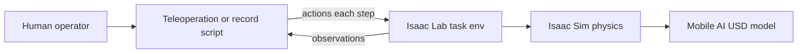
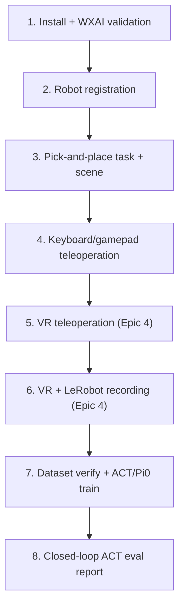
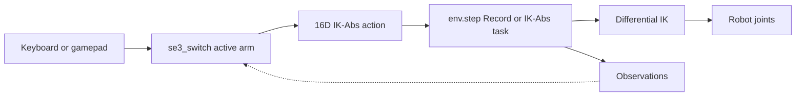
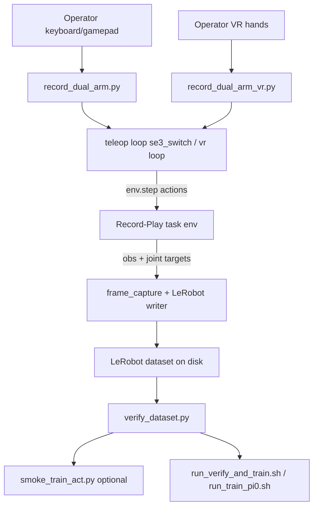
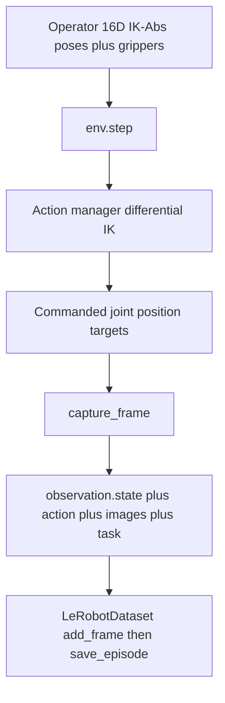

# Epic 3 — Simulation Training Pipeline

> **Document status:** Simulation data collection, ACT / Pi0 training, and closed-loop ACT evaluation are documented below. Pi0 sim eval remains deferred (see [§5.13](#513-evaluate-pi0-policy-closed-loop-rollout)).

## Contents

- [1. Goal](#1-goal)
- [2. Overview](#2-overview)
- [3. Background and Key Concepts](#3-background-and-key-concepts)
  - [Abbreviations](#abbreviations)
  - [Terms](#terms)
  - [Development timeline](#development-timeline)
- [4. Implementation](#4-implementation)
  - [4.1 Installation and Initial Validation](#41-installation-and-initial-validation)
  - [4.2 Mobile AI Robot Registration](#42-mobile-ai-robot-registration)
  - [4.3 Custom Reach Task Environment](#43-custom-reach-task-environment)
  - [4.4 Simulation Scene](#44-simulation-scene)
  - [4.5 Dual-Arm Keyboard/Gamepad Teleoperation](#45-dual-arm-keyboardgamepad-teleoperation)
  - [4.6 VR Teleoperation](#46-vr-teleoperation)
  - [4.7 Imitation Learning Recording Pipeline](#47-imitation-learning-recording-pipeline)
  - [4.8 Repository Structure](#48-repository-structure)
  - [4.9 Training Runs (ACT and Pi0)](#49-training-runs-act-and-pi0)
  - [4.10 Sim ACT / Pi0 Evaluation](#410-sim-act--pi0-evaluation)
- [5. Operational Procedures](#5-operational-procedures)
- [6. Findings and Limitations](#6-findings-and-limitations)
  - [6.4 ACT Evaluation Report (summary)](#64-act-evaluation-report-summary)
- [7. Troubleshooting](#7-troubleshooting)
- [8. Future Work](#8-future-work)

## 1. Goal

The goal of this epic is to build a digital twin of the Trossen Mobile AI robot in Isaac Sim and to establish a virtual data collection and training pipeline. The pipeline supports imitation learning by recording human demonstrations in simulation and preparing datasets for policy training.

---

## 2. Overview

The **Trossen Mobile AI** platform is a dual-arm mobile manipulator. The project applies **imitation learning (IL)** so the robot can perform manipulation tasks, such as picking up a cube from human demonstrations rather than explicit programming.

### Role of simulation

The project aims to enable autonomous manipulation after learning from human demos. Simulation addresses this by allowing the team to:

- Practice and debug control without physical hardware
- Collect synthetic training data at scale
- Iterate on scene layout, cameras, and recording format safely

### Wider project context

On the real robot, a parallel track uses leader-arm teleoperation, rosbag or LeRobot datasets, fine-tuning, and deployment. The simulation track follows the same imitation learning (IL) approach but runs entirely in Isaac Lab with LeRobot-compatible datasets, full ACT and Pi0 training, and closed-loop ACT evaluation in sim.

### Current scope

The current implementation extends the upstream Trossen repository with Mobile AI-specific Isaac Lab support:

- [Robot Registration](#42-mobile-ai-robot-registration): Articulation configs for `mobile_ai.usd`
- [Reach / pick-and-place task environments](#43-custom-reach-task-environment): `Isaac-Reach-MobileAI-IK-Abs-Play-v0`, `Isaac-Reach-MobileAI-Record-Play-v0`, and eval `Isaac-Lift-Cube-MobileAI-Joint-Pos-Play-v0` (Reach/Lift IDs are historical names for a pick-and-place scene)
- [Simulation scene](#44-simulation-scene): table, cube, spawn/color randomization
- [Dual-arm keyboard/gamepad teleoperation](#45-dual-arm-keyboardgamepad-teleoperation) with switchable arm control
- [VR teleoperation](#46-vr-teleoperation) (Quest 3; details in [Epic 4](EPIC4_VR_INTEGRATION.md))
- [LeRobot recording pipeline](#47-imitation-learning-recording-pipeline): **production demos collected with VR, right arm only** ([LeRobot Dataset v3.0](https://huggingface.co/docs/lerobot/en/lerobot-dataset-v3)); keyboard/gamepad recording scripts exist for smoke tests only
- [ACT and Pi0 training runs](#49-training-runs-act-and-pi0) on `mobile_ai_right_pick_place_20260714_v2` (10k ACT, 100k ACT, 10k Pi0)
- [Closed-loop ACT evaluation](#410-sim-act--pi0-evaluation) with a reported 30-episode result ([ACT Evaluation Report](ACT_EVAL_REPORT_100K.md))

Step-by-step collect → train → eval: [IL Workflow Cheat Sheet](IL_WORKFLOW_CHEATSHEET.md).

> **Historical note:** Early planning explored a standalone Isaac Sim scene (`mobile_ai_scene.usd`) with ROS2 topics mirroring the real robot. That approach was used for initial exploration but does not match the current implementation. The digital twin is the **Isaac Lab task environment**: robot, scene, cameras, and physics defined in Python ([`reach_env_cfg.py`](#reach_env_cfgpy--scene-and-mdp-base)), not a hand-edited USD scene file.

---

## 3. Background and Key Concepts

The following terms and abbreviations are used throughout this report:

### Abbreviations

| Abbreviation | Meaning |
|--------------|---------|
| **14D** | Fourteen-dimensional vector (7 joint values per follower arm) |
| **16D** | Sixteen-dimensional action vector (7D pose + 1 gripper command per arm) |
| **7D** | Seven-dimensional pose (3D position + unit quaternion) |
| **ACT** | Action Chunking with Transformers — a vision–state policy that predicts short sequences (“chunks”) of joint actions |
| **DOF** | Degrees of freedom |
| **Pi0** / **π₀** | Physical Intelligence open VLA-style policy in LeRobot; fine-tuned from `lerobot/pi0_base` on the same LeRobot dataset as ACT |
| **EE** | End-effector |
| **IK** | Inverse kinematics |
| **IK-Abs** | Inverse kinematics, absolute pose command mode |
| **IK-Rel** | Inverse kinematics, relative pose delta mode |
| **IL** | Imitation learning |
| **MDP** | Markov decision process |
| **PD** | Proportional-derivative (controller gains) |
| **PPO** | Proximal policy optimization (reinforcement learning algorithm) |
| **RGB** | Red, green, blue (color image channels) |
| **RL** | Reinforcement learning |
| **ROS2** | Robot Operating System 2 |
| **SE(3)** / **Se3** | Special Euclidean group in three dimensions (3D position and orientation) |
| **USD** | Universal Scene Description (3D scene file format) |
| **VR** | Virtual reality |
| **WXAI** | WidowX AI (Trossen single-arm reference robot) |
| **XR** | Extended reality (umbrella term for VR/AR; includes OpenXR) |

### Terms

| Term | Definition |
|------|------------|
| **Isaac Sim** | NVIDIA physics simulator. Runs the 3D world, robot model, and cameras. |
| **Isaac Lab** | Framework on top of Isaac Sim for robot learning. Standardizes environments, actions, and observations. |
| **Extension** | Python package `trossen_ai_isaac` installed into Isaac Lab; adds Trossen robots and tasks. |
| **Task / environment** | Named, launchable simulation: robot, scene, control mode, and observations. Selected with `--task Isaac-Reach-MobileAI-...`. |
| **Gym registration** | Mechanism that assigns a task name. Defined in `config/__init__.py`; verified with `list_envs.py`. |
| **Play variant** | Task configured for human interaction (single environment, no RL training rewards). |
| **Action** | Command sent to the robot each simulation step (e.g. IK target poses, gripper commands). |
| **Observation** | Data returned by the simulation (joint angles, camera images, etc.). |
| **OpenXR** | Open standard for VR/AR device access; used for hand-tracking teleoperation in Epic 4. |
| **LeRobot** | Open-source robotics dataset and training framework (Hugging Face). |
| **Policy sidecar** | Separate LeRobot inference process ([`policy_sidecar.py`](../source/trossen_ai_isaac/trossen_ai_isaac/evaluation/policy_sidecar.py)) spawned by closed-loop eval. Isaac Sim (Python 3.11) talks to the sidecar over localhost so the policy can run in `lerobot_train` (Python 3.12). |

### System architecture



At a high level the loop is: a **human** drives a **teleop or recording script**; each step the script sends **actions** into an **Isaac Lab task environment**, which advances **Isaac Sim** physics on the **Mobile AI USD**. The task returns **observations** (joints, cameras, …) to the script for the next step. Recording adds a writer that stores those observations and joint targets as a LeRobot dataset; evaluation swaps the human for a **policy sidecar** but keeps the same task → sim → robot path.

### Trossen upstream baseline

[Trossen Robotics provides](https://docs.trossenrobotics.com/trossen_arm/main/tutorials/trossen_ai_isaac.html) the upstream [`trossen_ai_isaac`](https://github.com/TrossenRobotics/trossen_ai_isaac) repository with Isaac Sim USD models, demo scripts, and full **WidowX AI (WXAI)** Isaac Lab support, registered tasks (reach, lift, cabinet), articulation configs, and teleoperation via [`teleop_se3_agent.py`](../scripts/teleoperation/teleop_se3_agent.py). The upstream repo also ships a `mobile_ai.usd` asset and standalone demos, but **no Isaac Lab tasks or IL pipeline for Mobile AI**. The team's work extends the upstream codebase using WXAI as the reference pattern.

### Development timeline

The diagram below is the chronological delivery path on this fork. Steps **1–4** and **7–8** are documented in this Epic 3 report; steps **5–6** are in [Epic 4](EPIC4_VR_INTEGRATION.md). Step **3** includes the table, cube, and spawn/color randomization ([§4.4](#44-simulation-scene)). Step **6** produced the **reporting dataset** (VR, right arm only — this project did not collect demos via keyboard/gamepad recording). Step **7** is dataset verify plus full ACT/Pi0 training. Step **8** is the closed-loop ACT reporting eval ([ACT Evaluation Report](ACT_EVAL_REPORT_100K.md)); Pi0 was trained in step 7 but sim eval remains deferred ([§5.13](#513-evaluate-pi0-policy-closed-loop-rollout)).



| Step | What was delivered |
|------|--------------------|
| 1 | Fork, Isaac Lab install, upstream WXAI bringup check ([§4.1](#41-installation-and-initial-validation)) |
| 2 | Mobile AI articulation config ([§4.2](#42-mobile-ai-robot-registration)) |
| 3 | Pick-and-place Reach/Record gym tasks + scene ([§4.3](#43-custom-reach-task-environment), [§4.4](#44-simulation-scene)) |
| 4 | Dual-arm keyboard/gamepad teleop ([§4.5](#45-dual-arm-keyboardgamepad-teleoperation)) |
| 5 | VR teleoperation ([§4.6](#46-vr-teleoperation), [Epic 4](EPIC4_VR_INTEGRATION.md)) |
| 6 | VR + LeRobot recording — **production dataset** ([§5.5](#55-vr-recording--production-demonstrations), [Epic 4 §5.4](EPIC4_VR_INTEGRATION.md#54-vr-recording-procedure)) |
| 7 | Dataset verify + ACT 10k/100k + Pi0 train ([§4.9](#49-training-runs-act-and-pi0), [§5.9](#59-verify-dataset)–[§5.12](#512-verify-pi0-dataset-and-train-pi0-manual)) |
| 8 | ACT 100k closed-loop reporting eval ([§5.11](#511-evaluate-act-policy-closed-loop-rollout), [ACT Evaluation Report](ACT_EVAL_REPORT_100K.md)) |

---

## 4. Implementation

The implementation follows the [development timeline](#development-timeline) above. The upstream Trossen repository provides the foundation: installation layout, USD assets, WXAI Isaac Lab tasks, and teleoperation scripts. The team did not build the simulation stack from scratch. The project **forked** upstream and **extended** it so the same patterns work for Mobile AI.

| Step | Topic | Section |
|------|-------|---------|
| 1 | Fork, install, upstream validation | [§4.1](#41-installation-and-initial-validation) |
| 2 | Mobile AI articulation registration | [§4.2](#42-mobile-ai-robot-registration) |
| 3 | Pick-and-place task + gym registration | [§4.3](#43-custom-reach-task-environment) |
| 3 | Simulation scene (table, cube, events) | [§4.4](#44-simulation-scene) |
| 4 | Dual-arm keyboard/gamepad teleoperation | [§4.5](#45-dual-arm-keyboardgamepad-teleoperation) |
| 5 | VR teleoperation | [§4.6](#46-vr-teleoperation), [Epic 4](EPIC4_VR_INTEGRATION.md) |
| 6 | VR + LeRobot recording (production) | [§4.7](#47-imitation-learning-recording-pipeline), [Epic 4 §5.4](EPIC4_VR_INTEGRATION.md#54-vr-recording-procedure) |
| 7 | Dataset verify + ACT/Pi0 training | [§4.9](#49-training-runs-act-and-pi0), [§5.9](#59-verify-dataset)–[§5.12](#512-verify-pi0-dataset-and-train-pi0-manual) |
| 8 | Closed-loop ACT eval report | [§4.10](#410-sim-act--pi0-evaluation), [ACT Evaluation Report](ACT_EVAL_REPORT_100K.md) |

Existing upstream files (`mobile_ai.usd`, [`teleop_se3_agent.py`](../scripts/teleoperation/teleop_se3_agent.py)) were used as starting points; new articulation configs, task environments, and teleoperation scripts were added where Mobile AI required them.

### 4.1 Installation and Initial Validation

The team followed the [Trossen AI Isaac installation guide](https://docs.trossenrobotics.com/trossen_arm/main/tutorials/trossen_ai_isaac.html) before adding Mobile AI customizations.

For project development, the team created a **designated GitHub account** and **forked** the upstream repository:

| Repository | Role |
|------------|------|
| [TrossenRobotics/trossen_ai_isaac](https://github.com/TrossenRobotics/trossen_ai_isaac) | Upstream (reference and baseline) |
| [trossenmobileai/trossen_ai_isaac](https://github.com/trossenmobileai/trossen_ai_isaac) | Project fork (all Mobile AI extensions) |

All extension install and development commands below refer to the **forked** repository, not the upstream clone.

**Prerequisites:**

- Ubuntu 22.04
- Isaac Lab 2.3.0 (installs Isaac Sim 5.1.0)
- Recommended method: binary Isaac Sim and Isaac Lab from source

**Extension install (forked repo):**

```bash
git clone https://github.com/trossenmobileai/trossen_ai_isaac.git
cd ~/trossen_ai_isaac   # use this path (or cd into your clone) before every project command

~/IsaacLab/isaaclab.sh -p -m pip install -e source/trossen_ai_isaac
```

**Task registration check:**

```bash
cd ~/trossen_ai_isaac
~/IsaacLab/isaaclab.sh -p scripts/tools/list_envs.py
```

The output should include WXAI tasks from upstream plus the Mobile AI entries added in the fork:

- `Isaac-Reach-MobileAI-IK-Abs-Play-v0`
- `Isaac-Reach-MobileAI-Record-Play-v0`
- `Isaac-Lift-Cube-MobileAI-Joint-Pos-Play-v0` (closed-loop eval)

**Upstream validation:** Before Mobile AI customization, the team confirmed the upstream toolchain with a stock WXAI bringup demo:

```bash
cd ~/trossen_ai_isaac
~/isaacsim/python.sh scripts/demos/robot_bringup.py wxai_base
```

A successful run confirms that Isaac Sim, Isaac Lab, and the upstream extension install correctly. Mobile AI work builds on top of this validated baseline.

### 4.2 Mobile AI Robot Registration

#### Why registration is required

Isaac Lab tasks do not load a USD file by path alone. A robot must be registered through an **articulation configuration** (`ArticulationCfg`) that tells Isaac Lab how to spawn the model, which joints to control, and how actuators behave. Upstream already provides this for WXAI in `tasks/.../assets/wxai.py` (`WXAI_CFG`, `WXAI_HIGH_PD_CFG`) and wires those configs into registered WXAI tasks.

The fork **already includes** `assets/robots/mobile_ai/mobile_ai.usd` from upstream. The USD file is shipped with the original repository. Standalone demos (e.g. `robot_bringup.py mobile_ai`) can load the asset without extra registration.

However, **no Mobile AI Isaac Lab articulation config or gym tasks exist in upstream**. To run Mobile AI inside Isaac Lab task environments (teleoperation, recording, data collection, training), the team studied the WXAI registration pattern and added the equivalent for Mobile AI.

#### What was added

- **`mobile_ai.usd`**: Robot 3D model. Include link hierarchy, mimic grippers, and joint drives live in USD.
	- Path: `assets/robots/mobile_ai/mobile_ai.usd`
- **`mobile_ai.py`**: Isaac Lab articulation registration for Mobile AI. Exports `MOBILE_AI_CFG` (base physics) and `MOBILE_AI_HIGH_PD_CFG` (IK teleoperation), modeled after `wxai.py`.
	- Path: `source/trossen_ai_isaac/trossen_ai_isaac/tasks/manager_based/manipulation/assets/mobile_ai.py`
- **`assets/__init__.py`**: Re-exports Mobile AI configs alongside WXAI so task environments can import them from the assets package.
	- Path: `source/trossen_ai_isaac/trossen_ai_isaac/tasks/manager_based/manipulation/assets/__init__.py`

**`mobile_ai.py`** (essential structure):

```python
MOBILE_AI_CFG = ArticulationCfg(
    spawn=sim_utils.UsdFileCfg(
        usd_path=os.path.join(_ASSETS_ROOT, "mobile_ai", "mobile_ai.usd"),
        # ...
    ),
    init_state=ArticulationCfg.InitialStateCfg(joint_pos={...}),  # both follower arms at zero
    actuators={
        "left_arm": ImplicitActuatorCfg(joint_names_expr=["follower_left_joint_[0-5]"], stiffness=None, damping=None),
        "left_gripper": ImplicitActuatorCfg(joint_names_expr=["follower_left_left_carriage_joint"], ...),
        "right_arm": ImplicitActuatorCfg(joint_names_expr=["follower_right_joint_[0-5]"], ...),
        "right_gripper": ImplicitActuatorCfg(joint_names_expr=["follower_right_left_carriage_joint"], ...),
        "base_wheels": ImplicitActuatorCfg(joint_names_expr=["left_wheel", "right_wheel"], ...),
    },
)

MOBILE_AI_HIGH_PD_CFG = MOBILE_AI_CFG.copy()
MOBILE_AI_HIGH_PD_CFG.spawn.rigid_props.disable_gravity = True
MOBILE_AI_HIGH_PD_CFG.actuators["left_arm"].stiffness = 400.0
MOBILE_AI_HIGH_PD_CFG.actuators["left_arm"].damping = 80.0
MOBILE_AI_HIGH_PD_CFG.actuators["right_arm"].stiffness = 400.0
MOBILE_AI_HIGH_PD_CFG.actuators["right_arm"].damping = 80.0
```

- **`MOBILE_AI_CFG`:** Spawns `mobile_ai.usd`, sets initial joint poses, and groups actuators for both arms, grippers, and base wheels. Stiffness/damping are left `None` so values from the USD file are used.
- **`MOBILE_AI_HIGH_PD_CFG`:** Copy used by Reach tasks: gravity disabled and high PD on arm joints for stable IK teleoperation (same pattern as `WXAI_HIGH_PD_CFG`).

**`assets/__init__.py`** (one-line addition next to the existing WXAI import):

```python
from .wxai import *
from .mobile_ai import *
```

Task configs (e.g. [`reach_env_cfg.py`](#reach_env_cfgpy--scene-and-mdp-base)) then import `MOBILE_AI_HIGH_PD_CFG` the same way WXAI tasks import `WXAI_HIGH_PD_CFG`.

The Mobile AI has **26 degrees of freedom** (base wheels and dual follower arms). IL work focuses on the **14 follower arm joints** (7 per arm: 6 arm joints and 1 gripper joint).

> **Design note:** `MOBILE_AI_HIGH_PD_CFG` uses high proportional-derivative (PD) gains and disables gravity on arm links. The same IK-control pattern used for `WXAI_HIGH_PD_CFG`. The Reach scene applies `fix_root_link=True` when spawning the robot ([§4.3](#reach_env_cfgpy--scene-and-mdp-base)) so the base does not slide or tip during teleoperation.

### 4.3 Custom Reach Task Environment

#### Why a custom task is required

Upstream provides complete Isaac Lab task packages for WXAI under `tasks/manager_based/manipulation/wxai/` (Reach, Lift, and Cabinet), each with scene configs, action/observation definitions, and gym registration in `config/__init__.py`. These tasks launch by name and work with `teleop_se3_agent.py`.

**Upstream WXAI tasks (available before any Mobile AI fork work):**

| Task family | Registered task ID | Control mode | Notes |
|-------------|-------------------|--------------|-------|
| **Reach** | `Isaac-Reach-WXAI-v0` | Joint position | RL training |
| | `Isaac-Reach-WXAI-Play-v0` | Joint position | Play / human interaction |
| | `Isaac-Reach-WXAI-IK-Rel-v0` | IK relative pose | RL training |
| | `Isaac-Reach-WXAI-IK-Abs-v0` | IK absolute pose | RL training |
| **Lift** | `Isaac-Lift-Cube-WXAI-v0` | Joint position | RL training |
| | `Isaac-Lift-Cube-WXAI-Play-v0` | Joint position | Play / human interaction |
| | `Isaac-Lift-Cube-WXAI-IK-Rel-v0` | IK relative pose | RL training |
| | `Isaac-Lift-Cube-WXAI-IK-Abs-v0` | IK absolute pose | RL training |
| **Cabinet** | `Isaac-Open-Drawer-WXAI-v0` | Joint position | RL training |
| | `Isaac-Open-Drawer-WXAI-Play-v0` | Joint position | Play / human interaction |

**No equivalent task package exists for Mobile AI in upstream.** The fork therefore adds environments under `tasks/manager_based/manipulation/mobile_ai/reach/` (and a joint-position play env under `.../lift/` for policy eval), following Isaac Lab’s WXAI package layout but adapted for dual-arm control, IL-oriented observations, and recording.

> **Naming note (Reach / Lift vs pick-and-place):** During development the Mobile AI environments were registered under Isaac Lab–style **Reach** and **Lift** names. They are not classic reach-to-target or lift-only RL tasks. All three production IDs are variants of the same **pick-and-place** scene (table + cube: pick, lift, place back):
>
> | Role | Gym ID (unchanged) |
> |------|--------------------|
> | Teleop | `Isaac-Reach-MobileAI-IK-Abs-Play-v0` |
> | LeRobot recording | `Isaac-Reach-MobileAI-Record-Play-v0` |
> | Closed-loop policy eval | `Isaac-Lift-Cube-MobileAI-Joint-Pos-Play-v0` |
>
> The gym IDs and Python module paths (`reach/`, `lift/`) were left as-is to avoid breaking scripts and docs already using them. When this report says “Reach task” for Mobile AI, it means the pick-and-place teleop/record environments above.

#### Reach task package

The reach package is a small set of config files. **[`reach_env_cfg.py`](#reach_env_cfgpy--scene-and-mdp-base)** is the base. It defines the digital twin scene and the dual-arm MDP skeleton that teleoperation and recording inherit from. Registered gym tasks point at specialized subclasses rather than at this file directly.

- **`reach_env_cfg.py`**: Base environment (scene, MDP terms, reset randomization, simulation timing, and teleoperation device defaults). [Details](#reach_env_cfgpy--scene-and-mdp-base)
	- Path: `source/trossen_ai_isaac/trossen_ai_isaac/tasks/manager_based/manipulation/mobile_ai/reach/reach_env_cfg.py`
- **`ik_abs_env_cfg.py`**: Absolute IK teleoperation (16D action layout and binary grippers). Registers `Isaac-Reach-MobileAI-IK-Abs-Play-v0`. [Details](#ik_abs_env_cfgpy--absolute-ik-teleoperation)
	- Path: `source/trossen_ai_isaac/trossen_ai_isaac/tasks/manager_based/manipulation/mobile_ai/reach/ik_abs_env_cfg.py`
- **`record_env_cfg.py`**: IL recording (cameras, 14D joint observations, and 60 Hz stepping). Registers `Isaac-Reach-MobileAI-Record-Play-v0`. [Details](#record_env_cfgpy--il-recording)
	- Path: `source/trossen_ai_isaac/trossen_ai_isaac/tasks/manager_based/manipulation/mobile_ai/reach/record_env_cfg.py`
- **`config/__init__.py`**: Gymnasium registration; Maps task IDs to the config entry points above.
	- Path: `source/trossen_ai_isaac/trossen_ai_isaac/tasks/manager_based/manipulation/mobile_ai/reach/config/__init__.py`

#### reach_env_cfg.py - scene and MDP base

Scene assets, table/cube setup, and reset randomization are described in [§4.4 Simulation Scene](#44-simulation-scene). This subsection summarizes the MDP wiring.

This file turns [`MOBILE_AI_HIGH_PD_CFG`](#42-mobile-ai-robot-registration) into a runnable Isaac Lab `ManagerBasedRLEnv`. The file groups the environment into `@configclass` blocks that Isaac Lab assembles at launch:

- **`MobileAIReachSceneCfg`**: Digital twin scene (ground, light, table, cube, robot) — details in [§4.4](#44-simulation-scene).
- **`CommandsCfg`**: Random end-effector pose targets for both arms (`follower_left_link_6`, `follower_right_link_6`). These feed reach-task observations; the [recording variant](#record_env_cfgpy--il-recording) disables them.
- **`ActionsCfg`**: Dual-arm action slots. `MobileAIReachEnvCfg.__post_init__` wires a differential IK controller on each arm's six joints.
- **`ObservationsCfg`**: Policy observations: relative joint positions and velocities, generated pose commands, and last action.
- **`EventCfg`**: Reset behavior: restore robot joints, randomize cube XY position on the table, and pick a discrete red, green, or blue cube color.
- **`MobileAIReachEnvCfg`**: Top-level config that combines the above, sets 60 Hz simulation (`sim.dt = 1/60`, `decimation = 2`), and registers keyboard and gamepad teleoperation device defaults (`gripper_term=False`; grippers are handled by the [teleoperation script](#45-dual-arm-keyboardgamepad-teleoperation)).
- **`MobileAIReachEnvCfg_PLAY`**: Play/teleoperation base: single environment (`num_envs = 1`), observation noise off.

Essential scene and robot wiring:

```python
@configclass
class MobileAIReachSceneCfg(InteractiveSceneCfg):
    ground = AssetBaseCfg(...)
    light = AssetBaseCfg(...)
    table = AssetBaseCfg(...)                    # grey table in front of robot
    cube: RigidObjectCfg = RigidObjectCfg(...)   # 3 cm manipulation target on table
    robot: ArticulationCfg = MOBILE_AI_HIGH_PD_CFG.replace(
        prim_path="{ENV_REGEX_NS}/Robot",
        spawn=MOBILE_AI_HIGH_PD_CFG.spawn.replace(
            articulation_props=ArticulationRootPropertiesCfg(
                fix_root_link=True,              # anchor base during teleoperation
                # ...
            ),
        ),
    )
```

#### ik_abs_env_cfg.py - absolute IK teleoperation

This file is **central to Epic 3 teleoperation**. The registered task `Isaac-Reach-MobileAI-IK-Abs-Play-v0` points at `MobileAIReachEnvCfg_IK_ABS_PLAY` defined here: the environment that [`teleop_dual_arm_switch.py`](#53-keyboard-or-gamepad-teleoperation) launches. It inherits the scene and MDP skeleton from [`reach_env_cfg.py`](#reach_env_cfgpy--scene-and-mdp-base) and overrides the action layer for **absolute** inverse kinematics.

- **`MobileAIReachEnvCfg_IK_ABS`**: Flips both arm action terms from relative deltas (base config) to absolute pose commands (`use_relative_mode=False`). Each arm expects a 7D pose `[pos_xyz, quat_wxyz]` in the robot base frame. Adds binary gripper actions on both carriage joints, producing a **16D** environment action vector: `[L_pose(7), R_pose(7), L_grip(1), R_grip(1)]`.
- **`MobileAIReachEnvCfg_IK_ABS_PLAY`**: Play/teleoperation entry point: single environment, observation noise off. Registered as `Isaac-Reach-MobileAI-IK-Abs-Play-v0`.

The file also registers an OpenXR **`handtracking`** teleoperation device for VR. Keyboard and gamepad teleoperation ignore this; see [Epic 4](EPIC4_VR_INTEGRATION.md).

Essential action wiring:

```python
# Absolute IK on both arms (overrides relative mode from reach_env_cfg.py)
self.actions.left_arm_action = DifferentialInverseKinematicsActionCfg(
    controller=DifferentialIKControllerCfg(command_type="pose", use_relative_mode=False, ...),
    # ...
)
self.actions.right_arm_action = DifferentialInverseKinematicsActionCfg(...)

# Binary grippers (appended after arm actions; 16D total)
self.actions.left_gripper_action = BinaryJointPositionActionCfg(
    joint_names=["follower_left_left_carriage_joint"],
    open_command_expr={...: 0.044}, close_command_expr={...: 0.0},
)
self.actions.right_gripper_action = BinaryJointPositionActionCfg(...)
```

The teleoperation library ([`se3_switch.py`](#45-dual-arm-keyboardgamepad-teleoperation)) assembles the same 16D layout client-side for keyboard/gamepad: it integrates device deltas into per-arm IK targets and passes them to `env.step()`.

#### record_env_cfg.py - IL recording

This file defines the environment for [LeRobot dataset collection](#47-imitation-learning-recording-pipeline). The registered task `Isaac-Reach-MobileAI-Record-Play-v0` points at `MobileAIReachEnvCfg_RECORD_PLAY`, launched by [`record_dual_arm_vr.py`](#55-vr-recording--production-demonstrations) or [`record_dual_arm.py`](#58-recording--human-demonstrations). It inherits absolute IK and grippers from [`MobileAIReachEnvCfg_IK_ABS_PLAY`](#ik_abs_env_cfgpy--absolute-ik-teleoperation) and retargets observations and sensors for a [LeRobot Dataset v3.0](https://huggingface.co/docs/lerobot/en/lerobot-dataset-v3) feature schema.

- **`MobileAIRecordSceneCfg`**: Extends `MobileAIReachSceneCfg` with three RGB camera sensors (`cam_high`, `cam_left_wrist`, `cam_right_wrist`) at 480×640, bound to existing USD camera prims on the robot.
- **`RecordObservationsCfg`**: Replaces the reach-task policy observations with a single **14D absolute joint position** vector (7 joints per follower arm), matching the real-robot LeRobot layout. No pose commands or velocity noise.
- **`EmptyCommandsCfg`**: Disables random end-effector pose commands; IL demos do not use reach targets.
- **`MobileAIReachEnvCfg_RECORD_PLAY`**: Top-level recording config: inherits cube position/color randomization from `EventCfg`, sets `decimation = 1` for full 60 Hz stepping, and turns off IK debug visualization.

Essential recording overrides:

```python
@configclass
class MobileAIReachEnvCfg_RECORD_PLAY(MobileAIReachEnvCfg_IK_ABS_PLAY):
    scene: MobileAIRecordSceneCfg = MobileAIRecordSceneCfg(num_envs=1, ...)
    observations: RecordObservationsCfg = RecordObservationsCfg()
    events: EventCfg = EventCfg()          # cube randomization on reset

    def __post_init__(self):
        super().__post_init__()
        self.decimation = 1                # 60 Hz: one env step per sim frame
        self.commands = EmptyCommandsCfg() # no random EE targets during recording
```

Commanded joint position targets captured at each step become the dataset `action` labels ([§4.7](#47-imitation-learning-recording-pipeline)); IK commands drive the robot during collection but are not stored directly.

**Registered tasks (fork):**

| Task ID | Config class | Launched by |
|---------|--------------|-------------|
| `Isaac-Reach-MobileAI-IK-Abs-Play-v0` | `MobileAIReachEnvCfg_IK_ABS_PLAY` | [`teleop_dual_arm_switch.py`](#53-keyboard-or-gamepad-teleoperation), [`teleop_dual_arm_vr.py`](EPIC4_VR_INTEGRATION.md#52-mobile-ai-vr-teleoperation) |
| `Isaac-Reach-MobileAI-Record-Play-v0` | `MobileAIReachEnvCfg_RECORD_PLAY` | [`record_dual_arm_vr.py`](#55-vr-recording--production-demonstrations), [`record_dual_arm.py`](#58-recording--human-demonstrations) |

(Closed-loop eval uses `Isaac-Lift-Cube-MobileAI-Joint-Pos-Play-v0` — same pick-and-place scene, joint-position actions; see [§4.10](#410-sim-act--pi0-evaluation). Naming history: [§4.3](#43-custom-reach-task-environment).)

**IK-Rel to IK-Abs migration:** Early experiments used IK-Rel (12D relative pose deltas). Arm drift and control instability led to a switch to IK-Abs (16D). See [§6.1 Arm Drift](#61-arm-drift-resolved) for the full investigation and resolution.

> **Historical note:** Early Mobile AI work also experimented with separate Lift-named gym IDs and IK-Rel Reach variants. The production teleop/record path settled on the Reach-named IDs above; joint-position eval kept a Lift-named ID. Conceptually all are pick-and-place — see the [naming note](#43-custom-reach-task-environment).

### 4.4 Simulation Scene

The pick-and-place digital twin is assembled in [`reach_env_cfg.py`](../source/trossen_ai_isaac/trossen_ai_isaac/tasks/manager_based/manipulation/mobile_ai/reach/reach_env_cfg.py) as `MobileAIReachSceneCfg` plus reset `EventCfg`. Teleop, VR, recording, and closed-loop eval all reuse this scene (recording adds cameras; eval uses a joint-position lift variant of the same table and cube).

#### Scene assets (`MobileAIReachSceneCfg`)

| Asset | How it is configured |
|-------|----------------------|
| **Ground** | Default Isaac Lab ground plane at `/World/ground`. |
| **Light** | Dome light (`color≈0.75`, intensity `2500`) for even illumination of RGB cameras. |
| **Table** | Grey cuboid `size=(0.99, 2.0, 0.807)` m with collision and rigid body props. Spawned at `(0.85, 0.0, 0.4035)` so the top sits in front of the Mobile AI base. Visual material is a dark grey preview surface. |
| **Cube** | Rigid cuboid `0.03×0.03×0.03` m, mass `0.1` kg, collision enabled. Initial pose sits on the table surface (`z≈0.822`). Default visual color is red; reset events override color (below). |
| **Robot** | `MOBILE_AI_HIGH_PD_CFG` with `fix_root_link=True` so the base stays anchored, `disable_gravity=True` on the articulation spawn (arms are position-controlled), self-collisions enabled, and higher PhysX solver iterations for stable contact. |

#### Reset randomization (`EventCfg`)

On every environment reset (including after **J** / episode save):

1. **Robot joints** restore to the default scaled pose (no random joint noise).
2. **Cube XY** is resampled on the table with `reset_root_state_uniform` ranges roughly `x∈[-0.10, 0.05]`, `y∈[-0.20, 0.0]` relative to the default cube pose (`z` fixed).
3. **Cube color** is chosen discretely from pure red, green, or blue via `randomize_cube_color_discrete` (stored on the env for eval metrics).

#### Simulation timing and physics

- Base reach config: `sim.dt = 1/60`, `decimation = 2` (control at 30 Hz).
- Record-Play: `decimation = 1` so demos are stored at **60 Hz**, matching closed-loop eval FPS.
- Anchored base + high PD gains keep teleop IK targets tracking without tipping the mobile base.

#### Recording cameras

[`record_env_cfg.py`](#record_env_cfgpy--il-recording) extends the same scene with `cam_high`, `cam_left_wrist`, and `cam_right_wrist` (480×640 RGB) bound to USD camera prims on the robot. Production demos used **right-arm** mode (`cam_high` + `cam_right_wrist` only).

Code-level overview of the same classes: [§4.3 `reach_env_cfg.py`](#reach_env_cfgpy--scene-and-mdp-base).

### 4.5 Dual-Arm Keyboard/Gamepad Teleoperation

#### Why a custom teleoperation script is required

Upstream provides [`teleop_se3_agent.py`](../scripts/teleoperation/teleop_se3_agent.py) as the general teleoperation entrypoint for Isaac Lab tasks. WXAI tasks work with this script out of the box.

Mobile AI requires **dual-arm** control with **switchable** arm selection (one arm at a time for keyboard/gamepad recording). The upstream script targets single-arm tasks and does not implement arm switching or the [16D IK-Abs action layout](#ik_abs_env_cfgpy--absolute-ik-teleoperation). The team used `teleop_se3_agent.py` as the architectural base and added:

| Upstream (reference) | Fork (Mobile AI extension) |
|----------------------|----------------------------|
| [`teleop_se3_agent.py`](../scripts/teleoperation/teleop_se3_agent.py) | [`teleop_dual_arm_switch.py`](../scripts/teleoperation/teleop_dual_arm_switch.py) |
| Single-arm Se3 teleoperation | Switchable dual-arm IK-Abs teleoperation via [`se3_switch.py`](../source/trossen_ai_isaac/trossen_ai_isaac/teleop/se3_switch.py) |

VR hand-tracking teleoperation extends this layer further; see [Epic 4](EPIC4_VR_INTEGRATION.md).

#### Control model and loop

The operator moves one end-effector at a time; the task environment's differential IK solver ([`ik_abs_env_cfg.py`](#ik_abs_env_cfgpy--absolute-ik-teleoperation)) converts 16D pose and gripper commands into joint motion. [`teleop_dual_arm_switch.py`](../scripts/teleoperation/teleop_dual_arm_switch.py) launches `Isaac-Reach-MobileAI-IK-Abs-Play-v0`, reads input each frame, builds the action tensor in [`se3_switch.py`](../source/trossen_ai_isaac/trossen_ai_isaac/teleop/se3_switch.py), and calls `env.step(action)`.



**Input devices:** keyboard or gamepad via `--teleop_device`. Motion deltas apply to the **active arm only** while teleoperation is active (`TeleopSession.teleoperation_active`, on by default). Bindings combine Isaac Lab `Se3Keyboard` / `Se3Gamepad` defaults with fork-specific callbacks in `se3_switch.py` (`gripper_term=False` in the env config; grippers are toggled via **K** / **A** instead). This project does not use SpaceMouse for Mobile AI teleoperation.

**Keyboard** (`--teleop_device keyboard`):

| Key / input | Category | Action |
|-------------|----------|--------|
| **W** / **S** | Motion (active arm) | Move end-effector along +X / −X (forward / backward) |
| **A** / **D** | Motion (active arm) | Move along +Y / −Y (left / right) |
| **Q** / **E** | Motion (active arm) | Move along +Z / −Z (up / down) |
| **Z** / **X** | Motion (active arm) | Rotate about X axis (+ / −) |
| **T** / **G** | Motion (active arm) | Rotate about Y axis (+ / −) |
| **C** / **V** | Motion (active arm) | Rotate about Z axis (+ / −) |
| **L** | Device reset | Clear accumulated position/rotation deltas (Isaac Lab default) |
| **TAB** | Dual-arm | Switch active arm (re-seeds IK target from current end-effector pose) |
| **K** | Gripper | Toggle open/close on the **active** arm |
| **J** | Environment | Reset environment (discards in-progress recording if any). Prefer **J** over **R** to avoid Isaac Kit shortcut conflicts (same as VR). |
| **N** | Recording only | Toggle episode recording: start, or save and reset ([`record_dual_arm.py`](../scripts/imitation_learning/recording/record_dual_arm.py) only) |
| **M** | Recording only | Discard current episode buffer without saving |
| **START** / **STOP** / **RESET** | Session (XR) | Registered for OpenXR / env-config teleoperation devices; not bound to physical keys on the local `Se3Keyboard` fallback |

**Gamepad** (`--teleop_device gamepad`):

| Button / stick | Category | Action |
|----------------|----------|--------|
| **Left stick** up / down | Motion (active arm) | Move along +X / −X |
| **Left stick** left / right | Motion (active arm) | Move along +Y / −Y |
| **Right stick** up / down | Motion (active arm) | Move along +Z / −Z |
| **D-pad** right / left | Motion (active arm) | Rotate about X axis (+ / −) |
| **D-pad** down / up | Motion (active arm) | Rotate about Y axis (+ / −) |
| **Right stick** left / right | Motion (active arm) | Rotate about Z axis (+ / −) |
| **Y** (polled) | Dual-arm | Switch active arm |
| **A** (polled) | Gripper | Toggle open/close on the **active** arm |
| **B** (polled) | Environment | Reset environment (discards in-progress recording if any) |
| **X** (polled, recording only) | Recording | Toggle episode recording: start, or save and reset |

Episode discard on gamepad uses keyboard **M** only (no gamepad binding).

Tune motion sensitivity with `--sensitivity`. For gamepad, `--gamepad_dead_zone` filters stick noise. Step-by-step launch commands are in [§5.3](#53-keyboard-or-gamepad-teleoperation).

### 4.6 VR Teleoperation

After keyboard/gamepad teleop worked on the pick-and-place task, the team added **Quest 3 + ALVR + OpenXR** teleoperation so both arms can be driven by hand tracking. Implementation lives in [Epic 4](EPIC4_VR_INTEGRATION.md) (`teleop_dual_arm_vr.py`, `source/.../teleop/vr/`).

Epic 3 keeps only this summary:

- Same task ID as keyboard teleop: `Isaac-Reach-MobileAI-IK-Abs-Play-v0` (16D IK-Abs actions).
- Default VR session is single-arm focus for demos; `--dual_arm` enables true bimanual control.
- Workstation keys **N/M/B/J** control session / recording / re-anchor / reset (Kit binds **R**, so reset is **J**).

Full stack setup, CLI flags, and troubleshooting: [Epic 4](EPIC4_VR_INTEGRATION.md).

### 4.7 Imitation Learning Recording Pipeline

Teleoperation moves the robot; imitation learning requires saved episodes in a standard format. The pipeline builds on the [record task config](#record_env_cfgpy--il-recording).

**Production collection (this project):** demos for the reporting train set (`mobile_ai_right_pick_place_20260714_v2`) were recorded with **VR only**, right arm only (`--record_arm right`), via [`run_collect_dataset.sh`](../scripts/imitation_learning/run_collect_dataset.sh) → [`record_dual_arm_vr.py`](../scripts/imitation_learning/recording/record_dual_arm_vr.py). Pick-and-place needs one arm; operators focus on the active hand, and VR often loses tracking of the unused arm (which then drifts). This project did **not** collect production demos with keyboard/gamepad recording (`record_dual_arm.py` remains available for smoke tests).

Pipeline components:

1. The **Record task** (`Isaac-Reach-MobileAI-Record-Play-v0`). See [`record_env_cfg.py`](#record_env_cfgpy--il-recording).
2. **Recording entrypoints** — **VR (production)** [`record_dual_arm_vr.py`](../scripts/imitation_learning/recording/record_dual_arm_vr.py) ([Epic 4](EPIC4_VR_INTEGRATION.md)); **keyboard/gamepad (smoke / tooling only)** [`record_dual_arm.py`](../scripts/imitation_learning/recording/record_dual_arm.py)
3. A **LeRobot dataset writer** under [`source/.../recording/`](../source/trossen_ai_isaac/trossen_ai_isaac/recording/) that captures frames each simulation step
4. Offline **validation** ([`verify_dataset.py`](../scripts/imitation_learning/validation/verify_dataset.py), [§5.9](#59-verify-dataset))
5. **Training** — optional short smoke ([`smoke_train_act.py`](../scripts/imitation_learning/training/smoke_train_act.py)) or full ACT/Pi0 train ([§4.9](#49-training-runs-act-and-pi0), [§5.10](#510-act-training-smoke-test-and-full-training), [§5.12](#512-verify-pi0-dataset-and-train-pi0-manual))

`smoke_train_act.py` only checks that the dataset feeds the trainer for a few iterations. Production training uses [`run_verify_and_train.sh`](../scripts/imitation_learning/run_verify_and_train.sh) (ACT) or [`run_train_pi0.sh`](../scripts/imitation_learning/run_train_pi0.sh) (Pi0), which call `lerobot-train` in the `lerobot_train` conda env.



**Dataset schema** (default `--record_arm both`):

| Field | Shape | Description |
|-------|-------|-------------|
| `observation.state` | 14D float32 | Follower arm joint positions (7 per arm) |
| `action` | 14D float32 | Commanded joint position targets (7 per arm) |
| `observation.images.cam_high` | 480×640 RGB video | Overhead camera |
| `observation.images.cam_left_wrist` | 480×640 RGB video | Left wrist camera |
| `observation.images.cam_right_wrist` | 480×640 RGB video | Right wrist camera |

The **reporting** train set used `--record_arm right`: **7D** state/action plus `cam_high` + `cam_right_wrist` only ([§4.9](#49-training-runs-act-and-pi0)).

> **Design note:** Actions are stored as **commanded joint position targets**, not IK pose commands. During teleoperation the operator drives 16D IK-Abs actions; the recorder captures the resulting joint targets that the action manager applies. This matches the [LeRobot Dataset v3.0](https://huggingface.co/docs/lerobot/en/lerobot-dataset-v3) layout (`observation.state` / `action` / `observation.images.*` / `task`).



#### LeRobot Dataset v3.0 on disk

Recording writes a self-describing [LeRobot Dataset v3.0](https://huggingface.co/docs/lerobot/en/lerobot-dataset-v3) tree via [`LeRobotRecorder`](../source/trossen_ai_isaac/trossen_ai_isaac/recording/lerobot_recorder.py) / [`capture_frame`](../source/trossen_ai_isaac/trossen_ai_isaac/recording/frame_capture.py):

1. **`LeRobotDataset.create`** — opens the dataset root with the feature schema (joint dims + cameras for `--record_arm`), fps, and `robot_type`.
2. **Per simulation step** — after `env.step`, `capture_frame` builds one frame dict; `add_frame` buffers it.
3. **Episode save** — workstation **N** (or equivalent) calls `save_episode`, flushing the buffer into parquet + video chunks.
4. **Finalize** — on exit / interrupt, `finalize()` writes metadata so the dataset is readable by LeRobot trainers.
5. **VR multi-session** — shards under `.../shards/session_*` are combined with [`run_merge_dataset.sh`](../scripts/imitation_learning/run_merge_dataset.sh) (`aggregate_datasets`) into one valid v3 dataset.

Typical on-disk layout (see HF docs for the full v3 contract):

| Path | Role |
|------|------|
| `meta/info.json` | Dataset metadata: features, fps, `robot_type`, total episodes/frames |
| `meta/episodes.*` | Per-episode index / lengths |
| `data/` | Parquet tables of non-video frame fields (`observation.state`, `action`, `task`, …) |
| `videos/` | MP4 (or equivalent) streams per `observation.images.*` camera feature |

The reporting set (`mobile_ai_right_pick_place_20260714_v2`) is this v3 format with **7D** right-arm state/action and cameras `cam_high` + `cam_right_wrist`.

**Recording controls:** **N** (toggle episode), **M** (discard), **J** (reset). Same bindings as the [keyboard table in §4.5](#45-dual-arm-keyboardgamepad-teleoperation). VR recording also uses **J** for reset ([Epic 4](EPIC4_VR_INTEGRATION.md)).

**LeRobot dependency:** LeRobot is not bundled in Isaac Sim Python. It is installed separately for recording (`lerobot==0.4.4` in Isaac Sim Python 3.11), dataset verification (`~/lerobot_trossen/.venv`), and training (`lerobot_train` conda environment).

### 4.8 Repository Structure

Runnable **scripts** live under `scripts/`; reusable **library code** lives in the installed `trossen_ai_isaac` package. All Mobile AI IL and VR integration work for this project lives on **`main`**.

| Location | Role | How to run |
|----------|------|------------|
| `scripts/teleoperation/` | Teleoperation entrypoints | `~/IsaacLab/isaaclab.sh -p scripts/teleoperation/...` |
| `scripts/imitation_learning/` | Recording, validation, training smoke | `isaaclab.sh -p` or plain Python |
| `scripts/demos/` | Standalone Isaac Sim demos | `~/isaacsim/python.sh scripts/demos/...` |
| `source/.../teleop/` | Teleoperation library | Imported by scripts |
| `source/.../recording/` | LeRobot writer, frame capture | Imported by IL scripts |
| `source/.../evaluation/` | Policy rollout, LeRobot sidecar (ACT / Pi0) | Imported by `play_act.py` |
| `source/.../tasks/.../mobile_ai/` | Task environment configs | Registered as gym tasks |

### 4.9 Training Runs (ACT and Pi0)

After demonstrations are recorded and verified, the same [LeRobot Dataset v3.0](https://huggingface.co/docs/lerobot/en/lerobot-dataset-v3) can train more than one policy type. This project trained **ACT** (twice) and **Pi0** (once) on the **VR-collected** right-arm pick-and-place set (`mobile_ai_right_pick_place_20260714_v2`), then evaluated the longer ACT run in simulation.

**What a newcomer should know**

1. Recording writes a [LeRobot Dataset v3.0](https://huggingface.co/docs/lerobot/en/lerobot-dataset-v3) (parquet frames + MP4 cameras). That format is the common input for LeRobot trainers.
2. **ACT** is a compact transformer that maps camera images + joint state → a chunk of joint actions. It trains from scratch on the demo set.
3. **Pi0** is a larger pretrained policy (`lerobot/pi0_base`) fine-tuned on the same demos. It also expects LeRobot features, so no dataset conversion is required.
4. Training runs in the external `lerobot_train` conda env (Python 3.12 / CUDA). Isaac Sim is not involved until evaluation.
5. Checkpoints land under `~/trossen_ai_isaac/outputs/train/<job_name>/checkpoints/`. Evaluation uses the `last` (or a numbered) `pretrained_model` folder.

**Shared dataset (all three runs)**

| Field | Value |
|-------|--------|
| `repo_id` | `trossen-admin/mobile_ai_right_pick_place_20260714_v2` |
| `root` | `~/lerobot_trossen/datasets/mobile_ai_right_pick_place_20260714_v2` |
| Collection | **VR**, `--record_arm right` ([`run_collect_dataset.sh`](../scripts/imitation_learning/run_collect_dataset.sh)); see [§4.7](#47-imitation-learning-recording-pipeline) |
| Layout | 7D right-arm `observation.state` / `action`; cameras `cam_high` + `cam_right_wrist` (480×640) |
| `video_backend` | `pyav` |
| Image transforms | Disabled during these runs |

**Artifacts produced**

| Job | Policy | Steps | Output directory | Role |
|-----|--------|-------|------------------|------|
| `act_mobile_ai_right_v2` | ACT | 10 000 | `~/trossen_ai_isaac/outputs/train/act_mobile_ai_right_v2` | First full train (short); smoke / early testing |
| `act_mobile_ai_right_v2_100k` | ACT | 100 000 | `~/trossen_ai_isaac/outputs/train/act_mobile_ai_right_v2_100k` | **Reporting model** — used for the 30-episode eval |
| `pi0_mobile_ai_right_v2` | Pi0 | 10 000 | `~/trossen_ai_isaac/outputs/train/pi0_mobile_ai_right_v2` | Fine-tuned Pi0; sim eval deferred ([§5.13](#513-evaluate-pi0-policy-closed-loop-rollout)) |

**How the runs were launched**

- **ACT 10k:** [`run_verify_and_train.sh`](../scripts/imitation_learning/run_verify_and_train.sh) (verify dataset, then `lerobot-train` with `--policy.type=act`, `--steps=10000`, `--save_freq=1000`).
- **ACT 100k:** Same ACT recipe and dataset as the 10k run, with `--steps=100000`, `--job_name=act_mobile_ai_right_v2_100k`, a separate `--output_dir`, and `--save_freq=10000`. There is no separate wrapper script in-repo; the command is the 10k train line with those flags changed ([§5.10](#510-act-training-smoke-test-and-full-training)).
- **Pi0 10k:** [`run_train_pi0.sh`](../scripts/imitation_learning/run_train_pi0.sh) after [`run_verify_pi0_dataset.sh`](../scripts/imitation_learning/run_verify_pi0_dataset.sh) ([§5.12](#512-verify-pi0-dataset-and-train-pi0-manual)).

**ACT hyperparameters** (identical for the 10k and 100k jobs except `steps` and `save_freq`)

| Setting | Value |
|---------|--------|
| `batch_size` | 8 |
| `num_workers` | 4 |
| `seed` | 1000 |
| Optimizer | AdamW, `lr=1e-5`, `weight_decay=1e-4`, `grad_clip_norm=10`, betas `(0.9, 0.999)` |
| Scheduler | None |
| `n_obs_steps` | 1 |
| `chunk_size` / `n_action_steps` | 100 |
| `dim_model` | 512 |
| Encoder / decoder layers | 4 / 1 |
| Attention heads | 8 |
| `dim_feedforward` | 3200 |
| `dropout` | 0.1 |
| `kl_weight` | 10.0 |
| Vision backbone | ResNet18 (`IMAGENET1K_V1`) |
| VAE | Enabled (`latent_dim=32`) |
| Device | `cuda` |
| Logging | `log_freq=100`; W&B off; no Hub push |
| Checkpointing | 10k run: `save_freq=1000`; 100k run: `save_freq=10000` |

**Pi0 hyperparameters** (from `run_train_pi0.sh` / saved `train_config.json`)

| Setting | Value |
|---------|--------|
| Base weights | `lerobot/pi0_base` |
| `batch_size` | 8 |
| `steps` | 10 000 |
| `num_workers` | 4 |
| `seed` | 1000 |
| Optimizer | AdamW, `lr=2.5e-5`, `weight_decay=0.01`, `grad_clip_norm=1`, betas `(0.9, 0.95)` |
| `n_obs_steps` | 1 |
| `chunk_size` / `n_action_steps` | 50 |
| `dtype` | `bfloat16` |
| `compile_model` | `true` |
| `gradient_checkpointing` | `true` |
| `train_expert_only` | `true` |
| `num_inference_steps` | 10 |
| Variants | PaliGemma `gemma_2b`, action expert `gemma_300m` |
| Device | `cuda` |
| Logging / save | `log_freq=100`, `save_freq=1000`; W&B off; no Hub push |

Configs for each finished run are stored next to the weights, e.g. `.../checkpoints/last/pretrained_model/train_config.json`.

**Evaluation choice:** The team evaluated **`act_mobile_ai_right_v2_100k`** (not the 10k ACT or Pi0) with a 30-episode closed-loop rollout. Procedure: [§5.11](#511-evaluate-act-policy-closed-loop-rollout). Results: [ACT Evaluation Report](ACT_EVAL_REPORT_100K.md).

---

### 4.10 Sim ACT / Pi0 Evaluation

Closed-loop deployment and evaluation of a trained ACT or Pi0 checkpoint in simulation. This is the sim equivalent of real-robot `lerobot-record --policy.path=<checkpoint>` ([Trossen ACT evaluation docs](https://docs.trossenrobotics.com/trossen_arm/main/tutorials/lerobot_plugin/train_and_evaluate.html)).

**ACT and Pi0 share one Isaac eval path.** Both wrappers call [`play_act.py`](../scripts/imitation_learning/evaluation/play_act.py) → [`act_rollout.py`](../source/trossen_ai_isaac/trossen_ai_isaac/evaluation/act_rollout.py) → the same metrics. The sidecar loads `act` or `pi0` from the checkpoint config. Only default checkpoint paths and output directories differ (`outputs/eval/act` vs `outputs/eval/pi0`). **Pi0 was trained but closed-loop sim eval was not completed** (Inductor compile / 120 s timeout). **Reporting uses ACT 100k** (`act_mobile_ai_right_v2_100k`) — see [§4.9](#49-training-runs-act-and-pi0), [§5.11](#511-evaluate-act-policy-closed-loop-rollout), [ACT Evaluation Report](ACT_EVAL_REPORT_100K.md).

#### How the policy is evaluated

Each episode is a **closed-loop rollout** in `Isaac-Lift-Cube-MobileAI-Joint-Pos-Play-v0` at **60 FPS** (play env timeout **90 s**):

1. Isaac Sim runs the scene; a **policy sidecar** in `lerobot_train` loads the checkpoint and answers `reset` / `infer` over a persistent TCP link.
2. Episode start: force **home pose** (arms at zero joints, grippers open `0.044 m`), then ~30 warm-up steps that are **not** scored.
3. Each policy step: capture **7D** right-arm state + `cam_high` + `cam_right_wrist` → sidecar → **7D** action → map onto **14D** env joint targets (left arm held at start pose).
4. [`EpisodeCubeTracker`](../source/trossen_ai_isaac/trossen_ai_isaac/tasks/manager_based/manipulation/mobile_ai/lift/mdp/metrics.py) updates lift/place state and may early-stop; after the episode, metrics are written to `rollout_summary.json`.

**Real robot vs sim**

| Real robot | Simulation (this repo) |
|------------|------------------------|
| `lerobot-record --policy.path=...` | [`run_play_act.sh`](../scripts/imitation_learning/run_play_act.sh) / [`run_play_pi0.sh`](../scripts/imitation_learning/run_play_pi0.sh) |
| `mobileai_robot` + RealSense | `Isaac-Lift-Cube-MobileAI-Joint-Pos-Play-v0` |
| Policy in same process as robot I/O | **Sidecar**: Isaac Sim (Python 3.11) + policy in `lerobot_train` conda (Python 3.12) |
| 16D mobileai_robot actions | **7D right-arm** checkpoint when recorded with `--record_arm right` |
| Operator observes success | Automatic metrics in `~/trossen_ai_isaac/outputs/eval/act/` or `.../eval/pi0/` |

**Architecture (implementation detail)**

1. [`play_act.py`](../scripts/imitation_learning/evaluation/play_act.py) launches Isaac Sim with the joint-position lift environment.
2. [`act_rollout.py`](../source/trossen_ai_isaac/trossen_ai_isaac/evaluation/act_rollout.py) spawns [`policy_sidecar.py`](../source/trossen_ai_isaac/trossen_ai_isaac/evaluation/policy_sidecar.py) in `lerobot_train` with a **clean subprocess env** (strips Isaac `PYTHONPATH` to avoid Python version conflicts).
3. A **single persistent TCP connection** carries `reset` / `infer` requests for the full rollout.
4. Each step: capture 7D right-arm state + cameras → sidecar → 7D action → 14D env targets (left held).
5. The sidecar loads the policy type from the checkpoint (`act`, `pi0`, …) via LeRobot `PreTrainedConfig` / `get_policy_class`, then applies `make_pre_post_processors` before/after `select_action`.
6. Home + warm-up as above; joint-position actions use `preserve_order=True`.
7. Tracker + [`evaluate_episode_metrics`](../source/trossen_ai_isaac/trossen_ai_isaac/tasks/manager_based/manipulation/mobile_ai/lift/mdp/metrics.py) produce per-episode flags.

#### Success criteria

An episode **succeeds** only if the policy **lifts** the cube clear of the table, then **places/releases** it back (`cube_is_placed`). Locked in [`metrics.py`](../source/trossen_ai_isaac/trossen_ai_isaac/tasks/manager_based/manipulation/mobile_ai/lift/mdp/metrics.py):

| Outcome | Condition |
|---------|-----------|
| **Success** | Cube cleared the on-table band (`z > 0.845 m`) at least once, then **released** on the table (`|z - 0.745| < 0.08 m`, low velocity, gripper open) on a later step |
| **Failure** | Cube never lifted; stays on the table regardless of robot motion |
| **Failure** | Cube lifted but never released on the table before episode end |

Lift duration has no minimum. Return uses `cube_is_placed` (on-table + stable + open gripper) so lowering with a closed gripper through the height band does not count as success.

#### Metrics

**Aggregate (reporting):** overall `success_rate` (successes / episodes) and `success_rate_by_color` with per-color `{episodes, successes, success_rate}`. Reporting run: [ACT Evaluation Report](ACT_EVAL_REPORT_100K.md).

**Early-stop contract** (`stop_reason`):

| Reason | Trigger |
|--------|---------|
| `success` | Place criteria met, then `POST_SUCCESS_STEPS=60` tail |
| `no_progress` | Cube idle on table ~`IDLE_STEPS=200` with no clear lift |
| `no_pick` | Hard cap ~`MAX_APPROACH_STEPS=1000` with no lift |
| `no_place` | Lifted but not released within ~`MAX_STEPS_AFTER_LIFT=500` |
| `env_done` | Drop / play-env timeout (90 s) |

**`rollout_summary.json` per-episode fields**

| Field | Meaning |
|-------|---------|
| `cube_lifted` | Cube cleared the on-table height band at least once |
| `cube_returned_after_lift` | After lift, cube was released on table (`cube_is_placed`) |
| `cube_on_table` | On-table stable state at final step, no gripper check (diagnostic) |
| `cube_dropped` | Cube fell below table at final step (diagnostic) |
| `episode_success` | `cube_lifted` and `cube_returned_after_lift` |
| `stop_reason` | One of the early-stop values above |
| `cube_color` | Spawned cube color this episode (`red` / `green` / `blue`) |
| `steps` | Policy steps (warm-up excluded) |

**Key files**

| File | Role |
|------|------|
| [`run_play_act.sh`](../scripts/imitation_learning/run_play_act.sh) | Closed-loop ACT eval → `outputs/eval/act/` |
| [`run_play_pi0.sh`](../scripts/imitation_learning/run_play_pi0.sh) | Closed-loop Pi0 eval → `outputs/eval/pi0/` (same Isaac path) |
| [`run_verify_pi0_dataset.sh`](../scripts/imitation_learning/run_verify_pi0_dataset.sh) | Dataset verify before Pi0 train |
| [`run_train_pi0.sh`](../scripts/imitation_learning/run_train_pi0.sh) | Interactive Pi0 fine-tune (live progress) |
| [`run_play_replay.sh`](../scripts/imitation_learning/run_play_replay.sh) | Open-loop replay sanity check |
| [`act_rollout.py`](../source/trossen_ai_isaac/trossen_ai_isaac/evaluation/act_rollout.py) | Rollout loop + metrics |
| [`policy_sidecar.py`](../source/trossen_ai_isaac/trossen_ai_isaac/evaluation/policy_sidecar.py) | Generic LeRobot inference server (`act` / `pi0`) |
| [`joint_pos_env_cfg.py`](../source/trossen_ai_isaac/trossen_ai_isaac/tasks/manager_based/manipulation/mobile_ai/lift/joint_pos_env_cfg.py) | Joint-position control env for rollout |

**Prerequisites:** trained checkpoint from `lerobot_train`, same 7D right-arm layout as recording (`cam_high` + `cam_right_wrist`), task string `"Pick up the cube, lift it, and place it back on the table"`.

## 5. Operational Procedures

Each procedure is described as **Purpose**, then **Command**, then **Expected result**.

> **Paths are examples.** Commands below assume `~/trossen_ai_isaac`, `~/IsaacLab`, `~/isaacsim`, and `~/lerobot_trossen/...` as on this workstation. Replace them with the real locations on **your** machine (clone path, Isaac installs, dataset `--root`, checkpoint dirs). Do not copy-paste blindly.

**Always `cd` into your `trossen_ai_isaac` clone** before running project scripts so relative `scripts/...` paths resolve. Procedures follow the [implementation order](#4-implementation) above. For a single page of collect → train → eval commands, see the [IL Workflow Cheat Sheet](IL_WORKFLOW_CHEATSHEET.md).

### 5.1 Verify Registered Environments

**Purpose:** Confirm Mobile AI tasks are installed ([§4.1](#41-installation-and-initial-validation)).

```bash
cd ~/trossen_ai_isaac
~/IsaacLab/isaaclab.sh -p scripts/tools/list_envs.py
```

**Expected result:** Scan the full output manually. Among the WXAI tasks you should also see:

- `Isaac-Reach-MobileAI-IK-Abs-Play-v0` (teleop)
- `Isaac-Reach-MobileAI-Record-Play-v0` (recording)
- `Isaac-Lift-Cube-MobileAI-Joint-Pos-Play-v0` (closed-loop eval)

### 5.2 Visualize the Robot

**Purpose:** Load the Mobile AI USD in standalone Isaac Sim without an Isaac Lab task.

```bash
cd ~/trossen_ai_isaac
~/isaacsim/python.sh scripts/demos/robot_bringup.py mobile_ai
```

**Expected result:** The robot appears in the viewport.

### 5.3 Keyboard or Gamepad Teleoperation

**Purpose:** Control one arm at a time with IK-Abs teleoperation ([§4.5](#45-dual-arm-keyboardgamepad-teleoperation), task config in [§4.3](#ik_abs_env_cfgpy--absolute-ik-teleoperation)).

```bash
cd ~/trossen_ai_isaac
~/IsaacLab/isaaclab.sh -p scripts/teleoperation/teleop_dual_arm_switch.py \
  --task Isaac-Reach-MobileAI-IK-Abs-Play-v0 \
  --teleop_device keyboard
```

For gamepad, use `--teleop_device gamepad`.

#### CLI arguments (`teleop_dual_arm_switch.py`)

From [`teleop/cli.py`](../source/trossen_ai_isaac/trossen_ai_isaac/teleop/cli.py) `add_mobile_ai_teleop_args`. Isaac Lab `AppLauncher` flags (for example `--device cuda`, `--headless`) are also accepted.

| Argument | Default | Description |
|----------|---------|-------------|
| `--num_envs` | `1` | Number of parallel environments |
| `--teleop_device` | `keyboard` | Input device: `keyboard` or `gamepad` |
| `--task` | `Isaac-Reach-MobileAI-IK-Abs-Play-v0` | Gym task id (pick-and-place teleop env; see [naming note](#43-custom-reach-task-environment)) |
| `--sensitivity` | `1.0` | Motion sensitivity scale |
| `--gamepad_dead_zone` | `0.15` | Per-axis dead zone for gamepad stick drift |

**Expected result:** Table and cube scene load ([§4.4](#44-simulation-scene)). The active arm follows input. TAB or Y switches arms.

### 5.4 VR Teleoperation

**Purpose:** Drive the pick-and-place task with Quest 3 hand tracking ([§4.6](#46-vr-teleoperation)). Full procedure: [Epic 4 §5.2](EPIC4_VR_INTEGRATION.md#52-mobile-ai-vr-teleoperation).

```bash
cd ~/trossen_ai_isaac
~/IsaacLab/isaaclab.sh -p scripts/teleoperation/teleop_dual_arm_vr.py \
  --task Isaac-Reach-MobileAI-IK-Abs-Play-v0
```

**Expected result:** After OpenXR “Start AR” and warm-up, hand motion drives the arm(s). See Epic 4 for ALVR/SteamVR startup.

### 5.5 VR Recording — Production Demonstrations

**Purpose:** Collect the **production** LeRobot dataset used for ACT/Pi0 training. This project recorded **right-arm-only** VR demos (pick-and-place needs one arm; VR tracking of the unused arm is unreliable when attention is on the active hand).

Preferred wrapper (shards under the reporting dataset id):

```bash
cd ~/trossen_ai_isaac
./scripts/imitation_learning/run_collect_dataset.sh
# after sessions:
./scripts/imitation_learning/run_merge_dataset.sh --verify
```

Or call the script directly ([Epic 4 §5.4](EPIC4_VR_INTEGRATION.md#54-vr-recording-procedure)):

```bash
cd ~/trossen_ai_isaac
~/IsaacLab/isaaclab.sh -p scripts/imitation_learning/recording/record_dual_arm_vr.py \
  --repo_id YOUR_USERNAME/dataset_name \
  --root ~/lerobot_trossen/datasets/dataset_name \
  --fps 60 \
  --record_arm right
```

Workstation controls: **U** (engage teleop), **N** (toggle episode), **M** (discard), **B** (re-anchor), **J** (reset).

**Expected result:** Parquet + MP4 under `--root` / shard dirs. Verify with [§5.9](#59-verify-dataset).

### 5.6 Recording — Environment Smoke Test

**Purpose:** Confirm the Record task launches with cameras ([`record_env_cfg.py`](#record_env_cfgpy--il-recording)).

```bash
cd ~/trossen_ai_isaac
~/IsaacLab/isaaclab.sh -p scripts/imitation_learning/smoke/smoke_record_env.py \
  --task Isaac-Reach-MobileAI-Record-Play-v0 \
  --enable_cameras
```

**Expected result:** Environment runs without errors; camera observations are present.

### 5.7 Recording — Automated Dataset Smoke Test

**Purpose:** Generate a one-episode test dataset without human input.

```bash
cd ~/trossen_ai_isaac
~/IsaacLab/isaaclab.sh -p scripts/imitation_learning/smoke/smoke_record_dataset.py \
  --task Isaac-Reach-MobileAI-Record-Play-v0 \
  --enable_cameras \
  --overwrite
```

**Expected result:** A LeRobot dataset is written to the configured output path.

### 5.8 Recording — Human Demonstrations

**Purpose:** Collect keyboard/gamepad teleoperated episodes into a LeRobot dataset ([§4.7](#47-imitation-learning-recording-pipeline)). **Supported alternate** — production demos used VR ([§5.5](#55-vr-recording--production-demonstrations)).

```bash
cd ~/trossen_ai_isaac
~/IsaacLab/isaaclab.sh -p scripts/imitation_learning/recording/record_dual_arm.py \
  --task Isaac-Reach-MobileAI-Record-Play-v0 \
  --repo_id YOUR_USERNAME/dataset_name \
  --root ~/lerobot_trossen/datasets/dataset_name \
  --fps 60 \
  --enable_cameras
```

#### CLI arguments (recording)

Teleop flags from [§5.3](#53-keyboard-or-gamepad-teleoperation) apply (`--teleop_device`, `--sensitivity`, …). Recording-specific flags come from [`teleop/cli.py`](../source/trossen_ai_isaac/trossen_ai_isaac/teleop/cli.py) `add_record_args`. Pass `--enable_cameras` via Isaac Lab `AppLauncher` when collecting RGB.

| Argument | Default | Description |
|----------|---------|-------------|
| `--repo_id` | *(required)* | LeRobot dataset id, e.g. `YourUser/trossen_ai_sim_reach` |
| `--root` | HF cache | Local dataset directory |
| `--fps` | `60` | Dataset FPS; also sets env decimation (`60` → decimation 1, `30` → 2) |
| `--task_description` | `mobile_ai_reach` | Natural-language task label stored per frame |
| `--overwrite` | off | Replace an existing dataset at `--root` instead of failing |
| `--record_arm` | `both` | `both` → 14D + 3 cameras; `left` / `right` → 7D that arm + `cam_high` + that wrist camera (teleop locked to that arm) |

**Expected result:** The operator toggles episodes with **N** ([§4.5](#45-dual-arm-keyboardgamepad-teleoperation)). Dataset files (parquet and MP4) appear under `--root`.

### 5.9 Verify Dataset

**Purpose:** Offline quality assurance of recorded data (uses LeRobot venv, not Isaac Sim Python).

```bash
cd ~/trossen_ai_isaac
~/lerobot_trossen/.venv/bin/python scripts/imitation_learning/validation/verify_dataset.py \
  --root ~/lerobot_trossen/datasets/dataset_name \
  --repo_id YOUR_USERNAME/dataset_name
```

**Expected result:** Validation passes; video files are readable.

### 5.10 ACT Training Smoke Test and Full Training

**Purpose:** Confirm the dataset feeds a policy trainer, then run full ACT training in `lerobot_train` ([§4.9](#49-training-runs-act-and-pi0)).

**Smoke (short iteration):**

```bash
cd ~/trossen_ai_isaac
python scripts/imitation_learning/training/smoke_train_act.py \
  --root ~/lerobot_trossen/datasets/dataset_name \
  --repo_id YOUR_USERNAME/dataset_name
```

**Expected result:** Training completes a short smoke iteration without errors.

**Full ACT training — 10 000 steps (wrapper):**

```bash
cd ~/trossen_ai_isaac
./scripts/imitation_learning/run_verify_and_train.sh
```

This verifies `mobile_ai_right_pick_place_20260714_v2`, then trains ACT for 10 000 steps. Checkpoints land under:

`~/trossen_ai_isaac/outputs/train/act_mobile_ai_right_v2/checkpoints/`

**Full ACT training — 100 000 steps (reporting model):**

Same recipe as the wrapper, with a longer schedule and a separate output directory (no dedicated script in-repo):

```bash
cd ~/trossen_ai_isaac
source "$HOME/.bashrc" 2>/dev/null || true
export HF_DATASETS_CACHE="${HF_DATASETS_CACHE:-$HOME/trossen_ai_isaac/.hf_datasets_cache}"
mkdir -p "$HF_DATASETS_CACHE"

REPO_ID="trossen-admin/mobile_ai_right_pick_place_20260714_v2"
ROOT="$HOME/lerobot_trossen/datasets/mobile_ai_right_pick_place_20260714_v2"
OUTPUT_DIR="$HOME/trossen_ai_isaac/outputs/train/act_mobile_ai_right_v2_100k"

conda run -n lerobot_train \
  env HF_DATASETS_CACHE="$HF_DATASETS_CACHE" \
  lerobot-train \
    --dataset.repo_id="$REPO_ID" \
    --dataset.root="$ROOT" \
    --dataset.video_backend=pyav \
    --policy.type=act \
    --output_dir="$OUTPUT_DIR" \
    --job_name=act_mobile_ai_right_v2_100k \
    --policy.device=cuda \
    --steps=100000 \
    --save_freq=10000 \
    --log_freq=100 \
    --num_workers=4 \
    --save_checkpoint=true \
    --wandb.enable=false \
    --policy.push_to_hub=false
```

**Expected result:** Training finishes; `last` (and numbered) checkpoints under `$OUTPUT_DIR/checkpoints/`. Hyperparameters match [§4.9](#49-training-runs-act-and-pi0). Use the 100k `pretrained_model` for the reporting eval in [§5.11](#511-evaluate-act-policy-closed-loop-rollout).

**Resume (either ACT job):**

```bash
conda run -n lerobot_train lerobot-train \
  --config_path ~/trossen_ai_isaac/outputs/train/act_mobile_ai_right_v2_100k/checkpoints/last/pretrained_model/train_config.json \
  --resume=true
```

### 5.11 Evaluate ACT Policy (Closed-Loop Rollout)

**Purpose:** Deploy a trained ACT checkpoint in simulation and measure pick-lift-place success ([§4.10](#410-sim-act--pi0-evaluation)). The **reporting evaluation** used the 100k ACT checkpoint for **30 episodes** at 60 FPS; results are summarized in [ACT Evaluation Report](ACT_EVAL_REPORT_100K.md).

**Preflight — verify checkpoint loads:**

```bash
conda run -n lerobot_train python -c "
from lerobot.policies.factory import get_policy_class
from lerobot.configs.policies import PreTrainedConfig
path = '~/trossen_ai_isaac/outputs/train/act_mobile_ai_right_v2_100k/checkpoints/last/pretrained_model'
cfg = PreTrainedConfig.from_pretrained(path)
get_policy_class(cfg.type).from_pretrained(path)
print('OK', cfg.type)
"
```

**Preflight — open-loop replay (optional):**

```bash
cd ~/trossen_ai_isaac
./scripts/imitation_learning/run_play_replay.sh \
  ~/lerobot_trossen/datasets/mobile_ai_right_pick_place_20260714_v2 0
```

**Closed-loop evaluation (reporting run):**

```bash
cd ~/trossen_ai_isaac
./scripts/imitation_learning/run_play_act.sh \
  ~/trossen_ai_isaac/outputs/train/act_mobile_ai_right_v2_100k/checkpoints/last/pretrained_model \
  30 60
```

Defaults (if you omit arguments) still point at the shorter 10k job; always pass the 100k path for the reporting checkpoint. Add `--visual` anywhere to watch in the Isaac Sim GUI instead of headless mode.

**What the eval does (short version)**

1. Starts Isaac Sim on `Isaac-Lift-Cube-MobileAI-Joint-Pos-Play-v0` and a LeRobot **sidecar** process that loads the ACT weights.
2. Each episode: force home pose + open grippers, warm up (~30 steps, not scored), then run policy steps at **60 FPS**.
3. Observations match training: 7D right-arm state + `cam_high` + `cam_right_wrist`. Actions are 7D and mapped onto the 14D env (left arm held).
4. **Success** = clear lift (`z > 0.845 m`) then release on the table (`cube_is_placed`). Early stops follow the [success criteria and metrics in §4.10](#410-sim-act--pi0-evaluation).
5. Metrics are written under `~/trossen_ai_isaac/outputs/eval/act/`. The writer defaults to `rollout_summary.json`; the completed reporting run is kept as `rollout_summary_30eps.json` for the report in [ACT Evaluation Report](ACT_EVAL_REPORT_100K.md).

**Expected result:**

- Sidecar prints `[OK] act sidecar listening on 127.0.0.1:5555` (policy type from checkpoint)
- Per-episode lines: `[EP 1/30] success=... color=... lifted=... returned=... on_table=... stop=... steps=...`
- Summary JSON with overall `success_rate` and `success_rate_by_color`
- Early stop ([§4.10 metrics](#metrics)): `IDLE_STEPS=200` → `no_progress`; `MAX_APPROACH_STEPS=1000` → `no_pick`; `MAX_STEPS_AFTER_LIFT=500` → `no_place`; `POST_SUCCESS_STEPS=60` → `success`. Play env timeout is **90 s**.

### 5.12 Verify Pi0 Dataset and Train Pi0 (Manual)

**Purpose:** Verify the right-arm pick-place dataset, then fine-tune π₀ from `lerobot/pi0_base` with a **visible progress bar**. Run these yourself in a terminal (do not background the train command).

**Verify:**

```bash
cd ~/trossen_ai_isaac
./scripts/imitation_learning/run_verify_pi0_dataset.sh
```

**Train (interactive, live tqdm):**

```bash
cd ~/trossen_ai_isaac
./scripts/imitation_learning/run_train_pi0.sh
```

The wrapper uses `conda run --no-capture-output` so LeRobot’s progress bar streams to the terminal. First run downloads `lerobot/pi0_base`. Checkpoints land under `~/trossen_ai_isaac/outputs/train/pi0_mobile_ai_right_v2/checkpoints/`. Hyperparameters are listed in [§4.9](#49-training-runs-act-and-pi0).

**Resume if interrupted:**

```bash
conda run --no-capture-output -n lerobot_train lerobot-train \
  --config_path ~/trossen_ai_isaac/outputs/train/pi0_mobile_ai_right_v2/checkpoints/last/pretrained_model/train_config.json \
  --resume=true
```

**Expected result:** Verify passes; training completes 10 000 steps with periodic checkpoints (`save_freq=1000`).

### 5.13 Evaluate Pi0 Policy (Closed-Loop Rollout)

**Purpose:** Deploy a fine-tuned Pi0 checkpoint with the same Isaac-side observation capture and 7D→14D action mapping as ACT ([§4.10](#410-sim-act--pi0-evaluation)).

**Status — trained, sim eval not completed.** Pi0 training finished (`pi0_mobile_ai_right_v2`, [§4.9](#49-training-runs-act-and-pi0)). Closed-loop eval was blocked: the first sidecar `select_action` triggers Torch Inductor / Triton AUTOTUNE, which exceeded the Isaac client’s **120 s** socket timeout (`[FAIL] timed out`); no episodes finished. Left unfixed due to time constraints. **Reporting eval uses ACT 100k only** ([§5.11](#511-evaluate-act-policy-closed-loop-rollout), [ACT Evaluation Report](ACT_EVAL_REPORT_100K.md)). Revisit later by raising the client timeout, warming up compile before the rollout loop, and/or disabling `torch.compile` for Pi0 eval.

Wrapper (same Isaac path as ACT; not used for the current report):

```bash
cd ~/trossen_ai_isaac
./scripts/imitation_learning/run_play_pi0.sh \
  ~/trossen_ai_isaac/outputs/train/pi0_mobile_ai_right_v2/checkpoints/last/pretrained_model \
  10 60
```

**Expected result (once unblocked):** Same success criteria and metrics fields as [§5.11](#511-evaluate-act-policy-closed-loop-rollout) / [§4.10](#410-sim-act--pi0-evaluation); summary at `~/trossen_ai_isaac/outputs/eval/pi0/rollout_summary.json`; sidecar prints `[OK] pi0 sidecar listening on ...`.

---

## 6. Findings and Limitations

### 6.1 Arm Drift (Resolved)

With early **IK-Rel** control, both arms drifted slowly even when sending zero actions. The switch to IK-Abs is documented in [§4.3](#43-custom-reach-task-environment).

**Resolution:** Switching to **IK-Abs** fixed the problem. All current teleoperation and recording uses IK-Abs. This issue does not apply to the current pipeline.

### 6.2 Issues Addressed During Development

- **Base instability:** robot base moved unexpectedly. Addressed with `fix_root_link=True` in [`reach_env_cfg.py`](#reach_env_cfgpy--scene-and-mdp-base)
- **Arm responsiveness:** arms were too fast or unstable. PD gains tuned in [`MOBILE_AI_HIGH_PD_CFG`](#42-mobile-ai-robot-registration)
- **Blank camera recordings:** camera prims must reference USD `Camera_*` nodes. See [`record_env_cfg.py`](#record_env_cfgpy--il-recording)

### 6.3 Current Limitations

- **No Mobile AI RL/PPO** unlike stock WXAI reach, lift, and cabinet tasks
- **Full training is external to Isaac:** ACT and Pi0 train in `lerobot_train` (wrappers documented in [§4.9](#49-training-runs-act-and-pi0), [§5.10](#510-act-training-smoke-test-and-full-training), [§5.12](#512-verify-pi0-dataset-and-train-pi0-manual)); only a short ACT smoke lives as an in-repo Python helper
- **Production demos are VR right-arm only:** keyboard/gamepad recording works but was not used for the reporting train set; unused-arm VR tracking remains a limitation for bimanual collection ([§4.7](#47-imitation-learning-recording-pipeline))
- **Sim eval is metrics-only:** closed-loop rollout reports success metrics; it does not write an `eval_*` LeRobot dataset like optional real-robot recording
- **Sim eval early-stop (locked):** idle `no_progress` (200), approach hard-cap `no_pick` (1000), place window `no_place` (500 after lift), success tail (60); ACT and Pi0 share this path with separate `outputs/eval/act` vs `outputs/eval/pi0` — see [§4.10](#410-sim-act--pi0-evaluation)
- **Pi0 sim eval blocked:** checkpoint trained, but first-step Inductor/Triton AUTOTUNE exceeded the 120 s sidecar client timeout; deferred — reporting uses the ACT 100k 30-episode eval ([ACT Evaluation Report](ACT_EVAL_REPORT_100K.md), [§5.13](#513-evaluate-pi0-policy-closed-loop-rollout))
- **Reach task has no automated success metrics:** the Reach *recording* scene is an IL sandbox; the separate *Lift* joint-position env used for ACT rollout does have lift/place metrics

### 6.4 ACT Evaluation Report (summary)

Closed-loop ACT 100k reporting eval: **56.7% success (17/30)** on `Isaac-Lift-Cube-MobileAI-Joint-Pos-Play-v0`. All failures were `no_progress` (grasp/approach). Full method, by-color rates, and interpretation: **[ACT Evaluation Report](ACT_EVAL_REPORT_100K.md)**. Procedure: [§5.11](#511-evaluate-act-policy-closed-loop-rollout).

## 7. Troubleshooting

### IL-specific issues

| Symptom | Likely cause | Fix |
|---------|--------------|-----|
| Blank or black camera videos | Wrong camera prim paths | Ensure Record env uses `Camera_high`, `Camera_follower_left`, `Camera_follower_right` |
| `ImportError: lerobot` during recording | LeRobot not in Isaac Sim Python | Install via `isaaclab.sh -p -m pip install lerobot==0.4.4` |
| Verify script fails | Wrong Python interpreter | Use `~/lerobot_trossen/.venv/bin/python` |
| Dataset incomplete after Ctrl+C | Interrupt before finalize | Wait for "dataset finalized" log; script handles SIGINT |
| `SRE module mismatch` in sidecar | Sidecar inherited Isaac `PYTHONPATH` | Fixed: sidecar subprocess uses clean env ([§4.10](#410-sim-act--pi0-evaluation)) |
| `BrokenPipeError` / connection reset during eval | Probe connection closed sidecar session | Fixed: single persistent TCP connect in `act_rollout.py` |
| `PreTrainedPolicy` abstract class error | Wrong policy loader in sidecar | Use current `policy_sidecar.py` (`PreTrainedConfig` + `get_policy_class`) |
| Eval policy moves wrong arm | Checkpoint not 7D right-arm | Record/retrain with `--record_arm right` |
| Visual success but `success=False` | Gripper closed while cube in height band | Return requires `cube_is_placed` (open gripper + on-table); see [§4.10](#410-sim-act--pi0-evaluation) |
| `success=True` but cube still gripped | Old height-only return detection | Fixed: release requires open gripper |
| Eval runs full timeout on failure | No failure early-stop | Fixed: idle / approach / place caps (`IDLE_STEPS`, `MAX_APPROACH_STEPS`, `MAX_STEPS_AFTER_LIFT`) |
| `success=True` at ~60 steps during approach | Lift/on-table threshold overlap | Fixed: clear lift requires `z > 0.845 m` before return counts |
| Gripper closed at start of next episode | Joint targets carried over after reset | Fixed: eval forces home pose + open grippers after every `env.reset()` |
| Pi0 eval `[FAIL] timed out` on first step; Triton `AUTOTUNE` spam | First Pi0 `select_action` compiles via Torch Inductor (>120 s client timeout) | Deferred: raise timeout / warmup compile / disable compile; see [§5.13](#513-evaluate-pi0-policy-closed-loop-rollout) |

### Simulation and physics issues

| Symptom | Fix |
|---------|-----|
| Robot base moves or tips | Confirm `fix_root_link=True` in [`reach_env_cfg.py`](#reach_env_cfgpy--scene-and-mdp-base) |
| `RuntimeError: Accessed invalid null prim` on Play/Stop | Deselect all prims in Isaac Sim before Play/Stop (UI bug, no physics impact) |

> IK-Rel arm drift workarounds and ROS2 standalone scene checks from early documentation are resolved or deprecated.

---

## 8. Future Work

- [ ] Unblock Pi0 sim eval (Inductor compile / 120 s timeout) → [§5.13](#513-evaluate-pi0-policy-closed-loop-rollout)
- [ ] Sim-to-real deployment on physical Mobile AI
- [ ] Mobile AI reinforcement learning tasks
- [ ] Broader task success metrics and manipulation goals beyond pick–lift–place

### Related documentation

**[Epic 4 — VR Integration](EPIC4_VR_INTEGRATION.md)**: VR headset teleoperation and production dataset recording.

**[IL Workflow Cheat Sheet](IL_WORKFLOW_CHEATSHEET.md)**: step-by-step collect → train → eval.

**[ACT Evaluation Report](ACT_EVAL_REPORT_100K.md)**: 100k ACT 30-episode results.
