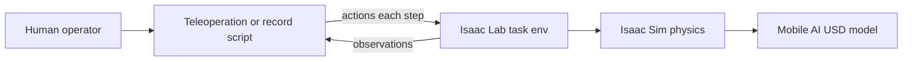
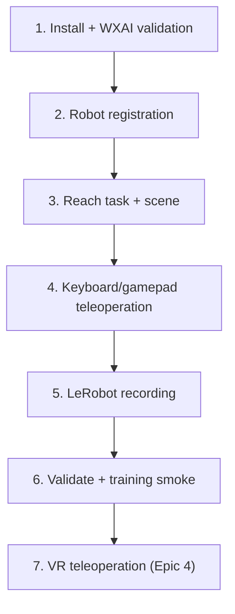
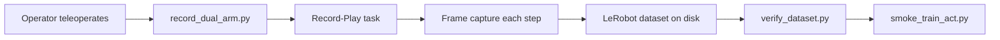

# Epic 3 — Simulation Training Pipeline

> **Document status:** This report describes work in progress. Content will be revised as implementation continues.

## Contents

- [1. Goal](#1-goal)
- [2. Overview](#2-overview)
- [3. Background and Key Concepts](#3-background-and-key-concepts)
  - [Abbreviations](#abbreviations)
  - [Development timeline](#development-timeline)
- [4. Implementation](#4-implementation)
  - [4.1 Installation and Initial Validation](#41-installation-and-initial-validation)
  - [4.2 Mobile AI Robot Registration](#42-mobile-ai-robot-registration)
  - [4.3 Custom Reach Task Environment](#43-custom-reach-task-environment)
  - [4.4 Dual-Arm Teleoperation](#44-dual-arm-teleoperation)
  - [4.5 Simulation Scene](#45-simulation-scene)
  - [4.6 Imitation Learning Recording Pipeline](#46-imitation-learning-recording-pipeline)
  - [4.7 Repository and Branch Structure](#47-repository-and-branch-structure)
- [5. Operational Procedures](#5-operational-procedures)
- [6. Findings and Limitations](#6-findings-and-limitations)
- [7. Troubleshooting](#7-troubleshooting)
- [8. Current Status and Future Work](#8-current-status-and-future-work)

## 1. Goal

The goal of this epic is to build a digital twin of the Trossen Mobile AI robot in Isaac Sim and to establish a virtual data collection and training pipeline. The pipeline supports imitation learning by recording human demonstrations in simulation and preparing datasets for policy training.

---

## 2. Overview

The **Trossen Mobile AI** platform is a dual-arm mobile manipulator. The project applies **imitation learning (IL)** so the robot can perform manipulation tasks, such as picking up a cube from human demonstrations rather than explicit programming.

### Role of simulation

The project aims to enable autonomous manipulation after learning from human demos. Simulation addresses this by allowing the team to:

- Practice and debug control without physical hardware
- Collect synthetic training data at scale
- Iterate on scene layout, cameras, and recording format safely

### Wider project context

On the real robot, a parallel track uses leader-arm teleoperation, rosbag or LeRobot datasets, fine-tuning, and deployment. The simulation track follows the same imitation learning (IL) approach but runs entirely in Isaac Lab with LeRobot-compatible datasets and Action Chunking with Transformers (ACT) training smoke tests.

### Current scope

The current implementation extends the upstream Trossen repository with Mobile AI-specific Isaac Lab support:

- [Robot Registration](#42-mobile-ai-robot-registration): Articulation configs for `mobile_ai.usd`
- [Reach Task Environments](#43-custom-reach-task-environment): `Isaac-Reach-MobileAI-IK-Abs-Play-v0` and `Isaac-Reach-MobileAI-Record-Play-v0`
- [Dual-arm keyboard/gamepad teleoperation](#44-dual-arm-teleoperation) with switchable arm control
- [Scene and randomization](#45-simulation-scene) with table, cube, spawn/color variation (defined in `reach_env_cfg.py`)
- [LeRobot recording pipeline](#46-imitation-learning-recording-pipeline) for 14-dimensional (14D) joint state, 3 RGB cameras, validation, ACT smoke test

VR teleoperation is documented separately in [Epic 4 — VR Integration](EPIC4_VR_INTEGRATION.md).

> **Historical note:** Early planning explored a standalone Isaac Sim scene (`mobile_ai_scene.usd`) with ROS2 topics mirroring the real robot. That approach was used for initial exploration but does not match the current implementation. The digital twin is the **Isaac Lab task environment**: robot, scene, cameras, and physics defined in Python ([`reach_env_cfg.py`](#reach_env_cfgpy--scene-and-mdp-base)), not a hand-edited USD scene file.

---

## 3. Background and Key Concepts

The following terms and abbreviations are used throughout this report:

### Abbreviations

| Abbreviation | Meaning |
|--------------|---------|
| **14D** | Fourteen-dimensional vector (7 joint values per follower arm) |
| **16D** | Sixteen-dimensional action vector (7D pose + 1 gripper command per arm) |
| **7D** | Seven-dimensional pose (3D position + unit quaternion) |
| **ACT** | Action Chunking with Transformers (policy architecture used in training smoke tests) |
| **DOF** | Degrees of freedom |
| **EE** | End-effector |
| **IK** | Inverse kinematics |
| **IK-Abs** | Inverse kinematics, absolute pose command mode |
| **IK-Rel** | Inverse kinematics, relative pose delta mode |
| **IL** | Imitation learning |
| **MDP** | Markov decision process |
| **PD** | Proportional-derivative (controller gains) |
| **PPO** | Proximal policy optimization (reinforcement learning algorithm) |
| **RGB** | Red, green, blue (color image channels) |
| **RL** | Reinforcement learning |
| **ROS2** | Robot Operating System 2 |
| **SE(3)** / **Se3** | Special Euclidean group in three dimensions (3D position and orientation) |
| **USD** | Universal Scene Description (3D scene file format) |
| **VR** | Virtual reality |
| **WXAI** | WidowX AI (Trossen single-arm reference robot) |
| **XR** | Extended reality (umbrella term for VR/AR; includes OpenXR) |

### Terms

| Term | Definition |
|------|------------|
| **Isaac Sim** | NVIDIA physics simulator. Runs the 3D world, robot model, and cameras. |
| **Isaac Lab** | Framework on top of Isaac Sim for robot learning. Standardizes environments, actions, and observations. |
| **Extension** | Python package `trossen_ai_isaac` installed into Isaac Lab; adds Trossen robots and tasks. |
| **Task / environment** | Named, launchable simulation: robot, scene, control mode, and observations. Selected with `--task Isaac-Reach-MobileAI-...`. |
| **Gym registration** | Mechanism that assigns a task name. Defined in `config/__init__.py`; verified with `list_envs.py`. |
| **Play variant** | Task configured for human interaction (single environment, no RL training rewards). |
| **Action** | Command sent to the robot each simulation step (e.g. IK target poses, gripper commands). |
| **Observation** | Data returned by the simulation (joint angles, camera images, etc.). |
| **OpenXR** | Open standard for VR/AR device access; used for hand-tracking teleoperation in Epic 4. |
| **LeRobot** | Open-source robotics dataset and training framework (Hugging Face). |

### System architecture



### Trossen upstream baseline

[Trossen Robotics provides](https://docs.trossenrobotics.com/trossen_arm/main/tutorials/trossen_ai_isaac.html) the upstream [`trossen_ai_isaac`](https://github.com/TrossenRobotics/trossen_ai_isaac) repository with Isaac Sim USD models, demo scripts, and full **WidowX AI (WXAI)** Isaac Lab support, registered tasks (reach, lift, cabinet), articulation configs, and teleoperation via `teleop_se3_agent.py`. The upstream repo also ships a `mobile_ai.usd` asset and standalone demos, but **no Isaac Lab tasks or IL pipeline for Mobile AI**. The team's work extends the upstream codebase using WXAI as the reference pattern.

### Development timeline

Epic 3 covers implementation steps 1–6 below. Step 7 (VR teleoperation) is covered in [Epic 4](EPIC4_VR_INTEGRATION.md). Each step maps to a section in [§4 Implementation](#4-implementation).



> **Note:** Table, cube, and randomization (historically a separate milestone) are implemented inside [`reach_env_cfg.py`](#reach_env_cfgpy--scene-and-mdp-base) as part of step 3.

---

## 4. Implementation

The implementation follows the [development timeline](#development-timeline) above. The upstream Trossen repository provides the foundation: installation layout, USD assets, WXAI Isaac Lab tasks, and teleoperation scripts. The team did not build the simulation stack from scratch. The project **forked** upstream and **extended** it so the same patterns work for Mobile AI.

| Step | Topic | Section |
|------|-------|---------|
| 1 | Fork, install, upstream validation | [§4.1](#41-installation-and-initial-validation) |
| 2 | Mobile AI articulation registration | [§4.2](#42-mobile-ai-robot-registration) |
| 3 | Reach task, scene, gym registration | [§4.3](#43-custom-reach-task-environment) |
| 4 | Dual-arm keyboard/gamepad teleoperation | [§4.4](#44-dual-arm-teleoperation) |
| 5 | LeRobot recording pipeline | [§4.6](#46-imitation-learning-recording-pipeline) |
| 6 | Dataset validation + training smoke | [§5.7](#57-verify-dataset), [§5.8](#58-act-training-smoke-test) |
| 7 | VR teleoperation | [Epic 4](EPIC4_VR_INTEGRATION.md) |

Existing upstream files (`mobile_ai.usd`, `teleop_se3_agent.py`) were used as starting points; new articulation configs, task environments, and teleoperation scripts were added where Mobile AI required them.

### 4.1 Installation and Initial Validation

The team followed the [Trossen AI Isaac installation guide](https://docs.trossenrobotics.com/trossen_arm/main/tutorials/trossen_ai_isaac.html) before adding Mobile AI customizations.

For project development, the team created a **designated GitHub account** and **forked** the upstream repository:

| Repository | Role |
|------------|------|
| [TrossenRobotics/trossen_ai_isaac](https://github.com/TrossenRobotics/trossen_ai_isaac) | Upstream (reference and baseline) |
| [trossenmobileai/trossen_ai_isaac](https://github.com/trossenmobileai/trossen_ai_isaac) | Project fork (all Mobile AI extensions) |

All extension install and development commands below refer to the **forked** repository, not the upstream clone.

**Prerequisites:**

- Ubuntu 22.04
- Isaac Lab 2.3.0 (installs Isaac Sim 5.1.0)
- Recommended method: binary Isaac Sim and Isaac Lab from source

**Extension install (forked repo):**

```bash
git clone https://github.com/trossenmobileai/trossen_ai_isaac.git
cd trossen_ai_isaac

~/IsaacLab/isaaclab.sh -p -m pip install -e source/trossen_ai_isaac
```

**Task registration check:**

```bash
~/IsaacLab/isaaclab.sh -p scripts/tools/list_envs.py
```

The output should include WXAI tasks from upstream plus the Mobile AI entries added in the fork:

- `Isaac-Reach-MobileAI-IK-Abs-Play-v0`
- `Isaac-Reach-MobileAI-Record-Play-v0`

**Upstream validation:** Before Mobile AI customization, the team confirmed the upstream toolchain with a stock WXAI bringup demo:

```bash
~/isaacsim/python.sh scripts/demos/robot_bringup.py wxai_base
```

A successful run confirms that Isaac Sim, Isaac Lab, and the upstream extension install correctly. Mobile AI work builds on top of this validated baseline.

### 4.2 Mobile AI Robot Registration

#### Why registration is required

Isaac Lab tasks do not load a USD file by path alone. A robot must be registered through an **articulation configuration** (`ArticulationCfg`) that tells Isaac Lab how to spawn the model, which joints to control, and how actuators behave. Upstream already provides this for WXAI in `tasks/.../assets/wxai.py` (`WXAI_CFG`, `WXAI_HIGH_PD_CFG`) and wires those configs into registered WXAI tasks.

The fork **already includes** `assets/robots/mobile_ai/mobile_ai.usd` from upstream. The USD file is shipped with the original repository. Standalone demos (e.g. `robot_bringup.py mobile_ai`) can load the asset without extra registration.

However, **no Mobile AI Isaac Lab articulation config or gym tasks exist in upstream**. To run Mobile AI inside Isaac Lab task environments (teleoperation, recording, data collection, training), the team studied the WXAI registration pattern and added the equivalent for Mobile AI.

#### What was added

- **`mobile_ai.usd`**: Robot 3D model. Include link hierarchy, mimic grippers, and joint drives live in USD.
	- Path: `assets/robots/mobile_ai/mobile_ai.usd`
- **`mobile_ai.py`**: Isaac Lab articulation registration for Mobile AI. Exports `MOBILE_AI_CFG` (base physics) and `MOBILE_AI_HIGH_PD_CFG` (IK teleoperation), modeled after `wxai.py`.
	- Path: `source/trossen_ai_isaac/trossen_ai_isaac/tasks/manager_based/manipulation/assets/mobile_ai.py`
- **`assets/__init__.py`**: Re-exports Mobile AI configs alongside WXAI so task environments can import them from the assets package.
	- Path: `source/trossen_ai_isaac/trossen_ai_isaac/tasks/manager_based/manipulation/assets/__init__.py`

**`mobile_ai.py`** (essential structure):

```python
MOBILE_AI_CFG = ArticulationCfg(
    spawn=sim_utils.UsdFileCfg(
        usd_path=os.path.join(_ASSETS_ROOT, "mobile_ai", "mobile_ai.usd"),
        # ...
    ),
    init_state=ArticulationCfg.InitialStateCfg(joint_pos={...}),  # both follower arms at zero
    actuators={
        "left_arm": ImplicitActuatorCfg(joint_names_expr=["follower_left_joint_[0-5]"], stiffness=None, damping=None),
        "left_gripper": ImplicitActuatorCfg(joint_names_expr=["follower_left_left_carriage_joint"], ...),
        "right_arm": ImplicitActuatorCfg(joint_names_expr=["follower_right_joint_[0-5]"], ...),
        "right_gripper": ImplicitActuatorCfg(joint_names_expr=["follower_right_left_carriage_joint"], ...),
        "base_wheels": ImplicitActuatorCfg(joint_names_expr=["left_wheel", "right_wheel"], ...),
    },
)

MOBILE_AI_HIGH_PD_CFG = MOBILE_AI_CFG.copy()
MOBILE_AI_HIGH_PD_CFG.spawn.rigid_props.disable_gravity = True
MOBILE_AI_HIGH_PD_CFG.actuators["left_arm"].stiffness = 400.0
MOBILE_AI_HIGH_PD_CFG.actuators["left_arm"].damping = 80.0
MOBILE_AI_HIGH_PD_CFG.actuators["right_arm"].stiffness = 400.0
MOBILE_AI_HIGH_PD_CFG.actuators["right_arm"].damping = 80.0
```

- **`MOBILE_AI_CFG`:** Spawns `mobile_ai.usd`, sets initial joint poses, and groups actuators for both arms, grippers, and base wheels. Stiffness/damping are left `None` so values from the USD file are used.
- **`MOBILE_AI_HIGH_PD_CFG`:** Copy used by Reach tasks: gravity disabled and high PD on arm joints for stable IK teleoperation (same pattern as `WXAI_HIGH_PD_CFG`).

**`assets/__init__.py`** (one-line addition next to the existing WXAI import):

```python
from .wxai import *
from .mobile_ai import *
```

Task configs (e.g. [`reach_env_cfg.py`](#reach_env_cfgpy--scene-and-mdp-base)) then import `MOBILE_AI_HIGH_PD_CFG` the same way WXAI tasks import `WXAI_HIGH_PD_CFG`.

The Mobile AI has **26 degrees of freedom** (base wheels and dual follower arms). IL work focuses on the **14 follower arm joints** (7 per arm: 6 arm joints and 1 gripper joint).

> **Design note:** `MOBILE_AI_HIGH_PD_CFG` uses high proportional-derivative (PD) gains and disables gravity on arm links. The same IK-control pattern used for `WXAI_HIGH_PD_CFG`. The Reach scene applies `fix_root_link=True` when spawning the robot ([§4.3](#reach_env_cfgpy--scene-and-mdp-base)) so the base does not slide or tip during teleoperation.

### 4.3 Custom Reach Task Environment

#### Why a custom task is required

Upstream provides complete Isaac Lab task packages for WXAI under `tasks/manager_based/manipulation/wxai/` (Reach, Lift, and Cabinet), each with scene configs, action/observation definitions, and gym registration in `config/__init__.py`. These tasks launch by name and work with `teleop_se3_agent.py`.

**Upstream WXAI tasks (available before any Mobile AI fork work):**

| Task family | Registered task ID | Control mode | Notes |
|-------------|-------------------|--------------|-------|
| **Reach** | `Isaac-Reach-WXAI-v0` | Joint position | RL training |
| | `Isaac-Reach-WXAI-Play-v0` | Joint position | Play / human interaction |
| | `Isaac-Reach-WXAI-IK-Rel-v0` | IK relative pose | RL training |
| | `Isaac-Reach-WXAI-IK-Abs-v0` | IK absolute pose | RL training |
| **Lift** | `Isaac-Lift-Cube-WXAI-v0` | Joint position | RL training |
| | `Isaac-Lift-Cube-WXAI-Play-v0` | Joint position | Play / human interaction |
| | `Isaac-Lift-Cube-WXAI-IK-Rel-v0` | IK relative pose | RL training |
| | `Isaac-Lift-Cube-WXAI-IK-Abs-v0` | IK absolute pose | RL training |
| **Cabinet** | `Isaac-Open-Drawer-WXAI-v0` | Joint position | RL training |
| | `Isaac-Open-Drawer-WXAI-Play-v0` | Joint position | Play / human interaction |

**No equivalent task package exists for Mobile AI in upstream.** The fork therefore adds a Reach task under `tasks/manager_based/manipulation/mobile_ai/reach/`, following the same structure as the WXAI Reach task but adapted for dual-arm control, IL-oriented observations, and later recording.

#### Reach task package

The reach package is a small set of config files. **[`reach_env_cfg.py`](#reach_env_cfgpy--scene-and-mdp-base)** is the base. It defines the digital twin scene and the dual-arm MDP skeleton that teleoperation and recording inherit from. Registered gym tasks point at specialized subclasses rather than at this file directly.

- **`reach_env_cfg.py`**: Base environment (scene, MDP terms, reset randomization, simulation timing, and teleoperation device defaults). [Details](#reach_env_cfgpy--scene-and-mdp-base)
	- Path: `source/trossen_ai_isaac/trossen_ai_isaac/tasks/manager_based/manipulation/mobile_ai/reach/reach_env_cfg.py`
- **`ik_abs_env_cfg.py`**: Absolute IK teleoperation (16D action layout and binary grippers). Registers `Isaac-Reach-MobileAI-IK-Abs-Play-v0`. [Details](#ik_abs_env_cfgpy--absolute-ik-teleoperation)
	- Path: `source/trossen_ai_isaac/trossen_ai_isaac/tasks/manager_based/manipulation/mobile_ai/reach/ik_abs_env_cfg.py`
- **`record_env_cfg.py`**: IL recording (cameras, 14D joint observations, and 60 Hz stepping). Registers `Isaac-Reach-MobileAI-Record-Play-v0`. [Details](#record_env_cfgpy--il-recording)
	- Path: `source/trossen_ai_isaac/trossen_ai_isaac/tasks/manager_based/manipulation/mobile_ai/reach/record_env_cfg.py`
- **`config/__init__.py`**: Gymnasium registration; Maps task IDs to the config entry points above.
	- Path: `source/trossen_ai_isaac/trossen_ai_isaac/tasks/manager_based/manipulation/mobile_ai/reach/config/__init__.py`

#### reach_env_cfg.py - scene and MDP base

This file turns [`MOBILE_AI_HIGH_PD_CFG`](#42-mobile-ai-robot-registration) into a runnable Isaac Lab `ManagerBasedRLEnv`. The file groups the environment into `@configclass` blocks that Isaac Lab assembles at launch:

- **`MobileAIReachSceneCfg`**: The digital twin scene: ground plane, dome light, grey table, manipulable cube, and the Mobile AI robot. The robot spawn overrides `MOBILE_AI_HIGH_PD_CFG` with `fix_root_link=True` so the base stays anchored during teleoperation.
- **`CommandsCfg`**: Random end-effector pose targets for both arms (`follower_left_link_6`, `follower_right_link_6`). These feed reach-task observations; the [recording variant](#record_env_cfgpy--il-recording) disables them.
- **`ActionsCfg`**: Dual-arm action slots. `MobileAIReachEnvCfg.__post_init__` wires a differential IK controller on each arm's six joints.
- **`ObservationsCfg`**: Policy observations: relative joint positions and velocities, generated pose commands, and last action.
- **`EventCfg`**: Reset behavior: restore robot joints, randomize cube XY position on the table, and pick a discrete red, green, or blue cube color.
- **`MobileAIReachEnvCfg`**: Top-level config that combines the above, sets 60 Hz simulation (`sim.dt = 1/60`, `decimation = 2`), and registers keyboard, gamepad, and spacemouse teleoperation device defaults (`gripper_term=False`; grippers are handled by the [teleoperation script](#44-dual-arm-teleoperation)).
- **`MobileAIReachEnvCfg_PLAY`**: Play/teleoperation base: single environment (`num_envs = 1`), observation noise off.

Essential scene and robot wiring:

```python
@configclass
class MobileAIReachSceneCfg(InteractiveSceneCfg):
    ground = AssetBaseCfg(...)
    light = AssetBaseCfg(...)
    table = AssetBaseCfg(...)                    # grey table in front of robot
    cube: RigidObjectCfg = RigidObjectCfg(...)   # 7 cm manipulation target on table
    robot: ArticulationCfg = MOBILE_AI_HIGH_PD_CFG.replace(
        prim_path="{ENV_REGEX_NS}/Robot",
        spawn=MOBILE_AI_HIGH_PD_CFG.spawn.replace(
            articulation_props=ArticulationRootPropertiesCfg(
                fix_root_link=True,              # anchor base during teleoperation
                # ...
            ),
        ),
    )
```

#### ik_abs_env_cfg.py - absolute IK teleoperation

This file is **central to Epic 3 teleoperation**. The registered task `Isaac-Reach-MobileAI-IK-Abs-Play-v0` points at `MobileAIReachEnvCfg_IK_ABS_PLAY` defined here: the environment that [`teleop_dual_arm_switch.py`](#53-keyboard-or-gamepad-teleoperation) launches. It inherits the scene and MDP skeleton from [`reach_env_cfg.py`](#reach_env_cfgpy--scene-and-mdp-base) and overrides the action layer for **absolute** inverse kinematics.

- **`MobileAIReachEnvCfg_IK_ABS`**: Flips both arm action terms from relative deltas (base config) to absolute pose commands (`use_relative_mode=False`). Each arm expects a 7D pose `[pos_xyz, quat_wxyz]` in the robot base frame. Adds binary gripper actions on both carriage joints, producing a **16D** environment action vector: `[L_pose(7), R_pose(7), L_grip(1), R_grip(1)]`.
- **`MobileAIReachEnvCfg_IK_ABS_PLAY`**: Play/teleoperation entry point: single environment, observation noise off. Registered as `Isaac-Reach-MobileAI-IK-Abs-Play-v0`.

The file also registers an OpenXR **`handtracking`** teleoperation device for VR. Keyboard and gamepad teleoperation ignore this; see [Epic 4](EPIC4_VR_INTEGRATION.md).

Essential action wiring:

```python
# Absolute IK on both arms (overrides relative mode from reach_env_cfg.py)
self.actions.left_arm_action = DifferentialInverseKinematicsActionCfg(
    controller=DifferentialIKControllerCfg(command_type="pose", use_relative_mode=False, ...),
    # ...
)
self.actions.right_arm_action = DifferentialInverseKinematicsActionCfg(...)

# Binary grippers (appended after arm actions; 16D total)
self.actions.left_gripper_action = BinaryJointPositionActionCfg(
    joint_names=["follower_left_left_carriage_joint"],
    open_command_expr={...: 0.044}, close_command_expr={...: 0.0},
)
self.actions.right_gripper_action = BinaryJointPositionActionCfg(...)
```

The teleoperation library ([`se3_switch.py`](#44-dual-arm-teleoperation)) assembles the same 16D layout client-side for keyboard/gamepad: it integrates device deltas into per-arm IK targets and passes them to `env.step()`.

#### record_env_cfg.py - IL recording

This file defines the environment for [LeRobot dataset collection](#46-imitation-learning-recording-pipeline). The registered task `Isaac-Reach-MobileAI-Record-Play-v0` points at `MobileAIReachEnvCfg_RECORD_PLAY`, launched by [`record_dual_arm.py`](#56-recording--human-demonstrations). It inherits absolute IK and grippers from [`MobileAIReachEnvCfg_IK_ABS_PLAY`](#ik_abs_env_cfgpy--absolute-ik-teleoperation) and retargets observations and sensors for the `trossen_ai_2026` dataset schema.

- **`MobileAIRecordSceneCfg`**: Extends `MobileAIReachSceneCfg` with three RGB camera sensors (`cam_high`, `cam_left_wrist`, `cam_right_wrist`) at 480×640, bound to existing USD camera prims on the robot.
- **`RecordObservationsCfg`**: Replaces the reach-task policy observations with a single **14D absolute joint position** vector (7 joints per follower arm), matching the real-robot LeRobot layout. No pose commands or velocity noise.
- **`EmptyCommandsCfg`**: Disables random end-effector pose commands; IL demos do not use reach targets.
- **`MobileAIReachEnvCfg_RECORD_PLAY`**: Top-level recording config: inherits cube position/color randomization from `EventCfg`, sets `decimation = 1` for full 60 Hz stepping, and turns off IK debug visualization.

Essential recording overrides:

```python
@configclass
class MobileAIReachEnvCfg_RECORD_PLAY(MobileAIReachEnvCfg_IK_ABS_PLAY):
    scene: MobileAIRecordSceneCfg = MobileAIRecordSceneCfg(num_envs=1, ...)
    observations: RecordObservationsCfg = RecordObservationsCfg()
    events: EventCfg = EventCfg()          # cube randomization on reset

    def __post_init__(self):
        super().__post_init__()
        self.decimation = 1                # 60 Hz: one env step per sim frame
        self.commands = EmptyCommandsCfg() # no random EE targets during recording
```

Joint positions captured at each step become the dataset `action` labels ([§4.6](#46-imitation-learning-recording-pipeline)); IK commands drive the robot during collection but are not stored directly.

**Registered tasks (fork):**

| Task ID | Config class | Launched by |
|---------|--------------|-------------|
| `Isaac-Reach-MobileAI-IK-Abs-Play-v0` | `MobileAIReachEnvCfg_IK_ABS_PLAY` | [`teleop_dual_arm_switch.py`](#53-keyboard-or-gamepad-teleoperation) |
| `Isaac-Reach-MobileAI-Record-Play-v0` | `MobileAIReachEnvCfg_RECORD_PLAY` | [`record_dual_arm.py`](#56-recording--human-demonstrations) |

**IK-Rel to IK-Abs migration:** Early experiments used IK-Rel (12D relative pose deltas). Arm drift and control instability led to a switch to IK-Abs (16D). See [§6.1 Arm Drift](#61-arm-drift-resolved) for the full investigation and resolution.

> **Historical note:** An early **Lift** task (`Isaac-Lift-Cube-MobileAI-*`) and IK-Rel Reach variants were removed. Reach replaced Lift as the IL foundation.

### 4.4 Dual-Arm Teleoperation

#### Why a custom teleoperation script is required

Upstream provides [`teleop_se3_agent.py`](../../scripts/teleoperation/teleop_se3_agent.py) as the general teleoperation entrypoint for Isaac Lab tasks. WXAI tasks work with this script out of the box.

Mobile AI requires **dual-arm** control with **switchable** arm selection (one arm at a time for keyboard/gamepad recording). The upstream script targets single-arm tasks and does not implement arm switching or the [16D IK-Abs action layout](#ik_abs_env_cfgpy--absolute-ik-teleoperation). The team used `teleop_se3_agent.py` as the architectural base and added:

| Upstream (reference) | Fork (Mobile AI extension) |
|----------------------|----------------------------|
| `scripts/teleoperation/teleop_se3_agent.py` | [`teleop_dual_arm_switch.py`](../../scripts/teleoperation/teleop_dual_arm_switch.py) |
| Single-arm Se3 teleoperation | Switchable dual-arm IK-Abs teleoperation via [`se3_switch.py`](../../source/trossen_ai_isaac/trossen_ai_isaac/teleop/se3_switch.py) |

VR hand-tracking teleoperation extends this layer further; see [Epic 4](EPIC4_VR_INTEGRATION.md).

#### Control model and loop

The operator moves one end-effector at a time; the task environment's differential IK solver ([`ik_abs_env_cfg.py`](#ik_abs_env_cfgpy--absolute-ik-teleoperation)) converts 16D pose and gripper commands into joint motion. `teleop_dual_arm_switch.py` launches `Isaac-Reach-MobileAI-IK-Abs-Play-v0`, reads input each frame, builds the action tensor in `se3_switch.py`, and calls `env.step(action)`.

**Input devices:** keyboard, gamepad, or spacemouse via `--teleop_device`. Motion deltas apply to the **active arm only** while teleoperation is active (`TeleopSession.teleoperation_active`, on by default). Bindings combine Isaac Lab `Se3Keyboard` / `Se3Gamepad` defaults with fork-specific callbacks in `se3_switch.py` (`gripper_term=False` in the env config; grippers are toggled via **K** / **A** instead).

**Keyboard** (`--teleop_device keyboard`):

| Key / input | Category | Action |
|-------------|----------|--------|
| **W** / **S** | Motion (active arm) | Move end-effector along +X / −X (forward / backward) |
| **A** / **D** | Motion (active arm) | Move along +Y / −Y (left / right) |
| **Q** / **E** | Motion (active arm) | Move along +Z / −Z (up / down) |
| **Z** / **X** | Motion (active arm) | Rotate about X axis (+ / −) |
| **T** / **G** | Motion (active arm) | Rotate about Y axis (+ / −) |
| **C** / **V** | Motion (active arm) | Rotate about Z axis (+ / −) |
| **L** | Device reset | Clear accumulated position/rotation deltas (Isaac Lab default) |
| **TAB** | Dual-arm | Switch active arm (re-seeds IK target from current end-effector pose) |
| **K** | Gripper | Toggle open/close on the **active** arm |
| **R** | Environment | Reset environment (discards in-progress recording if any) |
| **N** | Recording only | Toggle episode recording: start, or save and reset ([`record_dual_arm.py`](#56-recording--human-demonstrations) only) |
| **M** | Recording only | Discard current episode buffer without saving |
| **START** / **STOP** / **RESET** | Session (XR) | Registered for OpenXR / env-config teleoperation devices; not bound to physical keys on the local `Se3Keyboard` fallback |

**Gamepad** (`--teleop_device gamepad`):

| Button / stick | Category | Action |
|----------------|----------|--------|
| **Left stick** up / down | Motion (active arm) | Move along +X / −X |
| **Left stick** left / right | Motion (active arm) | Move along +Y / −Y |
| **Right stick** up / down | Motion (active arm) | Move along +Z / −Z |
| **D-pad** right / left | Motion (active arm) | Rotate about X axis (+ / −) |
| **D-pad** down / up | Motion (active arm) | Rotate about Y axis (+ / −) |
| **Right stick** left / right | Motion (active arm) | Rotate about Z axis (+ / −) |
| **Y** (polled) | Dual-arm | Switch active arm |
| **A** (polled) | Gripper | Toggle open/close on the **active** arm |
| **B** (polled) | Environment | Reset environment (discards in-progress recording if any) |
| **X** (polled, recording only) | Recording | Toggle episode recording: start, or save and reset |

Episode discard on gamepad uses keyboard **M** only (no gamepad binding).

**SpaceMouse** (`--teleop_device spacemouse`):

| Input | Category | Action |
|-------|----------|--------|
| 6-DOF cap | Motion (active arm) | Translate and rotate the active arm end-effector |
| **Left button** | Gripper | Toggle open/close on the **active** arm |
| **Right button** | Environment | Reset environment |
| (none) | Dual-arm | Arm switching not available on SpaceMouse |

Tune motion sensitivity with `--sensitivity`. For gamepad, `--gamepad_dead_zone` filters stick noise. Step-by-step launch commands are in [§5.3](#53-keyboard-or-gamepad-teleoperation).

### 4.5 Simulation Scene

The digital twin scene (grey table, manipulable cube, and reset randomization) is defined in [`MobileAIReachSceneCfg` and `EventCfg`](#reach_env_cfgpy--scene-and-mdp-base) inside `reach_env_cfg.py`. The [recording variant](#record_env_cfgpy--il-recording) reuses the same scene and events, adding three RGB camera sensors on the robot USD prims.

### 4.6 Imitation Learning Recording Pipeline

Teleoperation ([§4.4](#44-dual-arm-teleoperation)) moves the robot; imitation learning requires saved episodes in a standard format. The pipeline builds on the [record task config](#record_env_cfgpy--il-recording) and consists of:

1. The **Record task** (`Isaac-Reach-MobileAI-Record-Play-v0`). See [`record_env_cfg.py`](#record_env_cfgpy--il-recording).
2. A **LeRobot dataset writer** (`source/.../recording/`) that captures frames each simulation step
3. Offline **validation** ([§5.7](#57-verify-dataset)) and **training smoke** ([§5.8](#58-act-training-smoke-test)) scripts



**Dataset schema:**

| Field | Shape | Description |
|-------|-------|-------------|
| `observation.state` | 14D float32 | Follower arm joint positions (7 per arm) |
| `action` | 14D float32 | Joint positions (same as state at record time) |
| `observation.images.cam_high` | 480×640 RGB video | Overhead camera |
| `observation.images.cam_left_wrist` | 480×640 RGB video | Left wrist camera |
| `observation.images.cam_right_wrist` | 480×640 RGB video | Right wrist camera |

> **Design note:** Actions are stored as joint positions, not IK commands. Policies learn target joint angles; the recorder stores resulting joint state as the action label.

**Recording controls:** **N** (toggle episode), **M** (discard), **R** (reset). Same bindings as the [keyboard table in §4.4](#44-dual-arm-teleoperation).

**LeRobot dependency:** LeRobot is not bundled in Isaac Sim Python. It is installed separately for recording (`lerobot==0.4.4` in Isaac Sim Python 3.11), dataset verification (`~/lerobot_trossen/.venv`), and training smoke (`lerobot_train` conda environment).

### 4.7 Repository and Branch Structure

Runnable **scripts** live under `scripts/`; reusable **library code** lives in the installed `trossen_ai_isaac` package.

| Location | Role | How to run |
|----------|------|------------|
| `scripts/teleoperation/` | Teleoperation entrypoints | `~/IsaacLab/isaaclab.sh -p scripts/teleoperation/...` |
| `scripts/imitation_learning/` | Recording, validation, training smoke | `isaaclab.sh -p` or plain Python |
| `scripts/demos/` | Standalone Isaac Sim demos | `~/isaacsim/python.sh scripts/demos/...` |
| `source/.../teleop/` | Teleoperation library | Imported by scripts |
| `source/.../recording/` | LeRobot writer, frame capture | Imported by IL scripts |
| `source/.../tasks/.../mobile_ai/` | Task environment configs | Registered as gym tasks |

**Branch history:**

| Branch | Status |
|--------|--------|
| `feat/il-pipeline-integration` | Current integration target |
| `feat/il-record-phase2` | Merged (LeRobot writer) |
| `feat/sim-environment` | Merged (table, cube, randomization) |
| `feat/sim-training` | Deprecated (HDF5/Robomimic approach) |

Full branch details: [IL_PIPELINE_BRANCHES.md](IL_PIPELINE_BRANCHES.md)

---

## 5. Operational Procedures

Each procedure is described as **Purpose**, then **Command**, then **Expected result**. Paths assume `~/trossen_ai_isaac` and `~/IsaacLab`. Procedures follow the [implementation order](#4-implementation) above.

### 5.1 Verify Registered Environments

**Purpose:** Confirm Mobile AI tasks are installed ([§4.1](#41-installation-and-initial-validation)).

```bash
cd ~/trossen_ai_isaac
~/IsaacLab/isaaclab.sh -p scripts/tools/list_envs.py | grep MobileAI
```

**Expected result:** Output includes `Isaac-Reach-MobileAI-IK-Abs-Play-v0` and `Isaac-Reach-MobileAI-Record-Play-v0`.

### 5.2 Visualize the Robot

**Purpose:** Load the Mobile AI USD in standalone Isaac Sim without an Isaac Lab task.

```bash
~/isaacsim/python.sh scripts/demos/robot_bringup.py mobile_ai
```

**Expected result:** The robot appears in the viewport.

### 5.3 Keyboard or Gamepad Teleoperation

**Purpose:** Control one arm at a time with IK-Abs teleoperation ([§4.4](#44-dual-arm-teleoperation), task config in [§4.3](#ik_abs_env_cfgpy--absolute-ik-teleoperation)).

```bash
cd ~/trossen_ai_isaac
~/IsaacLab/isaaclab.sh -p scripts/teleoperation/teleop_dual_arm_switch.py \
  --task Isaac-Reach-MobileAI-IK-Abs-Play-v0 \
  --teleop_device keyboard
```

For gamepad, use `--teleop_device gamepad`.

**Expected result:** Table and cube scene load ([§4.5](#45-simulation-scene)). The active arm follows input. TAB or Y switches arms.

### 5.4 Recording — Environment Smoke Test

**Purpose:** Confirm the Record task launches with cameras ([`record_env_cfg.py`](#record_env_cfgpy--il-recording)).

```bash
cd ~/trossen_ai_isaac
~/IsaacLab/isaaclab.sh -p scripts/imitation_learning/smoke/smoke_record_env.py \
  --task Isaac-Reach-MobileAI-Record-Play-v0 \
  --enable_cameras
```

**Expected result:** Environment runs without errors; camera observations are present.

### 5.5 Recording — Automated Dataset Smoke Test

**Purpose:** Generate a one-episode test dataset without human input.

```bash
cd ~/trossen_ai_isaac
~/IsaacLab/isaaclab.sh -p scripts/imitation_learning/smoke/smoke_record_dataset.py \
  --task Isaac-Reach-MobileAI-Record-Play-v0 \
  --enable_cameras \
  --overwrite
```

**Expected result:** A LeRobot dataset is written to the configured output path.

### 5.6 Recording — Human Demonstrations

**Purpose:** Collect teleoperated episodes into a LeRobot dataset ([§4.6](#46-imitation-learning-recording-pipeline)).

```bash
cd ~/trossen_ai_isaac
~/IsaacLab/isaaclab.sh -p scripts/imitation_learning/recording/record_dual_arm.py \
  --task Isaac-Reach-MobileAI-Record-Play-v0 \
  --repo_id YOUR_USERNAME/dataset_name \
  --root ~/lerobot_trossen/datasets/dataset_name \
  --fps 60 \
  --enable_cameras
```

**Expected result:** The operator toggles episodes with **N** ([§4.4](#44-dual-arm-teleoperation)). Dataset files (parquet and MP4) appear under `--root`.

### 5.7 Verify Dataset

**Purpose:** Offline quality assurance of recorded data (uses LeRobot venv, not Isaac Sim Python).

```bash
~/lerobot_trossen/.venv/bin/python scripts/imitation_learning/validation/verify_dataset.py \
  --root ~/lerobot_trossen/datasets/dataset_name \
  --repo_id YOUR_USERNAME/dataset_name
```

**Expected result:** Validation passes; video files are readable.

### 5.8 ACT Training Smoke Test

**Purpose:** Confirm the dataset feeds a policy trainer (requires `lerobot_train` conda environment).

```bash
python scripts/imitation_learning/training/smoke_train_act.py \
  --root ~/lerobot_trossen/datasets/dataset_name \
  --repo_id YOUR_USERNAME/dataset_name
```

**Expected result:** Training completes a short smoke iteration without errors.

---

## 6. Findings and Limitations

### 6.1 Arm Drift (Resolved)

With early **IK-Rel** control, both arms drifted slowly even when sending zero actions. The issue was investigated in detail (historical notes in `sim-vr-onboarding/isaac_lab_teleop/03_arm_drift.md`). The switch to IK-Abs is documented in [§4.3](#43-custom-reach-task-environment).

**Resolution:** Switching to **IK-Abs** fixed the problem. All current teleoperation and recording uses IK-Abs. This issue does not apply to the current pipeline.

### 6.2 Issues Addressed During Development

- **Base instability:** robot base moved unexpectedly. Addressed with `fix_root_link=True` in [`reach_env_cfg.py`](#reach_env_cfgpy--scene-and-mdp-base)
- **Arm responsiveness:** arms were too fast or unstable. PD gains tuned in [`MOBILE_AI_HIGH_PD_CFG`](#42-mobile-ai-robot-registration)
- **Blank camera recordings:** camera prims must reference USD `Camera_*` nodes. See [`record_env_cfg.py`](#record_env_cfgpy--il-recording)

### 6.3 Current Limitations

- **No Mobile AI RL/PPO** unlike stock WXAI reach, lift, and cabinet tasks
- **VR + recording not integrated:** keyboard/gamepad recording works; VR teleoperation exists but does not yet write LeRobot datasets ([Epic 4 §6.3](EPIC4_VR_INTEGRATION.md#63-current-limitations))
- **Training smoke only in-repo:** full ACT training runs in the external `lerobot_train` environment

---

## 7. Troubleshooting

### IL-specific issues

| Symptom | Likely cause | Fix |
|---------|--------------|-----|
| Blank or black camera videos | Wrong camera prim paths | Ensure Record env uses `Camera_high`, `Camera_follower_left`, `Camera_follower_right` |
| `ImportError: lerobot` during recording | LeRobot not in Isaac Sim Python | Install via `isaaclab.sh -p -m pip install lerobot==0.4.4` |
| Verify script fails | Wrong Python interpreter | Use `~/lerobot_trossen/.venv/bin/python` |
| Dataset incomplete after Ctrl+C | Interrupt before finalize | Wait for "dataset finalized" log; script handles SIGINT |

### Simulation and physics issues

| Symptom | Fix |
|---------|-----|
| Robot base moves or tips | Confirm `fix_root_link=True` in [`reach_env_cfg.py`](#reach_env_cfgpy--scene-and-mdp-base) |
| `RuntimeError: Accessed invalid null prim` on Play/Stop | Deselect all prims in Isaac Sim before Play/Stop (UI bug, no physics impact) |

> IK-Rel arm drift workarounds and ROS2 standalone scene checks from early documentation are resolved or deprecated.

---

## 8. Current Status and Future Work

### Completed

- [x] [Mobile AI registered](#42-mobile-ai-robot-registration) in Isaac Lab
- [x] [Dual-arm Reach task](#43-custom-reach-task-environment) (IK-Abs)
- [x] [Keyboard and gamepad teleoperation](#44-dual-arm-teleoperation)
- [x] [Table, cube, randomization](#45-simulation-scene)
- [x] [LeRobot recording pipeline](#46-imitation-learning-recording-pipeline)
- [x] [Dataset validation and ACT training smoke](#57-verify-dataset)

### Planned or in progress

- [ ] VR + LeRobot recording integration → [Epic 4](EPIC4_VR_INTEGRATION.md)
- [ ] Full policy training and sim-to-real deployment
- [ ] Mobile AI reinforcement learning tasks

### Related documentation

**[Epic 4 — VR Integration](EPIC4_VR_INTEGRATION.md)**: VR headset teleoperation on the same task framework.
