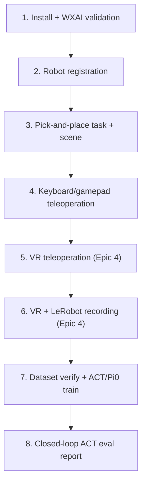

# Epic 3 — Simulation Training Pipeline

> **Document status:** **BookStack book intro** for Epic 3 (keep this file when uploading). Prefer editing the [docs index](README.md) first, then mirror goal / timeline / page map here. Repo readers should start at the docs index. Detailed pages: [`epic3/`](epic3/). Pi0 sim eval remains deferred.

## Goal

Build a digital twin of the Trossen Mobile AI in Isaac Sim and an imitation-learning pipeline: record human demonstrations, train policies (ACT / Pi0), and evaluate closed-loop in simulation.

## Overview

The **Trossen Mobile AI** is a dual-arm mobile manipulator. This fork extends upstream Trossen Isaac Lab support with Mobile AI tasks, teleoperation, VR recording, and training/eval wrappers. Production demos: [cheat sheet production fact](IL_WORKFLOW_CHEATSHEET.md) (VR, right arm). **Out of scope this semester:** physical sim-to-real deployment.

## Start here

1. **[IL Workflow Cheat Sheet](IL_WORKFLOW_CHEATSHEET.md)** — commands (collect → verify → train → eval)
2. **[Tasks and scene](epic3/02-tasks-and-scene.md)** — what was built in Isaac Lab
3. **[Recording (LeRobot)](epic3/04-recording-lerobot.md)** — how demos become a v3 dataset
4. **[Training](epic3/05-training.md)** / **[Evaluation](epic3/06-evaluation.md)** — policies and metrics
5. **[ACT Evaluation Report](ACT_EVAL_REPORT_100K.md)** — reporting results
6. **[Epic 4](EPIC4_VR_INTEGRATION.md)** — Quest / ALVR + [`epic4/`](epic4/) pages (production collection path)

## Development timeline

Steps **1–4** and **7–8** are Epic 3; steps **5–6** are [Epic 4](README.md#epic-4--vr-integration) ([BookStack hub](EPIC4_VR_INTEGRATION.md)). Step **6** is the production VR right-arm dataset. Keyboard/gamepad **teleop** is step 4; keyboard recording was not a delivered milestone.

| Step | Delivered | Where |
|------|-----------|--------|
| 1–2 | Install, Mobile AI registration | [Tasks and scene](epic3/02-tasks-and-scene.md) |
| 3 | Pick-and-place + scene | [Tasks and scene](epic3/02-tasks-and-scene.md) |
| 4 | Keyboard/gamepad teleop | [Teleoperation](epic3/03-teleoperation.md) |
| 5–6 | VR teleop + VR recording (production) | [Epic 4](README.md#epic-4--vr-integration), [VR recording](epic4/05-vr-recording.md), [cheat sheet](IL_WORKFLOW_CHEATSHEET.md) |
| 7 | Verify + ACT/Pi0 train | [Training](epic3/05-training.md) |
| 8 | ACT closed-loop report | [Evaluation](epic3/06-evaluation.md), [ACT report](ACT_EVAL_REPORT_100K.md) |

## Pages (BookStack-ready)

| Page | Contents |
|------|----------|
| [Glossary](epic3/01-glossary.md) | Abbreviations and terms (incl. policy sidecar) |
| [Tasks and scene](epic3/02-tasks-and-scene.md) | Install, registration, Reach/Record configs, scene |
| [Teleoperation](epic3/03-teleoperation.md) | Keyboard/gamepad control model and keys; VR summary |
| [Recording (LeRobot)](epic3/04-recording-lerobot.md) | Pipeline, action labels, Dataset v3.0 on disk |
| [Training](epic3/05-training.md) | ACT / Pi0 jobs and hyperparameters |
| [Evaluation](epic3/06-evaluation.md) | How eval works, success criteria, metrics |
| [Findings and troubleshooting](epic3/07-findings-troubleshooting.md) | Limitations and fixes |
| [Future work](epic3/08-future-work.md) | Planned follow-ups |

**Related:** [docs index](README.md) · [IL cheat sheet](IL_WORKFLOW_CHEATSHEET.md) · [ACT eval report](ACT_EVAL_REPORT_100K.md) · [Epic 4 hub](EPIC4_VR_INTEGRATION.md)
