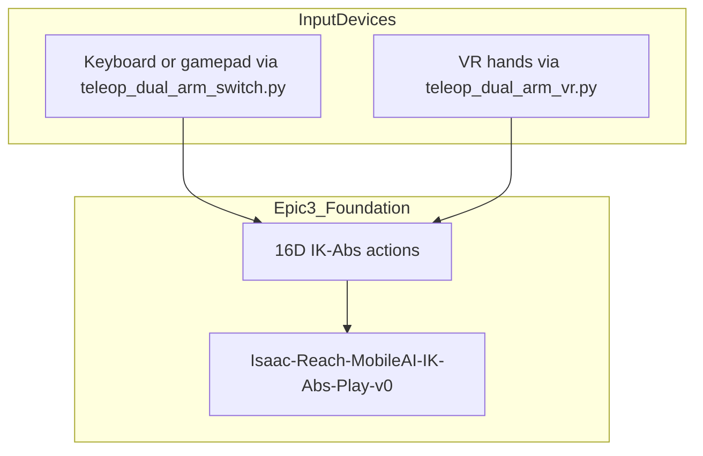
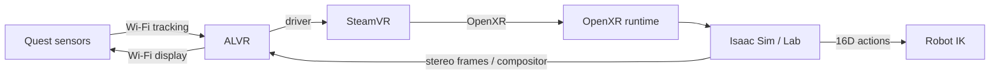
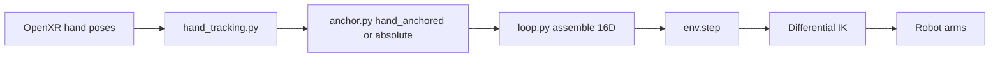
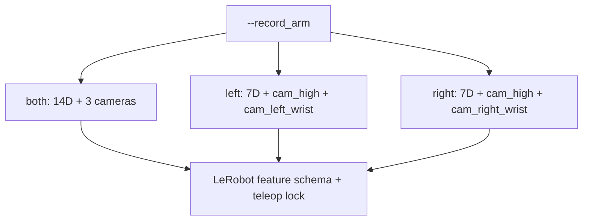
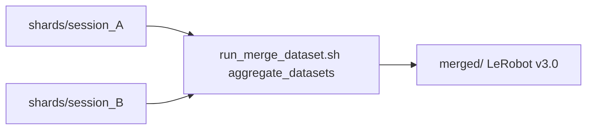
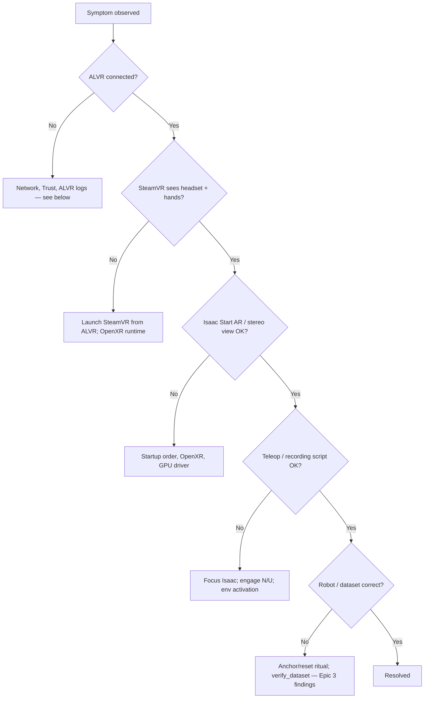

# Epic 4 — VR Integration

> **In-repo docs:** The same design content is maintained as separate chapters under
> `docs/epic4/` in the project repository (plus the [IL Workflow Runbook](IL_WORKFLOW_RUNBOOK.md)
> and [setup](setup/README.md) for how-to). This page is a single consolidated copy of that
> design material for convenience; for chapter-by-chapter browsing on GitHub, use `docs/epic4/`.
>
> Repo-relative links (runbook, setup, `scripts/`, `source/`) target the GitHub tree and may not
> resolve inside an external wiki.
> Related design (IL pipeline): [Epic 3 consolidated page](EPIC3_SIMULATION_TRAINING_PIPELINE.md).
> One-time VR host: [VR workstation setup](setup/vr-workstation.md). Every session: [runbook §1](IL_WORKFLOW_RUNBOOK.md#1-vr-session-startup-every-time).

## Goal

Connect VR headsets to Isaac Sim for in-simulation teleoperation — safe demonstration practice and synthetic data collection without physical hardware risk.

## Table of contents

- [Glossary (VR)](#glossary-vr)
- [Background and Stack](#background-and-stack)
- [VR Teleoperation](#vr-teleoperation)
- [VR Recording](#vr-recording)
- [Findings and Troubleshooting](#findings-and-troubleshooting)
- [Future Work](#future-work)

## Glossary (VR)

VR-specific abbreviations and terms. Shared IL terms (IK, IK-Abs, 16D, OpenXR, etc.) are in the [Epic 3 glossary](EPIC3_SIMULATION_TRAINING_PIPELINE.md#glossary).

### Abbreviations

| Abbreviation | Meaning |
|--------------|---------|
| **ALVR** | Air Light VR (wireless PC-to-headset streaming) |
| **AR** | Augmented reality (Isaac Sim "Start AR" mode for OpenXR output) |
| **DLSS** | Deep Learning Super Sampling (NVIDIA anti-aliasing used in VR rendering) |
| **FPV** | First-person view |
| **VR** | Virtual reality |

### Terms

| Term | Definition |
|------|------------|
| **Meta Quest 3** | Standalone VR headset used for display and hand tracking in this project. |
| **ALVR** | Open-source wireless streaming bridge from the PC to Quest headsets over Wi-Fi. |
| **SteamVR** | PC VR runtime; manages the compositor and device drivers. |
| **OpenXR** | Khronos standard API; Isaac Sim uses it to read headset pose and hand tracking. |
| **Hand-anchored mode** | Default VR control mode: robot end-effector follows **relative** hand motion from a snapshot, not absolute hand position in the room. |
| **Absolute mode** | Alternative VR control mode: hand pose maps directly to the inverse kinematics (IK) target. Intended for humanoid avatars, not room-scale Mobile AI use. |
| **Retargeter** | Isaac Lab component that converts OpenXR hand data into robot action terms (pose and gripper). |
| **Workstation keyboard sidecar** | Plain `Se3Keyboard` used only for session keys (N/M/B/J); the headset operator has no keyboard. |


## Background and Stack

### Integration with Epic 3

VR does **not** replace the task environment. It replaces the **input device**. The same `Isaac-Reach-MobileAI-IK-Abs-Play-v0` task, the same **16D action vector**, and the same IK solver are used. Only the source of actions changes (hand poses instead of keyboard or gamepad input).



The VR control loop matches Epic 3's teleoperation loop (`input → 16D action → env.step()`), with OpenXR hand tracking as the input source. See [Teleoperation (Epic 3)](EPIC3_SIMULATION_TRAINING_PIPELINE.md#teleoperation) and [VR teleoperation](#vr-teleoperation).

### VR system stack

| Component | Role |
|-----------|------|
| **Meta Quest 3** | VR display and hand tracking |
| **ALVR** | Wireless streaming from PC to headset over Wi-Fi |
| **SteamVR** | PC VR runtime; manages compositor and device drivers |
| **OpenXR** | Standard API used by Isaac Sim to read headset pose and hand tracking |
| **Isaac Sim / Isaac Lab** | Renders stereo frames; `OpenXRDevice` converts hand poses to robot actions |


#### Why this stack

No single product gives **Quest wireless streaming** and **Isaac Lab hand retargeting** into the Mobile AI IK task. The chain above exists because each hop owns one concern; Isaac Sim never talks to the Quest or ALVR directly.

Reading the diagram **left → right**:

1. **Meta Quest 3 (hand tracking)** — Standalone headset: stereo display plus inside-out cameras that track the wearer’s hands. Avoids a tethered PC VR HMD and physical controllers for this project’s demos.

2. **ALVR** — Wireless bridge on the same Wi-Fi LAN. Encodes/decodes frames between the workstation GPU and the Quest, and injects headset + hand tracking into the PC VR path. Chosen over cloud streaming (e.g. NVIDIA CloudXR) because it runs entirely on the local workstation. See [Findings — ALVR vs cloud XR](#alvr-vs-cloud-xr-streaming).

3. **SteamVR** — PC VR compositor and driver host. ALVR registers as a SteamVR driver; without SteamVR there is no standard place for ALVR to publish devices. Session rule: always **Launch SteamVR from ALVR**, not from the Steam library alone ([§1 VR session startup](IL_WORKFLOW_RUNBOOK.md#1-vr-session-startup-every-time)).

4. **OpenXR runtime** — Khronos API that Isaac Sim uses for XR. SteamVR is set as the active OpenXR runtime so Isaac loads SteamVR’s OpenXR layer, which in turn sees ALVR’s devices. Isaac does not integrate with ALVR’s own API.

5. **Isaac Sim AR / OpenXR** — With Output Plugin = OpenXR and **Start AR**, the sim renders stereo frames into the OpenXR swapchain (what the Quest displays via ALVR).

6. **Isaac Lab `OpenXRDevice` → `teleop_dual_arm_vr.py` → Mobile AI IK** — Lab converts OpenXR hand poses into the same **16D** absolute IK actions as keyboard/gamepad teleop, then `env.step()` drives the dual-arm scene.



One-time VR host install: [VR workstation setup](setup/vr-workstation.md). Every session: [runbook §1](IL_WORKFLOW_RUNBOOK.md#1-vr-session-startup-every-time). Copy-paste after VR is live: [§2 Practice VR teleop](IL_WORKFLOW_RUNBOOK.md#2-practice-vr-teleop-no-dataset) · [§3 Collect VR](IL_WORKFLOW_RUNBOOK.md#3-collect-demos-vr).


## VR Teleoperation

How Quest hand tracking drives the Mobile AI IK-Abs task.

**Copy-paste commands:** [§2 Practice VR teleop](IL_WORKFLOW_RUNBOOK.md#2-practice-vr-teleop-no-dataset). Session startup: [§1 VR session startup](IL_WORKFLOW_RUNBOOK.md#1-vr-session-startup-every-time) (launch pointer: [§1.7](IL_WORKFLOW_RUNBOOK.md#17-launch-teleop-or-recording-on-the-pc)). Collect: [§3](IL_WORKFLOW_RUNBOOK.md#3-collect-demos-vr).

### Integration with the simulation pipeline

[`teleop_dual_arm_vr.py`](../scripts/teleoperation/teleop_dual_arm_vr.py) launches the same Isaac Lab task as keyboard teleoperation: `Isaac-Reach-MobileAI-IK-Abs-Play-v0` ([Tasks and scene — IK Abs](EPIC3_SIMULATION_TRAINING_PIPELINE.md#ik_abs_env_cfgpy-absolute-ik-teleoperation)). That ID says “Reach” for historical reasons; the environment is the Mobile AI **pick-and-place** scene (table + cube), not a classic reach-to-target RL task (see [naming note](EPIC3_SIMULATION_TRAINING_PIPELINE.md#custom-reach-task-environment)). Each frame, OpenXR hand tracking data is converted to a 16D action tensor (14D absolute IK poses and 2 binary gripper scalars) and passed to `env.step(action)`.

The control path is:

1. `OpenXRDevice.advance()` returns a 16-element tensor: `[L_pose(7), R_pose(7), L_grip(1), R_grip(1)]`.
2. The VR loop applies hand-anchored or absolute pose composition (below).
3. The tensor is broadcast to `[num_envs, 16]` and sent to `env.step()`.
4. The task environment's differential IK solver moves both arms.



### VR module package

Logic lives in `source/trossen_ai_isaac/trossen_ai_isaac/teleop/vr/`. The teleop entrypoint calls `run_vr_teleop_loop` in `loop.py`. Dataset collection uses [`record_dual_arm_vr.py`](../scripts/imitation_learning/recording/record_dual_arm_vr.py) with the same control loop plus `LeRobotRecorder` ([VR recording](#vr-recording)).

- **`loop.py`**: Main VR control loop, workstation keyboard sidecar, warm-up guard, and action assembly.
- **`hand_tracking.py`**: Hand pose and pinch extraction from OpenXR device output.
- **`anchor.py`**: Hand-anchored vs absolute pose composition for end-effector targets.
- **`constants.py`**: 16D action layout, view presets, and control-frame defaults.

### Control loop behaviour

`run_vr_teleop_loop` mirrors the Epic 3 teleoperation pattern (`input → 16D action → env.step()`), but reads from the OpenXR `handtracking` device instead of `Se3Keyboard` or `Se3Gamepad`.

**Bimanual control:** Unlike keyboard/gamepad switch mode, with `--dual_arm` the left hand controls the left arm and the right hand controls the right arm simultaneously. Default teleop is single-arm (`--start_arm left|right`, **TAB** to switch). Recording locks the arm with `--record_arm` on the recording entrypoint only ([VR recording](#vr-recording)).

**Hand-anchored mode (default):** `--anchor_mode hand_anchored` snapshots the operator's hand pose and the robot's end-effector pose on the first active frame. Subsequent hand movements *relative to that start* map to arm movements.

**Re-anchor (**B**):** clears the hand↔EE snapshot and pose-smoothing filter, then re-snapshots head yaw + hand/EE on the next active frame so “forward relative to the headset” maps to robot-forward again — **without** pausing or resetting the environment. Also happens automatically after pause/resume (next engage) and after environment reset. Full operator ritual (C-shape hands, stay still, slow motion): [§1.10](IL_WORKFLOW_RUNBOOK.md#110-engage-teleop-recording-with-the-workstation-operator).

**Absolute mode:** `--anchor_mode absolute` feeds hand pose directly as the IK target. Intended for humanoid avatars; not recommended for Mobile AI room-scale use — [Findings — hand-anchored vs absolute](#hand-anchored-vs-absolute-anchor-mode).

**Grippers:** Pinch gesture (thumb-index distance) opens or closes each hand's gripper via `GripperRetargeter`.

**Staged activation (default):** The script begins **inactive**. A warm-up guard (`--warmup_frames`, `--warmup_min_pos`) waits for both hands to report live tracking, then a second user at the workstation presses **N** to engage. The hand-to-end-effector anchor is captured at that moment so the arms do not jump on connect. Pass `--autostart` to engage automatically after warm-up.

**Workstation keyboard controls** (sidecar `Se3Keyboard`; headset operator has no keyboard). **Isaac Sim must be the focused window** or keys are ignored. **Operator quick ref (keys + expected logs):** [runbook Controls — VR teleop](IL_WORKFLOW_RUNBOOK.md#controls-quick-reference). Design notes below; operator ritual: [§1.10](IL_WORKFLOW_RUNBOOK.md#110-engage-teleop-recording-with-the-workstation-operator).

Warm-up prints `[WARMUP] Hand tracking stable after N frames -- press N at the workstation to engage.` Pinch has no dedicated print — with `--step_log`, see `L_grip` / `R_grip` on periodic `[VR step=...]` lines.

**Grippers (headset):** pinch gesture — see above. Recording uses a different workstation key map ([VR recording](#vr-recording); [runbook Controls — VR recording](IL_WORKFLOW_RUNBOOK.md#controls-quick-reference)).

**VR-specific rendering:** Scene cameras are removed during pure VR teleop (the headset view replaces them). DLSS anti-aliasing is enabled. Recording keeps cameras via `--keep_cameras` ([VR recording](#vr-recording)).

**View presets** (`--view`): `first_person`, `over_shoulder`, `third_person` (default). Presets set `XrCfg.anchor_prim_path`, `anchor_pos`, and `anchor_rot`. Override with `--anchor_pos`, `--anchor_rot`, or `--anchor_prim_path`.

| Flag | Description |
|------|-------------|
| `--view first_person` | Inside the robot's head camera (robot's-eye view) |
| `--view over_shoulder` | Behind and above the arms looking forward |
| `--view third_person` | Wider external view (default) |

### Task configuration wiring

The Reach task must expose a `handtracking` device in [`ik_abs_env_cfg.py`](EPIC3_SIMULATION_TRAINING_PIPELINE.md#ik_abs_env_cfgpy-absolute-ik-teleoperation) (`OpenXRDeviceCfg` with retargeters). Epic 3 documents this wiring; Epic 4 consumes it.

Retargeters are ordered so `advance()` returns shape `[16]`:

| Index | Consumed by |
|-------|-------------|
| 0..6 | Left arm absolute pose (`left_arm_action`) |
| 7..13 | Right arm absolute pose (`right_arm_action`) |
| 14 | Left gripper (`left_gripper_action`) |
| 15 | Right gripper (`right_gripper_action`) |

`GripperRetargeter` emits +1.0 (open) / −1.0 (close); `BinaryJointPositionAction` maps value > 0 to open, else close.

Default `XrCfg` anchors the operator at the robot head camera (`cam_high_link`) with a vertical offset to cancel physical headset height. VR teleoperation starts **inactive** by default (`teleoperation_active_default=False`).

### Development history

VR was built in three stages on the Mobile AI robot directly (no separate Franka OpenXR smoke test):

1. **Mobile AI dual-arm VR** — hand tracking on `Isaac-Reach-MobileAI-IK-Abs-Play-v0`.
2. **Modular refactor** — logic under `source/.../teleop/vr/`.
3. **VR + LeRobot recording** — `record_dual_arm_vr.py` / `run_vr_recording_loop`. See [VR recording](#vr-recording).

### Repository and module structure

| Location | Role |
|----------|------|
| `scripts/teleoperation/teleop_dual_arm_vr.py` | VR teleoperation entrypoint |
| `scripts/imitation_learning/recording/record_dual_arm_vr.py` | VR + LeRobot recording entrypoint |
| `source/.../teleop/vr/loop.py` | Main VR control loop |
| `source/.../teleop/vr/cli.py` | Shared VR argparse flags (loaded pre-AppLauncher) |
| `source/.../teleop/vr/hand_tracking.py` | Hand pose and pinch extraction |
| `source/.../recording/camera_compat.py` | XR camera probe / JSON report helper |
| `source/.../teleop/vr/anchor.py` | Hand-anchored vs absolute composition |
| `source/.../teleop/vr/constants.py` | 16D layout and view presets |
| `source/.../tasks/.../mobile_ai/reach/ik_abs_env_cfg.py` | OpenXR device and retargeter registration |

### CLI reference (`teleop_dual_arm_vr.py`)

From [`teleop/vr/cli.py`](../source/trossen_ai_isaac/trossen_ai_isaac/teleop/vr/cli.py). Isaac Lab `AppLauncher` flags also apply; the script forces `--xr` on.

**Teleop / control**

| Argument | Default | Description |
|----------|---------|-------------|
| `--num_envs` | `1` | Number of environments |
| `--task` | `Isaac-Reach-MobileAI-IK-Abs-Play-v0` | Absolute-IK gym task (must be an IK-Abs variant) |
| `--device_name` | `handtracking` | Key into `env_cfg.teleop_devices.devices` for the OpenXR device |
| `--warmup_frames` | `30` | Consecutive live-tracking frames required before forwarding actions (~0.5 s at 60 Hz) |
| `--warmup_min_pos` | `0.02` | Min hand position norm (m) to count a frame as live tracking |
| `--dual_arm` | off | Drive both arms at once; default is single-arm (TAB switches active arm) |
| `--start_arm` | `left` | First active arm in single-arm mode (`left` / `right`); ignored with `--dual_arm` |
| `--pinch_hold_dist` | `0.08` | Thumb–index distance (m) below which EE orientation is frozen during pinch; `0` disables |
| `--anchor_pos` | task cfg | Override XR origin in robot base frame (three floats, meters) |
| `--anchor_rot` | task cfg | Override XR origin quaternion `w x y z` |
| `--anchor_mode` | `hand_anchored` | `hand_anchored` (relative hand deltas) or `absolute` (hand pose = IK target) |
| `--anchor_prim_path` | task cfg | USD prim for XR view anchor; use `--list_bodies` to discover names |
| `--list_bodies` | off | Print robot body names/poses after env construction, then continue |
| `--view` | `third_person` | Viewpoint preset: `first_person`, `third_person`, `over_shoulder` |
| `--autostart` | off | Start teleop after warm-up without waiting for workstation **N** |
| `--no_hand_markers` | off | Disable debug EE/hand markers |
| `--control_yaw_deg` | `-90.0` | Yaw (deg) applied to hand-motion deltas in `hand_anchored` mode |
| `--pose_smoothing` | `0.5` | EMA weight of previous IK pose (`0` = raw, higher = smoother/laggier) |
| `--step_log` | off | Print `[VR step=...]` status every 60 sim steps (hand pose / grip / REC); off by default |

**Camera / XR compatibility** (`add_vr_camera_args`)

| Argument | Default | Description |
|----------|---------|-------------|
| `--keep_cameras` | off | Keep task USD cameras enabled during XR (needed for VR recording) |
| `--camera_probe_interval` | `0` | If `> 0`, probe record-camera RGB every N sim steps |
| `--camera_probe_capture_frame` | off | During probes, also run full recording frame capture |
| `--camera_probe_output` | none | Optional JSON path for probe summary on exit |


## VR Recording

Demonstration collection over VR + LeRobot (design). Operator commands: [§3 Collect demos — VR](IL_WORKFLOW_RUNBOOK.md#3-collect-demos-vr).

**End-to-end:** Quest hand tracking → ALVR / SteamVR / OpenXR ([stack](#background-and-stack)) → Isaac Lab 16D IK-Abs → `env.step` → LeRobot writer on disk ([schema / layout](EPIC3_SIMULATION_TRAINING_PIPELINE.md#recording-and-lerobot-dataset-v30)) → finalize → [§5 Verify](IL_WORKFLOW_RUNBOOK.md#5-verify-dataset) → [§6 Train](IL_WORKFLOW_RUNBOOK.md#6-train).

**Copy-paste commands** (session startup summary, `run_collect_dataset.sh`, merge, one-shot `record_dual_arm_vr.py`): [§3](IL_WORKFLOW_RUNBOOK.md#3-collect-demos-vr). Mid-session launch pointer: [§1.7](IL_WORKFLOW_RUNBOOK.md#17-launch-teleop-or-recording-on-the-pc). On-disk layout: [Recording — LeRobot v3.0](EPIC3_SIMULATION_TRAINING_PIPELINE.md#lerobot-dataset-v30-on-disk).

Entrypoint: [`record_dual_arm_vr.py`](../scripts/imitation_learning/recording/record_dual_arm_vr.py). Defaults to `Isaac-Reach-MobileAI-Record-Play-v0`, keeps record cameras enabled, and shares the VR control loop from [VR teleoperation](#vr-teleoperation).

**Existing `--root`:** `LeRobotRecorder` refuses to create over a path that already exists unless you pass `--overwrite` (deletes the folder) or pick a new root. That is not append — for multi-session collection use [shard-then-merge](#multi-session-collection-shard-then-merge). Operator detail: [§3](IL_WORKFLOW_RUNBOOK.md#single-session-one-shot).

### Workstation keys (recording)

**Isaac Sim must be the focused window** or keys are ignored. **Operator quick ref (keys + expected logs):** [runbook Controls — VR recording](IL_WORKFLOW_RUNBOOK.md#controls-quick-reference). Operator ritual (C-shape, still before engage, slow motion, re-anchor, Ctrl+C finalize): [§1.10](IL_WORKFLOW_RUNBOOK.md#110-engage-teleop-recording-with-the-workstation-operator). Re-anchor (**B**) re-snapshots the hand↔EE relationship without pausing or resetting — see [VR teleoperation](#vr-teleoperation).

**After save (**N**):** wait until the terminal shows `[RECORD] Saved episode (N frames) -> ...` (parquet/video flush can take several seconds), then the reset guidance lines, before **B** / **U** / next episode. Operator detail: [§1.10](IL_WORKFLOW_RUNBOOK.md#110-engage-teleop-recording-with-the-workstation-operator).

Full teleop-only map (no recorder): [VR teleoperation](#vr-teleoperation) · [runbook Controls](IL_WORKFLOW_RUNBOOK.md#controls-quick-reference).

### One-arm vs two-arm (`--record_arm`)

`--record_arm` selects both what is written to the dataset and which arm(s) the operator teleoperates:

| Mode | `observation.state` / `action` | Cameras | Teleop control |
|------|-------------------------------|---------|----------------|
| `both` (default) | 14D (`left_joint_0..6`, `right_joint_0..6`) | `cam_high`, `cam_left_wrist`, `cam_right_wrist` | both arms simultaneously |
| `left` | 7D (`left_joint_0..6`) | `cam_high`, `cam_left_wrist` | locked to left arm (TAB disabled) |
| `right` | 7D (`right_joint_0..6`) | `cam_high`, `cam_right_wrist` | locked to right arm (TAB disabled) |



All three modes produce a standard [LeRobot Dataset v3.0](https://huggingface.co/docs/lerobot/en/lerobot-dataset-v3); only feature dimensions and `observation.images.*` cameras differ.

**This project’s reporting set** used `--record_arm right` — see [runbook project example reference](IL_WORKFLOW_RUNBOOK.md). Unused-arm drift is why single-arm lock is common; bimanual remains a limitation ([Findings — unused-arm drift](#unused-arm-drift-and-record_arm-right)).

### Multi-session collection (shard-then-merge)

LeRobot Dataset v3.0 closes parquet writers permanently on `finalize()`, so an existing folder cannot be reopened for append. Use shards:



1. Each `run_collect_dataset.sh` write goes to `$ROOT_BASE/shards/session_<timestamp>/` (optional label: `./scripts/imitation_learning/run_collect_dataset.sh morning`).
2. Merge with `run_merge_dataset.sh` (optional `--verify`) → `$ROOT_BASE/merged/`.
3. All shards **must** share the same `--record_arm` and `--fps`.

### XR camera compatibility probes

For experiments that keep USD cameras active during XR, use teleop with `--keep_cameras` and probe flags (`--camera_probe_interval`, `--camera_probe_capture_frame`, `--camera_probe_output`). See the CLI table in [VR teleoperation](#cli-reference-teleop_dual_arm_vrpy).

### Debug visualization

Debug markers (wrist/thumb/index spheres and EE axis lines) are suppressed while recording is active. They remain in pure teleop; `--no_hand_markers` can disable them there too.

### Movement smoothing (`--pose_smoothing`)

Quest hand tracking jitters position and orientation. `--pose_smoothing ALPHA` (default `0.5`) applies an EMA / SLERP low-pass on the IK target. `0` = raw; higher = smoother but laggier. The filter resets on re-anchor (**B**), arm switch (**TAB**), and environment reset.

| ALPHA | Behaviour |
|-------|-----------|
| 0.0 | Raw passthrough — maximum responsiveness, maximum jitter |
| 0.3 | Light smoothing |
| 0.5 | **Default** — balanced |
| 0.7 | Strong smoothing — noticeable lag on fast moves |

Both `record_dual_arm_vr.py` and `teleop_dual_arm_vr.py` accept this flag.


## Findings and Troubleshooting

### Input device comparison

Both paths drive the same task (`Isaac-Reach-MobileAI-IK-Abs-Play-v0`) and the same **16D IK-Abs** action into `env.step()` — only the input device differs ([Background and stack](#background-and-stack), [Teleoperation (Epic 3)](EPIC3_SIMULATION_TRAINING_PIPELINE.md#teleoperation)).

| | Keyboard / gamepad | VR |
|--|-------------------|-----|
| Script | `teleop_dual_arm_switch.py` / `record_dual_arm.py` | `teleop_dual_arm_vr.py` / `record_dual_arm_vr.py` |
| Arms controlled | One at a time (TAB / Y to switch) | Both simultaneously with `--dual_arm`, or locked to one arm (`--record_arm` / TAB in teleop) |
| Input fidelity | Discrete key/stick deltas, fixed sensitivity | Continuous hand motion; pinch grippers |
| Recording | Supported alternate (`record_dual_arm.py`) — smoke / tooling only | **Production path** for this project (`record_dual_arm_vr.py`, right-arm demos) |
| Setup complexity | Low — no headset or streaming stack | High — Quest 3, ALVR, SteamVR, OpenXR, per-session order |
| Network dependency | None | Stable **5 GHz** Wi-Fi (institutional networks may block peer-to-peer) |
| Best suited for | Smoke tests, quick iteration without a headset | Operator demos feeding the reporting train set |
| Known limitations | Not the production data-collection path | Unused-arm drift, setup friction, tracking jitter (needs `--pose_smoothing` / fine-tuning) |

**Interpretation:** The shared 16D schema is deliberate — keyboard/gamepad and VR demos are structurally compatible at the action level, so VR collection builds on the Epic 3 teleop foundation without a new task or action space. Keyboard/gamepad stays simpler and more deterministic for engineering smoke tests; VR trades that simplicity for natural dual-arm / pinch control, which is why it became the production collection method despite setup cost, Wi-Fi dependency, and unused-arm drift ([Current limitations](#current-limitations)).

### Arm drift (not applicable)

The IK-Rel arm drift issue documented in [Epic 3 Findings](EPIC3_SIMULATION_TRAINING_PIPELINE.md#arm-drift-resolved) was resolved by switching to IK-Abs. It does not apply to the current IK-Abs + VR setup.

### Issues addressed / design decisions

#### ALVR vs cloud XR streaming

**Problem:** Need wireless Quest streaming into Isaac Lab hand retargeting without a cloud dependency.

**Decision:** Use **ALVR** on the local workstation (hours to stand up; no cloud infrastructure). A more integrated path (e.g. NVIDIA CloudXR) was deferred — [Future work](#stack-and-operations). Stack rationale: [Background and stack](#background-and-stack).

#### SteamVR must launch from ALVR

**Problem:** SteamVR often exited after a few seconds, or Isaac never saw a stable headset, when SteamVR was started only from the Steam library.

**Cause:** ALVR registers as a SteamVR driver; the session is order-sensitive (ALVR Server → Launch SteamVR **from ALVR** → Isaac).

**Resolution:** Documented one-time launch options / driver settings ([VR workstation setup](setup/vr-workstation.md)) and every-session rule ([§1.4](IL_WORKFLOW_RUNBOOK.md#14-launch-steamvr-from-alvr)). Symptom rows: [Symptom table](#symptom-table).

#### Hand-anchored vs absolute anchor mode

**Problem:** `--anchor_mode absolute` (hand pose = IK target) produced unnatural motion on the Mobile AI room-scale dual-arm setup.

**Cause:** Absolute mode targets humanoid-avatar style retargeting, not relative hand↔EE mapping for a fixed-base teleop scene.

**Resolution:** Default `--anchor_mode hand_anchored`; re-anchor with **B**. Absolute remains available but is not recommended — [VR teleoperation](#vr-teleoperation). Symptom row: [Symptom table](#symptom-table).

#### Unused-arm drift and `--record_arm right`

**Problem:** When the operator focuses on one hand, the less-attended tracked hand wanders and the unused arm drifts — contaminating bimanual demos.

**Mitigation:** Production / reporting collection locked `--record_arm right` (7D + `cam_high` + `cam_right_wrist`). Full reliable bimanual VR recording remains open — [Current limitations](#current-limitations) / [Future work](#demonstration-collection). Design: [VR recording](#one-arm-vs-two-arm-record_arm).

#### Dataset root: no append, shards, and `--overwrite`

**Problem:** Re-opening a finalized LeRobot Dataset v3.0 folder to append fails; re-using the same `--root` without care raises `FileExistsError` or risks wiping data.

**Cause:** `finalize()` permanently closes parquet writers. `--overwrite` deletes an existing root — it does not append.

**Resolution:** Multi-session **shard-then-merge** (`run_collect_dataset.sh` → `run_merge_dataset.sh`); single-session re-create only with `--overwrite` or a new `--root` — [§3](IL_WORKFLOW_RUNBOOK.md#3-collect-demos-vr) · [VR recording](#multi-session-collection-shard-then-merge). Index rows: [Recording-specific](#recording-specific-index).

#### Two-operator VR sessions

**Problem:** One person cannot reliably wear the Quest and drive workstation keys / ALVR / Start AR at once.

**Resolution:** Treat **headset operator** and **workstation operator** as distinct roles (not a software bug) — [§1 Roles](IL_WORKFLOW_RUNBOOK.md#roles). Engage ritual: [§1.10](IL_WORKFLOW_RUNBOOK.md#110-engage-teleop-recording-with-the-workstation-operator).

### Current limitations

- **Right-arm focus for production demos:** unused-arm tracking drifts when the operator concentrates on the active hand; this project recorded `--record_arm right` only — [Unused-arm drift](#unused-arm-drift-and-record_arm-right)
- **Setup complexity:** VR requires ALVR, SteamVR, Quest 3, and per-session startup steps — [SteamVR from ALVR](#steamvr-must-launch-from-alvr) · [Two-operator sessions](#two-operator-vr-sessions)
- **Network dependency:** ALVR requires stable 5 GHz Wi-Fi; institutional networks may block peer-to-peer traffic
- **VR teleop / tracking fine-tuning still needed:** hand-anchored mapping, `--pose_smoothing`, unused-arm drift, and session ergonomics still need tuning for smoother demos ([VR teleoperation](#vr-teleoperation), [VR session startup (§1)](IL_WORKFLOW_RUNBOOK.md#1-vr-session-startup-every-time); also [Epic 3 findings](EPIC3_SIMULATION_TRAINING_PIPELINE.md#findings-and-troubleshooting))
- **Sim policy evaluation lives in Epic 3:** closed-loop ACT eval is in [Evaluation](EPIC3_SIMULATION_TRAINING_PIPELINE.md#evaluation) and the [ACT Evaluation Report](ACT_EVAL_REPORT_100K.md) (trained on this VR-collected right-arm set)

### Troubleshooting (VR / ALVR)

#### Debug order

When a VR session fails, walk the stack **in order** before diving into Isaac or recording. Session startup (correct order every time): [§1](IL_WORKFLOW_RUNBOOK.md#1-vr-session-startup-every-time). IL / Python / dataset issues: [Epic 3 findings](EPIC3_SIMULATION_TRAINING_PIPELINE.md#findings-and-troubleshooting).



Use the symptom table below once you know which layer failed.

#### Network diagnostics (ALVR pairing)

If the Quest never appears in ALVR Devices (or connects then drops), treat networking as first-class — not an app bug:

1. Confirm Quest and PC share the **same** LAN/SSID ([§1.1](IL_WORKFLOW_RUNBOOK.md#11-same-wi-fi), [one-time Wi-Fi](setup/vr-workstation.md#network-wi-fi)). Prefer dedicated **5 GHz**; wired Ethernet for the workstation.
2. On the PC, check that ALVR is listening and that the firewall is not blocking peer discovery/streaming:

```bash
ss -tulpn
sudo ufw status
```

3. Watch the ALVR Devices list while opening the Quest ALVR app; **Trust** when prompted ([§1.2](IL_WORKFLOW_RUNBOOK.md#12-open-alvr-on-the-headset-trust-on-the-pc)).
4. Enforce order: **ALVR Server → Launch SteamVR from ALVR → Isaac** ([§1.4](IL_WORKFLOW_RUNBOOK.md#14-launch-steamvr-from-alvr)).

Exact ALVR port numbers vary by release; if `ufw` is active, allow ALVR’s discovery and streaming ports for the local network (or temporarily disable ufw to confirm it is the cause).

#### Symptom table

| Symptom | Likely cause | Fix |
|---------|--------------|-----|
| `setcap` fails (file not found) | SteamVR install path differs | `find ~ -name "vrcompositor-launcher"` and use the returned path |
| SteamVR closes after a few seconds | Launched from Steam instead of ALVR | Launch SteamVR **from ALVR**; confirm launch option is set ([one-time setup](setup/vr-workstation.md#one-time-setup) / [§1.4](IL_WORKFLOW_RUNBOOK.md#14-launch-steamvr-from-alvr)) — [SteamVR from ALVR](#steamvr-must-launch-from-alvr) |
| ALVR: `steamvr.vrsettings` does not exist | File not created yet | Create the file (see [ALVR server setup](setup/vr-workstation.md#workstation-alvr-server)) |
| Quest 3 not in ALVR Devices | Network or trust issue | Same **5 GHz Wi-Fi**; launch ALVR app on headset; try a dedicated router on institutional networks — [Network diagnostics](#network-diagnostics-alvr-pairing) |
| Black screen in headset | Encode or hand-tracking mode | Reduce ALVR encode resolution; confirm Hand Tracking = SteamVR Input 2.0 |
| Isaac Sim segfault on Start AR | NVIDIA driver conflict | Disable GPU firmware in `/etc/modprobe.d/nvidia.conf`: `options nvidia NVreg_EnableGpuFirmware=0`, then reboot |
| `XR_ERROR_RUNTIME_UNAVAILABLE` | OpenXR runtime not running | Start ALVR + SteamVR; verify OpenXR runtime points to SteamVR |
| ALVR desync warnings | Wi-Fi quality | Move closer to router; use 5 GHz; reduce encode bitrate |
| Hands track but arms do not move | Teleoperation not engaged, or Isaac Sim not focused | Focus Isaac Sim; press **N** (teleop) / **U** (recording) after warm-up; or use `--autostart` — [§1.10](IL_WORKFLOW_RUNBOOK.md#110-engage-teleop-recording-with-the-workstation-operator) |
| Workstation keys do nothing | Isaac Sim window not focused | Click the Isaac Sim window, then press keys again |
| Arms jump or do not follow hands after engage | Bad first anchor (hands moving / wrong pose at engage) | Horizontal **C-shape** hands, stay still, then engage; or press **B** to re-anchor while still |
| Odd mapping after turning body | Hand↔EE snapshot out of date | Stay still, press **B** (re-anchor) — [§1.10](IL_WORKFLOW_RUNBOOK.md#110-engage-teleop-recording-with-the-workstation-operator) |
| Hands missing / only one cursor in SteamVR | Tracking or startup order | Hands visible before SteamVR; restart SteamVR via ALVR; full restart from [§1 VR session startup](IL_WORKFLOW_RUNBOOK.md#1-vr-session-startup-every-time) |
| SteamVR dashboard blocks the view | Dashboard still toggled on | SteamVR window → ☰ → **Toggle Dashboard** ([§1 VR session startup](IL_WORKFLOW_RUNBOOK.md#16-toggle-steamvr-dashboard-off)) |
| POV wrong after Start AR | First-spawn XR alignment | Remove headset a few seconds, put it back ([§1 VR session startup](IL_WORKFLOW_RUNBOOK.md#19-pov-reset-if-the-first-spawn-looks-wrong)) |
| Jittery hand tracking / shaky arms | Raw OpenXR hand-pose noise | Raise `--pose_smoothing` (default `0.5`; higher = smoother/laggier) — [Movement smoothing](#movement-smoothing-pose_smoothing) |
| Absolute mode feels unnatural / unusable | `--anchor_mode absolute` (hand pose = IK target; meant for humanoid avatars) | Use default `--anchor_mode hand_anchored` for Mobile AI room-scale — [Hand-anchored vs absolute](#hand-anchored-vs-absolute-anchor-mode) |

Connectivity issues above (setcap through POV) also affect recording sessions — same stack and startup order. Recording-only integrity issues:

#### Recording-specific (index)

| Symptom | Fix (detail elsewhere) |
|---------|------------------------|
| `FileExistsError: Dataset root already exists` | Pass `--overwrite` (deletes the folder) or choose a new `--root` — [§3](IL_WORKFLOW_RUNBOOK.md#single-session-one-shot) · [Dataset root](#dataset-root-no-append-shards-and-overwrite). Does not append; multi-session → shards |
| Unsure when to start the next episode after **N** | Wait for `[RECORD] Saved episode ...` (+ reset lines) — [§1.10](IL_WORKFLOW_RUNBOOK.md#110-engage-teleop-recording-with-the-workstation-operator) |
| Cannot append to an existing finalized dataset folder | Shard-then-merge — [§3](IL_WORKFLOW_RUNBOOK.md#3-collect-demos-vr) · [Dataset root](#dataset-root-no-append-shards-and-overwrite) · [VR recording](#multi-session-collection-shard-then-merge) |
| Merged dataset has inconsistent state/action dims | All shards must share the same `--record_arm` and `--fps` — [§3](IL_WORKFLOW_RUNBOOK.md#3-collect-demos-vr) |
| Unused arm drifts into bimanual / unlocked demos | Lock with `--record_arm left\|right` (reporting used `right`) — [Unused-arm drift](#unused-arm-drift-and-record_arm-right) · [VR recording](#one-arm-vs-two-arm-record_arm) |
| Debug hand/EE markers clutter recording | Suppressed while recording; `--no_hand_markers` for pure teleop — [VR recording](#debug-visualization) |
| Scene cameras missing under XR / conflict with headset view | Recording keeps cameras (`--keep_cameras`); probes before a full run — [XR camera probes](#xr-camera-compatibility-probes) |
| Jitter baked into recorded demos | Same `--pose_smoothing` on `record_dual_arm_vr.py` — [Movement smoothing](#movement-smoothing-pose_smoothing) |


## Future Work

Derived from open items in [Findings and Troubleshooting](#findings-and-troubleshooting) ([Issues addressed / design decisions](#issues-addressed--design-decisions) for resolved lessons). Operational troubleshooting fixes (setcap path, POV reset, etc.) stay in that page — only open limitations and design follow-ups are listed here.

### Demonstration collection

- [ ] **Reliable bimanual VR recording** — unused-arm tracking drifts when attention is on the active hand; production demos used `--record_arm right` only ([Unused-arm drift](#unused-arm-drift-and-record_arm-right) · [Current limitations](#current-limitations))
- [ ] **Larger-scale VR demonstration sets** — beyond the current reporting right-arm train set ([§3 Collect](IL_WORKFLOW_RUNBOOK.md#3-collect-demos-vr))

### Teleoperation quality

- [ ] **VR tracking / mapping fine-tuning** — hand-anchored mapping, `--pose_smoothing`, unused-arm drift, and session ergonomics for smoother demos ([Hand-anchored vs absolute](#hand-anchored-vs-absolute-anchor-mode), [VR teleoperation](#vr-teleoperation), [§1 session](IL_WORKFLOW_RUNBOOK.md#1-vr-session-startup-every-time))

### Stack and operations

- [ ] **Reduce VR setup / session friction** — headset + ALVR + SteamVR + per-session order is still heavy vs keyboard/gamepad smoke ([SteamVR from ALVR](#steamvr-must-launch-from-alvr) · [Two-operator sessions](#two-operator-vr-sessions) · [Input device comparison](#input-device-comparison))
- [ ] **More robust networking for ALVR** — dedicated 5 GHz path or alternate routing where institutional Wi-Fi blocks peer-to-peer ([Current limitations](#current-limitations))
- [ ] **Evaluate alternate XR streaming** — e.g. NVIDIA CloudXR vs local ALVR ([ALVR vs cloud XR](#alvr-vs-cloud-xr-streaming))

Policy closed-loop eval (ACT report, Pi0 unblock) is tracked under [Epic 3 future work](EPIC3_SIMULATION_TRAINING_PIPELINE.md#future-work) / [Evaluation](EPIC3_SIMULATION_TRAINING_PIPELINE.md#evaluation) — trained on this VR-collected set, but not an Epic 4 deliverable.
