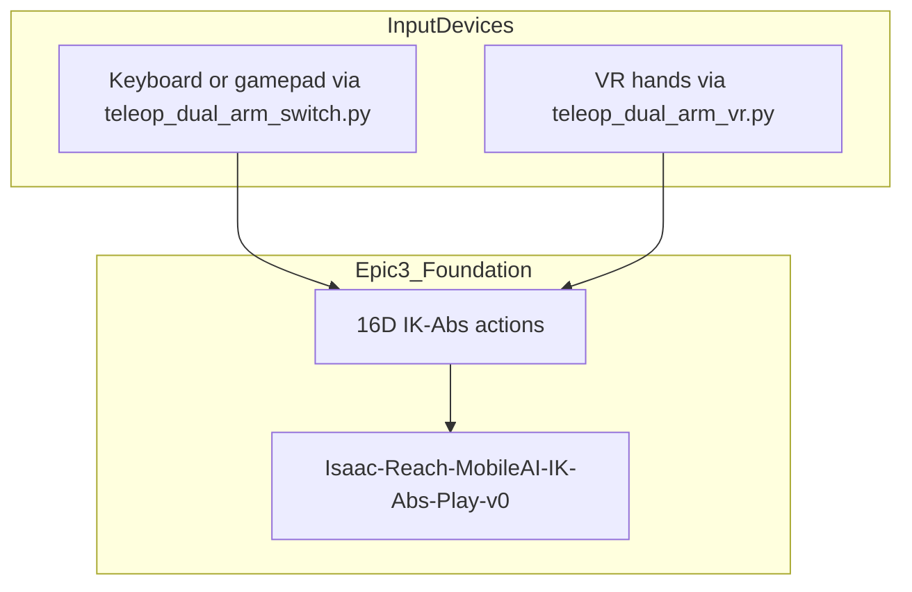
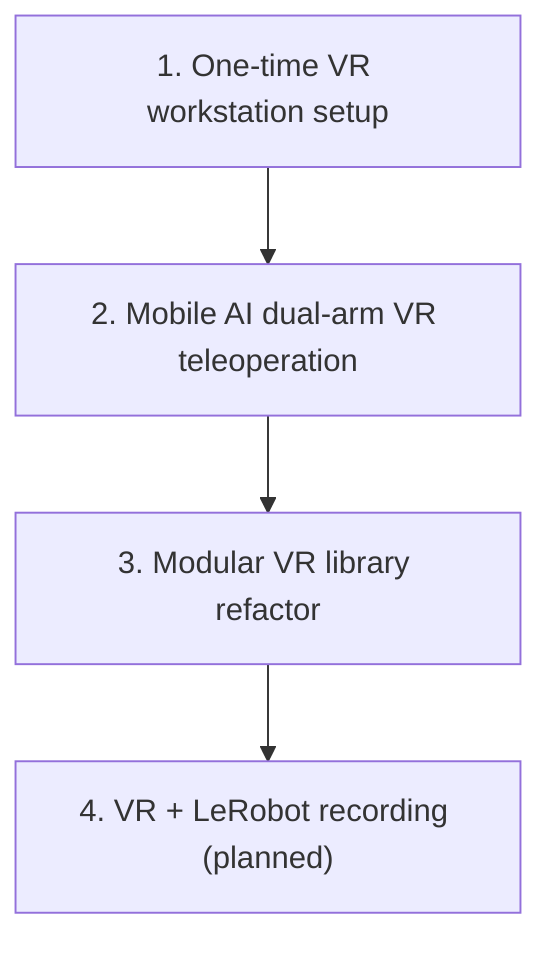

# Epic 4 — VR Integration

> **Document status:** This report describes work in progress. Content will be revised as implementation continues.

## Contents

- [1. Goal](#1-goal)
- [2. Overview](#2-overview)
- [3. Background and Key Concepts](#3-background-and-key-concepts)
  - [Abbreviations](#abbreviations)
  - [Development timeline](#development-timeline)
- [4. Implementation](#4-implementation)
  - [4.1 Integration with the Simulation Pipeline](#41-integration-with-the-simulation-pipeline)
  - [4.2 One-Time VR Workstation Configuration](#42-one-time-vr-workstation-configuration)
  - [4.3 VR Teleoperation Module](#43-vr-teleoperation-module)
  - [4.4 Task Configuration Wiring](#44-task-configuration-wiring)
  - [4.5 Development History](#45-development-history)
  - [4.6 Repository and Module Structure](#46-repository-and-module-structure)
- [5. Operational Procedures](#5-operational-procedures)
- [6. Findings and Limitations](#6-findings-and-limitations)
- [7. Troubleshooting](#7-troubleshooting)
- [8. Current Status and Future Work](#8-current-status-and-future-work)

## 1. Goal

The goal of this epic is to connect virtual reality (VR) headsets to Isaac Sim for in-simulation teleoperation. This enables safe demonstration practice and, in a later phase, synthetic data generation without physical hardware risk.

---

## 2. Overview

VR teleoperation allows an operator to wear a **Meta Quest 3** headset, view the simulation in stereo, and control both robot arms simultaneously using **hand tracking**, without a keyboard, gamepad, or physical leader arms.

### Role of VR in the project

[Epic 3](EPIC3_SIMULATION_TRAINING_PIPELINE.md) established the Mobile AI digital twin, keyboard/gamepad teleoperation, and the LeRobot recording pipeline. Epic 4 adds a **natural dual-arm** input path: the left hand drives the left arm and the right hand drives the right arm at the same time. Keyboard and gamepad teleoperation ([§4.4 of Epic 3](EPIC3_SIMULATION_TRAINING_PIPELINE.md#44-dual-arm-teleoperation)) controls one arm at a time (TAB or Y to switch).

VR also supports **safe practice**: operators manipulate the robot in simulation with no hardware collisions, cable tangles, or joint wear.

### Wider project context

The long-term objective is VR-collected demonstrations feeding the same LeRobot pipeline described in [Epic 3 §4.6](EPIC3_SIMULATION_TRAINING_PIPELINE.md#46-imitation-learning-recording-pipeline). VR teleoperation is implemented; wiring the LeRobot recorder into the VR loop remains planned work.

### Current scope

- [VR stack configured](#42-one-time-vr-workstation-configuration): ALVR, SteamVR, OpenXR on the workstation
- [Mobile AI dual-arm VR teleoperation](#43-vr-teleoperation-module) via `teleop_dual_arm_vr.py`
- **VR + LeRobot recording not yet integrated**; dataset collection today uses keyboard/gamepad recording per [Epic 3 §5.6](EPIC3_SIMULATION_TRAINING_PIPELINE.md#56-recording--human-demonstrations)

### Prerequisites (Epic 3)

Readers should complete the Epic 3 foundation before using this report:

- [§3 Background and Key Concepts](EPIC3_SIMULATION_TRAINING_PIPELINE.md#3-background-and-key-concepts): Isaac Lab tasks and shared abbreviations
- [§4.3 Custom Reach Task Environment](EPIC3_SIMULATION_TRAINING_PIPELINE.md#43-custom-reach-task-environment): task IDs and environment configs
- [§4.4 Dual-Arm Teleoperation](EPIC3_SIMULATION_TRAINING_PIPELINE.md#44-dual-arm-teleoperation): sixteen-dimensional (16D) action format and control loop

---

## 3. Background and Key Concepts

The following terms and abbreviations are used throughout this report. Shared terms (IK, IK-Abs, IL, 16D, OpenXR, etc.) are defined in [Epic 3 §3](EPIC3_SIMULATION_TRAINING_PIPELINE.md#3-background-and-key-concepts).

### Abbreviations

| Abbreviation | Meaning |
|--------------|---------|
| **ALVR** | Air Light VR (wireless PC-to-headset streaming) |
| **AR** | Augmented reality (Isaac Sim "Start AR" mode for OpenXR output) |
| **DLSS** | Deep Learning Super Sampling (NVIDIA anti-aliasing used in VR rendering) |
| **FPV** | First-person view |
| **VR** | Virtual reality |

### Terms

| Term | Definition |
|------|------------|
| **Meta Quest 3** | Standalone VR headset used for display and hand tracking in this project. |
| **ALVR** | Open-source wireless streaming bridge from the PC to Quest headsets over Wi-Fi. |
| **SteamVR** | PC VR runtime; manages the compositor and device drivers. |
| **OpenXR** | Khronos standard API; Isaac Sim uses it to read headset pose and hand tracking. |
| **Hand-anchored mode** | Default VR control mode: robot end-effector follows **relative** hand motion from a snapshot, not absolute hand position in the room. |
| **Absolute mode** | Alternative VR control mode: hand pose maps directly to the inverse kinematics (IK) target. Intended for humanoid avatars, not room-scale Mobile AI use. |
| **Retargeter** | Isaac Lab component that converts OpenXR hand data into robot action terms (pose and gripper). |
| **Workstation keyboard sidecar** | Plain `Se3Keyboard` used only for session keys (N/M/B/J); the headset operator has no keyboard. |

### Integration with Epic 3

VR does **not** replace the task environment. It replaces the **input device**. The same `Isaac-Reach-MobileAI-IK-Abs-Play-v0` task, the same **16D action vector**, and the same IK solver are used. Only the source of actions changes (hand poses instead of keyboard or gamepad input).



The VR control loop matches Epic 3's teleoperation loop (`input → 16D action → env.step()`), with OpenXR hand tracking as the input source.

### VR system stack

| Component | Role |
|-----------|------|
| **Meta Quest 3** | VR display and hand tracking |
| **ALVR** | Wireless streaming from PC to headset over Wi-Fi |
| **SteamVR** | PC VR runtime; manages compositor and device drivers |
| **OpenXR** | Standard API used by Isaac Sim to read headset pose and hand tracking |
| **Isaac Sim / Isaac Lab** | Renders stereo frames; `OpenXRDevice` converts hand poses to robot actions |


### Development timeline

Epic 4 builds on the Epic 3 pipeline. Each step maps to a section in [§4 Implementation](#4-implementation).



---

## 4. Implementation

VR implementation extends the Epic 3 task and teleoperation framework. The project did not create a separate VR-only environment.

| Step | Topic | Section |
|------|-------|---------|
| 1 | ALVR, SteamVR, OpenXR workstation setup | [§4.2](#42-one-time-vr-workstation-configuration) |
| 2 | Mobile AI dual-arm hand tracking (VR stack validated here) | [§4.3](#43-vr-teleoperation-module), [§5.2](#52-mobile-ai-vr-teleoperation) |
| 3 | VR library under `teleop/vr/` | [§4.6](#46-repository-and-module-structure) |
| 4 | VR + LeRobot recording | [§5.5](#55-vr-recording-procedure-planned) (planned) |

### 4.1 Integration with the Simulation Pipeline

The VR teleoperation script (`teleop_dual_arm_vr.py`) launches the same Isaac Lab task as keyboard teleoperation: `Isaac-Reach-MobileAI-IK-Abs-Play-v0` ([Epic 3 §4.3](EPIC3_SIMULATION_TRAINING_PIPELINE.md#ik_abs_env_cfgpy--absolute-ik-teleoperation)). Each frame, OpenXR hand tracking data is converted to a 16D action tensor (14D absolute IK poses and 2 binary gripper scalars) and passed to `env.step(action)`.

The control path is:

1. `OpenXRDevice.advance()` returns a 16-element tensor: `[L_pose(7), R_pose(7), L_grip(1), R_grip(1)]`.
2. The VR loop applies hand-anchored or absolute pose composition ([§4.3](#43-vr-teleoperation-module)).
3. The tensor is broadcast to `[num_envs, 16]` and sent to `env.step()`.
4. The task environment's differential IK solver moves both arms.

### 4.2 One-Time VR Workstation Configuration

On a pre-configured workstation, these steps are typically already complete. They are documented for reference or system re-imaging.

**SteamVR Linux capability fix.** SteamVR requires `CAP_SYS_NICE` for scheduling priority:

```bash
sudo setcap CAP_SYS_NICE+eip \
  ~/.steam/debian-installation/steamapps/common/SteamVR/bin/linux64/vrcompositor-launcher
```

Verify with `getcap` on the same path. If the path differs, locate it with:

```bash
find ~ -name "vrcompositor-launcher" 2>/dev/null
```

**SteamVR launch option.** In Steam → Library → right-click **SteamVR** → Properties → Launch Options:

```
~/.steam/debian-installation/steamapps/common/SteamVR/bin/vrmonitor.sh %command%
```

**ALVR driver registration.** Create `~/.local/share/Steam/config/steamvr.vrsettings`:

```json
{
   "Driver_alvr_server" : {
      "enable" : true,
      "loadPriority" : 0
   },
   "steamvr" : {
      "activateMultipleDrivers" : true
   }
}
```

**SteamVR as OpenXR runtime.** Set in SteamVR: **☰ Menu → Settings → Developer → Set SteamVR as OpenXR Runtime**. Verify:

```bash
cat ~/.config/openxr/1/active_runtime.json
# Must show "name": "SteamVR"
```

**Quest 3 hand tracking.** On the headset: Hand Tracking ON, Auto Switch between Hands and Controllers ON. On the ALVR dashboard: Hand Tracking interaction → SteamVR Input 2.0.

### 4.3 VR Teleoperation Module

VR teleoperation logic lives in `source/trossen_ai_isaac/trossen_ai_isaac/teleop/vr/`. The entrypoint is `scripts/teleoperation/teleop_dual_arm_vr.py`, which calls `run_vr_teleop_loop` in `loop.py`.

#### VR module package

- **`loop.py`**: Main VR control loop, workstation keyboard sidecar, warm-up guard, and action assembly.
	- Path: `source/trossen_ai_isaac/trossen_ai_isaac/teleop/vr/loop.py`
- **`hand_tracking.py`**: Hand pose and pinch extraction from OpenXR device output.
	- Path: `source/trossen_ai_isaac/trossen_ai_isaac/teleop/vr/hand_tracking.py`
- **`anchor.py`**: Hand-anchored vs absolute pose composition for end-effector targets.
	- Path: `source/trossen_ai_isaac/trossen_ai_isaac/teleop/vr/anchor.py`
- **`constants.py`**: 16D action layout, view presets, and control-frame defaults.
	- Path: `source/trossen_ai_isaac/trossen_ai_isaac/teleop/vr/constants.py`

#### loop.py - control loop

`run_vr_teleop_loop` mirrors the Epic 3 teleoperation pattern (`input → 16D action → env.step()`), but reads from the OpenXR `handtracking` device instead of `Se3Keyboard` or `Se3Gamepad`.

**Bimanual control:** Unlike keyboard/gamepad switch mode, the left hand controls the left arm and the right hand controls the right arm simultaneously.

**Hand-anchored mode (default):** `--anchor_mode hand_anchored` snapshots the operator's hand pose and the robot's end-effector pose on the first active frame. Subsequent hand movements relative to that start map to arm movements. The operator re-anchors with **B**, environment reset, or pause/resume if body orientation changes.

**Absolute mode:** `--anchor_mode absolute` feeds hand pose directly as the IK target. This mode is intended for cases where the operator coincides with the robot (e.g. humanoid avatars) and is not recommended for Mobile AI room-scale use.

**Grippers:** Pinch gesture (thumb-index distance) opens or closes each hand's gripper via `GripperRetargeter`.

**Staged activation (default):** The script begins **inactive**. A warm-up guard (`--warmup_frames`, `--warmup_min_pos`) waits for both hands to report live tracking, then a second user at the workstation presses **N** to engage. The hand-to-end-effector anchor is captured at that moment so the arms do not jump on connect. Pass `--autostart` to engage automatically after warm-up.

**Workstation keyboard controls** (sidecar `Se3Keyboard`; headset operator has no keyboard):

| Key | Action |
|-----|--------|
| **N** | Start / engage teleoperation (capture anchor on first active frame) |
| **M** | Pause (hold pose; re-anchors on resume) |
| **B** | Re-anchor only (no pause) |
| **J** | Reset environment |

**VR-specific rendering:** Scene cameras are removed during VR (the headset view replaces them). Deep Learning Super Sampling (DLSS) anti-aliasing is enabled.

**View presets** (`--view`): `first_person`, `over_shoulder`, `third_person` (default). Presets set `XrCfg.anchor_prim_path`, `anchor_pos`, and `anchor_rot` for where the operator's headset appears in the simulation. Override at runtime with `--anchor_pos`, `--anchor_rot`, or `--anchor_prim_path`.

### 4.4 Task Configuration Wiring

The Reach task must expose a `handtracking` device in [`ik_abs_env_cfg.py`](EPIC3_SIMULATION_TRAINING_PIPELINE.md#ik_abs_env_cfgpy--absolute-ik-teleoperation) (`OpenXRDeviceCfg` with retargeters). Epic 3 documents this wiring; Epic 4 consumes it.

Retargeters are ordered so `advance()` returns shape `[16]`:

| Index | Consumed by |
|-------|-------------|
| 0..6 | Left arm absolute pose (`left_arm_action`) |
| 7..13 | Right arm absolute pose (`right_arm_action`) |
| 14 | Left gripper (`left_gripper_action`) |
| 15 | Right gripper (`right_gripper_action`) |

`GripperRetargeter` emits +1.0 (open) / −1.0 (close); `BinaryJointPositionAction` maps value > 0 to open, else close.

Default `XrCfg` anchors the operator at the robot head camera (`cam_high_link`) with a vertical offset to cancel physical headset height. VR teleoperation starts **inactive** by default (`teleoperation_active_default=False`) so the operator can position before the robot reacts.

### 4.5 Development History

VR was built in two stages on the Mobile AI robot directly. The team did **not** run a separate Franka OpenXR smoke test; the ALVR → SteamVR → OpenXR → Isaac Lab chain was validated on `Isaac-Reach-MobileAI-IK-Abs-Play-v0` from the start.

1. **Mobile AI dual-arm VR** ([§4.3](#43-vr-teleoperation-module)): hand tracking ported to the Mobile AI Reach task on branch `feat/vr-handtracking-teleop`. This step confirmed the full VR stack and dual-arm IK-Abs mapping together.
2. **Modular refactor**: VR logic moved into `source/.../teleop/vr/` on the integration branch, alongside keyboard teleoperation in `teleop/se3_switch.py`.

### 4.6 Repository and Module Structure

| Location | Role | How to run |
|----------|------|------------|
| `scripts/teleoperation/teleop_dual_arm_vr.py` | VR teleoperation entrypoint | `~/IsaacLab/isaaclab.sh -p scripts/teleoperation/...` |
| `source/.../teleop/vr/loop.py` | Main VR control loop | Imported by entrypoint |
| `source/.../teleop/vr/hand_tracking.py` | Hand pose and pinch extraction | Imported by loop |
| `source/.../teleop/vr/anchor.py` | Hand-anchored vs absolute composition | Imported by loop |
| `source/.../teleop/vr/constants.py` | 16D layout and view presets | Imported by loop |
| `source/.../tasks/.../mobile_ai/reach/ik_abs_env_cfg.py` | OpenXR device and retargeter registration | Registered as gym task ([Epic 3 §4.3](EPIC3_SIMULATION_TRAINING_PIPELINE.md#ik_abs_env_cfgpy--absolute-ik-teleoperation)) |

---

## 5. Operational Procedures

Each procedure is described as **Purpose**, then **Command** or **Procedure**, then **Expected result**. Paths assume `~/trossen_ai_isaac` and `~/IsaacLab`. Epic 3 installation and task registration must be complete first ([Epic 3 §4.1](EPIC3_SIMULATION_TRAINING_PIPELINE.md#41-installation-and-initial-validation)).

### 5.1 VR Session Startup

**Purpose:** Establish a working VR session before launching teleoperation.

**Procedure** (order matters):

- [ ] Open **ALVR Launcher** → click **Launch**
- [ ] In ALVR dashboard → click **"Launch SteamVR"** (do not launch SteamVR directly from Steam)
- [ ] On Quest 3 → open **ALVR** app
- [ ] ALVR **Devices** tab → trust the Quest 3 → headset shows SteamVR home
- [ ] Run the Mobile AI VR teleoperation script ([§5.2](#52-mobile-ai-vr-teleoperation))
- [ ] In Isaac Sim: set Output Plugin = OpenXR, then click **Start AR**
- [ ] At the workstation: press **N** to engage arm tracking after warm-up completes

### 5.2 Mobile AI VR Teleoperation

**Purpose:** Run dual-arm VR teleoperation on the Mobile AI Reach task ([§4.3](#43-vr-teleoperation-module)). This is also how the team validated the full VR stack (ALVR, SteamVR, OpenXR, Isaac Lab) on Mobile AI directly.

```bash
cd ~/trossen_ai_isaac
~/IsaacLab/isaaclab.sh -p scripts/teleoperation/teleop_dual_arm_vr.py \
  --task Isaac-Reach-MobileAI-IK-Abs-Play-v0
```

**Expected result:** The Quest 3 displays the Isaac Sim scene in stereo. After warm-up, pressing **N** at the workstation engages both arms. Pinch gestures toggle grippers. Left and right hands control the corresponding arms simultaneously.

### 5.3 View Preset Options

**Purpose:** Adjust the operator's viewpoint in the simulation ([§4.3](#43-vr-teleoperation-module)).

| Flag | Description |
|------|-------------|
| `--view first_person` | Inside the robot's head camera (robot's-eye view) |
| `--view over_shoulder` | Behind and above the arms looking forward |
| `--view third_person` | Wider external view (default) |

Fine-tune with `--anchor_pos`, `--anchor_rot`, or `--anchor_prim_path` overrides.

### 5.4 VR Recording Procedure (Planned)

**Purpose:** Collect LeRobot datasets via VR teleoperation.

This procedure is **not yet implemented**. It will use `Isaac-Reach-MobileAI-Record-Play-v0` with the LeRobot recorder wired into the VR loop (planned branch: `feat/il-record-vr`).

Until then, dataset collection uses keyboard/gamepad recording per [Epic 3 §5.6](EPIC3_SIMULATION_TRAINING_PIPELINE.md#56-recording--human-demonstrations).

---

## 6. Findings and Limitations

### 6.1 Input Device Comparison

| | Keyboard / gamepad | VR |
|--|-------------------|-----|
| Script | `teleop_dual_arm_switch.py` | `teleop_dual_arm_vr.py` |
| Arms controlled | One at a time (TAB / Y to switch) | Both simultaneously |
| Recording today | Yes (`Record-Play` task) | Not yet |
| Setup complexity | Low | Headset + ALVR + SteamVR |
| Best suited for | Dataset collection (current) | Natural dual-arm demos (planned) |

### 6.2 Arm Drift (Not Applicable)

The IK-Rel arm drift issue documented in [Epic 3 §6.1](EPIC3_SIMULATION_TRAINING_PIPELINE.md#61-arm-drift-resolved) was resolved by switching to IK-Abs. It does not apply to the current IK-Abs + VR setup.

### 6.3 Current Limitations

- **VR + LeRobot recording not integrated:** keyboard/gamepad recording is the current data collection path
- **Setup complexity:** VR requires ALVR, SteamVR, Quest 3, and per-session startup steps
- **Network dependency:** ALVR requires stable 5 GHz Wi-Fi; institutional networks may block peer-to-peer traffic

### 6.4 Design Notes

**ALVR selection:** ALVR was chosen because it requires no cloud infrastructure and can be set up on a local workstation in hours. A more integrated path (e.g. NVIDIA CloudXR) may be evaluated in a later phase.

---

## 7. Troubleshooting

### VR and ALVR issues

| Symptom | Likely cause | Fix |
|---------|--------------|-----|
| `setcap` fails (file not found) | SteamVR install path differs | `find ~ -name "vrcompositor-launcher"` and use the returned path |
| SteamVR closes after a few seconds | Launched from Steam instead of ALVR | Launch SteamVR **from ALVR**; confirm launch option is set ([§4.2](#42-one-time-vr-workstation-configuration)) |
| ALVR: `steamvr.vrsettings` does not exist | File not created yet | Create the file (see [§4.2](#42-one-time-vr-workstation-configuration)) |
| Quest 3 not in ALVR Devices | Network or trust issue | Same **5 GHz Wi-Fi**; launch ALVR app on headset; try a dedicated router on institutional networks |
| Black screen in headset | Encode or hand-tracking mode | Reduce ALVR encode resolution; confirm Hand Tracking = SteamVR Input 2.0 |
| Isaac Sim segfault on Start AR | NVIDIA driver conflict | Disable GPU firmware in `/etc/modprobe.d/nvidia.conf`: `options nvidia NVreg_EnableGpuFirmware=0`, then reboot |
| `XR_ERROR_RUNTIME_UNAVAILABLE` | OpenXR runtime not running | Start ALVR + SteamVR; verify OpenXR runtime points to SteamVR |
| ALVR desync warnings | Wi-Fi quality | Move closer to router; use 5 GHz; reduce encode bitrate |
| Hands track but arms do not move | Teleoperation not engaged | Press **N** at the workstation after warm-up; or use `--autostart` |

---

## 8. Current Status and Future Work

### Completed

- [x] [ALVR + SteamVR + OpenXR stack](#42-one-time-vr-workstation-configuration) configured
- [x] [Mobile AI dual-arm VR teleoperation](#43-vr-teleoperation-module) (`teleop_dual_arm_vr.py`); VR stack validated directly on Mobile AI
- [x] Hand-anchored IK mode with view presets

### Planned or in progress

- [ ] **`feat/il-record-vr`**: integrate LeRobot recorder into VR teleoperation loop (completes Epic 3 and Epic 4 together)
- [ ] Large-scale synthetic demonstration collection via VR

### Related documentation

**[Epic 3 — Simulation Training Pipeline](EPIC3_SIMULATION_TRAINING_PIPELINE.md)**: installation, task environments, keyboard/gamepad teleoperation, and LeRobot recording.
