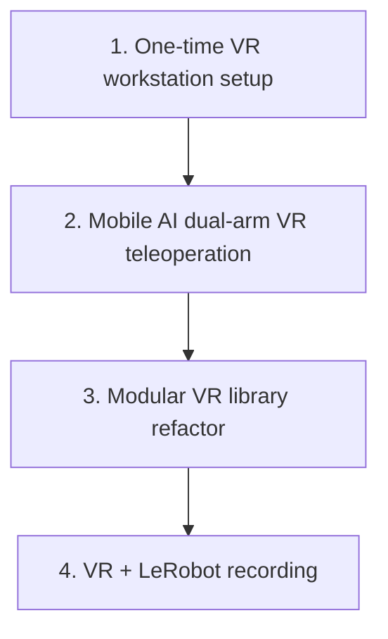

# Epic 4 — VR Integration

> **Document status:** **BookStack book intro** for Epic 4 (keep this file when uploading). Prefer editing the [docs index](README.md) first, then mirror goal / timeline / page map here. Repo readers should start at the docs index. Detailed pages: [`epic4/`](epic4/). Day-to-day commands: [IL cheat sheet](IL_WORKFLOW_CHEATSHEET.md).

## Goal

Connect VR headsets to Isaac Sim for in-simulation teleoperation — safe demonstration practice and synthetic data collection without physical hardware risk.

## Overview

VR teleoperation lets an operator wear a **Meta Quest 3**, view the simulation in stereo, and control the robot arms with **hand tracking** (no keyboard, gamepad, or physical leader arms for the operator).

[Epic 3](EPIC3_SIMULATION_TRAINING_PIPELINE.md) established the Mobile AI digital twin, keyboard/gamepad teleoperation, and the LeRobot recording pipeline. Epic 4 adds Quest 3 hand-tracking teleoperation and was the **production path for demonstration collection**. VR can drive both arms at once; keyboard/gamepad ([Teleoperation](epic3/03-teleoperation.md)) controls one arm at a time (TAB or Y to switch).

This project’s **reporting train set** was collected with VR (`--record_arm right`) — see [cheat sheet production fact](IL_WORKFLOW_CHEATSHEET.md). Episodes feed the LeRobot pipeline in [Recording (LeRobot)](epic3/04-recording-lerobot.md). Keyboard/gamepad recording remains available for smoke tests only.

### Current scope

- [Workstation config](epic4/03-workstation-config.md): one-time install (Part A) + per-session startup (Part B)
- [VR teleoperation](epic4/04-vr-teleoperation.md): `teleop_dual_arm_vr.py`
- [VR recording](epic4/05-vr-recording.md): `record_dual_arm_vr.py`, right-arm production path, XR camera probes

### Prerequisites (Epic 3)

- [Glossary](epic3/01-glossary.md) · [Tasks and scene](epic3/02-tasks-and-scene.md) · [Teleoperation](epic3/03-teleoperation.md) · [Epic 3](README.md#epic-3--simulation-training-pipeline) / [Epic 3 hub](EPIC3_SIMULATION_TRAINING_PIPELINE.md)

## Start here

1. **[IL Workflow Cheat Sheet](IL_WORKFLOW_CHEATSHEET.md#1-collect-demos--vr-production)** — session startup + collect / merge
2. **[Workstation config](epic4/03-workstation-config.md)** — one-time install (Part A) and every-session startup (Part B)
3. **[VR teleoperation](epic4/04-vr-teleoperation.md)** — control model and CLI
4. **[VR recording](epic4/05-vr-recording.md)** — `--record_arm`, shards, smoothing
5. **[Epic 3](README.md#epic-3--simulation-training-pipeline)** / [hub](EPIC3_SIMULATION_TRAINING_PIPELINE.md) — train / eval after demos exist

## Development timeline

| Step | Delivered | Where |
|------|-----------|--------|
| 1 | ALVR, SteamVR, OpenXR workstation setup | [Workstation config — Part A](epic4/03-workstation-config.md#part-a--one-time-setup) |
| 2 | Mobile AI dual-arm hand tracking | [VR teleoperation](epic4/04-vr-teleoperation.md) |
| 3 | VR library under `teleop/vr/` | [VR teleoperation](epic4/04-vr-teleoperation.md#repository-and-module-structure) |
| 4 | VR + LeRobot recording (production) | [VR recording](epic4/05-vr-recording.md), [cheat sheet](IL_WORKFLOW_CHEATSHEET.md) |

## Pages (BookStack-ready)

| Page | Contents |
|------|----------|
| [Glossary](epic4/01-glossary.md) | VR abbreviations and terms |
| [Background and stack](epic4/02-background-and-stack.md) | Epic 3 integration + VR stack (why each hop) |
| [Workstation config](epic4/03-workstation-config.md) | One-time install (Part A) + per-session startup (Part B) |
| [VR teleoperation](epic4/04-vr-teleoperation.md) | Module, wiring, keys, CLI |
| [VR recording](epic4/05-vr-recording.md) | Dataset modes, shards, smoothing |
| [Findings and troubleshooting](epic4/06-findings-troubleshooting.md) | Limitations and VR/ALVR fixes |
| [Future work](epic4/07-future-work.md) | Completed checklist and follow-ups |

**Related:** [docs index](README.md) · [IL cheat sheet](IL_WORKFLOW_CHEATSHEET.md) · [ACT eval report](ACT_EVAL_REPORT_100K.md) · [Epic 3 hub](EPIC3_SIMULATION_TRAINING_PIPELINE.md)
