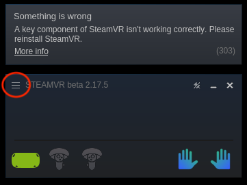

# IL Workflow Runbook

**Day-to-day runbook** to operate Mobile AI in simulation: VR session → practice teleop / collect demos → verify → train → evaluate (keyboard/gamepad alternate included).

> **Paths are examples** (`~/trossen_ai_isaac`, `~/IsaacLab`, `~/lerobot_trossen/...`). Replace with your locations. Always `cd` into your `trossen_ai_isaac` clone first.

**First-time machine?** Complete [one-time setup](setup/README.md) (Isaac/Lab + [VR workstation](setup/vr-workstation.md)) before this runbook.

**Project example reference** (values used in labeled examples below — edit wrappers for your run): reporting dataset `mobile_ai_right_pick_place_20260714_v2` — [LeRobot Dataset v3.0](https://huggingface.co/docs/lerobot/en/lerobot-dataset-v3), collected with **VR**, **`--record_arm right`** (~50 episodes / ~30.5k frames @ 60 FPS). Collect/train wrapper defaults match this recipe. Reporting eval: [ACT Evaluation Report](ACT_EVAL_REPORT_100K.md) (56.7%). Design: [Recording](epic3/04-recording-lerobot.md) · [VR recording](epic4/04-vr-recording.md). Keyboard/gamepad recording is smoke tooling only.

---

## 0. Prerequisites

Confirm gym IDs (host already installed — see [setup](setup/README.md) if not):

```bash
cd ~/trossen_ai_isaac
~/IsaacLab/isaaclab.sh -p scripts/tools/list_envs.py
# Confirm: Isaac-Reach-MobileAI-IK-Abs-Play-v0, Isaac-Reach-MobileAI-Record-Play-v0,
#          Isaac-Lift-Cube-MobileAI-Joint-Pos-Play-v0
```

Optional robot visualization (from clone root):

```bash
cd ~/trossen_ai_isaac
~/isaacsim/python.sh scripts/demos/robot_bringup.py mobile_ai
```

---

## 1. VR session startup (every time)

Run this **every** VR teleop or recording session. Order matters. One-time host install: [VR workstation one-time setup](setup/vr-workstation.md). Design: [Background and stack](epic4/02-background-and-stack.md).

### Roles

| Role | Who | Responsibility |
|------|-----|----------------|
| **Headset operator** | Person wearing the Quest 3 | Wi-Fi, ALVR app, guardian, hand visibility, watching the sim |
| **Workstation operator** | Person at the PC | ALVR Launcher, SteamVR from ALVR, Toggle Dashboard, Isaac scripts, **Start AR**, keyboard keys (**N** / **U** / …) |

Both roles are required for a smooth session.

### 1.1 Same Wi-Fi

Confirm Quest and workstation are on the **same** network ([one-time network notes](setup/vr-workstation.md#network-wi-fi)).

### 1.2 Open ALVR on the headset; trust on the PC

1. Workstation operator: start **ALVR Launcher** → **Launch** so the ALVR server UI is up.
2. Headset operator: open the **ALVR** app on the Quest.
3. If the headset prompts you to open ALVR on the PC, the workstation operator should already have it running.
4. On the PC ALVR **Devices** list, click **Trust** next to the Quest entry (required on first pairing; later sessions may auto-connect).

> **Screenshot placeholder:** `docs/assets/epic4/alvr-trust-device.png` — ALVR PC Devices tab with Trust next to the Quest.
>
> 

### 1.3 Room boundary (guardian)

If the Quest detects obstacles or has no play area, it prompts for a **room boundary / guardian**. Follow the on-screen instructions until tracking space is accepted.

> **Screenshot placeholder:** `docs/assets/epic4/quest-room-boundary.png` — Quest guardian / boundary setup screens.
>
> 

### 1.4 Launch SteamVR from ALVR

1. On the PC ALVR UI, click **Launch SteamVR** (do **not** launch SteamVR only from the Steam library).
2. **First run:** after the device is listed, press **Trust** if still required; then SteamVR should bring the headset into the SteamVR environment.
3. **Later runs:** if the headset was trusted before, SteamVR often starts and drops you on the SteamVR dashboard automatically.

Only after SteamVR is up via ALVR is the headset reliably recognized by the PC VR stack.

> **Screenshot placeholder:** `docs/assets/epic4/alvr-launch-steamvr.png` — ALVR UI “Launch SteamVR” control.
>
> 

### 1.5 Confirm both hands are tracked

Headset operator: move both arms so the Quest cameras see them. In the SteamVR world you should see **two cursors / hand representations**.

**Tip:** Hold both hands in view of the headset **before** starting SteamVR.

If hands are missing:

1. Ask the workstation operator to **restart SteamVR through ALVR**.
2. If still broken: close SteamVR (Steam apps), close ALVR, then restart from [1.2](#12-open-alvr-on-the-headset-trust-on-the-pc) (ALVR → Launch SteamVR from ALVR → check hands again).

> **Screenshot placeholder:** `docs/assets/epic4/steamvr-both-hands-tracked.png` — SteamVR view with two hand cursors visible.
>
> 

### 1.6 Toggle SteamVR dashboard off

With hands tracked, the workstation operator clears the SteamVR dashboard overlay so it does not block the view:

1. Focus the **SteamVR** window on the PC.
2. Open the menu via the **stacked lines** (☰) control at the top of the window.
3. Click **Toggle Dashboard** so the in-world dashboard is **off**.

Hands should remain tracked after the dashboard is hidden.

> **Screenshot placeholder:** `docs/assets/epic4/steamvr-toggle-dashboard.png` — SteamVR window menu → Toggle Dashboard.
>
> 

### 1.7 Launch teleop or recording on the PC

Workstation operator starts Isaac from the clone root (paths are examples). Copy-paste commands live in the sections below — then continue with [1.8](#18-isaac-sim-openxr-start-ar) → [1.10](#110-engage-teleop-recording-with-the-workstation-operator).

- **Practice teleop (no dataset):** [§2](#2-practice-vr-teleop-no-dataset) · design [VR teleoperation](epic4/03-vr-teleoperation.md)
- **Collect demos (single- or multi-session):** [§3](#3-collect-demos-vr) · design [VR recording](epic4/04-vr-recording.md)

### 1.8 Isaac Sim: OpenXR + Start AR

In the **Isaac Sim** window (once the app is up from the script):

1. Set **Output Plugin** = **OpenXR** (viewport / XR output controls — see screenshots below).
2. Click **Start AR**.

The headset should leave the SteamVR home and show the simulation stereo view.

> **Screenshot placeholder:** `docs/assets/epic4/isaac-sim-main-window.png` — Full Isaac Sim main window during VR teleop/recording (orientation for where XR controls live).
>
> 

> **Screenshot placeholder:** `docs/assets/epic4/isaac-output-plugin-openxr-start-ar.png` — Close-up: Output Plugin = OpenXR and **Start AR** control in the Isaac Sim UI.
>
> 

### 1.9 POV reset if the first spawn looks wrong

On the first entry into the sim, the viewpoint is often wrong relative to the robot. **Remove the headset for a couple of seconds, then put it back on** — that usually resets the POV / XR anchor alignment.

### 1.10 Engage teleop / recording with the workstation operator

After warm-up (hands live — watch for `[WARMUP] Hand tracking stable...` in the terminal), follow this ritual before and during control.

**Before engage**

1. Click the **Isaac Sim** window so it is the active (focused) window — workstation keys are ignored otherwise.
2. Headset operator: form a horizontal **C-shape** with each hand (mimic the open robot gripper). **Stay still.**
3. PC operator engages while hands are still:
   - Teleop only → **N**
   - Recording → **U** (then **N** to start the episode once teleop feels good)

That stillness avoids a bad first hand↔EE anchor. Expect `[TELEOP] Activated...` then `[ANCHOR] Captured...` on the first active frame. Full key → log map: [Controls](#controls-quick-reference).

**During teleoperation**

- Move hands **slowly** — rushing makes tracking and IK targets look wrong.
- If motion no longer matches your hands (e.g. after turning your body), stay still and press **B** (**re-anchor**): clears the current hand↔EE snapshot and pose filter, then re-snapshots on the next active frame so “forward relative to the headset” maps to robot-forward again — without pausing or resetting the environment. Expect `[ANCHOR] Re-anchor requested...` then `[ANCHOR] Captured...`.
- **Pinch** thumb and index together to close/open that hand’s gripper (no dedicated print; with `--step_log`, see `L_grip` / `R_grip` on the periodic `[VR step=...]` line).

**Reset (**J**)**

- **J** returns the robot to the start pose, turns teleop off, and (if recording) discards an in-progress episode. Expect `[RESET] Environment will reset...` then `[RESET] Done -- teleop off; reposition hands, press B to re-anchor, then N|U to engage`.
- After reset: hands still in C-shape → **B** → engage again (**N** teleop / **U** recording).

**Saving a recording episode (**N** second press)**

After you finish a demo and press **N** to save, **wait until the save finishes** before re-anchoring, engaging, or starting the next episode. Saving flushes parquet + video and can take several seconds. Watch the terminal for:

1. `[RECORD] Saved episode (N frames) -> <dataset_root>` — write completed ([`LeRobotRecorder.save_episode`](../source/trossen_ai_isaac/trossen_ai_isaac/recording/lerobot_recorder.py))
2. `[RECORD] Episode saved -- resetting robot; reposition hands, press B to re-anchor, then U to engage teleop`
3. Then the usual `[RESET] ...` lines

Do not press keys or move on until those lines appear. Then: hands still → **B** → **U** → **N** for the next take.

> **Warning — end every recording session with Ctrl+C in the terminal**
>
> When you are done collecting for **this** Isaac run (last episode already saved):
>
> 1. Focus the **terminal** that launched recording (not the Isaac Sim window).
> 2. Press **Ctrl+C**.
> 3. Wait for `[RECORD] Finalized dataset at ...` before closing the terminal or killing the process.
>
> SIGINT runs `finalize()` so parquet/video metadata close cleanly. Closing without Ctrl+C (or without waiting for that line) risks an **incomplete dataset**. Single- vs multi-session layout: [§3](#3-collect-demos-vr).

| Mode | Typical keys |
|------|----------------|
| Teleop only | **N** engage · **M** pause · **B** re-anchor · **J** reset · **TAB** switch arm (single-arm) — [Controls](#controls-quick-reference) · design [VR teleoperation](epic4/03-vr-teleoperation.md) |
| Recording | **U** engage · **I** pause · **N** episode · **M** discard · **B** re-anchor · **J** reset — [Controls](#controls-quick-reference) · design [VR recording](epic4/04-vr-recording.md) |

You are now ready to practice ([§2](#2-practice-vr-teleop-no-dataset)) or collect ([§3](#3-collect-demos-vr)).

---

## 2. Practice VR teleop (no dataset)

Complete [§1 VR session startup](#1-vr-session-startup-every-time) first (through Start AR). Design: [VR teleoperation](epic4/03-vr-teleoperation.md). One-time host: [VR workstation setup](setup/vr-workstation.md).

```bash
cd ~/trossen_ai_isaac
~/IsaacLab/isaaclab.sh -p scripts/teleoperation/teleop_dual_arm_vr.py \
  --task Isaac-Reach-MobileAI-IK-Abs-Play-v0
```

Operator tips: [§1.10](#110-engage-teleop-recording-with-the-workstation-operator). Engage with **N** (pause **M**, re-anchor **B**, reset **J**). Expected logs: [Controls quick reference](#controls-quick-reference).

---

## 3. Collect demos — VR

Complete [§1 VR session startup](#1-vr-session-startup-every-time) first. **Design:** [VR recording](epic4/04-vr-recording.md) · [shard-then-merge](epic4/04-vr-recording.md#multi-session-collection-shard-then-merge).

**Arm choice:** for single-arm pick-and-place, lock one arm with `--record_arm left|right` so the unused arm does not drift when VR loses tracking of the idle hand. This project’s reporting set used **`right`**.

### Single-session vs multi-session

LeRobot Dataset v3.0 **cannot reopen** a dataset folder for append after `finalize()` closes the parquet writers. That is why collection supports two modes:

| Mode | When to use | Where data lands |
|------|-------------|------------------|
| **Single-session** | You finish the whole dataset in **one** Isaac run | Write straight to your final `--root` with `record_dual_arm_vr.py` (no shards, no merge) |
| **Multi-session** | You stop and resume across breaks or days | Each `run_collect_dataset.sh` run writes a **shard** under `$ROOT_BASE/shards/session_<label-or-timestamp>/`; after the last session, merge into `$ROOT_BASE/merged/` |

**Why shards:** each session finalizes its own folder. Later sessions cannot append into a finalized folder, so new episodes go into a new shard; `run_merge_dataset.sh` combines compatible shards into one train-ready v3 dataset. All shards must share the same `--record_arm` and `--fps`.

### During and after each Isaac run

- After each episode save (**N**), wait for `[RECORD] Saved episode (...)` (and the follow-up reset lines) before the next take — [§1.10](#110-engage-teleop-recording-with-the-workstation-operator).

> **Warning — Ctrl+C in the launch terminal before you quit**
>
> When finished for **this** run: press **Ctrl+C** in the terminal that started recording, then wait for `[RECORD] Finalized dataset at ...`. Do not close the window first — see [§1.10](#110-engage-teleop-recording-with-the-workstation-operator).

### Single-session (one-shot)

Placeholders — set your own id, path, and arm:

```bash
cd ~/trossen_ai_isaac
~/IsaacLab/isaaclab.sh -p scripts/imitation_learning/recording/record_dual_arm_vr.py \
  --repo_id YOUR_USERNAME/dataset_name \
  --root ~/lerobot_trossen/datasets/dataset_name \
  --fps 60 \
  --record_arm left   # or right
```

Then Start AR → engage → collect → **Ctrl+C** → wait for Finalized. Verify/train against that `--root` ([§5](#5-verify-dataset) / [§6](#6-train)).

**Example (this project’s reporting collect — right arm, single-session shape):**

```bash
~/IsaacLab/isaaclab.sh -p scripts/imitation_learning/recording/record_dual_arm_vr.py \
  --repo_id trossen-admin/mobile_ai_right_pick_place_20260714_v2 \
  --root ~/lerobot_trossen/datasets/mobile_ai_right_pick_place_20260714_v2 \
  --fps 60 \
  --record_arm right
```

### Multi-session (shard, then merge)

Edit `REPO_BASE` / `ROOT_BASE` near the top of `run_collect_dataset.sh` and `run_merge_dataset.sh` for your dataset name and path (defaults match the project example reference). Each invocation creates one shard (`session_<TIMESTAMP>`, or pass a label as `$1`).

```bash
cd ~/trossen_ai_isaac
./scripts/imitation_learning/run_collect_dataset.sh          # optional: morning, session3, …
# … Start AR → engage → collect episodes → Ctrl+C → wait for Finalized …
# repeat for more sessions as needed, then:
./scripts/imitation_learning/run_merge_dataset.sh --verify
```

After merge, verify/train against **`$ROOT_BASE/merged/`** (not an individual shard).

Operator tips: [§1.10](#110-engage-teleop-recording-with-the-workstation-operator). Keys and expected logs: [Controls quick reference](#controls-quick-reference).

---

## 4. Collect demos — keyboard / gamepad (alternate)

**Practice teleop (no dataset):**

```bash
cd ~/trossen_ai_isaac
~/IsaacLab/isaaclab.sh -p scripts/teleoperation/teleop_dual_arm_switch.py \
  --task Isaac-Reach-MobileAI-IK-Abs-Play-v0
```

Add `--teleop_device gamepad` for gamepad. Keys: [Controls quick reference](#controls-quick-reference) · full tables [Teleoperation](epic3/03-teleoperation.md).

**Smoke recording (not production demos):**

```bash
cd ~/trossen_ai_isaac
~/IsaacLab/isaaclab.sh -p scripts/imitation_learning/recording/record_dual_arm.py \
  --task Isaac-Reach-MobileAI-Record-Play-v0 \
  --repo_id YOUR_USERNAME/dataset_name \
  --root ~/lerobot_trossen/datasets/dataset_name \
  --fps 60 \
  --enable_cameras \
  --record_arm right
```

Use `--teleop_device gamepad` for gamepad.

Automated smoke (no human demos):

```bash
~/IsaacLab/isaaclab.sh -p scripts/imitation_learning/smoke/smoke_record_env.py \
  --task Isaac-Reach-MobileAI-Record-Play-v0 --enable_cameras
~/IsaacLab/isaaclab.sh -p scripts/imitation_learning/smoke/smoke_record_dataset.py \
  --task Isaac-Reach-MobileAI-Record-Play-v0 --enable_cameras --overwrite
```

---

## Controls quick reference

**This runbook** is the operator quick ref (keys + expected terminal logs). Design pages cover control semantics and architecture: [Teleoperation](epic3/03-teleoperation.md) · [VR teleoperation](epic4/03-vr-teleoperation.md) · [VR recording](epic4/04-vr-recording.md) · [Recording](epic3/04-recording-lerobot.md).

**Isaac Sim must be the focused window** for workstation keys to register. Operator ritual: [§1.10](#110-engage-teleop-recording-with-the-workstation-operator). Key-event logs come from `teleop/vr/loop.py`. Periodic `[VR step=...]` / `[step=...]` status is **off by default**; pass `--step_log` to enable.

Warm-up (automatic): `[WARMUP] Hand tracking stable after N frames -- press N|U ...`

### VR teleop only (`teleop_dual_arm_vr.py`)

| Key / input | Action | Expected terminal log |
|-------------|--------|------------------------|
| **N** | Engage teleop | `[TELEOP] Activated (left+right hands -> left+right arms)` then `[ANCHOR] Captured. ...` on first active frame |
| **M** | Pause (hold pose; next engage re-anchors) | `[TELEOP] Deactivated (robot holds last pose; press B then N to re-engage)` |
| **B** | Re-anchor (no pause/reset) | `[ANCHOR] Re-anchor requested -- will re-snapshot on next active frame` then `[ANCHOR] Captured. ...` |
| **J** | Reset environment | `[RESET] Environment will reset on next step` then `[RESET] Done -- teleop off; reposition hands, press B to re-anchor, then N to engage` |
| **TAB** | Switch active arm (single-arm; not with `--dual_arm`) | `[ARM SWITCH] Now controlling: LEFT\|RIGHT arm  gripper=OPEN\|CLOSE` |
| **Pinch** | Toggle gripper (headset) | No dedicated print — with `--step_log`, see `L_grip` / `R_grip` on periodic `[VR step=...]` lines |


### VR recording (`record_dual_arm_vr.py` / `run_collect_dataset.sh`)

| Key / input | Action | Expected terminal log |
|-------------|--------|------------------------|
| **U** | Engage teleop without recording | `[TELEOP] Activated ...` then `[ANCHOR] Captured. ...` |
| **I** | Pause teleop | `[TELEOP] Deactivated (robot holds last pose; press B then U to re-engage)` |
| **N** | Start episode / save-and-reset | Start: `[RECORD] Episode recording started -- press N again to save and reset` (or `[RECORD] Engage teleop first (U), then press N...` if not engaged). Save: wait for `[RECORD] Saved episode (N frames) -> ...` then `[RECORD] Episode saved -- resetting robot; ...` (+ reset logs). Do not re-engage until those lines appear. |
| **M** | Discard episode buffer | `[RECORD] Episode buffer discarded -- recording stopped` |
| **B** | Re-anchor | Same as teleop **B** |
| **J** | Reset (discards in-progress episode) | Optional `[RECORD] Recording stopped -- episode discarded before reset`; then `[RESET] ...` / `[RESET] Done ... then U to engage` |
| **TAB** | Switch arm if single-arm and not locked by `--record_arm left/right` | Same as teleop **TAB** |
| **Pinch** | Toggle gripper (headset) | Same as teleop **Pinch** |

### Keyboard teleop / recording (`teleop_dual_arm_switch.py` / `record_dual_arm.py`)

| Key | Action |
|-----|--------|
| Motion (**W/S A/D Q/E Z/X T/G C/V**), **L** | EE motion / clear deltas — [full table](epic3/03-teleoperation.md) |
| **TAB** / **K** / **J** | Switch arm / gripper / reset |
| **N** / **M** | Episode toggle / discard (**recording only**) |

### Gamepad (`--teleop_device gamepad`)

| Button | Action |
|--------|--------|
| Sticks / D-pad | EE motion — [full table](epic3/03-teleoperation.md) |
| **Y** / **A** / **B** | Switch arm / gripper / reset |
| **X** | Episode toggle (**recording only**) |
| Keyboard **M** | Discard episode (no gamepad discard binding) |

---

## 5. Verify dataset

After recording (or merging shards), verify **your** [LeRobot Dataset v3.0](https://huggingface.co/docs/lerobot/en/lerobot-dataset-v3) before training. Pass `--root` (on-disk folder) and `--repo_id` (logical id) that match **that** dataset’s name and save location — they need not match the project example reference. Where datasets land: [§3 Collect](#3-collect-demos-vr) · [Recording](epic3/04-recording-lerobot.md).

```bash
cd ~/trossen_ai_isaac
~/lerobot_trossen/.venv/bin/python scripts/imitation_learning/validation/verify_dataset.py \
  --root /path/to/your/dataset \
  --repo_id YOUR_USERNAME/your_dataset_name
```

ACT/Pi0 train wrappers also verify using the `ROOT` / `REPO_ID` vars inside those scripts — edit them the same way for a custom dataset ([§6](#6-train)).

**Example (this project’s reporting set):**

```bash
cd ~/trossen_ai_isaac
~/lerobot_trossen/.venv/bin/python scripts/imitation_learning/validation/verify_dataset.py \
  --root ~/lerobot_trossen/datasets/mobile_ai_right_pick_place_20260714_v2 \
  --repo_id trossen-admin/mobile_ai_right_pick_place_20260714_v2
```

---

## 6. Train

This step **trains a policy** on a verified [LeRobot Dataset v3.0](https://huggingface.co/docs/lerobot/en/lerobot-dataset-v3). Training runs in the `lerobot_train` conda env via `lerobot-train` — Isaac Sim is not involved ([Training](epic3/05-training.md)).

**How:** run a repo **wrapper `.sh`**. Open the script and set `REPO_ID`, `ROOT`, `OUTPUT_DIR`, `STEPS`, job name, and policy flags for **your** run. Script defaults point at the project example reference; change them for a custom dataset or step count.

**Wrappers shipped today:** **ACT** (`run_verify_and_train.sh`) and **Pi0** (`run_verify_pi0_dataset.sh` + `run_train_pi0.sh`). Both stream a **live LeRobot progress bar** via `conda run --no-capture-output` — run in the foreground.

**Other policies:** any LeRobot-supported policy that trains on Dataset v3.0 can use the same dataset, but this repo does **not** ship wrappers beyond ACT/Pi0 — add a wrapper (or call `lerobot-train` yourself). Shape:

```bash
lerobot-train \
  --dataset.repo_id=YOUR_USERNAME/your_dataset_name \
  --dataset.root=/path/to/your/dataset \
  --policy.type=act \
  --output_dir=/path/to/outputs/train/YOUR_JOB \
  --steps=YOUR_STEP_COUNT
# Set --policy.type and remaining flags (device, save_freq, video_backend, …)
# for your policy — see [Training](epic3/05-training.md)
```

### ACT wrapper (edit settings in the script)

```bash
cd ~/trossen_ai_isaac
./scripts/imitation_learning/run_verify_and_train.sh
# script defaults → outputs/train/act_mobile_ai_right_v2/ (project example recipe)
```

Editable near the top: `REPO_ID`, `ROOT`, `OUTPUT_DIR`, `STEPS`, plus the `lerobot-train` block.

### Example (this project’s ACT 100k reporting train)

Same recipe with more steps / different output — step count is a preference, not a fixed path. Full hyperparameter table: [Training](epic3/05-training.md).

```bash
source "$HOME/.bashrc" 2>/dev/null || true
export HF_DATASETS_CACHE="${HF_DATASETS_CACHE:-$HOME/trossen_ai_isaac/.hf_datasets_cache}"
mkdir -p "$HF_DATASETS_CACHE"

conda run --no-capture-output -n lerobot_train \
  env HF_DATASETS_CACHE="$HF_DATASETS_CACHE" \
  lerobot-train \
    --dataset.repo_id=trossen-admin/mobile_ai_right_pick_place_20260714_v2 \
    --dataset.root="$HOME/lerobot_trossen/datasets/mobile_ai_right_pick_place_20260714_v2" \
    --dataset.video_backend=pyav \
    --policy.type=act \
    --output_dir="$HOME/trossen_ai_isaac/outputs/train/act_mobile_ai_right_v2_100k" \
    --job_name=act_mobile_ai_right_v2_100k \
    --policy.device=cuda \
    --steps=100000 \
    --save_freq=10000 \
    --log_freq=100 \
    --num_workers=4 \
    --save_checkpoint=true \
    --wandb.enable=false \
    --policy.push_to_hub=false
# → outputs/train/act_mobile_ai_right_v2_100k/
```

### Pi0 wrapper (edit settings in the script)

```bash
./scripts/imitation_learning/run_verify_pi0_dataset.sh
./scripts/imitation_learning/run_train_pi0.sh
# script defaults → outputs/train/pi0_mobile_ai_right_v2/ (project example recipe)
```

Editable near the top: `REPO_ID`, `ROOT`, `OUTPUT_DIR`, `STEPS`, and Pi0 `lerobot-train` flags.

### Optional connectivity smoke (not a full train)

```bash
python scripts/imitation_learning/training/smoke_train_act.py \
  --root ~/lerobot_trossen/datasets/DATASET \
  --repo_id USER/DATASET
```

---

## 7. Evaluate (closed-loop)

After training, run **closed-loop sim eval** on **your** checkpoint. Architecture: [Evaluation](epic3/06-evaluation.md).

**How:** wrappers [`run_play_act.sh`](../scripts/imitation_learning/run_play_act.sh) (ACT) and [`run_play_pi0.sh`](../scripts/imitation_learning/run_play_pi0.sh) (Pi0). Pass `CHECKPOINT_DIR` `NUM_EPISODES` `FPS` and optional `--visual`, or edit defaults near the top of the script (checkpoint, episodes, fps, output dir).

```bash
cd ~/trossen_ai_isaac
./scripts/imitation_learning/run_play_act.sh \
  /path/to/your/checkpoints/last/pretrained_model \
  NUM_EPISODES FPS
# Pi0 (same args shape):
./scripts/imitation_learning/run_play_pi0.sh \
  /path/to/your/checkpoints/last/pretrained_model \
  NUM_EPISODES FPS
```

**Project status:** Pi0 closed-loop sim eval is still **deferred** (Inductor / timeout) — see [Evaluation](epic3/06-evaluation.md); use the Pi0 wrapper when unblocked.

**Example (this project’s ACT reporting eval — 30 episodes @ 60 FPS):**

```bash
cd ~/trossen_ai_isaac
./scripts/imitation_learning/run_play_act.sh \
  ~/trossen_ai_isaac/outputs/train/act_mobile_ai_right_v2_100k/checkpoints/last/pretrained_model \
  30 60
```

Results for that run: **[ACT Evaluation Report](ACT_EVAL_REPORT_100K.md)** (56.7%).

### Optional open-loop replay

Replay a recorded episode (sanity check, not policy eval):

```bash
./scripts/imitation_learning/run_play_replay.sh \
  /path/to/your/dataset EPISODE_INDEX
```

Editable defaults / args near the top of `run_play_replay.sh` (dataset root, episode index, fps).

**Example (this project’s reporting dataset, episode 0):**

```bash
./scripts/imitation_learning/run_play_replay.sh \
  ~/lerobot_trossen/datasets/mobile_ai_right_pick_place_20260714_v2 0
```

---

## Quick map

| Stage | Copy-paste commands |
|-------|---------------------|
| One-time setup | [setup hub](setup/README.md) · [VR workstation](setup/vr-workstation.md) |
| VR session (every time) | [§1](#1-vr-session-startup-every-time) |
| VR practice teleop | [§2](#2-practice-vr-teleop-no-dataset) · design [VR teleoperation](epic4/03-vr-teleoperation.md) |
| VR collect | [§3](#3-collect-demos-vr) · design [VR recording](epic4/04-vr-recording.md) |
| KB practice / smoke record | [§4](#4-collect-demos-keyboard-gamepad-alternate) |
| Keys (all devices) | [Controls quick reference](#controls-quick-reference) |
| Verify | [§5](#5-verify-dataset) |
| Train policy | [§6](#6-train) · [Training](epic3/05-training.md) |
| Evaluate policy | [§7](#7-evaluate-closed-loop) · [Evaluation](epic3/06-evaluation.md) · [ACT report](ACT_EVAL_REPORT_100K.md) (this project’s example) |

## Continue reading

- [One-time setup](setup/README.md) (new machine)
- [§1 VR session startup](#1-vr-session-startup-every-time)
- [ACT Evaluation Report](ACT_EVAL_REPORT_100K.md) (this project’s example)
- [Docs index](README.md) (design lane)
