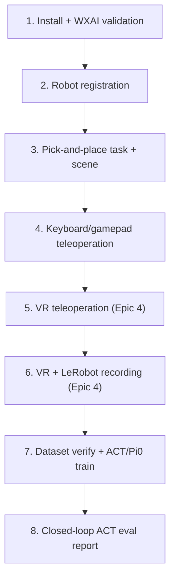
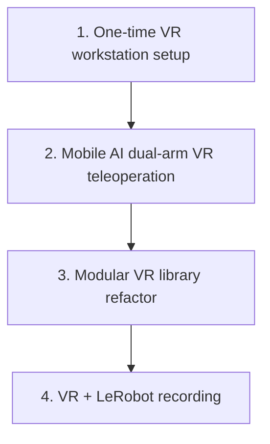

# Trossen Mobile AI — Simulation & VR Documentation

Repo index for the **Trossen Mobile AI** imitation-learning docs. Design pages live under [`epic3/`](epic3/) and [`epic4/`](epic4/); **commands** live in the [IL cheat sheet](IL_WORKFLOW_CHEATSHEET.md).

> **BookStack:** Upload [Epic 3 hub](EPIC3_SIMULATION_TRAINING_PIPELINE.md) / [Epic 4 hub](EPIC4_VR_INTEGRATION.md) as book intros, then the numbered pages under `epic3/` and `epic4/`. This README is the GitHub entry point (hubs are kept as BookStack reference, not deleted).

| Doc | What it covers |
|-----|----------------|
| **This page** | Goals, timelines, page maps, environment, smoke checklist |
| **[Epic 3 pages](epic3/)** | Glossary, tasks/scene, teleop, recording, training, evaluation, findings |
| **[Epic 4 pages](epic4/)** | Glossary, stack, workstation, VR teleop, VR recording, findings |
| **[IL Workflow Cheat Sheet](IL_WORKFLOW_CHEATSHEET.md)** | **Canonical runbook:** collect → verify → train → eval |
| **[ACT Evaluation Report](ACT_EVAL_REPORT_100K.md)** | Closed-loop ACT 100k / 30-episode results |
| [Epic 3 hub](EPIC3_SIMULATION_TRAINING_PIPELINE.md) / [Epic 4 hub](EPIC4_VR_INTEGRATION.md) | **BookStack book intros** (same story as sections below) |

## Who this is for

New team members, stakeholders, and contributors who need to understand what was built, why, and how to run it — without prior Isaac Sim experience.

## Reading order

1. **This page** — goals, timelines, page maps (below)
2. **[IL Workflow Cheat Sheet](IL_WORKFLOW_CHEATSHEET.md)** — if you only need commands
3. Drill into [`epic3/`](epic3/) / [`epic4/`](epic4/) pages as needed
4. **[ACT Evaluation Report](ACT_EVAL_REPORT_100K.md)** — reporting metrics

---

## Epic 3 — Simulation Training Pipeline

**Goal:** Build a digital twin of the Trossen Mobile AI in Isaac Sim and an imitation-learning pipeline: record human demonstrations, train policies (ACT / Pi0), and evaluate closed-loop in simulation. Pi0 sim eval remains deferred.

**Overview:** The **Trossen Mobile AI** is a dual-arm mobile manipulator. This fork extends upstream Trossen Isaac Lab support with Mobile AI tasks, teleoperation, VR recording, and training/eval wrappers. Production demos: [cheat sheet production fact](IL_WORKFLOW_CHEATSHEET.md) (VR, right arm). **Out of scope this semester:** physical sim-to-real deployment.

### Start here (Epic 3)

1. **[IL Workflow Cheat Sheet](IL_WORKFLOW_CHEATSHEET.md)** — commands (collect → verify → train → eval)
2. **[Tasks and scene](epic3/02-tasks-and-scene.md)** — what was built in Isaac Lab
3. **[Recording (LeRobot)](epic3/04-recording-lerobot.md)** — how demos become a v3 dataset
4. **[Training](epic3/05-training.md)** / **[Evaluation](epic3/06-evaluation.md)** — policies and metrics
5. **[ACT Evaluation Report](ACT_EVAL_REPORT_100K.md)** — reporting results
6. **[Epic 4](#epic-4--vr-integration)** (below) — Quest / ALVR + [`epic4/`](epic4/) (production collection path)

### Development timeline (project)

Steps **1–4** and **7–8** are Epic 3; steps **5–6** are Epic 4. Step **6** is the production VR right-arm dataset. Keyboard/gamepad **teleop** is step 4; keyboard recording was not a delivered milestone.

| Step | Delivered | Where |
|------|-----------|--------|
| 1–2 | Install, Mobile AI registration | [Tasks and scene](epic3/02-tasks-and-scene.md) |
| 3 | Pick-and-place + scene | [Tasks and scene](epic3/02-tasks-and-scene.md) |
| 4 | Keyboard/gamepad teleop | [Teleoperation](epic3/03-teleoperation.md) |
| 5–6 | VR teleop + VR recording (production) | [Epic 4](#epic-4--vr-integration), [VR recording](epic4/05-vr-recording.md), [cheat sheet](IL_WORKFLOW_CHEATSHEET.md) |
| 7 | Verify + ACT/Pi0 train | [Training](epic3/05-training.md) |
| 8 | ACT closed-loop report | [Evaluation](epic3/06-evaluation.md), [ACT report](ACT_EVAL_REPORT_100K.md) |

### Epic 3 pages

| Page | Contents |
|------|----------|
| [Glossary](epic3/01-glossary.md) | Abbreviations and terms (incl. policy sidecar) |
| [Tasks and scene](epic3/02-tasks-and-scene.md) | Install, registration, Reach/Record configs, scene |
| [Teleoperation](epic3/03-teleoperation.md) | Keyboard/gamepad control model and keys; VR summary |
| [Recording (LeRobot)](epic3/04-recording-lerobot.md) | Pipeline, action labels, Dataset v3.0 on disk |
| [Training](epic3/05-training.md) | ACT / Pi0 jobs and hyperparameters |
| [Evaluation](epic3/06-evaluation.md) | How eval works, success criteria, metrics |
| [Findings and troubleshooting](epic3/07-findings-troubleshooting.md) | Limitations and fixes |
| [Future work](epic3/08-future-work.md) | Planned follow-ups |

BookStack book intro (same content): [EPIC3_SIMULATION_TRAINING_PIPELINE.md](EPIC3_SIMULATION_TRAINING_PIPELINE.md).

---

## Epic 4 — VR Integration

**Goal:** Connect VR headsets to Isaac Sim for in-simulation teleoperation — safe demonstration practice and synthetic data collection without physical hardware risk.

**Overview:** VR teleoperation lets an operator wear a **Meta Quest 3**, view the simulation in stereo, and control the robot arms with **hand tracking** (no keyboard, gamepad, or physical leader arms for the operator).

[Epic 3](#epic-3--simulation-training-pipeline) established the Mobile AI digital twin, keyboard/gamepad teleoperation, and the LeRobot recording pipeline. Epic 4 adds Quest 3 hand-tracking teleoperation and was the **production path for demonstration collection**. VR can drive both arms at once; keyboard/gamepad ([Teleoperation](epic3/03-teleoperation.md)) controls one arm at a time (TAB or Y to switch).

This project’s **reporting train set** was collected with VR (`--record_arm right`) — see [cheat sheet production fact](IL_WORKFLOW_CHEATSHEET.md). Episodes feed the LeRobot pipeline in [Recording (LeRobot)](epic3/04-recording-lerobot.md). Keyboard/gamepad recording remains available for smoke tests only.

**Current scope:** [Workstation config](epic4/03-workstation-config.md) · [VR teleoperation](epic4/04-vr-teleoperation.md) · [VR recording](epic4/05-vr-recording.md)

**Prerequisites:** [Glossary](epic3/01-glossary.md) · [Tasks and scene](epic3/02-tasks-and-scene.md) · [Teleoperation](epic3/03-teleoperation.md)

### Start here (Epic 4)

1. **[IL Workflow Cheat Sheet](IL_WORKFLOW_CHEATSHEET.md#1-collect-demos--vr-production)** — session startup + collect / merge
2. **[Workstation config](epic4/03-workstation-config.md)** — one-time install (Part A) and every-session startup (Part B)
3. **[VR teleoperation](epic4/04-vr-teleoperation.md)** — control model and CLI
4. **[VR recording](epic4/05-vr-recording.md)** — `--record_arm`, shards, smoothing
5. **[Epic 3](#epic-3--simulation-training-pipeline)** — train / eval after demos exist

### Development timeline (VR)

| Step | Delivered | Where |
|------|-----------|--------|
| 1 | ALVR, SteamVR, OpenXR workstation setup | [Workstation config — Part A](epic4/03-workstation-config.md#part-a--one-time-setup) |
| 2 | Mobile AI dual-arm hand tracking | [VR teleoperation](epic4/04-vr-teleoperation.md) |
| 3 | VR library under `teleop/vr/` | [VR teleoperation](epic4/04-vr-teleoperation.md#repository-and-module-structure) |
| 4 | VR + LeRobot recording (production) | [VR recording](epic4/05-vr-recording.md), [cheat sheet](IL_WORKFLOW_CHEATSHEET.md) |

### Epic 4 pages

| Page | Contents |
|------|----------|
| [Glossary](epic4/01-glossary.md) | VR abbreviations and terms |
| [Background and stack](epic4/02-background-and-stack.md) | Epic 3 integration + VR stack (why each hop) |
| [Workstation config](epic4/03-workstation-config.md) | One-time install (Part A) + per-session startup (Part B) |
| [VR teleoperation](epic4/04-vr-teleoperation.md) | Module, wiring, keys, CLI |
| [VR recording](epic4/05-vr-recording.md) | Dataset modes, shards, smoothing |
| [Findings and troubleshooting](epic4/06-findings-troubleshooting.md) | Limitations and VR/ALVR fixes |
| [Future work](epic4/07-future-work.md) | Completed checklist and follow-ups |

BookStack book intro (same content): [EPIC4_VR_INTEGRATION.md](EPIC4_VR_INTEGRATION.md).

---

## Related docs in this repo

| Doc | Purpose |
|-----|---------|
| [Repository README](../README.md) | Clone/setup onboarding, repo map, upstream demos + IL overview |

**Branch:** `main` (all Mobile AI IL and VR work lives here)

Upstream baseline: [Trossen AI Isaac tutorial](https://docs.trossenrobotics.com/trossen_arm/main/tutorials/trossen_ai_isaac.html)

## Environment

| Component | Version / location (examples — adjust to your machine) |
|-----------|-------------------|
| OS | Ubuntu 22.04 |
| Isaac Sim | 5.1.0 (`~/isaacsim/`) |
| Isaac Lab | 2.3.0 (`~/IsaacLab/`) |
| Extension | `trossen_ai_isaac` (`~/trossen_ai_isaac/`) |
| LeRobot (recording verify) | `~/lerobot_trossen/.venv` |
| LeRobot (training / policy sidecar) | `lerobot_train` conda env |
| VR headset | Meta Quest 3 |
| VR stack | ALVR + SteamVR (OpenXR runtime) |

**What runs where**

| Tooling | Used for |
|---------|----------|
| `~/IsaacLab/isaaclab.sh` (Isaac Sim Python 3.11) | Teleop, recording, closed-loop eval host, list_envs |
| `~/lerobot_trossen/.venv` | `verify_dataset.py` |
| `lerobot_train` conda (Python 3.12) | `lerobot-train`, policy sidecar during eval |

**Mobile AI task names:** Gym IDs still contain **Reach** / **Lift** from early development; the intended task is **pick and place** (table + cube). Details: [Tasks and scene](epic3/02-tasks-and-scene.md#custom-reach-task-environment).

**Reporting dataset:** see [cheat sheet production fact](IL_WORKFLOW_CHEATSHEET.md) (VR, `--record_arm right`).

## Quick verification checklist

> Paths like `~/trossen_ai_isaac` are **examples** — use your machine’s locations. Full commands: [IL cheat sheet](IL_WORKFLOW_CHEATSHEET.md).

- [ ] Prerequisites / env list — [cheat sheet §0](IL_WORKFLOW_CHEATSHEET.md#0-prerequisites) (`list_envs.py`; expect Reach IK-Abs, Record, Lift Joint-Pos Play IDs)
- [ ] Robot bringup — `~/isaacsim/python.sh scripts/demos/robot_bringup.py mobile_ai` (from clone root)
- [ ] Keyboard teleop smoke — [cheat sheet](IL_WORKFLOW_CHEATSHEET.md) / [Teleoperation](epic3/03-teleoperation.md)
- [ ] VR session + collect — [cheat sheet §1](IL_WORKFLOW_CHEATSHEET.md#1-collect-demos--vr-production) · [Part B](epic4/03-workstation-config.md#part-b--per-session-startup)