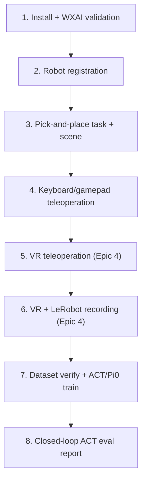

# Trossen Mobile AI — Simulation & VR Documentation

Repo index for the **Trossen Mobile AI** imitation-learning docs. Content is organized in **three lanes**:

| Lane | Purpose | Where |
|------|---------|--------|
| **Design** | What was built and why | [`epic3/`](epic3/README.md), [`epic4/`](epic4/README.md) design chapters, hubs, [ACT report](ACT_EVAL_REPORT_100K.md) |
| **One-time setup** | New workstation / re-image only | [`setup/`](setup/README.md) · [Isaac & envs](setup/isaac-and-environments.md) · [VR workstation](setup/vr-workstation.md) |
| **Day-to-day runbook** | Every session: operate sim / teleop / record / train / eval | [IL Workflow Runbook](IL_WORKFLOW_RUNBOOK.md) (§0–§7) |

| Doc | What it covers |
|-----|----------------|
| **This page** | Goals, timelines, page maps, environment, smoke checklist |
| **[Setup hub](setup/README.md)** | One-time Isaac + VR host setup |
| **[Epic 3 pages](epic3/README.md)** | Design: glossary, tasks/scene, teleop, recording, training, evaluation, findings |
| **[Epic 4 pages](epic4/README.md)** | Design: glossary, stack, VR teleop/recording, findings |
| **[IL Workflow Runbook](IL_WORKFLOW_RUNBOOK.md)** | **Runbook:** session → practice → collect → verify → train → eval |
| **[ACT Evaluation Report](ACT_EVAL_REPORT_100K.md)** | Closed-loop ACT 100k / 30-episode results |
| [Epic 3 hub](EPIC3_SIMULATION_TRAINING_PIPELINE.md) / [Epic 4 hub](EPIC4_VR_INTEGRATION.md) | **BookStack book intros** (short; full story in sections below) |

## Who this is for

New team members, stakeholders, and contributors who need to understand what was built, why, and how to run it — without prior Isaac Sim experience.

## Reading order

1. **This page** — goals, timelines, page maps (below)
2. **New machine?** [Setup hub](setup/README.md) first; **same machine?** skip to runbook
3. **[IL Workflow Runbook](IL_WORKFLOW_RUNBOOK.md)** — day-to-day ([§0](IL_WORKFLOW_RUNBOOK.md#0-prerequisites)–[§7](IL_WORKFLOW_RUNBOOK.md#7-evaluate-closed-loop))
4. Drill into [`epic3/`](epic3/README.md) / [`epic4/`](epic4/README.md) design chapters as needed
5. **[ACT Evaluation Report](ACT_EVAL_REPORT_100K.md)** — reporting metrics

---

## Epic 3 — Simulation Training Pipeline

**Goal:** Build a digital twin of the Trossen Mobile AI in Isaac Sim and an imitation-learning pipeline: record human demonstrations, train policies (ACT / Pi0), and evaluate closed-loop in simulation. Pi0 sim eval remains deferred.

**Overview:** The **Trossen Mobile AI** is a dual-arm mobile manipulator. This fork extends upstream Trossen Isaac Lab support with Mobile AI tasks, teleoperation, VR recording, and training/eval wrappers. This project’s reporting demos: [runbook project example reference](IL_WORKFLOW_RUNBOOK.md) (VR, `--record_arm right`). **Out of scope this semester:** physical sim-to-real deployment.

### Start here (Epic 3)

1. **[IL Workflow Runbook](IL_WORKFLOW_RUNBOOK.md)** — day-to-day runbook ([§0](IL_WORKFLOW_RUNBOOK.md#0-prerequisites)–[§7](IL_WORKFLOW_RUNBOOK.md#7-evaluate-closed-loop)); new machine: [setup](setup/README.md) first
2. **[Tasks and scene](epic3/02-tasks-and-scene.md)** — what was built in Isaac Lab (design)
3. **[Recording (LeRobot)](epic3/04-recording-lerobot.md)** — how demos become a v3 dataset (design)
4. **[Training](epic3/05-training.md)** / **[Evaluation](epic3/06-evaluation.md)** — policies and metrics (design)
5. **[ACT Evaluation Report](ACT_EVAL_REPORT_100K.md)** — reporting results
6. **[Epic 4](#epic-4-vr-integration)** (below) — Quest / ALVR design + VR one-time setup page

### Development timeline (project)

Steps **1–4** and **7–8** are Epic 3; steps **5–6** are Epic 4. Step **6** is the reporting VR right-arm dataset. Keyboard/gamepad **teleop** is step 4; keyboard recording was not a delivered milestone.

| Step | Delivered | Where |
|------|-----------|--------|
| 1–2 | Install, Mobile AI registration | [Tasks and scene](epic3/02-tasks-and-scene.md) |
| 3 | Pick-and-place + scene | [Tasks and scene](epic3/02-tasks-and-scene.md) |
| 4 | Keyboard/gamepad teleop | [Teleoperation](epic3/03-teleoperation.md) (design), [§4](IL_WORKFLOW_RUNBOOK.md#4-collect-demos-keyboard-gamepad-alternate) |
| 5–6 | VR teleop + VR recording (reporting path) | [Epic 4](#epic-4-vr-integration), [§1 Session](IL_WORKFLOW_RUNBOOK.md#1-vr-session-startup-every-time), [§2 Practice](IL_WORKFLOW_RUNBOOK.md#2-practice-vr-teleop-no-dataset), [§3 Collect](IL_WORKFLOW_RUNBOOK.md#3-collect-demos-vr) |
| 7 | Verify + ACT/Pi0 train | [§5](IL_WORKFLOW_RUNBOOK.md#5-verify-dataset) · [§6](IL_WORKFLOW_RUNBOOK.md#6-train), [Training](epic3/05-training.md) |
| 8 | ACT closed-loop report | [§7](IL_WORKFLOW_RUNBOOK.md#7-evaluate-closed-loop), [ACT report](ACT_EVAL_REPORT_100K.md) |

### Epic 3 chapters

| Page | Contents |
|------|----------|
| [Glossary](epic3/01-glossary.md) | Abbreviations and terms (incl. policy sidecar) |
| [Tasks and scene](epic3/02-tasks-and-scene.md) | Registration, Reach/Record configs, scene (install how-to → [setup](setup/isaac-and-environments.md)) |
| [Teleoperation](epic3/03-teleoperation.md) | Keyboard/gamepad control model and keys; VR summary |
| [Recording (LeRobot)](epic3/04-recording-lerobot.md) | Pipeline, action labels, Dataset v3.0 on disk |
| [Training](epic3/05-training.md) | ACT / Pi0 jobs and hyperparameters |
| [Evaluation](epic3/06-evaluation.md) | How eval works, success criteria, metrics |
| [Findings and troubleshooting](epic3/07-findings-troubleshooting.md) | Issues addressed, limitations, and fixes |
| [Future work](epic3/08-future-work.md) | Planned follow-ups |

---

## Epic 4 — VR Integration

**Goal:** Connect VR headsets to Isaac Sim for in-simulation teleoperation — safe demonstration practice and synthetic data collection without physical hardware risk.

**Overview:** VR teleoperation lets an operator wear a **Meta Quest 3**, view the simulation in stereo, and control the robot arms with **hand tracking** (no keyboard, gamepad, or physical leader arms for the operator).

[Epic 3](#epic-3-simulation-training-pipeline) established the Mobile AI digital twin, keyboard/gamepad teleoperation, and the LeRobot recording pipeline. Epic 4 adds Quest 3 hand-tracking teleoperation and was the **production path for demonstration collection**. VR can drive both arms at once; keyboard/gamepad ([Teleoperation](epic3/03-teleoperation.md)) controls one arm at a time (TAB or Y to switch).

This project’s **reporting train set** was collected with VR (`--record_arm right`) — see [runbook project example reference](IL_WORKFLOW_RUNBOOK.md). Episodes feed the LeRobot pipeline in [Recording (LeRobot)](epic3/04-recording-lerobot.md). Keyboard/gamepad recording remains available for smoke tests only.

**Current scope (design):** [VR teleoperation](epic4/03-vr-teleoperation.md) · [VR recording](epic4/04-vr-recording.md). **One-time VR host:** [setup/vr-workstation](setup/vr-workstation.md) (not an Epic 4 design chapter).

**Prerequisites:** [Glossary](epic3/01-glossary.md) · [Tasks and scene](epic3/02-tasks-and-scene.md) · [Teleoperation](epic3/03-teleoperation.md)

### Start here (Epic 4)

1. **New machine?** [Setup hub](setup/README.md) → [VR workstation one-time setup](setup/vr-workstation.md)
2. **Every session:** [§1 VR session startup](IL_WORKFLOW_RUNBOOK.md#1-vr-session-startup-every-time)
3. **[§2 Practice VR teleop](IL_WORKFLOW_RUNBOOK.md#2-practice-vr-teleop-no-dataset)** — try hands before collecting
4. **[§3 Collect VR](IL_WORKFLOW_RUNBOOK.md#3-collect-demos-vr)** — demos + merge (single- or multi-session)
5. **[VR teleoperation](epic4/03-vr-teleoperation.md)** / **[VR recording](epic4/04-vr-recording.md)** — design detail
6. **[§6 Train](IL_WORKFLOW_RUNBOOK.md#6-train)** / **[§7 Evaluate](IL_WORKFLOW_RUNBOOK.md#7-evaluate-closed-loop)** — after demos exist

### Development timeline (VR)

```mermaid
flowchart TD
  S1["1. One-time VR workstation setup"]
  S2["2. Mobile AI dual-arm VR teleoperation"]
  S3["3. Modular VR library refactor"]
  S4["4. VR + LeRobot recording"]

  S1 --> S2 --> S3 --> S4
```

| Step | Delivered | Where |
|------|-----------|--------|
| 1 | ALVR, SteamVR, OpenXR workstation setup | [VR workstation one-time setup](setup/vr-workstation.md#one-time-setup) |
| 2 | Mobile AI dual-arm hand tracking | [VR teleoperation](epic4/03-vr-teleoperation.md) |
| 3 | VR library under `teleop/vr/` | [VR teleoperation](epic4/03-vr-teleoperation.md#repository-and-module-structure) |
| 4 | VR + LeRobot recording (reporting path) | [§3 Collect](IL_WORKFLOW_RUNBOOK.md#3-collect-demos-vr), [VR recording](epic4/04-vr-recording.md) |

### Epic 4 chapters

| Page | Contents |
|------|----------|
| [Glossary](epic4/01-glossary.md) | VR abbreviations and terms |
| [Background and stack](epic4/02-background-and-stack.md) | Epic 3 integration + VR stack (why each hop) |
| [VR teleoperation](epic4/03-vr-teleoperation.md) | Module, wiring, keys, CLI (design) |
| [VR recording](epic4/04-vr-recording.md) | Dataset modes, shards, smoothing (design) |
| [Findings and troubleshooting](epic4/05-findings-troubleshooting.md) | Issues addressed, limitations, debug order, VR/ALVR fixes |
| [Future work](epic4/06-future-work.md) | Follow-ups |

---

## Related docs in this repo

| Doc | Purpose |
|-----|---------|
| [Repository README](../README.md) | Clone/setup onboarding, repo map, upstream demos + IL overview |

**Branch:** `main` (all Mobile AI IL and VR work lives here)

Upstream baseline: [Trossen AI Isaac tutorial](https://docs.trossenrobotics.com/trossen_arm/main/tutorials/trossen_ai_isaac.html)

## Environment

| Component | Version / location (examples — adjust to your machine) |
|-----------|-------------------|
| OS | Ubuntu 22.04 |
| Isaac Sim | 5.1.0 (`~/isaacsim/`) |
| Isaac Lab | 2.3.0 (`~/IsaacLab/`) |
| Extension | `trossen_ai_isaac` (`~/trossen_ai_isaac/`) |
| LeRobot (recording verify) | `~/lerobot_trossen/.venv` |
| LeRobot (training / policy sidecar) | `lerobot_train` conda env |
| VR headset | Meta Quest 3 |
| VR stack | ALVR + SteamVR (OpenXR runtime) |

**What runs where**

| Tooling | Used for |
|---------|----------|
| `~/IsaacLab/isaaclab.sh` (Isaac Sim Python 3.11) | Teleop, recording, closed-loop eval host, list_envs |
| `~/lerobot_trossen/.venv` | `verify_dataset.py` |
| `lerobot_train` conda (Python 3.12) | `lerobot-train`, policy sidecar during eval |

**Mobile AI task names:** Gym IDs still contain **Reach** / **Lift** from early development; the intended task is **pick and place** (table + cube). Details: [Tasks and scene](epic3/02-tasks-and-scene.md#custom-reach-task-environment).

**Reporting dataset:** see [runbook project example reference](IL_WORKFLOW_RUNBOOK.md) (VR, `--record_arm right`).

## Quick verification checklist

> Paths like `~/trossen_ai_isaac` are **examples** — use your machine’s locations. New machine? [Setup hub](setup/README.md) first.

- [ ] One-time Isaac/Lab — [setup/isaac-and-environments](setup/isaac-and-environments.md)
- [ ] One-time VR host — [setup/vr-workstation](setup/vr-workstation.md) (skip if already done)
- [ ] Prerequisites / env list — [§0](IL_WORKFLOW_RUNBOOK.md#0-prerequisites)
- [ ] Keyboard teleop smoke — [§4](IL_WORKFLOW_RUNBOOK.md#4-collect-demos-keyboard-gamepad-alternate)
- [ ] VR session + practice — [§1](IL_WORKFLOW_RUNBOOK.md#1-vr-session-startup-every-time) → [§2](IL_WORKFLOW_RUNBOOK.md#2-practice-vr-teleop-no-dataset)
- [ ] VR collect — [§3](IL_WORKFLOW_RUNBOOK.md#3-collect-demos-vr)

## Continue reading

- [Setup hub](setup/README.md) (new machine)
- [§1 VR session](IL_WORKFLOW_RUNBOOK.md#1-vr-session-startup-every-time) → [§2 Practice](IL_WORKFLOW_RUNBOOK.md#2-practice-vr-teleop-no-dataset) → [§3 Collect](IL_WORKFLOW_RUNBOOK.md#3-collect-demos-vr)
- [§6 Train](IL_WORKFLOW_RUNBOOK.md#6-train) / [§7 Evaluate](IL_WORKFLOW_RUNBOOK.md#7-evaluate-closed-loop)
- [ACT Evaluation Report](ACT_EVAL_REPORT_100K.md)
