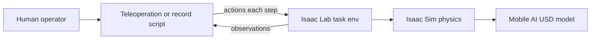
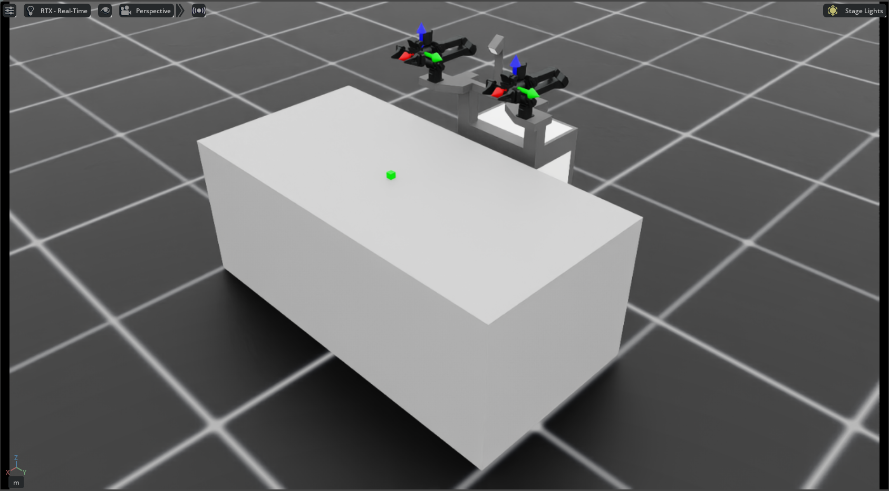
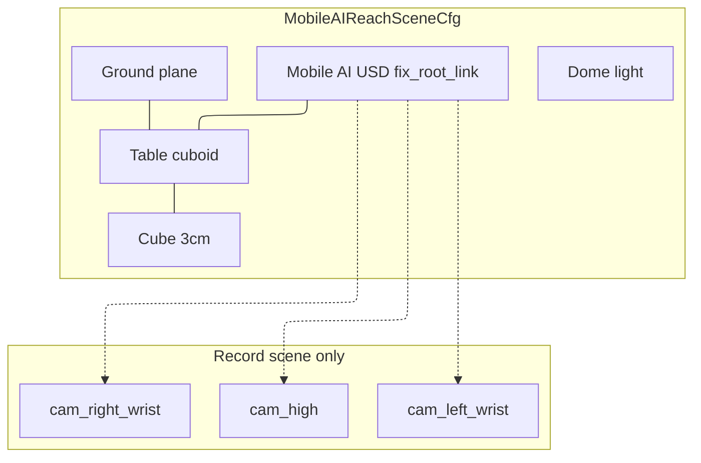

# Tasks and Scene

Install validation, Mobile AI registration, pick-and-place task configs, and simulation scene.

## System architecture




At a high level the loop is: a **human** drives a **teleop or recording script**; each step the script sends **actions** into an **Isaac Lab task environment**, which advances **Isaac Sim** physics on the **Mobile AI USD**. The task returns **observations** (joints, cameras, …) to the script for the next step. Recording adds a writer that stores those observations and joint targets as a LeRobot dataset; evaluation swaps the human for a **policy sidecar** but keeps the same task → sim → robot path.


## Installation and Initial Validation

**First-time install (procedural):** [Isaac Sim, Lab, and environments](../setup/isaac-and-environments.md) · [setup hub](../setup/README.md). Day-to-day checks: [runbook §0](../IL_WORKFLOW_RUNBOOK.md#0-prerequisites).

The team followed the [Trossen AI Isaac installation guide](https://docs.trossenrobotics.com/trossen_arm/main/tutorials/trossen_ai_isaac.html), then forked upstream for Mobile AI work:

| Repository | Role |
|------------|------|
| [TrossenRobotics/trossen_ai_isaac](https://github.com/TrossenRobotics/trossen_ai_isaac) | Upstream (reference and baseline) |
| [trossenmobileai/trossen_ai_isaac](https://github.com/trossenmobileai/trossen_ai_isaac) | Project fork (all Mobile AI extensions) |

**Environment versions:** see [docs index — Environment](../README.md#environment).

After the extension is installed editable, these Mobile AI gym IDs should appear (full install steps in [setup](../setup/isaac-and-environments.md)):

- `Isaac-Reach-MobileAI-IK-Abs-Play-v0`
- `Isaac-Reach-MobileAI-Record-Play-v0`
- `Isaac-Lift-Cube-MobileAI-Joint-Pos-Play-v0` (closed-loop eval)

**Upstream validation:** before Mobile AI customization, stock WXAI bringup (`robot_bringup.py wxai_base`) confirmed Isaac Sim / Lab / extension install. Mobile AI builds on that baseline.

## Mobile AI Robot Registration

#### Why registration is required

Isaac Lab tasks do not load a USD file by path alone. A robot must be registered through an **articulation configuration** (`ArticulationCfg`) that tells Isaac Lab how to spawn the model, which joints to control, and how actuators behave. Upstream already provides this for WXAI in `tasks/.../assets/wxai.py` (`WXAI_CFG`, `WXAI_HIGH_PD_CFG`) and wires those configs into registered WXAI tasks.

The fork **already includes** `assets/robots/mobile_ai/mobile_ai.usd` from upstream. The USD file is shipped with the original repository. Standalone demos (e.g. `robot_bringup.py mobile_ai`) can load the asset without extra registration.

However, **no Mobile AI Isaac Lab articulation config or gym tasks exist in upstream**. To run Mobile AI inside Isaac Lab task environments (teleoperation, recording, data collection, training), the team studied the WXAI registration pattern and added the equivalent for Mobile AI.

#### What was added

- **`mobile_ai.usd`**: Robot 3D model. Include link hierarchy, mimic grippers, and joint drives live in USD.
	- Path: `assets/robots/mobile_ai/mobile_ai.usd`
- **`mobile_ai.py`**: Isaac Lab articulation registration for Mobile AI. Exports `MOBILE_AI_CFG` (base physics) and `MOBILE_AI_HIGH_PD_CFG` (IK teleoperation), modeled after `wxai.py`.
	- Path: `source/trossen_ai_isaac/trossen_ai_isaac/tasks/manager_based/manipulation/assets/mobile_ai.py`
- **`assets/__init__.py`**: Re-exports Mobile AI configs alongside WXAI so task environments can import them from the assets package.
	- Path: `source/trossen_ai_isaac/trossen_ai_isaac/tasks/manager_based/manipulation/assets/__init__.py`

**`mobile_ai.py`** (essential structure):

```python
MOBILE_AI_CFG = ArticulationCfg(
    spawn=sim_utils.UsdFileCfg(
        usd_path=os.path.join(_ASSETS_ROOT, "mobile_ai", "mobile_ai.usd"),
        # ...
    ),
    init_state=ArticulationCfg.InitialStateCfg(joint_pos={...}),  # both follower arms at zero
    actuators={
        "left_arm": ImplicitActuatorCfg(joint_names_expr=["follower_left_joint_[0-5]"], stiffness=None, damping=None),
# ... see linked source file
```

- **`MOBILE_AI_CFG`:** Spawns `mobile_ai.usd`, sets initial joint poses, and groups actuators for both arms, grippers, and base wheels. Stiffness/damping are left `None` so values from the USD file are used.
- **`MOBILE_AI_HIGH_PD_CFG`:** Copy used by Reach tasks: gravity disabled and high PD on arm joints for stable IK teleoperation (same pattern as `WXAI_HIGH_PD_CFG`).

**`assets/__init__.py`** (one-line addition next to the existing WXAI import):

```python
from .wxai import *
from .mobile_ai import *
```

Task configs (e.g. [`reach_env_cfg.py`](#reach_env_cfgpy-scene-and-mdp-base)) then import `MOBILE_AI_HIGH_PD_CFG` the same way WXAI tasks import `WXAI_HIGH_PD_CFG`.

The Mobile AI has **26 degrees of freedom** (base wheels and dual follower arms). IL work focuses on the **14 follower arm joints** (7 per arm: 6 arm joints and 1 gripper joint).

> **Design note:** `MOBILE_AI_HIGH_PD_CFG` uses high proportional-derivative (PD) gains and disables gravity on arm links. The same IK-control pattern used for `WXAI_HIGH_PD_CFG`. The Reach scene applies `fix_root_link=True` when spawning the robot ([`reach_env_cfg.py`](#reach_env_cfgpy-scene-and-mdp-base)) so the base does not slide or tip during teleoperation.

## Custom Reach Task Environment

#### Why a custom task is required

Upstream provides complete Isaac Lab task packages for WXAI under `tasks/manager_based/manipulation/wxai/` (Reach, Lift, and Cabinet), each with scene configs, action/observation definitions, and gym registration in `config/__init__.py`. These tasks launch by name and work with `teleop_se3_agent.py`.

**Upstream WXAI** already ships Reach / Lift / Cabinet gym tasks under `tasks/.../wxai/`. **No equivalent package exists for Mobile AI in upstream.** The fork therefore adds environments under `tasks/manager_based/manipulation/mobile_ai/reach/` (and a joint-position play env under `.../lift/` for policy eval), following Isaac Lab’s WXAI package layout but adapted for dual-arm control, IL-oriented observations, and recording.

> **Naming note (Reach / Lift vs pick-and-place):** During development the Mobile AI environments were registered under Isaac Lab–style **Reach** and **Lift** names. They are not classic reach-to-target or lift-only RL tasks. All three production IDs are variants of the same **pick-and-place** scene (table + cube: pick, lift, place back):
>
> | Role | Gym ID (unchanged) |
> |------|--------------------|
> | Teleop | `Isaac-Reach-MobileAI-IK-Abs-Play-v0` |
> | LeRobot recording | `Isaac-Reach-MobileAI-Record-Play-v0` |
> | Closed-loop policy eval | `Isaac-Lift-Cube-MobileAI-Joint-Pos-Play-v0` |
>
> The gym IDs and Python module paths (`reach/`, `lift/`) were left as-is to avoid breaking scripts and docs already using them. When this report says “Reach task” for Mobile AI, it means the pick-and-place teleop/record environments above.

#### Reach task package

The reach package is a small set of config files. **[`reach_env_cfg.py`](#reach_env_cfgpy-scene-and-mdp-base)** is the base. It defines the digital twin scene and the dual-arm MDP skeleton that teleoperation and recording inherit from. Registered gym tasks point at specialized subclasses rather than at this file directly.

- **`reach_env_cfg.py`**: Base environment (scene, MDP terms, reset randomization, simulation timing, and teleoperation device defaults). [Details](#reach_env_cfgpy-scene-and-mdp-base)
	- Path: `source/trossen_ai_isaac/trossen_ai_isaac/tasks/manager_based/manipulation/mobile_ai/reach/reach_env_cfg.py`
- **`ik_abs_env_cfg.py`**: Absolute IK teleoperation (16D action layout and binary grippers). Registers `Isaac-Reach-MobileAI-IK-Abs-Play-v0`. [Details](#ik_abs_env_cfgpy-absolute-ik-teleoperation)
	- Path: `source/trossen_ai_isaac/trossen_ai_isaac/tasks/manager_based/manipulation/mobile_ai/reach/ik_abs_env_cfg.py`
- **`record_env_cfg.py`**: IL recording (cameras, 14D joint observations, and 60 Hz stepping). Registers `Isaac-Reach-MobileAI-Record-Play-v0`. [Details](#record_env_cfgpy-il-recording)
	- Path: `source/trossen_ai_isaac/trossen_ai_isaac/tasks/manager_based/manipulation/mobile_ai/reach/record_env_cfg.py`
- **`config/__init__.py`**: Gymnasium registration; Maps task IDs to the config entry points above.
	- Path: `source/trossen_ai_isaac/trossen_ai_isaac/tasks/manager_based/manipulation/mobile_ai/reach/config/__init__.py`

#### reach_env_cfg.py: scene and MDP base

Scene assets, table/cube setup, and reset randomization are described in [Simulation Scene](#simulation-scene). This subsection summarizes the MDP wiring.

This file turns [`MOBILE_AI_HIGH_PD_CFG`](#mobile-ai-robot-registration) into a runnable Isaac Lab `ManagerBasedRLEnv`. The file groups the environment into `@configclass` blocks that Isaac Lab assembles at launch:

- **`MobileAIReachSceneCfg`**: Digital twin scene (ground, light, table, cube, robot) — details in [Simulation Scene](#simulation-scene).
- **`CommandsCfg`**: Random end-effector pose targets for both arms (`follower_left_link_6`, `follower_right_link_6`). These feed reach-task observations; the [recording variant](#record_env_cfgpy-il-recording) disables them.
- **`ActionsCfg`**: Dual-arm action slots. `MobileAIReachEnvCfg.__post_init__` wires a differential IK controller on each arm's six joints.
- **`ObservationsCfg`**: Policy observations: relative joint positions and velocities, generated pose commands, and last action.
- **`EventCfg`**: Reset behavior: restore robot joints, randomize cube XY position on the table, and pick a discrete red, green, or blue cube color.
- **`MobileAIReachEnvCfg`**: Top-level config that combines the above, sets 60 Hz simulation (`sim.dt = 1/60`, `decimation = 2`), and registers keyboard and gamepad teleoperation device defaults (`gripper_term=False`; grippers are handled by the [teleoperation script](03-teleoperation.md)).
- **`MobileAIReachEnvCfg_PLAY`**: Play/teleoperation base: single environment (`num_envs = 1`), observation noise off.

Essential scene and robot wiring:

*(Illustrative snippet omitted — see the source file path above.)*

#### ik_abs_env_cfg.py: absolute IK teleoperation

This file is **central to Epic 3 teleoperation**. The registered task `Isaac-Reach-MobileAI-IK-Abs-Play-v0` points at `MobileAIReachEnvCfg_IK_ABS_PLAY` defined here: the environment that [`teleop_dual_arm_switch.py`](../IL_WORKFLOW_RUNBOOK.md) launches. It inherits the scene and MDP skeleton from [`reach_env_cfg.py`](#reach_env_cfgpy-scene-and-mdp-base) and overrides the action layer for **absolute** inverse kinematics.

- **`MobileAIReachEnvCfg_IK_ABS`**: Flips both arm action terms from relative deltas (base config) to absolute pose commands (`use_relative_mode=False`). Each arm expects a 7D pose `[pos_xyz, quat_wxyz]` in the robot base frame. Adds binary gripper actions on both carriage joints, producing a **16D** environment action vector: `[L_pose(7), R_pose(7), L_grip(1), R_grip(1)]`.
- **`MobileAIReachEnvCfg_IK_ABS_PLAY`**: Play/teleoperation entry point: single environment, observation noise off. Registered as `Isaac-Reach-MobileAI-IK-Abs-Play-v0`.

The file also registers an OpenXR **`handtracking`** teleoperation device for VR. Keyboard and gamepad teleoperation ignore this; see [VR teleoperation](../epic4/03-vr-teleoperation.md).

Essential action wiring:

*(Illustrative snippet omitted — see the source file path above.)*

The teleoperation library ([`se3_switch.py`](03-teleoperation.md)) assembles the same 16D layout client-side for keyboard/gamepad: it integrates device deltas into per-arm IK targets and passes them to `env.step()`.

#### record_env_cfg.py: IL recording

This file defines the environment for [LeRobot dataset collection](04-recording-lerobot.md). The registered task `Isaac-Reach-MobileAI-Record-Play-v0` points at `MobileAIReachEnvCfg_RECORD_PLAY`, launched by [`record_dual_arm_vr.py`](../IL_WORKFLOW_RUNBOOK.md#3-collect-demos-vr) or [`record_dual_arm.py`](../IL_WORKFLOW_RUNBOOK.md#4-collect-demos-keyboard-gamepad-alternate). It inherits absolute IK and grippers from [`MobileAIReachEnvCfg_IK_ABS_PLAY`](#ik_abs_env_cfgpy-absolute-ik-teleoperation) and retargets observations and sensors for a [LeRobot Dataset v3.0](https://huggingface.co/docs/lerobot/en/lerobot-dataset-v3) feature schema.

- **`MobileAIRecordSceneCfg`**: Extends `MobileAIReachSceneCfg` with three RGB camera sensors (`cam_high`, `cam_left_wrist`, `cam_right_wrist`) at 480×640, bound to existing USD camera prims on the robot.
- **`RecordObservationsCfg`**: Replaces the reach-task policy observations with a single **14D absolute joint position** vector (7 joints per follower arm), matching the real-robot LeRobot layout. No pose commands or velocity noise.
- **`EmptyCommandsCfg`**: Disables random end-effector pose commands; IL demos do not use reach targets.
- **`MobileAIReachEnvCfg_RECORD_PLAY`**: Top-level recording config: inherits cube position/color randomization from `EventCfg`, sets `decimation = 1` for full 60 Hz stepping, and turns off IK debug visualization.

Essential recording overrides:

*(Illustrative snippet omitted — see the source file path above.)*

Commanded joint position targets captured at each step become the dataset `action` labels ([Recording (LeRobot)](04-recording-lerobot.md)); IK commands drive the robot during collection but are not stored directly.

**Registered tasks (fork):**

| Task ID | Config class | Launched by |
|---------|--------------|-------------|
| `Isaac-Reach-MobileAI-IK-Abs-Play-v0` | `MobileAIReachEnvCfg_IK_ABS_PLAY` | [`teleop_dual_arm_switch.py`](../IL_WORKFLOW_RUNBOOK.md), [`teleop_dual_arm_vr.py`](../epic4/03-vr-teleoperation.md) |
| `Isaac-Reach-MobileAI-Record-Play-v0` | `MobileAIReachEnvCfg_RECORD_PLAY` | [`record_dual_arm_vr.py`](../IL_WORKFLOW_RUNBOOK.md#3-collect-demos-vr), [`record_dual_arm.py`](../IL_WORKFLOW_RUNBOOK.md#4-collect-demos-keyboard-gamepad-alternate) |

(Closed-loop eval uses `Isaac-Lift-Cube-MobileAI-Joint-Pos-Play-v0` — same pick-and-place scene, joint-position actions; see [Evaluation](06-evaluation.md). Naming history: [Custom Reach Task](#custom-reach-task-environment).)

**IK-Rel to IK-Abs migration:** Early experiments used IK-Rel (12D relative pose deltas). Arm drift and control instability led to a switch to IK-Abs (16D). See [Arm Drift (Resolved)](07-findings-troubleshooting.md#arm-drift-resolved) for the full investigation and resolution.

> **Historical note:** Early Mobile AI work also experimented with separate Lift-named gym IDs and IK-Rel Reach variants. The production teleop/record path settled on the Reach-named IDs above; joint-position eval kept a Lift-named ID. Conceptually all are pick-and-place — see the [naming note](#custom-reach-task-environment).

## Simulation Scene

The pick-and-place digital twin is assembled in [`reach_env_cfg.py`](../../source/trossen_ai_isaac/trossen_ai_isaac/tasks/manager_based/manipulation/mobile_ai/reach/reach_env_cfg.py) as `MobileAIReachSceneCfg` plus reset `EventCfg`. Teleop, VR, recording, and closed-loop eval all reuse this scene (recording adds cameras; eval uses a joint-position lift variant of the same table and cube).

> **Screenshot placeholder:** `docs/assets/epic3/mobile-ai-pick-place-scene.png` — Isaac Sim view of Mobile AI, table, and cube (pick-and-place digital twin).
>
> 



#### Scene assets (`MobileAIReachSceneCfg`)

| Asset | How it is configured |
|-------|----------------------|
| **Ground** | Default Isaac Lab ground plane at `/World/ground`. |
| **Light** | Dome light (`color≈0.75`, intensity `2500`) for even illumination of RGB cameras. |
| **Table** | Grey cuboid `size=(0.99, 2.0, 0.807)` m with collision and rigid body props. Spawned at `(0.85, 0.0, 0.4035)` so the top sits in front of the Mobile AI base. Visual material is a dark grey preview surface. |
| **Cube** | Rigid cuboid `0.03×0.03×0.03` m, mass `0.1` kg, collision enabled. Initial pose sits on the table surface (`z≈0.822`). Default visual color is red; reset events override color (below). |
| **Robot** | `MOBILE_AI_HIGH_PD_CFG` with `fix_root_link=True` so the base stays anchored, `disable_gravity=True` on the articulation spawn (arms are position-controlled), self-collisions enabled, and higher PhysX solver iterations for stable contact. |

#### Reset randomization (`EventCfg`)

On every environment reset (including after **J** / episode save):

1. **Robot joints** restore to the default scaled pose (no random joint noise).
2. **Cube XY** is resampled on the table with `reset_root_state_uniform` ranges roughly `x∈[-0.10, 0.05]`, `y∈[-0.20, 0.0]` relative to the default cube pose (`z` fixed).
3. **Cube color** is chosen discretely from pure red, green, or blue via `randomize_cube_color_discrete` (stored on the env for eval metrics).

#### Simulation timing and physics

- Base reach config: `sim.dt = 1/60`, `decimation = 2` (control at 30 Hz).
- Record-Play: `decimation = 1` so demos are stored at **60 Hz**, matching closed-loop eval FPS.
- Anchored base + high PD gains keep teleop IK targets tracking without tipping the mobile base.

#### Recording cameras

[`record_env_cfg.py`](#record_env_cfgpy-il-recording) extends the same scene with `cam_high`, `cam_left_wrist`, and `cam_right_wrist` (480×640 RGB) bound to USD camera prims on the robot. Production demos used **right-arm** mode (`cam_high` + `cam_right_wrist` only).

Code-level overview of the same classes: [`reach_env_cfg.py`](#reach_env_cfgpy-scene-and-mdp-base).


---

## How to run

- First-time install: [setup — Isaac and environments](../setup/isaac-and-environments.md)
- Confirm envs: [runbook §0](../IL_WORKFLOW_RUNBOOK.md#0-prerequisites)
- Full day-to-day pipeline: [§0](../IL_WORKFLOW_RUNBOOK.md#0-prerequisites)–[§7](../IL_WORKFLOW_RUNBOOK.md#7-evaluate-closed-loop)

## Continue reading

- [One-time setup](../setup/README.md)
- [§0 Prerequisites](../IL_WORKFLOW_RUNBOOK.md#0-prerequisites)
- [Teleoperation](03-teleoperation.md)
- [Epic 3 hub](../EPIC3_SIMULATION_TRAINING_PIPELINE.md)
