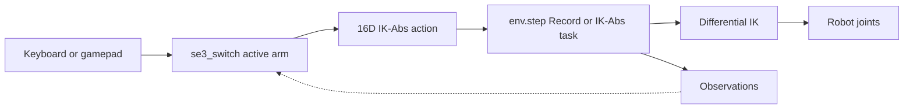

# Teleoperation

Dual-arm keyboard/gamepad teleoperation and VR summary.

## Keyboard / gamepad

#### Why a custom teleoperation script is required

Upstream provides [`teleop_se3_agent.py`](../../scripts/teleoperation/teleop_se3_agent.py) as the general teleoperation entrypoint for Isaac Lab tasks. WXAI tasks work with this script out of the box.

Mobile AI requires **dual-arm** control with **switchable** arm selection (one arm at a time for keyboard/gamepad recording). The upstream script targets single-arm tasks and does not implement arm switching or the [16D IK-Abs action layout](02-tasks-and-scene.md#ik_abs_env_cfgpy-absolute-ik-teleoperation). The team used `teleop_se3_agent.py` as the architectural base and added:

| Upstream (reference) | Fork (Mobile AI extension) |
|----------------------|----------------------------|
| [`teleop_se3_agent.py`](../../scripts/teleoperation/teleop_se3_agent.py) | [`teleop_dual_arm_switch.py`](../../scripts/teleoperation/teleop_dual_arm_switch.py) |
| Single-arm Se3 teleoperation | Switchable dual-arm IK-Abs teleoperation via [`se3_switch.py`](../../source/trossen_ai_isaac/trossen_ai_isaac/teleop/se3_switch.py) |

VR hand-tracking teleoperation extends this layer further; see [Epic 4](../EPIC4_VR_INTEGRATION.md) / [VR teleoperation](../epic4/04-vr-teleoperation.md).

#### Control model and loop

The operator moves one end-effector at a time; the task environment's differential IK solver ([`ik_abs_env_cfg.py`](02-tasks-and-scene.md#ik_abs_env_cfgpy-absolute-ik-teleoperation)) converts 16D pose and gripper commands into joint motion. [`teleop_dual_arm_switch.py`](../../scripts/teleoperation/teleop_dual_arm_switch.py) launches `Isaac-Reach-MobileAI-IK-Abs-Play-v0`, reads input each frame, builds the action tensor in [`se3_switch.py`](../../source/trossen_ai_isaac/trossen_ai_isaac/teleop/se3_switch.py), and calls `env.step(action)`.

Device motion deltas and gripper toggles are assembled into the **16D** layout (`L_pose(7)`, `R_pose(7)`, `L_grip`, `R_grip`); inactive-arm terms hold the last pose. The task’s differential IK turns those absolute EE targets into joint motion.

> **Screenshot placeholder:** `docs/assets/epic3/keyboard-teleop-viewport.png` — Isaac Sim viewport during keyboard/gamepad teleop.
>
> 

**Input devices:** keyboard or gamepad via `--teleop_device`. Motion deltas apply to the **active arm only** while teleoperation is active (`TeleopSession.teleoperation_active`, on by default). Bindings combine Isaac Lab `Se3Keyboard` / `Se3Gamepad` defaults with fork-specific callbacks in `se3_switch.py` (`gripper_term=False` in the env config; grippers are toggled via **K** / **A** instead). This project does not use SpaceMouse for Mobile AI teleoperation.

**Keyboard** (`--teleop_device keyboard`):

| Key / input | Category | Action |
|-------------|----------|--------|
| **W** / **S** | Motion (active arm) | Move end-effector along +X / −X (forward / backward) |
| **A** / **D** | Motion (active arm) | Move along +Y / −Y (left / right) |
| **Q** / **E** | Motion (active arm) | Move along +Z / −Z (up / down) |
| **Z** / **X** | Motion (active arm) | Rotate about X axis (+ / −) |
| **T** / **G** | Motion (active arm) | Rotate about Y axis (+ / −) |
| **C** / **V** | Motion (active arm) | Rotate about Z axis (+ / −) |
| **L** | Device reset | Clear accumulated position/rotation deltas (Isaac Lab default) |
| **TAB** | Dual-arm | Switch active arm (re-seeds IK target from current end-effector pose) |
| **K** | Gripper | Toggle open/close on the **active** arm |
| **J** | Environment | Reset environment (discards in-progress recording if any). Prefer **J** over **R** to avoid Isaac Kit shortcut conflicts (same as VR). |
| **N** | Recording only | Toggle episode recording: start, or save and reset ([`record_dual_arm.py`](../../scripts/imitation_learning/recording/record_dual_arm.py) only) |
| **M** | Recording only | Discard current episode buffer without saving |
| **START** / **STOP** / **RESET** | Session (XR) | Registered for OpenXR / env-config teleoperation devices; not bound to physical keys on the local `Se3Keyboard` fallback |

**Gamepad** (`--teleop_device gamepad`):

| Button / stick | Category | Action |
|----------------|----------|--------|
| **Left stick** up / down | Motion (active arm) | Move along +X / −X |
| **Left stick** left / right | Motion (active arm) | Move along +Y / −Y |
| **Right stick** up / down | Motion (active arm) | Move along +Z / −Z |
| **D-pad** right / left | Motion (active arm) | Rotate about X axis (+ / −) |
| **D-pad** down / up | Motion (active arm) | Rotate about Y axis (+ / −) |
| **Right stick** left / right | Motion (active arm) | Rotate about Z axis (+ / −) |
| **Y** (polled) | Dual-arm | Switch active arm |
| **A** (polled) | Gripper | Toggle open/close on the **active** arm |
| **B** (polled) | Environment | Reset environment (discards in-progress recording if any) |
| **X** (polled, recording only) | Recording | Toggle episode recording: start, or save and reset |

Episode discard on gamepad uses keyboard **M** only (no gamepad binding).

Tune motion sensitivity with `--sensitivity`. For gamepad, `--gamepad_dead_zone` filters stick noise. Step-by-step launch commands are in [cheat sheet](../IL_WORKFLOW_CHEATSHEET.md).

## VR teleoperation (summary)
After keyboard/gamepad teleop worked on the pick-and-place task, the team added **Quest 3 + ALVR + OpenXR** teleoperation so both arms can be driven by hand tracking. Implementation lives in [VR teleoperation](../epic4/04-vr-teleoperation.md) (`teleop_dual_arm_vr.py`, `source/.../teleop/vr/`).

Epic 3 keeps only this summary:

- Same task ID as keyboard teleop: `Isaac-Reach-MobileAI-IK-Abs-Play-v0` (16D IK-Abs actions).
- Default VR session is single-arm focus for demos; `--dual_arm` enables true bimanual control.
- **Workstation teleop keys:** **N** engage · **M** pause · **B** re-anchor · **J** reset · **TAB** switch arm (single-arm) — [VR teleoperation](../epic4/04-vr-teleoperation.md).
- **Workstation recording keys:** **U** engage · **I** pause · **N** episode · **M** discard · **B** re-anchor · **J** reset — [VR recording](../epic4/05-vr-recording.md).
- **Hands:** pinch = gripper. (Kit binds **R**, so reset is **J**.)

Full stack setup, CLI flags, and troubleshooting: [Epic 4 hub](../EPIC4_VR_INTEGRATION.md), [Workstation config](../epic4/03-workstation-config.md), [Findings](../epic4/06-findings-troubleshooting.md).

---

## How to run

- Keyboard/gamepad teleop: [IL Workflow Cheat Sheet](../IL_WORKFLOW_CHEATSHEET.md) (and Epic 3 hub).
- VR teleop / VR recording: [VR teleoperation](../epic4/04-vr-teleoperation.md), [VR recording](../epic4/05-vr-recording.md), and [cheat sheet — VR collect](../IL_WORKFLOW_CHEATSHEET.md#1-collect-demos--vr-production).

**Hub:** [Epic 3](../EPIC3_SIMULATION_TRAINING_PIPELINE.md) · **Cheat sheet:** [IL Workflow Cheat Sheet](../IL_WORKFLOW_CHEATSHEET.md)
