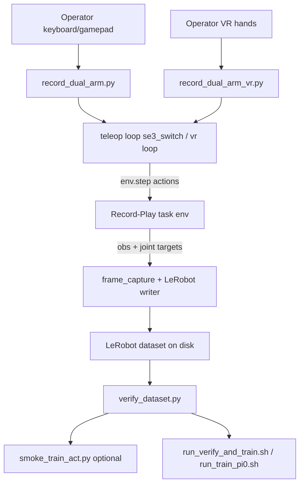
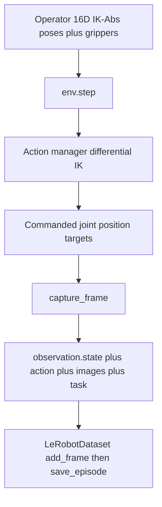

# Recording and LeRobot Dataset v3.0

Imitation-learning recording pipeline, action labels, and on-disk LeRobot Dataset v3.0 layout.

**End-to-end (VR production path):** Quest hand tracking → ALVR / SteamVR / OpenXR → Isaac Lab 16D IK-Abs → `env.step` → LeRobot writer → finalize → verify → train. Stack: [Background and stack](../epic4/02-background-and-stack.md). Operator collect: [§3](../IL_WORKFLOW_RUNBOOK.md#3-collect-demos-vr). Verify: [§5](../IL_WORKFLOW_RUNBOOK.md#5-verify-dataset).

## Recording pipeline
Teleoperation moves the robot; imitation learning requires saved episodes in a standard format. The pipeline builds on the [record task config](02-tasks-and-scene.md#record_env_cfgpy-il-recording).

**Reporting collection (this project):** VR, `--record_arm right` — see [runbook project example reference](../IL_WORKFLOW_RUNBOOK.md). Entrypoint: [`run_collect_dataset.sh`](../../scripts/imitation_learning/run_collect_dataset.sh) → [`record_dual_arm_vr.py`](../../scripts/imitation_learning/recording/record_dual_arm_vr.py). Keyboard/gamepad (`record_dual_arm.py`) is smoke tooling only.

Pipeline components:

1. The **Record task** (`Isaac-Reach-MobileAI-Record-Play-v0`). See [`record_env_cfg.py`](02-tasks-and-scene.md#record_env_cfgpy-il-recording).
2. **Recording entrypoints** — **VR (production)** [`record_dual_arm_vr.py`](../../scripts/imitation_learning/recording/record_dual_arm_vr.py) ([VR recording](../epic4/04-vr-recording.md)); **keyboard/gamepad (smoke / tooling only)** [`record_dual_arm.py`](../../scripts/imitation_learning/recording/record_dual_arm.py)
3. A **LeRobot dataset writer** under [`source/.../recording/`](../../source/trossen_ai_isaac/trossen_ai_isaac/recording/) that captures frames each simulation step
4. Offline **validation** ([`verify_dataset.py`](../../scripts/imitation_learning/validation/verify_dataset.py), [§5 Verify](../IL_WORKFLOW_RUNBOOK.md#5-verify-dataset)) — pass **your** `--root` / `--repo_id` (name and save location); this project’s reporting-set paths are only an example
5. **Training** — optional short smoke ([`smoke_train_act.py`](../../scripts/imitation_learning/training/smoke_train_act.py)) or full policy train via wrappers ([Training](05-training.md), [§6 Train](../IL_WORKFLOW_RUNBOOK.md#6-train)). Any LeRobot Dataset v3.0–compatible policy can train on the demos; **in-repo wrappers today are ACT and Pi0** — other policies need a new wrapper (or a direct `lerobot-train` call).

`smoke_train_act.py` only checks that the dataset feeds the trainer for a few iterations. Production training uses [`run_verify_and_train.sh`](../../scripts/imitation_learning/run_verify_and_train.sh) (ACT) or [`run_train_pi0.sh`](../../scripts/imitation_learning/run_train_pi0.sh) (Pi0), which call `lerobot-train` in the `lerobot_train` conda env — open each script and edit settings near the top for your run.

**Dataset schema** (default `--record_arm both`):

| Field | Shape | Description |
|-------|-------|-------------|
| `observation.state` | 14D float32 | Follower arm joint positions (7 per arm) |
| `action` | 14D float32 | Commanded joint position targets (7 per arm) |
| `observation.images.cam_high` | 480×640 RGB video | Overhead camera |
| `observation.images.cam_left_wrist` | 480×640 RGB video | Left wrist camera |
| `observation.images.cam_right_wrist` | 480×640 RGB video | Right wrist camera |

**Reporting schema** (`--record_arm right` — this project’s train set):

| Field | Shape | Description |
|-------|-------|-------------|
| `observation.state` | 7D float32 | Right arm joint positions (`right_joint_0..6`) |
| `action` | 7D float32 | Commanded right-arm joint targets |
| `observation.images.cam_high` | 480×640 RGB video | Overhead camera |
| `observation.images.cam_right_wrist` | 480×640 RGB video | Right wrist camera |

Left-arm mode mirrors right (`left_joint_*` + `cam_left_wrist`). Mode ↔ cameras/dims: [VR recording](../epic4/04-vr-recording.md#one-arm-vs-two-arm-record_arm). Training: [Training](05-training.md).

> **Design note:** Actions are stored as **commanded joint position targets**, not IK pose commands. During teleoperation the operator drives 16D IK-Abs actions; the recorder captures the resulting joint targets that the action manager applies (projected to the joints selected by `--record_arm`). This matches the [LeRobot Dataset v3.0](https://huggingface.co/docs/lerobot/en/lerobot-dataset-v3) layout (`observation.state` / `action` / `observation.images.*` / `task`).

#### LeRobot Dataset v3.0 on disk

Recording writes a self-describing [LeRobot Dataset v3.0](https://huggingface.co/docs/lerobot/en/lerobot-dataset-v3) tree via [`LeRobotRecorder`](../../source/trossen_ai_isaac/trossen_ai_isaac/recording/lerobot_recorder.py) / [`capture_frame`](../../source/trossen_ai_isaac/trossen_ai_isaac/recording/frame_capture.py):

1. **`LeRobotDataset.create`** — opens the dataset root with the feature schema (joint dims + cameras for `--record_arm`), fps, and `robot_type`.
2. **Per simulation step** — after `env.step`, `capture_frame` builds one frame dict; `add_frame` buffers it.
3. **Episode save** — workstation **N** (or equivalent) calls `save_episode`, flushing the buffer into parquet + video chunks. This can take several seconds; wait for `[RECORD] Saved episode (N frames) -> ...` in the terminal before starting the next episode ([§1.10](../IL_WORKFLOW_RUNBOOK.md#110-engage-teleop-recording-with-the-workstation-operator), [VR recording](../epic4/04-vr-recording.md)).
4. **Finalize** — on exit / interrupt, `finalize()` writes metadata so the dataset is readable by LeRobot trainers.
5. **VR multi-session** — shards under `.../shards/session_*` are combined with [`run_merge_dataset.sh`](../../scripts/imitation_learning/run_merge_dataset.sh) (`aggregate_datasets`) into one valid v3 dataset.

Typical on-disk layout (see HF docs for the full v3 contract):

| Path | Role |
|------|------|
| `meta/info.json` | Dataset metadata: features, fps, `robot_type`, total episodes/frames |
| `meta/episodes.*` | Per-episode index / lengths |
| `data/` | Parquet tables of non-video frame fields (`observation.state`, `action`, `task`, …) |
| `videos/` | MP4 (or equivalent) streams per `observation.images.*` camera feature |

The reporting set (`mobile_ai_right_pick_place_20260714_v2`) is this v3 format with **7D** right-arm state/action and cameras `cam_high` + `cam_right_wrist` (~50 episodes / ~30.5k frames @ 60 FPS — [runbook project example reference](../IL_WORKFLOW_RUNBOOK.md)).

### Recording controls

While recording, teleop motion/gripper keys still apply; the bindings below are the episode / session controls.

**Keyboard** (`record_dual_arm.py`, `--teleop_device keyboard`):

| Key | Action |
|-----|--------|
| **N** | Toggle episode: start, or save and reset |
| **M** | Discard current episode buffer |
| **J** | Reset environment (discards in-progress episode) |
| **TAB** / **K** | Switch active arm / toggle gripper (same as teleop) |

Motion keys: full table in [Teleoperation](03-teleoperation.md).

**Gamepad** (`--teleop_device gamepad`):

| Button | Action |
|--------|--------|
| **X** | Toggle episode: start, or save and reset |
| **B** | Reset environment |
| **Y** / **A** | Switch arm / toggle gripper |
| Keyboard **M** | Discard episode (no gamepad discard binding) |

**VR** (`record_dual_arm_vr.py`): workstation **U** / **I** / **N** / **M** / **B** / **J** (+ pinch grippers). Full table: [VR recording](../epic4/04-vr-recording.md). After **N** (save), wait for `[RECORD] Saved episode (...)` before the next take.

Quick reference for all devices: [IL runbook — Controls](../IL_WORKFLOW_RUNBOOK.md#controls-quick-reference).

**LeRobot dependency:** LeRobot is not bundled in Isaac Sim Python. It is installed separately for recording (`lerobot==0.4.4` in Isaac Sim Python 3.11), dataset verification (`~/lerobot_trossen/.venv`), and training (`lerobot_train` conda environment). Why three toolchains (and classic interpreter mistakes): [Findings — Three Python environments](07-findings-troubleshooting.md#three-python-environments).

## Repository map
Runnable **scripts** live under `scripts/`; reusable **library code** lives in the installed `trossen_ai_isaac` package. All Mobile AI IL and VR integration work for this project lives on **`main`**.

| Location | Role | How to run |
|----------|------|------------|
| `scripts/teleoperation/` | Teleoperation entrypoints | `~/IsaacLab/isaaclab.sh -p scripts/teleoperation/...` |
| `scripts/imitation_learning/` | Recording, validation, training smoke | `isaaclab.sh -p` or plain Python |
| `scripts/demos/` | Standalone Isaac Sim demos | `~/isaacsim/python.sh scripts/demos/...` |
| `source/.../teleop/` | Teleoperation library | Imported by scripts |
| `source/.../recording/` | LeRobot writer, frame capture | Imported by IL scripts |
| `source/.../evaluation/` | Policy rollout, LeRobot sidecar (ACT / Pi0) | Imported by `play_act.py` |
| `source/.../tasks/.../mobile_ai/` | Task environment configs | Registered as gym tasks |

---

## How to run

- Production VR collect / merge: [§3](../IL_WORKFLOW_RUNBOOK.md#3-collect-demos-vr)
- Keyboard smoke recording: [§4](../IL_WORKFLOW_RUNBOOK.md#4-collect-demos-keyboard-gamepad-alternate)
- Design / XR stack: [VR recording](../epic4/04-vr-recording.md)

## Continue reading

- [§3 Collect VR](../IL_WORKFLOW_RUNBOOK.md#3-collect-demos-vr) · [§5 Verify](../IL_WORKFLOW_RUNBOOK.md#5-verify-dataset) · [§6 Train](../IL_WORKFLOW_RUNBOOK.md#6-train)
- [Training](05-training.md)
- [Epic 3 design index](README.md)
