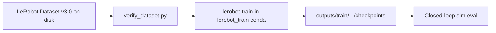

# Training (ACT and Pi0)

After demonstrations are recorded and verified, the same [LeRobot Dataset v3.0](https://huggingface.co/docs/lerobot/en/lerobot-dataset-v3) can train more than one policy type. This project trained **ACT** (twice) and **Pi0** (once) on the **VR-collected** right-arm pick-and-place set (`mobile_ai_right_pick_place_20260714_v2`), then evaluated the longer ACT run in simulation.

Isaac Sim is **not** involved during training — only when evaluating a checkpoint ([Evaluation](06-evaluation.md)).

**What a newcomer should know**

1. Recording writes a [LeRobot Dataset v3.0](https://huggingface.co/docs/lerobot/en/lerobot-dataset-v3) (parquet frames + MP4 cameras). That format is the common input for LeRobot trainers.
2. **ACT** is a compact transformer that maps camera images + joint state → a chunk of joint actions. It trains from scratch on the demo set.
3. **Pi0** is a larger pretrained policy (`lerobot/pi0_base`) fine-tuned on the same demos. It also expects LeRobot features, so no dataset conversion is required.
4. Training runs in the external `lerobot_train` conda env (Python 3.12 / CUDA). Isaac Sim is not involved until evaluation.
5. Checkpoints land under `~/trossen_ai_isaac/outputs/train/<job_name>/checkpoints/`. Evaluation uses the `last` (or a numbered) `pretrained_model` folder.

**Shared dataset (all three runs)**

| Field | Value |
|-------|--------|
| `repo_id` | `trossen-admin/mobile_ai_right_pick_place_20260714_v2` |
| `root` | `~/lerobot_trossen/datasets/mobile_ai_right_pick_place_20260714_v2` |
| Collection | **VR**, `--record_arm right` ([`run_collect_dataset.sh`](../../scripts/imitation_learning/run_collect_dataset.sh)); see [Recording](04-recording-lerobot.md) |
| Layout | 7D right-arm `observation.state` / `action`; cameras `cam_high` + `cam_right_wrist` (480×640) |
| `video_backend` | `pyav` |
| Image transforms | Disabled during these runs |

**Artifacts produced**

| Job | Policy | Steps | Output directory | Role |
|-----|--------|-------|------------------|------|
| `act_mobile_ai_right_v2` | ACT | 10 000 | `~/trossen_ai_isaac/outputs/train/act_mobile_ai_right_v2` | Intermediate / smoke train (not used for the reporting eval) |
| `act_mobile_ai_right_v2_100k` | ACT | 100 000 | `~/trossen_ai_isaac/outputs/train/act_mobile_ai_right_v2_100k` | **Reporting model** — 30-episode closed-loop eval |
| `pi0_mobile_ai_right_v2` | Pi0 | 10 000 | `~/trossen_ai_isaac/outputs/train/pi0_mobile_ai_right_v2` | Fine-tuned Pi0; sim eval deferred ([Evaluation](06-evaluation.md)) |

**How the runs were launched**

- **ACT 10k:** [`run_verify_and_train.sh`](../../scripts/imitation_learning/run_verify_and_train.sh) (verify dataset, then `lerobot-train` with `--policy.type=act`, `--steps=10000`, `--save_freq=1000`).
- **ACT 100k:** Same ACT recipe and dataset as the 10k run, with `--steps=100000`, `--job_name=act_mobile_ai_right_v2_100k`, a separate `--output_dir`, and `--save_freq=10000`. There is no separate wrapper script in-repo; the command is the 10k train line with those flags changed ([cheat sheet — train](../IL_WORKFLOW_CHEATSHEET.md#4-train)).
- **Pi0 10k:** [`run_train_pi0.sh`](../../scripts/imitation_learning/run_train_pi0.sh) after [`run_verify_pi0_dataset.sh`](../../scripts/imitation_learning/run_verify_pi0_dataset.sh) ([cheat sheet — train](../IL_WORKFLOW_CHEATSHEET.md#4-train)).

**ACT hyperparameters** (identical for the 10k and 100k jobs except `steps` and `save_freq`)

| Setting | Value |
|---------|--------|
| `batch_size` | 8 |
| `num_workers` | 4 |
| `seed` | 1000 |
| Optimizer | AdamW, `lr=1e-5`, `weight_decay=1e-4`, `grad_clip_norm=10`, betas `(0.9, 0.999)` |
| Scheduler | None |
| `n_obs_steps` | 1 |
| `chunk_size` / `n_action_steps` | 100 |
| `dim_model` | 512 |
| Encoder / decoder layers | 4 / 1 |
| Attention heads | 8 |
| `dim_feedforward` | 3200 |
| `dropout` | 0.1 |
| `kl_weight` | 10.0 |
| Vision backbone | ResNet18 (`IMAGENET1K_V1`) |
| VAE | Enabled (`latent_dim=32`) |
| Device | `cuda` |
| Logging | `log_freq=100`; W&B off; no Hub push |
| Checkpointing | 10k run: `save_freq=1000`; 100k run: `save_freq=10000` |

**Pi0 hyperparameters** (from `run_train_pi0.sh` / saved `train_config.json`)

| Setting | Value |
|---------|--------|
| Base weights | `lerobot/pi0_base` |
| `batch_size` | 8 |
| `steps` | 10 000 |
| `num_workers` | 4 |
| `seed` | 1000 |
| Optimizer | AdamW, `lr=2.5e-5`, `weight_decay=0.01`, `grad_clip_norm=1`, betas `(0.9, 0.95)` |
| `n_obs_steps` | 1 |
| `chunk_size` / `n_action_steps` | 50 |
| `dtype` | `bfloat16` |
| `compile_model` | `true` |
| `gradient_checkpointing` | `true` |
| `train_expert_only` | `true` |
| `num_inference_steps` | 10 |
| Variants | PaliGemma `gemma_2b`, action expert `gemma_300m` |
| Device | `cuda` |
| Logging / save | `log_freq=100`, `save_freq=1000`; W&B off; no Hub push |

Configs for each finished run are stored next to the weights, e.g. `.../checkpoints/last/pretrained_model/train_config.json`.

**Evaluation choice:** The team evaluated **`act_mobile_ai_right_v2_100k`** (not the 10k ACT or Pi0) with a 30-episode closed-loop rollout. Procedure: [Evaluation](06-evaluation.md) / [cheat sheet](../IL_WORKFLOW_CHEATSHEET.md#5-evaluate-closed-loop). Results: [ACT Evaluation Report](../ACT_EVAL_REPORT_100K.md).

---

---

## How to run

Verify + train wrappers: [IL Workflow Cheat Sheet — Train](../IL_WORKFLOW_CHEATSHEET.md#4-train). Hyperparameters and job table are documented above (single source of truth).

**Hub:** [Epic 3](../EPIC3_SIMULATION_TRAINING_PIPELINE.md) · **Cheat sheet:** [IL Workflow Cheat Sheet](../IL_WORKFLOW_CHEATSHEET.md)
