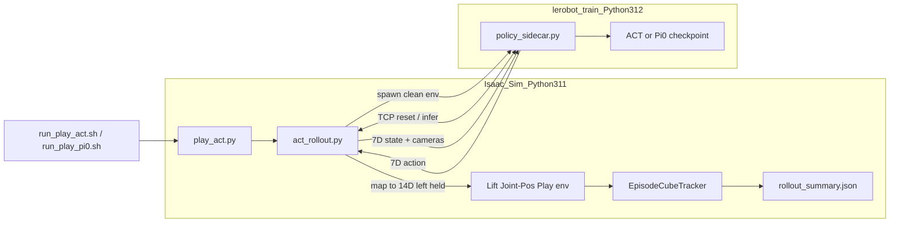

# Evaluation

Closed-loop ACT / Pi0 evaluation in simulation: how it works, success criteria, and metrics.

Closed-loop deployment and evaluation of a trained ACT or Pi0 checkpoint in simulation. This is the sim equivalent of real-robot `lerobot-record --policy.path=<checkpoint>` ([Trossen ACT evaluation docs](https://docs.trossenrobotics.com/trossen_arm/main/tutorials/lerobot_plugin/train_and_evaluate.html)).

**ACT and Pi0 share one Isaac eval path.** Both wrappers call [`play_act.py`](../../scripts/imitation_learning/evaluation/play_act.py) → [`act_rollout.py`](../../source/trossen_ai_isaac/trossen_ai_isaac/evaluation/act_rollout.py) → the same metrics. The sidecar loads `act` or `pi0` from the checkpoint config. Only default checkpoint paths and output directories differ (`outputs/eval/act` vs `outputs/eval/pi0`). **Pi0 was trained but closed-loop sim eval was not completed** (Inductor compile / 120 s timeout). **Reporting uses ACT 100k** (`act_mobile_ai_right_v2_100k`) — see [Training](05-training.md), [§7 Evaluate](../IL_WORKFLOW_RUNBOOK.md#7-evaluate-closed-loop), [ACT Evaluation Report](../ACT_EVAL_REPORT_100K.md).

#### How the policy is evaluated

Each episode is a **closed-loop rollout** in `Isaac-Lift-Cube-MobileAI-Joint-Pos-Play-v0` at **60 FPS** (play env timeout **90 s**):

1. Isaac Sim runs the scene; a **policy sidecar** in `lerobot_train` loads the checkpoint and answers `reset` / `infer` over a persistent TCP link.
2. Episode start: force **home pose** (arms at zero joints, grippers open `0.044 m`), then ~30 warm-up steps that are **not** scored.
3. Each policy step: capture **7D** right-arm state + `cam_high` + `cam_right_wrist` → sidecar → **7D** action → map onto **14D** env joint targets (left arm held at start pose).
4. [`EpisodeCubeTracker`](../../source/trossen_ai_isaac/trossen_ai_isaac/tasks/manager_based/manipulation/mobile_ai/lift/mdp/metrics.py) updates lift/place state and may early-stop; after the episode, metrics are written to `rollout_summary.json`.

**Real robot vs sim**

| Real robot | Simulation (this repo) |
|------------|------------------------|
| `lerobot-record --policy.path=...` | [`run_play_act.sh`](../../scripts/imitation_learning/run_play_act.sh) / [`run_play_pi0.sh`](../../scripts/imitation_learning/run_play_pi0.sh) |
| `mobileai_robot` + RealSense | `Isaac-Lift-Cube-MobileAI-Joint-Pos-Play-v0` |
| Policy in same process as robot I/O | **Sidecar**: Isaac Sim (Python 3.11) + policy in `lerobot_train` conda (Python 3.12) |
| 16D mobileai_robot actions | **7D right-arm** checkpoint when recorded with `--record_arm right` |
| Operator observes success | Automatic metrics in `~/trossen_ai_isaac/outputs/eval/act/` or `.../eval/pi0/` |

**Architecture (implementation detail)**

1. [`play_act.py`](../../scripts/imitation_learning/evaluation/play_act.py) launches Isaac Sim with the joint-position lift environment.
2. [`act_rollout.py`](../../source/trossen_ai_isaac/trossen_ai_isaac/evaluation/act_rollout.py) spawns [`policy_sidecar.py`](../../source/trossen_ai_isaac/trossen_ai_isaac/evaluation/policy_sidecar.py) in `lerobot_train` with a **clean subprocess env** (strips Isaac `PYTHONPATH` to avoid Python version conflicts).
3. A **single persistent TCP connection** carries `reset` / `infer` requests for the full rollout.
4. Each step: capture 7D right-arm state + cameras → sidecar → 7D action → 14D env targets (left held).
5. The sidecar loads the policy type from the checkpoint (`act`, `pi0`, …) via LeRobot `PreTrainedConfig` / `get_policy_class`, then applies `make_pre_post_processors` before/after `select_action`.
6. Home + warm-up as above; joint-position actions use `preserve_order=True`.
7. Tracker + [`evaluate_episode_metrics`](../../source/trossen_ai_isaac/trossen_ai_isaac/tasks/manager_based/manipulation/mobile_ai/lift/mdp/metrics.py) produce per-episode flags.

#### Success criteria

An episode **succeeds** only if the policy **lifts** the cube clear of the table, then **places/releases** it back (`cube_is_placed`). Locked in [`metrics.py`](../../source/trossen_ai_isaac/trossen_ai_isaac/tasks/manager_based/manipulation/mobile_ai/lift/mdp/metrics.py):

| Outcome | Condition |
|---------|-----------|
| **Success** | Cube cleared the on-table band (`z > 0.845 m`) at least once, then **released** on the table (`|z - 0.745| < 0.08 m`, low velocity, gripper open) on a later step |
| **Failure** | Cube never lifted; stays on the table regardless of robot motion |
| **Failure** | Cube lifted but never released on the table before episode end |

Lift duration has no minimum. Return uses `cube_is_placed` (on-table + stable + open gripper) so lowering with a closed gripper through the height band does not count as success.

**Heights note:** Success uses metric constants `CUBE_REST_Z=0.745` and `LIFT_CLEAR_Z=0.845` in [`metrics.py`](../../source/trossen_ai_isaac/trossen_ai_isaac/tasks/manager_based/manipulation/mobile_ai/lift/mdp/metrics.py). The digital-twin cube spawn is about **z≈0.822** on the table ([Tasks and scene](02-tasks-and-scene.md#simulation-scene)). Those values differ; treat the metric constants as the success contract, not the USD spawn pose.

#### Metrics

**Aggregate (reporting):** overall `success_rate` (successes / episodes) and `success_rate_by_color` with per-color `{episodes, successes, success_rate}`. Reporting run: [ACT Evaluation Report](../ACT_EVAL_REPORT_100K.md).

**Early-stop contract** (`stop_reason`):

| Reason | Trigger |
|--------|---------|
| `success` | Place criteria met, then `POST_SUCCESS_STEPS=60` tail |
| `no_progress` | Cube idle on table ~`IDLE_STEPS=500` with no clear lift |
| `no_pick` | Hard cap ~`MAX_APPROACH_STEPS=1000` with no lift |
| `no_place` | Lifted but not released within ~`MAX_STEPS_AFTER_LIFT=500` |
| `env_done` | Drop / play-env timeout (90 s) |

**`rollout_summary.json` per-episode fields**

| Field | Meaning |
|-------|---------|
| `cube_lifted` | Cube cleared the on-table height band at least once |
| `cube_returned_after_lift` | After lift, cube was released on table (`cube_is_placed`) |
| `cube_on_table` | On-table stable state at final step, no gripper check (diagnostic) |
| `cube_dropped` | Cube fell below table at final step (diagnostic) |
| `episode_success` | `cube_lifted` and `cube_returned_after_lift` |
| `stop_reason` | One of the early-stop values above |
| `cube_color` | Spawned cube color this episode (`red` / `green` / `blue`) |
| `steps` | Policy steps (warm-up excluded) |

**Key files**

| File | Role |
|------|------|
| [`run_play_act.sh`](../../scripts/imitation_learning/run_play_act.sh) | Closed-loop ACT eval → `outputs/eval/act/` |
| [`run_play_pi0.sh`](../../scripts/imitation_learning/run_play_pi0.sh) | Closed-loop Pi0 eval → `outputs/eval/pi0/` (same Isaac path) |
| [`run_verify_pi0_dataset.sh`](../../scripts/imitation_learning/run_verify_pi0_dataset.sh) | Dataset verify before Pi0 train |
| [`run_train_pi0.sh`](../../scripts/imitation_learning/run_train_pi0.sh) | Interactive Pi0 fine-tune (live progress) |
| [`run_play_replay.sh`](../../scripts/imitation_learning/run_play_replay.sh) | Open-loop replay sanity check |
| [`act_rollout.py`](../../source/trossen_ai_isaac/trossen_ai_isaac/evaluation/act_rollout.py) | Rollout loop + metrics |
| [`policy_sidecar.py`](../../source/trossen_ai_isaac/trossen_ai_isaac/evaluation/policy_sidecar.py) | Generic LeRobot inference server (`act` / `pi0`) |
| [`joint_pos_env_cfg.py`](../../source/trossen_ai_isaac/trossen_ai_isaac/tasks/manager_based/manipulation/mobile_ai/lift/joint_pos_env_cfg.py) | Joint-position control env for rollout |

**Prerequisites:** trained checkpoint from `lerobot_train`, same 7D right-arm layout as recording (`cam_high` + `cam_right_wrist`), task string `"Pick up the cube, lift it, and place it back on the table"`.

---

## How to run

Evaluate **your** checkpoint with the ACT or Pi0 play wrappers (checkpoint path, episode count, fps are args or editable defaults): [§7 Evaluate](../IL_WORKFLOW_RUNBOOK.md#7-evaluate-closed-loop).

**Results (this project’s ACT reporting run):** [ACT Evaluation Report](../ACT_EVAL_REPORT_100K.md).

## Continue reading

- [§7 Evaluate](../IL_WORKFLOW_RUNBOOK.md#7-evaluate-closed-loop)
- [ACT Evaluation Report](../ACT_EVAL_REPORT_100K.md)
- [Findings and troubleshooting](07-findings-troubleshooting.md)
- [Epic 3 design index](README.md)
