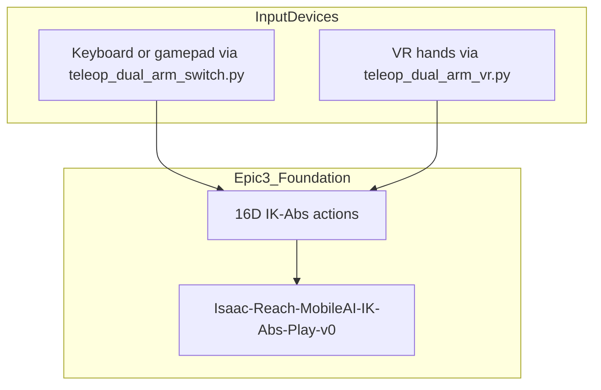

# Background and Stack

## Integration with Epic 3

VR does **not** replace the task environment. It replaces the **input device**. The same `Isaac-Reach-MobileAI-IK-Abs-Play-v0` task, the same **16D action vector**, and the same IK solver are used. Only the source of actions changes (hand poses instead of keyboard or gamepad input).



The VR control loop matches Epic 3's teleoperation loop (`input → 16D action → env.step()`), with OpenXR hand tracking as the input source. See [Teleoperation (Epic 3)](../epic3/03-teleoperation.md) and [VR teleoperation](04-vr-teleoperation.md).

## VR system stack

| Component | Role |
|-----------|------|
| **Meta Quest 3** | VR display and hand tracking |
| **ALVR** | Wireless streaming from PC to headset over Wi-Fi |
| **SteamVR** | PC VR runtime; manages compositor and device drivers |
| **OpenXR** | Standard API used by Isaac Sim to read headset pose and hand tracking |
| **Isaac Sim / Isaac Lab** | Renders stereo frames; `OpenXRDevice` converts hand poses to robot actions |


> **Screenshot placeholder:** `docs/assets/epic4/vr-stack-annotated.png` — optional annotated photo of the live stack (ALVR + SteamVR + Isaac) for BookStack.
>
> 

### Why this stack

No single product gives **Quest wireless streaming** and **Isaac Lab hand retargeting** into the Mobile AI IK task. The chain above exists because each hop owns one concern; Isaac Sim never talks to the Quest or ALVR directly.

Reading the diagram **left → right**:

1. **Meta Quest 3 (hand tracking)** — Standalone headset: stereo display plus inside-out cameras that track the wearer’s hands. Avoids a tethered PC VR HMD and physical controllers for this project’s demos.

2. **ALVR** — Wireless bridge on the same Wi-Fi LAN. Encodes/decodes frames between the workstation GPU and the Quest, and injects headset + hand tracking into the PC VR path. Chosen over cloud streaming (e.g. NVIDIA CloudXR) because it runs entirely on the local workstation. See [Findings — ALVR selection](06-findings-troubleshooting.md#design-notes).

3. **SteamVR** — PC VR compositor and driver host. ALVR registers as a SteamVR driver; without SteamVR there is no standard place for ALVR to publish devices. Session rule: always **Launch SteamVR from ALVR**, not from the Steam library alone ([Part B](03-workstation-config.md#part-b--per-session-startup)).

4. **OpenXR runtime** — Khronos API that Isaac Sim uses for XR. SteamVR is set as the active OpenXR runtime so Isaac loads SteamVR’s OpenXR layer, which in turn sees ALVR’s devices. Isaac does not integrate with ALVR’s own API.

5. **Isaac Sim AR / OpenXR** — With Output Plugin = OpenXR and **Start AR**, the sim renders stereo frames into the OpenXR swapchain (what the Quest displays via ALVR).

6. **Isaac Lab `OpenXRDevice` → `teleop_dual_arm_vr.py` → Mobile AI IK** — Lab converts OpenXR hand poses into the same **16D** absolute IK actions as keyboard/gamepad teleop, then `env.step()` drives the dual-arm scene.

```text
Quest sensors ──Wi-Fi──► ALVR ──driver──► SteamVR ──OpenXR──► Isaac Sim/Lab ──16D──► robot IK
     ▲                      │
     └──────── stereo frames / compositor path ──────────────┘
```

One-time install and every-session order: [Workstation config](03-workstation-config.md) (Parts A and B). Short day-to-day checklist: [IL cheat sheet](../IL_WORKFLOW_CHEATSHEET.md#1-collect-demos--vr-production).

**Hub:** [Epic 4](../EPIC4_VR_INTEGRATION.md)
