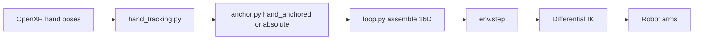

# VR Teleoperation

How Quest hand tracking drives the Mobile AI IK-Abs task.

**Copy-paste commands:** [§2 Practice VR teleop](../IL_WORKFLOW_RUNBOOK.md#2-practice-vr-teleop-no-dataset). Session startup: [§1 VR session startup](../IL_WORKFLOW_RUNBOOK.md#1-vr-session-startup-every-time) (launch pointer: [§1.7](../IL_WORKFLOW_RUNBOOK.md#17-launch-teleop-or-recording-on-the-pc)). Collect: [§3](../IL_WORKFLOW_RUNBOOK.md#3-collect-demos-vr).

## Integration with the simulation pipeline

[`teleop_dual_arm_vr.py`](../../scripts/teleoperation/teleop_dual_arm_vr.py) launches the same Isaac Lab task as keyboard teleoperation: `Isaac-Reach-MobileAI-IK-Abs-Play-v0` ([Tasks and scene — IK Abs](../epic3/02-tasks-and-scene.md#ik_abs_env_cfgpy-absolute-ik-teleoperation)). That ID says “Reach” for historical reasons; the environment is the Mobile AI **pick-and-place** scene (table + cube), not a classic reach-to-target RL task (see [naming note](../epic3/02-tasks-and-scene.md#custom-reach-task-environment)). Each frame, OpenXR hand tracking data is converted to a 16D action tensor (14D absolute IK poses and 2 binary gripper scalars) and passed to `env.step(action)`.

The control path is:

1. `OpenXRDevice.advance()` returns a 16-element tensor: `[L_pose(7), R_pose(7), L_grip(1), R_grip(1)]`.
2. The VR loop applies hand-anchored or absolute pose composition (below).
3. The tensor is broadcast to `[num_envs, 16]` and sent to `env.step()`.
4. The task environment's differential IK solver moves both arms.

## VR module package

Logic lives in `source/trossen_ai_isaac/trossen_ai_isaac/teleop/vr/`. The teleop entrypoint calls `run_vr_teleop_loop` in `loop.py`. Dataset collection uses [`record_dual_arm_vr.py`](../../scripts/imitation_learning/recording/record_dual_arm_vr.py) with the same control loop plus `LeRobotRecorder` ([VR recording](04-vr-recording.md)).

- **`loop.py`**: Main VR control loop, workstation keyboard sidecar, warm-up guard, and action assembly.
- **`hand_tracking.py`**: Hand pose and pinch extraction from OpenXR device output.
- **`anchor.py`**: Hand-anchored vs absolute pose composition for end-effector targets.
- **`constants.py`**: 16D action layout, view presets, and control-frame defaults.

## Control loop behaviour

`run_vr_teleop_loop` mirrors the Epic 3 teleoperation pattern (`input → 16D action → env.step()`), but reads from the OpenXR `handtracking` device instead of `Se3Keyboard` or `Se3Gamepad`.

**Bimanual control:** Unlike keyboard/gamepad switch mode, with `--dual_arm` the left hand controls the left arm and the right hand controls the right arm simultaneously. Default teleop is single-arm (`--start_arm left|right`, **TAB** to switch). Recording locks the arm with `--record_arm` on the recording entrypoint only ([VR recording](04-vr-recording.md)).

**Hand-anchored mode (default):** `--anchor_mode hand_anchored` snapshots the operator's hand pose and the robot's end-effector pose on the first active frame. Subsequent hand movements *relative to that start* map to arm movements.

**Re-anchor (**B**):** clears the hand↔EE snapshot and pose-smoothing filter, then re-snapshots head yaw + hand/EE on the next active frame so “forward relative to the headset” maps to robot-forward again — **without** pausing or resetting the environment. Also happens automatically after pause/resume (next engage) and after environment reset. Full operator ritual (C-shape hands, stay still, slow motion): [§1.10](../IL_WORKFLOW_RUNBOOK.md#110-engage-teleop-recording-with-the-workstation-operator).

**Absolute mode:** `--anchor_mode absolute` feeds hand pose directly as the IK target. Intended for humanoid avatars; not recommended for Mobile AI room-scale use.

**Grippers:** Pinch gesture (thumb-index distance) opens or closes each hand's gripper via `GripperRetargeter`.

**Staged activation (default):** The script begins **inactive**. A warm-up guard (`--warmup_frames`, `--warmup_min_pos`) waits for both hands to report live tracking, then a second user at the workstation presses **N** to engage. The hand-to-end-effector anchor is captured at that moment so the arms do not jump on connect. Pass `--autostart` to engage automatically after warm-up.

**Workstation keyboard controls** (sidecar `Se3Keyboard`; headset operator has no keyboard). **Isaac Sim must be the focused window** or keys are ignored. **Operator quick ref (keys + expected logs):** [runbook Controls — VR teleop](../IL_WORKFLOW_RUNBOOK.md#controls-quick-reference). Design notes below; operator ritual: [§1.10](../IL_WORKFLOW_RUNBOOK.md#110-engage-teleop-recording-with-the-workstation-operator).

Warm-up prints `[WARMUP] Hand tracking stable after N frames -- press N at the workstation to engage.` Pinch has no dedicated print — with `--step_log`, see `L_grip` / `R_grip` on periodic `[VR step=...]` lines.

**Grippers (headset):** pinch gesture — see above. Recording uses a different workstation key map ([VR recording](04-vr-recording.md); [runbook Controls — VR recording](../IL_WORKFLOW_RUNBOOK.md#controls-quick-reference)).

**VR-specific rendering:** Scene cameras are removed during pure VR teleop (the headset view replaces them). DLSS anti-aliasing is enabled. Recording keeps cameras via `--keep_cameras` ([VR recording](04-vr-recording.md)).

**View presets** (`--view`): `first_person`, `over_shoulder`, `third_person` (default). Presets set `XrCfg.anchor_prim_path`, `anchor_pos`, and `anchor_rot`. Override with `--anchor_pos`, `--anchor_rot`, or `--anchor_prim_path`.

| Flag | Description |
|------|-------------|
| `--view first_person` | Inside the robot's head camera (robot's-eye view) |
| `--view over_shoulder` | Behind and above the arms looking forward |
| `--view third_person` | Wider external view (default) |

## Task configuration wiring

The Reach task must expose a `handtracking` device in [`ik_abs_env_cfg.py`](../epic3/02-tasks-and-scene.md#ik_abs_env_cfgpy-absolute-ik-teleoperation) (`OpenXRDeviceCfg` with retargeters). Epic 3 documents this wiring; Epic 4 consumes it.

Retargeters are ordered so `advance()` returns shape `[16]`:

| Index | Consumed by |
|-------|-------------|
| 0..6 | Left arm absolute pose (`left_arm_action`) |
| 7..13 | Right arm absolute pose (`right_arm_action`) |
| 14 | Left gripper (`left_gripper_action`) |
| 15 | Right gripper (`right_gripper_action`) |

`GripperRetargeter` emits +1.0 (open) / −1.0 (close); `BinaryJointPositionAction` maps value > 0 to open, else close.

Default `XrCfg` anchors the operator at the robot head camera (`cam_high_link`) with a vertical offset to cancel physical headset height. VR teleoperation starts **inactive** by default (`teleoperation_active_default=False`).

## Development history

VR was built in three stages on the Mobile AI robot directly (no separate Franka OpenXR smoke test):

1. **Mobile AI dual-arm VR** — hand tracking on `Isaac-Reach-MobileAI-IK-Abs-Play-v0`.
2. **Modular refactor** — logic under `source/.../teleop/vr/`.
3. **VR + LeRobot recording** — `record_dual_arm_vr.py` / `run_vr_recording_loop`. See [VR recording](04-vr-recording.md).

## Repository and module structure

| Location | Role |
|----------|------|
| `scripts/teleoperation/teleop_dual_arm_vr.py` | VR teleoperation entrypoint |
| `scripts/imitation_learning/recording/record_dual_arm_vr.py` | VR + LeRobot recording entrypoint |
| `source/.../teleop/vr/loop.py` | Main VR control loop |
| `source/.../teleop/vr/cli.py` | Shared VR argparse flags (loaded pre-AppLauncher) |
| `source/.../teleop/vr/hand_tracking.py` | Hand pose and pinch extraction |
| `source/.../recording/camera_compat.py` | XR camera probe / JSON report helper |
| `source/.../teleop/vr/anchor.py` | Hand-anchored vs absolute composition |
| `source/.../teleop/vr/constants.py` | 16D layout and view presets |
| `source/.../tasks/.../mobile_ai/reach/ik_abs_env_cfg.py` | OpenXR device and retargeter registration |

## CLI reference (`teleop_dual_arm_vr.py`)

From [`teleop/vr/cli.py`](../../source/trossen_ai_isaac/trossen_ai_isaac/teleop/vr/cli.py). Isaac Lab `AppLauncher` flags also apply; the script forces `--xr` on.

**Teleop / control**

| Argument | Default | Description |
|----------|---------|-------------|
| `--num_envs` | `1` | Number of environments |
| `--task` | `Isaac-Reach-MobileAI-IK-Abs-Play-v0` | Absolute-IK gym task (must be an IK-Abs variant) |
| `--device_name` | `handtracking` | Key into `env_cfg.teleop_devices.devices` for the OpenXR device |
| `--warmup_frames` | `30` | Consecutive live-tracking frames required before forwarding actions (~0.5 s at 60 Hz) |
| `--warmup_min_pos` | `0.02` | Min hand position norm (m) to count a frame as live tracking |
| `--dual_arm` | off | Drive both arms at once; default is single-arm (TAB switches active arm) |
| `--start_arm` | `left` | First active arm in single-arm mode (`left` / `right`); ignored with `--dual_arm` |
| `--pinch_hold_dist` | `0.08` | Thumb–index distance (m) below which EE orientation is frozen during pinch; `0` disables |
| `--anchor_pos` | task cfg | Override XR origin in robot base frame (three floats, meters) |
| `--anchor_rot` | task cfg | Override XR origin quaternion `w x y z` |
| `--anchor_mode` | `hand_anchored` | `hand_anchored` (relative hand deltas) or `absolute` (hand pose = IK target) |
| `--anchor_prim_path` | task cfg | USD prim for XR view anchor; use `--list_bodies` to discover names |
| `--list_bodies` | off | Print robot body names/poses after env construction, then continue |
| `--view` | `third_person` | Viewpoint preset: `first_person`, `third_person`, `over_shoulder` |
| `--autostart` | off | Start teleop after warm-up without waiting for workstation **N** |
| `--no_hand_markers` | off | Disable debug EE/hand markers |
| `--control_yaw_deg` | `-90.0` | Yaw (deg) applied to hand-motion deltas in `hand_anchored` mode |
| `--pose_smoothing` | `0.5` | EMA weight of previous IK pose (`0` = raw, higher = smoother/laggier) |
| `--step_log` | off | Print `[VR step=...]` status every 60 sim steps (hand pose / grip / REC); off by default |

**Camera / XR compatibility** (`add_vr_camera_args`)

| Argument | Default | Description |
|----------|---------|-------------|
| `--keep_cameras` | off | Keep task USD cameras enabled during XR (needed for VR recording) |
| `--camera_probe_interval` | `0` | If `> 0`, probe record-camera RGB every N sim steps |
| `--camera_probe_capture_frame` | off | During probes, also run full recording frame capture |
| `--camera_probe_output` | none | Optional JSON path for probe summary on exit |

## Continue reading

- [VR workstation one-time setup](../setup/vr-workstation.md) / [§1 VR session startup](../IL_WORKFLOW_RUNBOOK.md#1-vr-session-startup-every-time)
- [§2 Practice VR teleop](../IL_WORKFLOW_RUNBOOK.md#2-practice-vr-teleop-no-dataset)
- [§3 Collect VR](../IL_WORKFLOW_RUNBOOK.md#3-collect-demos-vr) / [VR recording](04-vr-recording.md)
- [Epic 4 hub](../EPIC4_VR_INTEGRATION.md)
