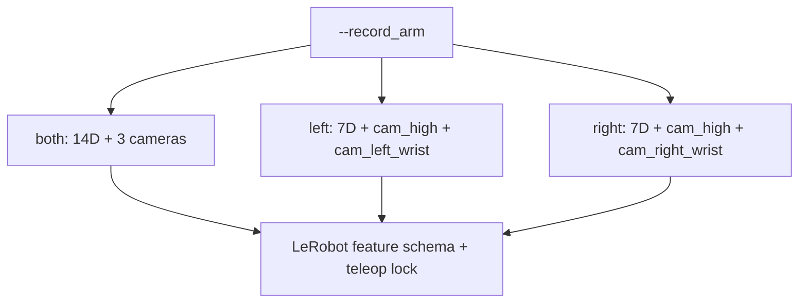
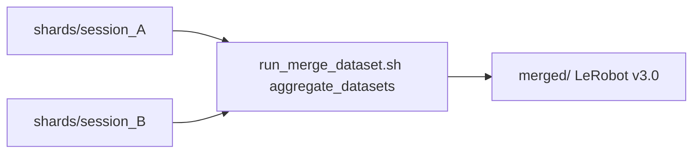

# VR Recording

Demonstration collection over VR + LeRobot (design). Operator commands: [§3 Collect demos — VR](../IL_WORKFLOW_RUNBOOK.md#3-collect-demos-vr).

**End-to-end:** Quest hand tracking → ALVR / SteamVR / OpenXR ([stack](02-background-and-stack.md)) → Isaac Lab 16D IK-Abs → `env.step` → LeRobot writer on disk ([schema / layout](../epic3/04-recording-lerobot.md)) → finalize → [§5 Verify](../IL_WORKFLOW_RUNBOOK.md#5-verify-dataset) → [§6 Train](../IL_WORKFLOW_RUNBOOK.md#6-train).

**Copy-paste commands** (session startup summary, `run_collect_dataset.sh`, merge, one-shot `record_dual_arm_vr.py`): [§3](../IL_WORKFLOW_RUNBOOK.md#3-collect-demos-vr). Mid-session launch pointer: [§1.7](../IL_WORKFLOW_RUNBOOK.md#17-launch-teleop-or-recording-on-the-pc). On-disk layout: [Recording — LeRobot v3.0](../epic3/04-recording-lerobot.md#lerobot-dataset-v30-on-disk).

Entrypoint: [`record_dual_arm_vr.py`](../../scripts/imitation_learning/recording/record_dual_arm_vr.py). Defaults to `Isaac-Reach-MobileAI-Record-Play-v0`, keeps record cameras enabled, and shares the VR control loop from [VR teleoperation](03-vr-teleoperation.md).

**Existing `--root`:** `LeRobotRecorder` refuses to create over a path that already exists unless you pass `--overwrite` (deletes the folder) or pick a new root. That is not append — for multi-session collection use [shard-then-merge](#multi-session-collection-shard-then-merge). Operator detail: [§3](../IL_WORKFLOW_RUNBOOK.md#single-session-one-shot).

## Workstation keys (recording)

**Isaac Sim must be the focused window** or keys are ignored. **Operator quick ref (keys + expected logs):** [runbook Controls — VR recording](../IL_WORKFLOW_RUNBOOK.md#controls-quick-reference). Operator ritual (C-shape, still before engage, slow motion, re-anchor, Ctrl+C finalize): [§1.10](../IL_WORKFLOW_RUNBOOK.md#110-engage-teleop-recording-with-the-workstation-operator). Re-anchor (**B**) re-snapshots the hand↔EE relationship without pausing or resetting — see [VR teleoperation](03-vr-teleoperation.md).

**After save (**N**):** wait until the terminal shows `[RECORD] Saved episode (N frames) -> ...` (parquet/video flush can take several seconds), then the reset guidance lines, before **B** / **U** / next episode. Operator detail: [§1.10](../IL_WORKFLOW_RUNBOOK.md#110-engage-teleop-recording-with-the-workstation-operator).

Full teleop-only map (no recorder): [VR teleoperation](03-vr-teleoperation.md) · [runbook Controls](../IL_WORKFLOW_RUNBOOK.md#controls-quick-reference).

## One-arm vs two-arm (`--record_arm`)

`--record_arm` selects both what is written to the dataset and which arm(s) the operator teleoperates:

| Mode | `observation.state` / `action` | Cameras | Teleop control |
|------|-------------------------------|---------|----------------|
| `both` (default) | 14D (`left_joint_0..6`, `right_joint_0..6`) | `cam_high`, `cam_left_wrist`, `cam_right_wrist` | both arms simultaneously |
| `left` | 7D (`left_joint_0..6`) | `cam_high`, `cam_left_wrist` | locked to left arm (TAB disabled) |
| `right` | 7D (`right_joint_0..6`) | `cam_high`, `cam_right_wrist` | locked to right arm (TAB disabled) |

All three modes produce a standard [LeRobot Dataset v3.0](https://huggingface.co/docs/lerobot/en/lerobot-dataset-v3); only feature dimensions and `observation.images.*` cameras differ.

**This project’s reporting set** used `--record_arm right` — see [runbook project example reference](../IL_WORKFLOW_RUNBOOK.md). Unused-arm drift is why single-arm lock is common; bimanual remains a limitation ([Findings — unused-arm drift](05-findings-troubleshooting.md#unused-arm-drift-and-record_arm-right)).

## Multi-session collection (shard-then-merge)

LeRobot Dataset v3.0 closes parquet writers permanently on `finalize()`, so an existing folder cannot be reopened for append. Use shards:

1. Each `run_collect_dataset.sh` write goes to `$ROOT_BASE/shards/session_<timestamp>/` (optional label: `./scripts/imitation_learning/run_collect_dataset.sh morning`).
2. Merge with `run_merge_dataset.sh` (optional `--verify`) → `$ROOT_BASE/merged/`.
3. All shards **must** share the same `--record_arm` and `--fps`.

## XR camera compatibility probes

For experiments that keep USD cameras active during XR, use teleop with `--keep_cameras` and probe flags (`--camera_probe_interval`, `--camera_probe_capture_frame`, `--camera_probe_output`). See the CLI table in [VR teleoperation](03-vr-teleoperation.md#cli-reference-teleop_dual_arm_vrpy).

## Debug visualization

Debug markers (wrist/thumb/index spheres and EE axis lines) are suppressed while recording is active. They remain in pure teleop; `--no_hand_markers` can disable them there too.

## Movement smoothing (`--pose_smoothing`)

Quest hand tracking jitters position and orientation. `--pose_smoothing ALPHA` (default `0.5`) applies an EMA / SLERP low-pass on the IK target. `0` = raw; higher = smoother but laggier. The filter resets on re-anchor (**B**), arm switch (**TAB**), and environment reset.

| ALPHA | Behaviour |
|-------|-----------|
| 0.0 | Raw passthrough — maximum responsiveness, maximum jitter |
| 0.3 | Light smoothing |
| 0.5 | **Default** — balanced |
| 0.7 | Strong smoothing — noticeable lag on fast moves |

Both `record_dual_arm_vr.py` and `teleop_dual_arm_vr.py` accept this flag.

## Continue reading

- [§3 Collect VR](../IL_WORKFLOW_RUNBOOK.md#3-collect-demos-vr) · [§5 Verify](../IL_WORKFLOW_RUNBOOK.md#5-verify-dataset) · [§6 Train](../IL_WORKFLOW_RUNBOOK.md#6-train)
- [Recording (LeRobot)](../epic3/04-recording-lerobot.md) (design)
- [Findings and troubleshooting](05-findings-troubleshooting.md)
- [Epic 4 design index](README.md)
