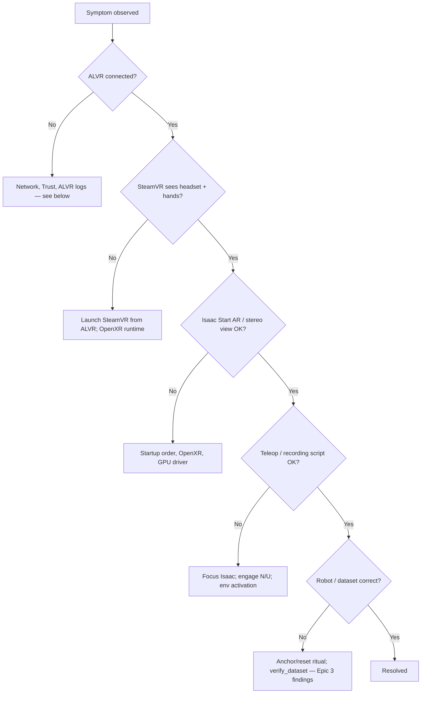

# Findings and Troubleshooting

## Input device comparison

| | Keyboard / gamepad | VR |
|--|-------------------|-----|
| Script | `teleop_dual_arm_switch.py` / `record_dual_arm.py` | `teleop_dual_arm_vr.py` / `record_dual_arm_vr.py` |
| Arms controlled | One at a time (TAB / Y to switch) | Both simultaneously (or lock to one with `--record_arm`) |
| Recording | Supported alternate (`record_dual_arm.py`) | **Production path** for this project (`record_dual_arm_vr.py`, right-arm demos) |
| Setup complexity | Low | Headset + ALVR + SteamVR |
| Best suited for | Smoke tests, keyboard iteration without a headset | Operator demos feeding the reporting train set |

## Arm drift (not applicable)

The IK-Rel arm drift issue documented in [Epic 3 Findings](../epic3/07-findings-troubleshooting.md) was resolved by switching to IK-Abs. It does not apply to the current IK-Abs + VR setup.

## Current limitations

- **Right-arm focus for production demos:** unused-arm tracking drifts when the operator concentrates on the active hand; this project recorded `--record_arm right` only
- **Setup complexity:** VR requires ALVR, SteamVR, Quest 3, and per-session startup steps
- **Network dependency:** ALVR requires stable 5 GHz Wi-Fi; institutional networks may block peer-to-peer traffic
- **VR teleop / tracking fine-tuning still needed:** hand-anchored mapping, `--pose_smoothing`, unused-arm drift, and session ergonomics still need tuning for smoother demos ([VR teleoperation](03-vr-teleoperation.md), [VR session startup (§1)](../IL_WORKFLOW_RUNBOOK.md#1-vr-session-startup-every-time); also [Epic 3 findings](../epic3/07-findings-troubleshooting.md))
- **Sim policy evaluation lives in Epic 3:** closed-loop ACT eval is in [Evaluation](../epic3/06-evaluation.md) and the [ACT Evaluation Report](../ACT_EVAL_REPORT_100K.md) (trained on this VR-collected right-arm set)

## Design notes

**ALVR selection:** ALVR was chosen because it requires no cloud infrastructure and can be set up on a local workstation in hours. A more integrated path (e.g. NVIDIA CloudXR) may be evaluated later.

## Troubleshooting (VR / ALVR)

### Debug order

When a VR session fails, walk the stack **in order** before diving into Isaac or recording. Session startup (correct order every time): [§1](../IL_WORKFLOW_RUNBOOK.md#1-vr-session-startup-every-time). IL / Python / dataset issues: [Epic 3 findings](../epic3/07-findings-troubleshooting.md).



Use the symptom table below once you know which layer failed.

### Network diagnostics (ALVR pairing)

If the Quest never appears in ALVR Devices (or connects then drops), treat networking as first-class — not an app bug:

1. Confirm Quest and PC share the **same** LAN/SSID ([§1.1](../IL_WORKFLOW_RUNBOOK.md#11-same-wi-fi), [one-time Wi-Fi](../setup/vr-workstation.md#network-wi-fi)). Prefer dedicated **5 GHz**; wired Ethernet for the workstation.
2. On the PC, check that ALVR is listening and that the firewall is not blocking peer discovery/streaming:

```bash
ss -tulpn
sudo ufw status
```

3. Watch the ALVR Devices list while opening the Quest ALVR app; **Trust** when prompted ([§1.2](../IL_WORKFLOW_RUNBOOK.md#12-open-alvr-on-the-headset-trust-on-the-pc)).
4. Enforce order: **ALVR Server → Launch SteamVR from ALVR → Isaac** ([§1.4](../IL_WORKFLOW_RUNBOOK.md#14-launch-steamvr-from-alvr)).

Exact ALVR port numbers vary by release; if `ufw` is active, allow ALVR’s discovery and streaming ports for the local network (or temporarily disable ufw to confirm it is the cause).

### Symptom table

| Symptom | Likely cause | Fix |
|---------|--------------|-----|
| `setcap` fails (file not found) | SteamVR install path differs | `find ~ -name "vrcompositor-launcher"` and use the returned path |
| SteamVR closes after a few seconds | Launched from Steam instead of ALVR | Launch SteamVR **from ALVR**; confirm launch option is set ([one-time setup](../setup/vr-workstation.md#one-time-setup) / [§1.4](../IL_WORKFLOW_RUNBOOK.md#14-launch-steamvr-from-alvr)) |
| ALVR: `steamvr.vrsettings` does not exist | File not created yet | Create the file (see [ALVR server setup](../setup/vr-workstation.md#workstation-alvr-server)) |
| Quest 3 not in ALVR Devices | Network or trust issue | Same **5 GHz Wi-Fi**; launch ALVR app on headset; try a dedicated router on institutional networks — [Network diagnostics](#network-diagnostics-alvr-pairing) |
| Black screen in headset | Encode or hand-tracking mode | Reduce ALVR encode resolution; confirm Hand Tracking = SteamVR Input 2.0 |
| Isaac Sim segfault on Start AR | NVIDIA driver conflict | Disable GPU firmware in `/etc/modprobe.d/nvidia.conf`: `options nvidia NVreg_EnableGpuFirmware=0`, then reboot |
| `XR_ERROR_RUNTIME_UNAVAILABLE` | OpenXR runtime not running | Start ALVR + SteamVR; verify OpenXR runtime points to SteamVR |
| ALVR desync warnings | Wi-Fi quality | Move closer to router; use 5 GHz; reduce encode bitrate |
| Hands track but arms do not move | Teleoperation not engaged, or Isaac Sim not focused | Focus Isaac Sim; press **N** (teleop) / **U** (recording) after warm-up; or use `--autostart` — [§1.10](../IL_WORKFLOW_RUNBOOK.md#110-engage-teleop-recording-with-the-workstation-operator) |
| Workstation keys do nothing | Isaac Sim window not focused | Click the Isaac Sim window, then press keys again |
| Arms jump or do not follow hands after engage | Bad first anchor (hands moving / wrong pose at engage) | Horizontal **C-shape** hands, stay still, then engage; or press **B** to re-anchor while still |
| Odd mapping after turning body | Hand↔EE snapshot out of date | Stay still, press **B** (re-anchor) — [§1.10](../IL_WORKFLOW_RUNBOOK.md#110-engage-teleop-recording-with-the-workstation-operator) |
| Hands missing / only one cursor in SteamVR | Tracking or startup order | Hands visible before SteamVR; restart SteamVR via ALVR; full restart from [§1 VR session startup](../IL_WORKFLOW_RUNBOOK.md#1-vr-session-startup-every-time) |
| SteamVR dashboard blocks the view | Dashboard still toggled on | SteamVR window → ☰ → **Toggle Dashboard** ([§1 VR session startup](../IL_WORKFLOW_RUNBOOK.md#16-toggle-steamvr-dashboard-off)) |
| POV wrong after Start AR | First-spawn XR alignment | Remove headset a few seconds, put it back ([§1 VR session startup](../IL_WORKFLOW_RUNBOOK.md#19-pov-reset-if-the-first-spawn-looks-wrong)) |

## Continue reading

- [VR workstation one-time setup](../setup/vr-workstation.md)
- [§1 VR session startup](../IL_WORKFLOW_RUNBOOK.md#1-vr-session-startup-every-time)
- [§2 Practice](../IL_WORKFLOW_RUNBOOK.md#2-practice-vr-teleop-no-dataset) / [§3 Collect](../IL_WORKFLOW_RUNBOOK.md#3-collect-demos-vr)
- [Future work](06-future-work.md)
- [Epic 4 hub](../EPIC4_VR_INTEGRATION.md)
