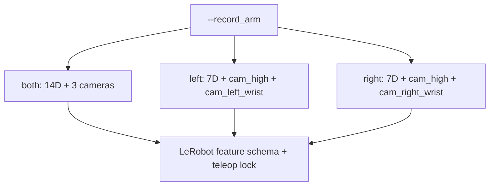
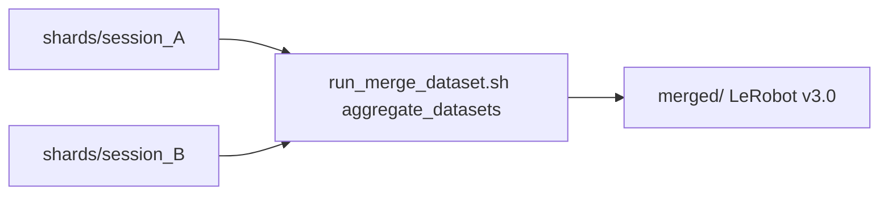

# VR Recording

Production demonstration collection for this project uses VR + LeRobot. **Commands** (session startup, `run_collect_dataset.sh`, merge, one-shot `record_dual_arm_vr.py`): [IL cheat sheet](../IL_WORKFLOW_CHEATSHEET.md#1-collect-demos--vr-production). On-disk layout: [Recording — LeRobot v3.0](../epic3/04-recording-lerobot.md#lerobot-dataset-v30-on-disk).

Entrypoint: [`record_dual_arm_vr.py`](../../scripts/imitation_learning/recording/record_dual_arm_vr.py). Defaults to `Isaac-Reach-MobileAI-Record-Play-v0`, keeps record cameras enabled, and shares the VR control loop from [VR teleoperation](04-vr-teleoperation.md).

## Workstation keys (recording)

| Key | Action |
|-----|--------|
| **N** | Start recording the current episode, then save-and-reset on the next press |
| **M** | Discard the current episode buffer |
| **U** | Start teleop without recording |
| **I** | Pause teleop |
| **B** | Re-anchor the current VR control frame |
| **J** | Reset the environment and discard any in-progress episode |

**Also:**

- **TAB** — switch active arm when teleop is single-arm and **not** locked by `--record_arm left` / `right` (those modes disable TAB). With `--record_arm both` and dual-arm drive, TAB is not used for arm lock the same way.
- **Pinch** (headset) — still opens/closes grippers while recording.

Full teleop-only map (no recorder): [VR teleoperation](04-vr-teleoperation.md).

## One-arm vs two-arm (`--record_arm`)

`--record_arm` selects both what is written to the dataset and which arm(s) the operator teleoperates:

| Mode | `observation.state` / `action` | Cameras | Teleop control |
|------|-------------------------------|---------|----------------|
| `both` (default) | 14D (`left_joint_0..6`, `right_joint_0..6`) | `cam_high`, `cam_left_wrist`, `cam_right_wrist` | both arms simultaneously |
| `left` | 7D (`left_joint_0..6`) | `cam_high`, `cam_left_wrist` | locked to left arm (TAB disabled) |
| `right` | 7D (`right_joint_0..6`) | `cam_high`, `cam_right_wrist` | locked to right arm (TAB disabled) |

All three modes produce a standard [LeRobot Dataset v3.0](https://huggingface.co/docs/lerobot/en/lerobot-dataset-v3); only feature dimensions and `observation.images.*` cameras differ.

**Production on this project:** `--record_arm right` only — see [cheat sheet production fact](../IL_WORKFLOW_CHEATSHEET.md).

## Multi-session collection (shard-then-merge)

LeRobot Dataset v3.0 closes parquet writers permanently on `finalize()`, so an existing folder cannot be reopened for append. Use shards:

1. Each `run_collect_dataset.sh` write goes to `$ROOT_BASE/shards/session_<timestamp>/` (optional label: `./scripts/imitation_learning/run_collect_dataset.sh morning`).
2. Merge with `run_merge_dataset.sh` (optional `--verify`) → `$ROOT_BASE/merged/`.
3. All shards **must** share the same `--record_arm` and `--fps`.

## XR camera compatibility probes

For experiments that keep USD cameras active during XR, use teleop with `--keep_cameras` and probe flags (`--camera_probe_interval`, `--camera_probe_capture_frame`, `--camera_probe_output`). See the CLI table in [VR teleoperation](04-vr-teleoperation.md#cli-reference-teleop_dual_arm_vrpy).

## Debug visualization

Debug markers (wrist/thumb/index spheres and EE axis lines) are suppressed while recording is active. They remain in pure teleop; `--no_hand_markers` can disable them there too.

## Movement smoothing (`--pose_smoothing`)

Quest hand tracking jitters position and orientation. `--pose_smoothing ALPHA` (default `0.5`) applies an EMA / SLERP low-pass on the IK target. `0` = raw; higher = smoother but laggier. The filter resets on re-anchor (**B**), arm switch (**TAB**), and environment reset.

| ALPHA | Behaviour |
|-------|-----------|
| 0.0 | Raw passthrough — maximum responsiveness, maximum jitter |
| 0.3 | Light smoothing |
| 0.5 | **Default** — balanced |
| 0.7 | Strong smoothing — noticeable lag on fast moves |

Both `record_dual_arm_vr.py` and `teleop_dual_arm_vr.py` accept this flag.

**Hub:** [Epic 4](../EPIC4_VR_INTEGRATION.md)
