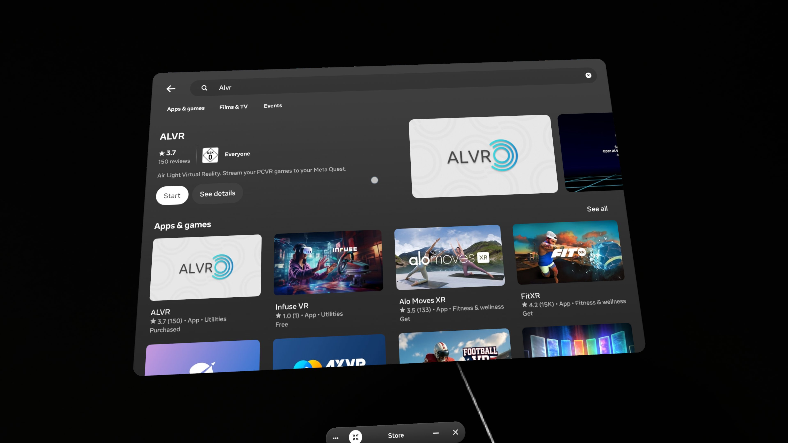

# VR workstation one-time setup

**One-time** install of Quest / ALVR / Steam / SteamVR / OpenXR on a workstation. Skip if this host is already validated.

**Every session** (Wi-Fi → Trust → SteamVR → hands → Start AR → engage): [IL runbook — §1 VR session startup](../IL_WORKFLOW_RUNBOOK.md#1-vr-session-startup-every-time) (includes headset vs workstation **Roles**).

- Setup hub: [README](README.md)
- Stack rationale (design): [Background and stack](../epic4/02-background-and-stack.md)
- Design: [VR teleoperation](../epic4/03-vr-teleoperation.md) · [VR recording](../epic4/04-vr-recording.md)

---

## One-time setup

Do this once per machine (or after re-imaging).

### Network / Wi-Fi

Quest 3 and the workstation must be on the **same** local network so ALVR can discover the headset.

- Prefer **5 GHz** Wi-Fi; a dedicated access point near the play area is more reliable than busy institutional Wi-Fi.
- Institutional networks often block peer-to-peer traffic — see [Network diagnostics](../epic4/05-findings-troubleshooting.md#network-diagnostics-alvr-pairing).

### Meta Quest 3

Official first-run guide: [Getting started with Meta Quest 3](https://www.meta.com/en-gb/help/quest/1994971530885728/) (Meta Help Center).

1. Power on the headset and complete Meta first-run / accounts as needed.
2. Enable **Hand Tracking** and **Auto Switch between Hands and Controllers** (Quest Settings → Movement / Hands — exact labels vary by OS version).
3. Install the **ALVR** client on the headset (Meta Store listing or the sideload path your team uses for the matching ALVR server version).



### Workstation: Steam and SteamVR

1. Install **Steam** for Linux from [store.steampowered.com](https://store.steampowered.com/) (or your distro’s supported method).
2. In Steam → Library, install **SteamVR**.
3. Apply the **Linux capability** fix so SteamVR can set scheduling priority:

```bash
sudo setcap CAP_SYS_NICE+eip \
  ~/.steam/debian-installation/steamapps/common/SteamVR/bin/linux64/vrcompositor-launcher
```

Verify with `getcap` on the same path. If the path differs:

```bash
find ~ -name "vrcompositor-launcher" 2>/dev/null
```

4. Set SteamVR **Launch Options** (Steam → Library → right-click **SteamVR** → Properties → Launch Options):

```
~/.steam/debian-installation/steamapps/common/SteamVR/bin/vrmonitor.sh %command%
```

### Workstation: ALVR server

1. Install **ALVR** (Launcher / server) for Linux from the [ALVR project releases](https://github.com/alvr-org/ALVR/releases) matching the Quest client version.
2. Register the ALVR SteamVR driver by creating `~/.local/share/Steam/config/steamvr.vrsettings` if it does not exist:

```json
{
   "Driver_alvr_server" : {
      "enable" : true,
      "loadPriority" : 0
   },
   "steamvr" : {
      "activateMultipleDrivers" : true
   }
}
```

3. In the ALVR dashboard: set **Hand Tracking** interaction to **SteamVR Input 2.0**.

### SteamVR as OpenXR runtime

Isaac Sim talks to **OpenXR**, not to ALVR’s API. Point the system OpenXR runtime at SteamVR:

1. Start SteamVR (for this one-time step you may use ALVR’s Launch SteamVR once the chain works).
2. In SteamVR: **☰ Menu → Settings → Developer → Set SteamVR as OpenXR Runtime**.
3. Verify:

```bash
cat ~/.config/openxr/1/active_runtime.json
# Must show "name": "SteamVR"
```

### One-time smoke (before Isaac)

1. Launch **ALVR** on the PC.
2. Open **ALVR** on the Quest; **Trust** the device on the PC Devices list if prompted.
3. From ALVR on the PC, click **Launch SteamVR** (do not start SteamVR only from Steam).
4. Confirm the headset shows the SteamVR home / dashboard environment.

If that fails, fix network / trust / setcap / OpenXR before installing Isaac Lab VR scripts. Troubleshooting: [Findings](../epic4/05-findings-troubleshooting.md).

---

## Continue reading

- [Setup hub](README.md)
- [Isaac Sim, Lab, and environments](isaac-and-environments.md)
- [§1 VR session startup](../IL_WORKFLOW_RUNBOOK.md#1-vr-session-startup-every-time) (every session)
- [§2 Practice](../IL_WORKFLOW_RUNBOOK.md#2-practice-vr-teleop-no-dataset) / [§3 Collect](../IL_WORKFLOW_RUNBOOK.md#3-collect-demos-vr)
- [Background and stack](../epic4/02-background-and-stack.md) (design)
- [Findings and troubleshooting](../epic4/05-findings-troubleshooting.md)
